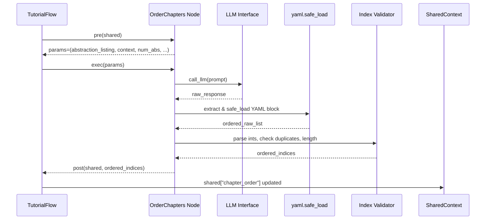

# Chapter 8: Chapter Sequencing Node

In the previous chapter we built a directed, labeled graph of abstractions in the **Relationship Analysis Node** ([Chapter 7](07_relationship_analysis_node_.md)). Now it’s time to decide **in which order** to teach those concepts. The **Chapter Sequencing Node** delegates curriculum planning to an LLM while enforcing that every abstraction appears exactly once—mirroring a topological sort of a prerequisite graph.

---

## 8.1 Motivation: Why a Chapter Sequencing Node?

Imagine you have these abstractions:

- 0 # QueryProcessor  
- 1 # Router  
- 2 # ConfigLoader  
- 3 # ResponseFormatter  

…and relationships like “Router uses QueryProcessor” or “QueryProcessor reads ConfigLoader.” A human scheduler would place `ConfigLoader` before `QueryProcessor`, then `Router`, and finally `ResponseFormatter`. Automating this ensures:

- **Foundational-first**: prerequisites come before dependents  
- **Coherence**: learners never hit a concept they can’t understand  
- **Completeness**: every abstraction is covered exactly once

Technically, we prompt the LLM: “Given these nodes and edges, what’s the best teaching order?” Then we **validate** the LLM’s output, programmatically enforcing:

1. **No duplicates**  
2. **All indices present**  
3. **Index bounds**  

If the LLM misorders or omits, we reject and retry.

---

## 8.2 Core Concepts

- **Input**:  
  - `shared["abstractions"]`: list of `{name, description, files}`  
  - `shared["relationships"]`: `{ summary: …, details: [{from, to, label}, …] }`  
- **Prompt Assembly**: bullet-list each abstraction with index and name; include project summary and relationship list.  
- **LLM Query**: ask for a YAML list of ordered indices with inline comments.  
- **Post‐Processing**: parse YAML, convert each entry to an integer, enforce no duplicates and full coverage.  
- **Output**: store `shared["chapter_order"] = [idx0, idx1, …]`.

---

## 8.3 Sequence Diagram: Runtime Flow



---

## 8.4 Implementation Walkthrough

### 8.4.1 `pre(shared)`

Gather inputs and build prompt scaffolding:

```python
class OrderChapters(Node):
    def pre(self, shared):
        abstractions  = shared["abstractions"]
        relationships = shared["relationships"]
        project       = shared["project_name"]
        lang          = shared.get("language", "english")

        # 1. Bullet-list abstractions
        abstraction_listing = "\n".join(
            f"- {i} # {a['name']}"
            for i, a in enumerate(abstractions)
        )

        # 2. Summarize project and relationships
        summary = relationships["summary"]
        rel_lines = "\n".join(
            f"- From {r['from']} → {r['to']}: {r['label']}"
            for r in relationships["details"]
        )
        context = (
            f"Project Summary:\n{summary}\n\n"
            f"Relationships:\n{rel_lines}"
        )

        # 3. Note: non-English names may be present
        list_note = ""
        if lang.lower() != "english":
            list_note = f" (Names might be in {lang.capitalize()})"

        return abstraction_listing, context, len(abstractions), project, list_note
```

- We produce a **string** listing abstractions and a **context** block for the LLM.

### 8.4.2 `exec(...)`

Ask the LLM for an optimal teaching sequence:

```python
    def exec(self, params):
        abstract_list, context, num_abs, project, note = params

        prompt = f"""
    Given the following project abstractions for `{project}`:

    Abstractions (Index # Name){note}:
    {abstract_list}

    Context about relationships and summary:
    {context}

    What is the best order to teach these abstractions so that foundational topics come first?
    Output a YAML list of indices with comments:

    ```yaml
    - 2 # ConfigLoader
    - 0 # QueryProcessor
    - 1 # Router
    - 3 # ResponseFormatter
    ```
    """
        raw = call_llm(prompt)

        # Extract YAML between ```yaml fences
        yaml_block = raw.split("```yaml")[1].split("```")[0].strip()
        ordered_raw = yaml.safe_load(yaml_block)

        # Validate and normalize
        ordered = []
        seen = set()
        for entry in ordered_raw:
            # Parse "2 # ConfigLoader" or integer 2
            if isinstance(entry, str) and "#" in entry:
                idx = int(entry.split("#")[0].strip())
            else:
                idx = int(entry)
            # Bounds and duplicates
            if idx < 0 or idx >= num_abs:
                raise ValueError(f"Index out of range: {idx}")
            if idx in seen:
                raise ValueError(f"Duplicate index: {idx}")
            seen.add(idx)
            ordered.append(idx)

        # Ensure full coverage
        if len(ordered) != num_abs:
            missing = set(range(num_abs)) - seen
            raise ValueError(f"Missing indices: {missing}")

        print(f"Determined chapter order: {ordered}")
        return ordered
```

- We **extract** the YAML block, **parse** it, and **enforce**:
  - 0 ≤ idx < num_abs  
  - no duplicates  
  - all indices covered

### 8.4.3 `post(shared, ..., ordered)`

Store the result for downstream:

```python
    def post(self, shared, prep_res, ordered_indices):
        shared["chapter_order"] = ordered_indices
```

---

## 8.5 Analogy: University Course Scheduler

Think of each abstraction as a university course:

- **Nodes**: individual courses (e.g., Data Structures, Algorithms)  
- **Edges**: prerequisites (e.g., Data Structures → Algorithms)  
- **Scheduler**: arranges courses so prerequisites come first  

Here, we push that scheduling problem to an LLM—“Given these courses/prereqs, what’s the best semester-by-semester plan?”—then we **verify** the plan matches our DAG constraints.

---

## 8.6 Conclusion & Next Steps

In this chapter we’ve:

- Defined how the **Chapter Sequencing Node** reads abstractions and relationships  
- Assembled a clear LLM prompt to propose an optimal teaching order  
- Programmatically **validated** the LLM’s response, enforcing a one-to-one mapping  
- Stored the final sequence in `shared["chapter_order"]`

Next, we’ll feed this order into the **[Chapter Writing BatchNode](09_chapter_writing_batchnode_.md)** to generate each tutorial chapter in Markdown—complete with code snippets, transitions, and diagrams.

---

Generated by fork of [AI Codebase Knowledge Builder](https://github.com/vegeta03/PocketFlow-Tutorial-Codebase-Knowledge.git)
