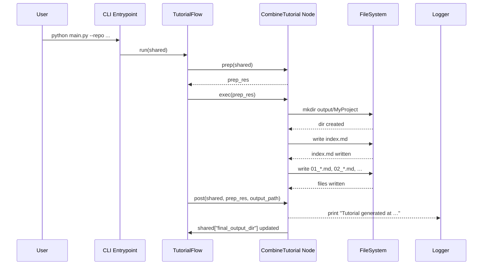

# Chapter 10: Tutorial Combiner Node

Now that you have generated each chapter’s Markdown in [Chapter 9: Chapter Writing BatchNode](09_chapter_writing_batchnode_.md), it’s time to stitch everything together into a final, distributable tutorial package.

## 10.1 Motivation & Central Use Case

After you’ve:

- Fetched files  
- Extracted abstractions  
- Analyzed relationships  
- Sequenced chapters  
- Written each chapter in Markdown  

you still need to produce:

1. An output directory (e.g. `output/MyProject/`)  
2. A top‐level `index.md` containing  
   - Project summary  
   - A Mermaid flowchart of abstraction relationships  
   - A clickable table of contents  
3. Individual chapter files named with a numeric prefix (e.g. `01_query_processor.md`)  
4. Attribution metadata appended to every file  
5. Directory hygiene (no stray temp files, directories created if missing)

Without a Combiner Node you’d cobble together ad‐hoc scripts. The **Tutorial Combiner Node** behaves like a **bookbinder** or a **static site generator**, taking pre‐rendered pages (chapters), creating a cover page and TOC, and writing a final bound volume ready for distribution.

## 10.2 Key Concepts

1. **prep(shared)**  
   - Reads `project_name`, `output_dir`, `repo_url`  
   - Pulls in `shared["relationships"]`, `shared["abstractions"]`, `shared["chapter_order"]`, `shared["chapters"]`  
   - Computes an `output_path` and builds:  
     - A sanitized filename for each chapter  
     - A Mermaid diagram of abstractions & relationships  
     - The content of `index.md` (summary, diagram, TOC)  
     - A list of `chapter_files` (filename + content with attribution)  

2. **exec(prep_res)**  
   - Creates the `output_path` directory (`os.makedirs`)  
   - Writes `index.md` and each chapter file to disk  
   - Logs every write for auditability  

3. **post(shared, …, exec_res)**  
   - Updates `shared["final_output_dir"] = exec_res`  
   - Prints a completion message  

4. **Sanitized Filenames**  
   Convert chapter titles into safe, alphanumeric‐only filenames with a two‐digit prefix.  

5. **Mermaid Flowchart**  
   Auto-generate a `flowchart TD` diagram of abstraction nodes (`A0`, `A1`, …) and labeled edges.

## 10.3 Runtime Sequence Diagram



## 10.4 Internal Implementation Walkthrough

Below is a complete, “Computer Science”-friendly excerpt of the `CombineTutorial` node from `nodes.py`.  
Comments and line breaks are used to highlight each step; non-essential details are elided.

```python
class CombineTutorial(Node):
    def prep(self, shared):
        import os

        # 1. Compute output directory
        project = shared["project_name"]
        base    = shared.get("output_dir", "output")
        out_dir = os.path.join(base, project)

        # 2. Generate Mermaid flowchart lines
        lines = ["flowchart TD"]
        for i, absr in enumerate(shared["abstractions"]):
            node_id  = f"A{i}"
            label    = absr["name"].replace('"', '')
            lines.append(f'    {node_id}["{label}"]')
        for rel in shared["relationships"]["details"]:
            src = f"A{rel['from']}"
            dst = f"A{rel['to']}"
            lbl = rel['label'].replace('"', ' ')
            if len(lbl) > 30:
                lbl = lbl[:27] + "..."
            lines.append(f'    {src} -- "{lbl}" --> {dst}')
        mermaid = "\n".join(lines)

        # 3. Build index.md content
        idx_md  = f"# Tutorial: {project}\n\n"
        idx_md += shared["relationships"]["summary"] + "\n\n"
        idx_md += f"**Source Repository:** [{shared.get('repo_url')}]\n\n"
        idx_md += "```mermaid\n" + mermaid + "\n```\n\n"
        idx_md += "## Chapters\n\n"

        # 4. Sanitize chapter filenames & append COI
        chapter_files = []
        for n, chap_md in enumerate(shared["chapters"], start=1):
            abs_idx = shared["chapter_order"][n-1]
            name    = shared["abstractions"][abs_idx]["name"]
            safe    = "".join(c if c.isalnum() else "_" for c in name).lower()
            fname   = f"{n:02d}_{safe}.md"

            idx_md += f"{n}. [{name}]({fname})\n"
            content = chap_md
            if not content.endswith("\n\n"):
                content += "\n\n"
            content += (
                "---\n\n"
                "Generated by [AI Codebase Knowledge Builder]"
                 "(https://github.com/The-Pocket/Tutorial-Codebase-Knowledge)"
            )
            chapter_files.append({"filename": fname, "content": content})

        # 5. Attribution for index.md
        idx_md += "\n---\n\n"
        idx_md += (
            "Generated by [AI Codebase Knowledge Builder]"
            "(https://github.com/The-Pocket/Tutorial-Codebase-Knowledge)"
        )

        return {
            "output_path": out_dir,
            "index_content": idx_md,
            "chapter_files": chapter_files
        }

    def exec(self, prep_res):
        import os

        path = prep_res["output_path"]
        os.makedirs(path, exist_ok=True)

        # Write index.md
        with open(os.path.join(path, "index.md"), "w", encoding="utf-8") as f:
            f.write(prep_res["index_content"])

        # Write each chapter file
        for cf in prep_res["chapter_files"]:
            fp = os.path.join(path, cf["filename"])
            with open(fp, "w", encoding="utf-8") as f:
                f.write(cf["content"])

        return path

    def post(self, shared, prep_res, exec_res):
        # Register final output directory
        shared["final_output_dir"] = exec_res
        print(f"Tutorial generation complete! Files in: {exec_res}")
```

### Explanation

- **prep**  
  - Computes `out_dir`  
  - Builds a **Mermaid** flowchart of abstraction nodes & edges  
  - Constructs `index_content` (summary, diagram, TOC)  
  - Prepares a list of chapter files with sanitized names and appended attribution  

- **exec**  
  - Ensures the output directory exists  
  - Writes `index.md` and each chapter file to disk  

- **post**  
  - Updates the shared context with the final directory path  
  - Prints a completion notice  

## 10.5 Analogy: Static Site Generator / Bookbinder

Just like **Jekyll** or **Hugo**, this Node:

- Takes pre‐rendered pages (chapters)  
- Builds a home page (`index.md`) with navigation and diagrams  
- Renders files to disk in a clean folder  
- Bundles everything into a ready‐to-publish tutorial site

Equivalently, a **bookbinder** that:

1. Gathers printed chapter signatures  
2. Designs a cover (index) and table of contents  
3. Binds pages in order  
4. Delivers a final volume  

## Conclusion

You’ve now mastered the **Tutorial Combiner Node**, the last step in our pipeline. It transforms individual Markdown artifacts into a polished tutorial:

- Creates an organized output directory  
- Generates a comprehensive `index.md` (summary, flowchart, TOC)  
- Writes each chapter file with correct filenames and attribution  
- Updates the shared context with the final path  

With this, your end-to-end tutorial pipeline is complete. Simply run:

```bash
python main.py --repo https://github.com/example/my-project.git --output tutorial_pkg
```

and find your full tutorial in `output/my-project/`.

---

Generated by fork of [AI Codebase Knowledge Builder](https://github.com/vegeta03/PocketFlow-Tutorial-Codebase-Knowledge.git)
