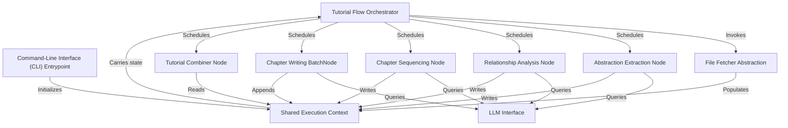

# Tutorial: PocketFlow-Tutorial-Codebase-Knowledge

**PocketFlow-Tutorial-Codebase-Knowledge** is a **pipeline-driven** system that transforms any codebase into a structured, *beginner-friendly* tutorial by orchestrating modular computational Nodes. It relies on a **shared execution context** for state management and a **LLM interface** for semantic analysis and content generation across discrete stages like file fetching, abstraction extraction, relationship analysis, chapter sequencing, chapter writing, and tutorial assembly.

**Source Repository:** [https://github.com/The-Pocket/PocketFlow-Tutorial-Codebase-Knowledge](https://github.com/The-Pocket/PocketFlow-Tutorial-Codebase-Knowledge)

## Chapters

1. [Command-Line Interface (CLI) Entrypoint](01_command_line_interface__cli__entrypoint_.md)
2. [Shared Execution Context](02_shared_execution_context_.md)
3. [Tutorial Flow Orchestrator](03_tutorial_flow_orchestrator_.md)
4. [File Fetcher Abstraction](04_file_fetcher_abstraction_.md)
5. [LLM Interface](05_llm_interface_.md)
6. [Abstraction Extraction Node](06_abstraction_extraction_node_.md)
7. [Relationship Analysis Node](07_relationship_analysis_node_.md)
8. [Chapter Sequencing Node](08_chapter_sequencing_node_.md)
9. [Chapter Writing BatchNode](09_chapter_writing_batchnode_.md)
10. [Tutorial Combiner Node](10_tutorial_combiner_node_.md)

---

Generated by fork of [AI Codebase Knowledge Builder](https://github.com/vegeta03/PocketFlow-Tutorial-Codebase-Knowledge.git)
