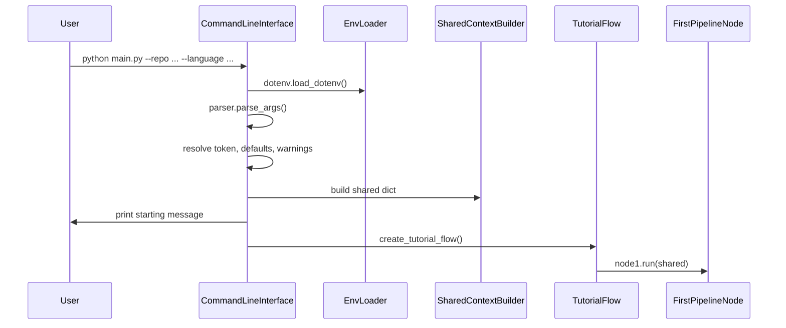

# Chapter 1: Command-Line Interface & Configuration

When you want to generate a tutorial for a codebase—whether it lives on GitHub or on your local machine—you need a single, consistent “mission control panel” that gathers inputs, applies sane defaults, flags missing credentials, and then hands off to the rest of the system. In this chapter we’ll:

- Motivate the need for a robust CLI + config abstraction  
- Walk through a concrete use case  
- Break down the key components in `main.py`  
- Show how the CLI builds a shared context for downstream nodes  
- Diagram the end-to-end flow with a Mermaid sequenceDiagram  
- Peek under the hood at the implementation  
- Prepare you for the next chapter on [Flow Orchestration Framework](02_flow_orchestration_framework_.md)  

---

## 1.1 Motivation & Central Use Case

Imagine Alex, a senior engineer, needs to generate a tutorial for the public GitHub repo `https://github.com/example/project`. Alex wants:

- A safe way to provide or fallback on a GitHub Personal Access Token  
- The ability to include only `.py` and `.md` files, while excluding tests and examples  
- Control over output directory and tutorial language  

Without a unified CLI, Alex would juggle scripts, environment variables, and ad-hoc defaults. The CLI abstraction in `main.py` solves this by:

1. Parsing user flags (`argparse`)  
2. Loading secrets via `.env` (`python-dotenv`)  
3. Validating inputs and warning on missing tokens  
4. Assembling a single shared context dictionary  
5. Kicking off the PocketFlow pipeline  

---

## 1.2 Key Concepts

1. **Argument Parsing**  
2. **Environment Loading**  
3. **Input Validation & Defaults**  
4. **Shared Context Construction**  
5. **Pipeline Invocation**  

---

## 1.3 Example Invocation

```bash
python main.py \
  --repo https://github.com/example/project \
  --token $GITHUB_TOKEN \
  --language spanish \
  --include "*.py" "*.md" \
  --exclude "tests/*" "examples/*" \
  -o tutorial_output
```

Expected startup output:

```plaintext
Starting tutorial generation for: https://github.com/example/project in Spanish language
# ... pipeline node logs ...
Tutorial generated at ./tutorial_output/project
```

---

## 1.4 Code Breakdown: `main.py`

### 1.4.1 Imports & Environment Loading

```python
# main.py
import dotenv          # pip install python-dotenv
import os
import argparse

from flow import create_tutorial_flow

# Load variables from .env into os.environ
dotenv.load_dotenv()
```

> **Why**: Keeps secrets (e.g. GITHUB_TOKEN) out of source control.

---

### 1.4.2 Default File Patterns

```python
# patterns to include most source files
DEFAULT_INCLUDE_PATTERNS = {
    "*.py", "*.js", "*.jsx", "*.ts", "*.tsx", "*.go",
    "*.java", "*.md", "*.rst", "Dockerfile", "Makefile",
    "*.yaml", "*.yml",
}

# patterns to exclude tests, build artifacts, logs, etc.
DEFAULT_EXCLUDE_PATTERNS = {
    "venv/*", ".git/*", "tests/*", "docs/*",
    "node_modules/*", "*.log"
}
```

> **Why**: Provides sensible defaults; users can override with `--include` / `--exclude`.

---

### 1.4.3 Argument Parser Setup

```python
def main():
    parser = argparse.ArgumentParser(
        description="Generate a tutorial for a GitHub codebase or local directory."
    )

    # Exactly one source: repo or dir
    source_group = parser.add_mutually_exclusive_group(required=True)
    source_group.add_argument("--repo", help="URL of the public GitHub repository.")
    source_group.add_argument("--dir", help="Path to local directory.")

    parser.add_argument("-n", "--name",
                        help="Project name (derived if omitted).")
    parser.add_argument("-t", "--token",
                        help="GitHub PAT (fallback to GITHUB_TOKEN env var).")
    parser.add_argument("-o", "--output", default="output",
                        help="Base directory for results.")
    parser.add_argument("-i", "--include", nargs="+",
                        help="Override include file patterns.")
    parser.add_argument("-e", "--exclude", nargs="+",
                        help="Override exclude file patterns.")
    parser.add_argument("-s", "--max-size", type=int, default=100000,
                        help="Max file size in bytes (default: 100KB).")
    parser.add_argument("--language", default="english",
                        help="Tutorial language (default: english).")

    args = parser.parse_args()
```

> **Why**: Enforces required inputs, groups mutually exclusive options, documents defaults.

---

### 1.4.4 Token Resolution & Warning

```python
    github_token = None
    if args.repo:
        github_token = args.token or os.environ.get("GITHUB_TOKEN")
        if not github_token:
            print("Warning: No GitHub token provided. You might hit rate limits.")
```

> **Why**: Public GitHub API is rate-limited; warn early if token is missing.

---

### 1.4.5 Building the Shared Context

```python
    shared = {
        "repo_url":       args.repo,
        "local_dir":      args.dir,
        "project_name":   args.name,
        "github_token":   github_token,
        "output_dir":     args.output,
        "include_patterns":
            set(args.include) if args.include else DEFAULT_INCLUDE_PATTERNS,
        "exclude_patterns":
            set(args.exclude) if args.exclude else DEFAULT_EXCLUDE_PATTERNS,
        "max_file_size":  args.max_size,
        "language":       args.language,
        # placeholders for pipeline outputs:
        "files": [], "abstractions": [],
        "relationships": {}, "chapter_order": [],
        "chapters": [], "final_output_dir": None
    }
```

> **Why**: A single dictionary (`shared`) carries config and results through every pipeline node.

---

### 1.4.6 Launching the Tutorial Flow

```python
    print(f"Starting tutorial generation for: "
          f"{args.repo or args.dir} in {args.language.capitalize()} language")

    tutorial_flow = create_tutorial_flow()
    tutorial_flow.run(shared)
```

> **Why**: Decouples CLI/configuration from the orchestration logic in [Flow Orchestration Framework](02_flow_orchestration_framework_.md).

---

## 1.5 End-to-End Sequence Diagram



---

## 1.6 Conclusion

You’ve now seen how our CLI and configuration layer acts as the mission control panel:

- Parses & validates user inputs  
- Loads secrets from `.env`  
- Applies defaults for file patterns, output location, and language  
- Constructs a unified `shared` context for downstream nodes  
- Triggers the tutorial generation pipeline  

In the next chapter, we’ll explore how the **[Flow Orchestration Framework](02_flow_orchestration_framework_.md)** takes this context and wires together the sequence of nodes that actually analyze your code, identify abstractions, and assemble the final tutorial.

---

Generated by fork of [AI Codebase Knowledge Builder](https://github.com/vegeta03/PocketFlow-Tutorial-Codebase-Knowledge.git)
