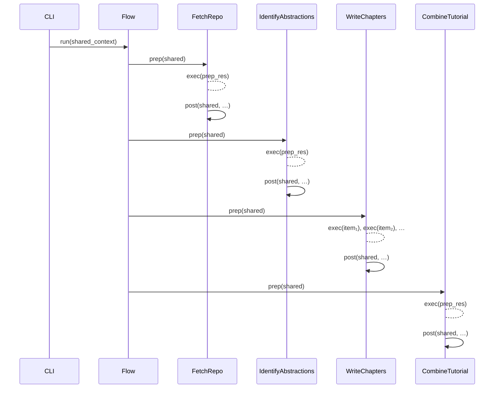

# Chapter 2: Flow Orchestration Framework

In [Chapter 1: Command-Line Interface & Configuration](01_command_line_interface___configuration_.md) we built our “mission control” for gathering inputs and assembling a shared context. Now, the **Flow Orchestration Framework** steps in as the conductor: it wires together discrete processing steps (nodes), enforces execution order, propagates state, handles retries and failures, and even fans out work in parallel batches. Think of it as a lightweight workflow engine or an assembly line manager—each **Node** prepares its inputs, performs its core work, merges results back into the shared context, and signals the next node in the chain.

---

## 2.1 Motivation & High-Level Overview

When generating a tutorial for a codebase, we have multiple logically distinct phases:

1. **Fetch source files**  
2. **Identify abstractions via LLM**  
3. **Analyze relationships**  
4. **Determine chapter order**  
5. **Write chapters (batch)**  
6. **Combine into final output**

Hard-coding this sequence with ad-hoc calls quickly becomes brittle. We want:

- **Clear dependency graph**  
- **Automatic state passing**  
- **Retry & back-off** on transient failures  
- **Parallelism** for independent tasks  
- **Error containment** and graceful shutdown  

PocketFlow’s `Flow`, `Node` and `BatchNode` abstractions deliver exactly that.

---

## 2.2 Core Abstractions: Flow, Node & BatchNode

### 2.2.1 Node

A `Node` encapsulates one step. It implements three methods:

```python
from pocketflow import Node

class ExampleNode(Node):
    def __init__(self, max_retries=3, wait=5):
        super().__init__(max_retries=max_retries, wait=wait)

    def prep(self, shared):
        # Extract and validate inputs from shared context
        return {"input_data": shared["raw_data"]}

    def exec(self, inputs):
        # Perform core logic
        processed = heavy_computation(inputs["input_data"])
        return processed

    def post(self, shared, prep_res, exec_res):
        # Merge results back into shared
        shared["processed_data"] = exec_res
```

- **prep(shared)**: prepare arguments  
- **exec(prep_res)**: core work  
- **post(shared, prep_res, exec_res)**: update shared context  

If `exec` raises, PocketFlow will retry up to `max_retries`, waiting `wait` seconds between attempts.

### 2.2.2 Flow

A `Flow` is a directed graph of `Node` instances. You connect nodes via the `>>` operator:

```python
from pocketflow import Flow
from nodes import FetchRepo, IdentifyAbstractions

fetch_repo = FetchRepo()
identify = IdentifyAbstractions(max_retries=5, wait=20)

fetch_repo >> identify        # fetch_repo feeds into identify
tutorial_flow = Flow(start=fetch_repo)
```

Calling `tutorial_flow.run(shared_ctx)` will:

1. Invoke `fetch_repo.prep`, `fetch_repo.exec`, `fetch_repo.post`  
2. Then automatically invoke `identify.prep`, `identify.exec`, `identify.post`  
3. Follow the graph until all nodes have executed.

### 2.2.3 BatchNode

`BatchNode` is a specialization that fans out work:

- **prep(shared)** returns a list of “items”  
- PocketFlow runs `exec(item)` for each in parallel (or sequentially with internal pooling)  
- Collects all outputs, then calls `post(shared, prep_res, exec_res_list)`

This is perfect for generating one Markdown file per chapter concurrently.

---

## 2.3 Defining the Tutorial Flow

Below is the code snippet from **flow.py** that wires our tutorial pipeline:

```python
# flow.py
from pocketflow import Flow
from nodes import (
    FetchRepo, IdentifyAbstractions, AnalyzeRelationships,
    OrderChapters, WriteChapters, CombineTutorial
)

def create_tutorial_flow():
    fetch_repo             = FetchRepo()
    identify_abstractions  = IdentifyAbstractions(max_retries=5, wait=20)
    analyze_relationships  = AnalyzeRelationships(max_retries=5, wait=20)
    order_chapters         = OrderChapters(max_retries=5, wait=20)
    write_chapters         = WriteChapters(max_retries=5, wait=20)  # BatchNode
    combine_tutorial       = CombineTutorial()

    # Sequence connections
    fetch_repo >> identify_abstractions
    identify_abstractions >> analyze_relationships
    analyze_relationships >> order_chapters
    order_chapters >> write_chapters
    write_chapters >> combine_tutorial

    # Build and return the orchestrator
    return Flow(start=fetch_repo)
```

- We instantiate each node, optionally tuning retry parameters.  
- We connect them in a directed chain: the output of one triggers the next.  
- Finally, we hand off the first node to `Flow`.

---

## 2.4 Execution Order & Shared Context

Here’s a simplified **sequence diagram** of `tutorial_flow.run(shared)`:



- **Shared context** (`shared`) is a single mutable dict passed to every node.  
- Each node reads from and writes to `shared`, avoiding global state.  
- The `Flow` engine ensures no node runs before all of its upstreams complete.

---

## 2.5 Retry Logic & Error Handling

- Each `Node` can be configured with `max_retries` and `wait` (in seconds).  
- On exceptions in `exec`, PocketFlow will automatically back off and retry.  
- Unrecoverable errors bubble up, halting the flow and surfacing clear diagnostics.

---

## 2.6 Parallel Batch Execution

`WriteChapters` extends `BatchNode`:

1. **prep(shared)** builds a list of chapter‐specific items.  
2. PocketFlow invokes `exec(item)` for each, potentially in parallel threads.  
3. Results are aggregated and passed to `post`, which merges all Markdown strings into `shared["chapters"]`.

This pattern scales to any use case where you need a map‐reduce style step.

---

## 2.7 Conclusion & Next Steps

You’ve now seen how the Flow Orchestration Framework glues together our pipeline:

- Directed graph of `Node` and `BatchNode` instances  
- Consistent `prep` → `exec` → `post` lifecycle  
- Shared state propagation, error retries, and parallel execution  

In the next chapter, we’ll add **[Multi-language Localization Support](03_multi_language_localization_support_.md)**—extending our nodes to generate tutorials in any target language.

---

Generated by fork of [AI Codebase Knowledge Builder](https://github.com/vegeta03/PocketFlow-Tutorial-Codebase-Knowledge.git)
