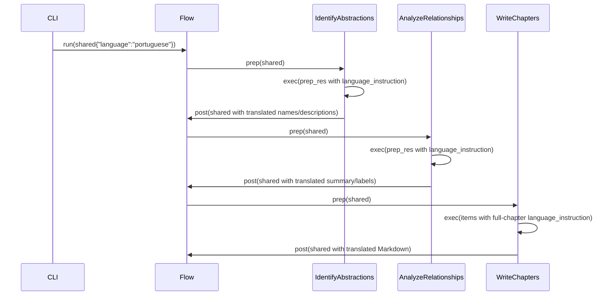

# Chapter 3: Multi-language Localization Support

In the previous chapter [Flow Orchestration Framework](02_flow_orchestration_framework_.md) we saw how our pipeline wires together discrete nodes and propagates a single shared context through each step. In this chapter we extend every node with a **Multi-language Localization** abstraction: by carrying a `language` parameter through the context, each node can automatically generate all narrative text—in headings, names, descriptions, summaries, labels, diagrams and links—in the target language, while preserving code syntax in English. Think of it as having a live technical interpreter at every stage.

## 3.1 Motivation & Central Use Case

Imagine your engineering team in Brazil needs a Portuguese tutorial for a Python microservice framework. You don’t want to duplicate code or write separate translation scripts. Instead you need:

- A **single pipeline** that can switch between English, Spanish, Portuguese, Japanese, etc.  
- **Precision**: only narrative text is translated; code, identifiers, file paths and proper nouns remain intact (or can be selectively translated).  
- **Seamless integration**: no additional branching—each node simply reads `shared["language"]` and adapts its prompts.

By threading a `language` parameter through the shared context, nodes inject conditional prompt prefixes, translation hints, and language-specific field formatting so that every piece of explanatory content is localized without loss of technical nuance.

## 3.2 Core Concepts

1. **Shared `language` Parameter**  
   - Stored in `shared["language"]` (e.g. `"spanish"`, `"portuguese"`, `"japanese"`).  
2. **Conditional Prompt Prefixes**  
   - Nodes prepend instructions like  
     > `IMPORTANT: Generate the name and description in **Spanish**. Do NOT use English.`  
     only when `language != "english"`.  
3. **Field-level Hints**  
   - YAML fields `name`, `description`, `summary`, `label` get hints such as  
     `(value in Portuguese)` so the LLM puts the translated text in the correct fields.  
4. **Code Syntax Preservation**  
   - All code fences (` ```python `) and identifiers remain in English or follow node-specific policies.  
5. **Uniform Injection Pattern**  
   - Every LLM-based node reads `language` in `prep`, builds a small `language_instruction`, then merges it into its prompt in `exec`.

## 3.3 Propagating `language` Through the Pipeline

### 3.3.1 CLI & Shared Context

In **main.py** we declare and capture the language flag:

```python
parser.add_argument("--language", default="english",
    help="Tutorial language (default: english)")
...
shared = {
    ...
    "language": args.language,
    ...
}
print(f"Starting tutorial generation in {args.language.capitalize()} language")
```

### 3.3.2 IdentifyAbstractions: Localizing Names & Descriptions

In `IdentifyAbstractions.prep`:

```python
language = shared.get("language", "english")
return context, file_listing, project_name, language
```

And in `.exec`:

```python
lang = language.lower()
language_instruction = ""
name_hint = desc_hint = ""
if lang != "english":
    language_instruction = (
        f"IMPORTANT: Generate the `name` and `description` "
        f"in **{language.capitalize()}** language. Do NOT use English."
    )
    name_hint = f" (value in {language.capitalize()})"
    desc_hint = f" (value in {language.capitalize()})"

prompt = f"""
For the project `{project_name}`:

{language_instruction}
Identify core abstractions:

1. A concise `name`{name_hint}.
2. A beginner-friendly `description`{desc_hint}.
...
"""
response = call_llm(prompt)
```

This pattern guarantees that the LLM returns YAML with translated names and descriptions.

### 3.3.3 AnalyzeRelationships: Translating Summary & Labels

In `AnalyzeRelationships.exec` we use:

```python
if language.lower() != "english":
    language_instruction = (
        f"IMPORTANT: Generate the `summary` and `label` fields "
        f"in **{language.capitalize()}** language."
    )
    label_hint = f" (in {language.capitalize()})"

prompt = f"""
Based on abstractions for `{project_name}`:

{language_instruction}
1. A high-level `summary`...{label_hint}.
2. A list of `relationships` with `label`{label_hint}.
"""
```

Now both the project summary and each relationship label will be localized.

### 3.3.4 WriteChapters: Full-Chapter Translation

In `WriteChapters.exec`, before generating each chapter:

```python
if language.lower() != "english":
    lang_cap = language.capitalize()
    language_instruction = (
        f"IMPORTANT: Write this ENTIRE tutorial chapter in **{lang_cap}**. "
        "Translate ALL text except code syntax."
    )
...
prompt = f"""
{language_instruction}
# Chapter {chapter_num}: {abstraction_name}

Concept Details:
- Name: {abstraction_name}
- Description: {abstraction_description}

...
"""
chapter_md = call_llm(prompt)
```

Every heading, narrative paragraph, list, diagram caption and link is produced in the target language.

## 3.4 Internal Walkthrough

Here’s a simplified **sequence diagram** showing how `language` flows from CLI to chapter files:



1. **CLI** sets `shared["language"]`.  
2. **IdentifyAbstractions** injects name/description hints.  
3. **AnalyzeRelationships** injects summary/label hints.  
4. **WriteChapters** instructs generation of entire chapter text in the target language.  
5. Localized content accumulates in `shared` and is finally written to disk.

## 3.5 Deep Dive: Key Code Snippet

```python
class IdentifyAbstractions(Node):
    def prep(self, shared):
        project_name = shared["project_name"]
        language = shared.get("language", "english")
        # build context...
        return context, file_listing, project_name, language

    def exec(self, prep_res):
        context, file_listing, project_name, language = prep_res
        lang = language.lower()
        language_instruction = ""
        if lang != "english":
            language_instruction = (
                f"IMPORTANT: Generate the `name` and `description` "
                f"in **{language.capitalize()}** language. Do NOT use English."
            )
        prompt = f"""
For the project `{project_name}`:

{language_instruction}
Analyze the codebase and list core abstractions as YAML.
"""
        response = call_llm(prompt)
        # parse and return translated abstractions...
```

**Takeaways**  

- Every node follows the same pattern:  
  1. Read `language` in `prep`.  
  2. Build a minimal `language_instruction` in `exec`.  
  3. Merge it into the prompt.  
- This keeps prompts DRY and centralizes translation logic.

## 3.6 Conclusion

By introducing **Multi-language Localization Support**, we have:

- Extended our shared context with a single `language` flag.  
- Enabled every LLM-based node to inject conditional translation instructions.  
- Ensured that all narrative content—names, descriptions, summaries, labels, diagrams and links—is localized, while code syntax stays consistent.  
- Maintained a uniform injection pattern without bloating node implementations.

Next, we’ll refactor our prompt creation and LLM interaction behind a reusable **[LLM Communication Abstraction](04_llm_communication_abstraction_.md)** to simplify prompt templates, manage retries, and centralize error handling.

---

Generated by fork of [AI Codebase Knowledge Builder](https://github.com/vegeta03/PocketFlow-Tutorial-Codebase-Knowledge.git)
