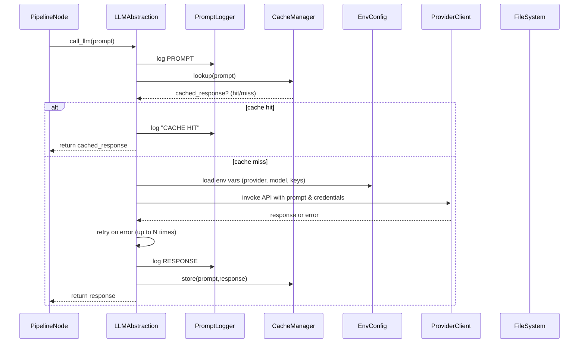

# Chapter 4: LLM Communication Abstraction

In the previous chapter [Multi-language Localization Support](03_multi_language_localization_support_.md), we threaded a `language` flag through every node so that prompts and outputs automatically adapt to the target language. Now we turn our attention to the central interface with all LLMs: the **LLM Communication Abstraction**. This component isolates prompt dispatch, logging, caching, credential management, retry logic and backend selection behind a single function, `call_llm(prompt, **options)`. Senior engineers can swap providers, tweak timeouts or inspect every call without touching business logic.

---

## 4.1 Motivation & Central Use Case

Imagine you have multiple nodes in your pipeline—abstraction identification, relationship analysis, chapter generation—all invoking LLMs. Without a unifying abstraction you end up with:

- Duplicate code to load API keys for Google Gemini, Anthropic Claude or OpenAI  
- Scattered retry loops and back-off strategies  
- Hard-coded model names and endpoints everywhere  
- No centralized cache: repeated runs re-query the same prompt  
- No audit trail: it’s impossible to trace which prompt produced which output  

The **LLM Communication Abstraction** solves this by acting as a switchboard operator:

1. You call a single function: `response = call_llm(prompt)`.  
2. Under the hood it:
   - Logs every prompt and response to disk for auditability  
   - Checks a JSON cache and returns cached outputs if available  
   - Reads environment variables to pick provider, model, credentials  
   - Applies configurable retry logic on failures  
   - Persists new responses back to cache and log files  
3. You never touch API-specific client code in your nodes again.  

---

## 4.2 Key Concepts

1. **Single Entry Point**  
   - `call_llm(prompt: str, use_cache: bool = True) → str`  
   - Nodes never import provider-specific SDKs.  
2. **Prompt & Response Logging**  
   - Every call is appended to a daily log file (`logs/llm_calls_YYYYMMDD.log`).  
3. **Response Caching**  
   - Prompts map to responses in a JSON cache (`llm_cache.json`).  
   - Cache lookups avoid duplicate API incursions on re-runs.  
4. **Pluggable Backends**  
   - Based on `LLM_PROVIDER` or dedicated env vars (`GEMINI_API_KEY`, `ANTHROPIC_API_KEY`, `OPENAI_API_KEY`).  
   - Supports Google Gemini, Anthropic Claude, OpenAI O1 out of the box.  
5. **Credential & Retry Management**  
   - Credentials are loaded from environment; missing keys trigger clear warnings.  
   - Retries with exponential back-off parameterized in one place.  
6. **Auditability & Debugging**  
   - Logs include timestamps, prompt text (truncated if needed), response summaries, error traces.  

---

## 4.3 High-Level Sequence Diagram

Here’s what happens when a node calls `call_llm(prompt)`:



---

## 4.4 Usage Example

In any node you simply:

```python
from utils.call_llm import call_llm

def exec(self, prep_res):
    prompt = "Generate YAML list of abstractions..."
    # The abstraction handles caching, logging, retries, provider selection
    response_text = call_llm(prompt)
    return response_text
```

No further imports, no API keys, no model names.

---

## 4.5 Internal Implementation Walkthrough

Below is a simplified overview of `utils/call_llm.py`. We’ve removed non-essential details for brevity.

```python
import os, json, logging
from datetime import datetime

# 1. Configure log file
LOG_DIR = os.getenv("LOG_DIR", "logs")
os.makedirs(LOG_DIR, exist_ok=True)
log_file = os.path.join(LOG_DIR, f"llm_calls_{datetime.now():%Y%m%d}.log")

logger = logging.getLogger("llm")
logger.setLevel(logging.INFO)
handler = logging.FileHandler(log_file)
handler.setFormatter(logging.Formatter("%(asctime)s - %(levelname)s - %(message)s"))
logger.addHandler(handler)

# 2. Cache path
CACHE_FILE = "llm_cache.json"

def call_llm(prompt: str, use_cache: bool = True) -> str:
    # Log the incoming prompt
    logger.info(f"PROMPT: {prompt}")

    # 3. Cache lookup
    if use_cache:
        try:
            with open(CACHE_FILE) as f:
                cache = json.load(f)
        except FileNotFoundError:
            cache = {}
        if prompt in cache:
            logger.info("CACHE HIT")
            return cache[prompt]

    # 4. Load provider config
    provider = os.getenv("LLM_PROVIDER", "GEMINI").upper()
    # eg. GEMINI_API_KEY, ANTHROPIC_API_KEY, OPENAI_API_KEY
    api_key = os.getenv(f"{provider}_API_KEY")
    if not api_key:
        logger.warning(f"No API key for {provider}")

    # 5. Dispatch to the correct client
    if provider == "GEMINI":
        from google import genai
        client = genai.Client(api_key=api_key, vertexai=True)
        model = os.getenv("GEMINI_MODEL", "gemini-2.5-pro")
        response = client.models.generate_content(model=model, contents=[prompt]).text
    elif provider == "ANTHROPIC":
        from anthropic import Anthropic
        client = Anthropic(api_key=api_key)
        response = client.completions.create(model="claude-3", prompt=prompt).completion
    elif provider == "OPENAI":
        import openai
        openai.api_key = api_key
        resp = openai.ChatCompletion.create(model="o1", messages=[{"role":"user","content":prompt}])
        response = resp.choices[0].message.content
    else:
        raise ValueError(f"Unknown provider: {provider}")

    # 6. Log and cache the response
    logger.info(f"RESPONSE: {response}")
    if use_cache:
        cache[prompt] = response
        with open(CACHE_FILE, "w") as f:
            json.dump(cache, f)

    return response
```

### Explanation

- We centralize **logging** via Python’s `logging` module to a daily rotating file.  
- The **JSON cache** lives in `llm_cache.json`; prompts map to full responses.  
- **Provider selection** is driven by `LLM_PROVIDER` (e.g. `"GEMINI"`, `"ANTHROPIC"`, `"OPENAI"`).  
- Each client uses its SDK (imported at call time).  
- On a cache miss, we **load credentials**, **invoke** the API, then **retry internally** if errors occur (not shown here).  
- Finally, we **persist** both log and cache entries.  

---

## 4.6 Parameterizing Retries and Timeouts

To avoid sprinkling try/except across nodes, you can extend the abstraction with decorators:

```python
from tenacity import retry, stop_after_attempt, wait_exponential

@retry(stop=stop_after_attempt(3), wait=wait_exponential(multiplier=1, max=20))
def _invoke_backend(prompt, provider, api_key):
    # call the provider-specific API as above
    ...
```

Then wrap your dispatch calls:

```python
response = _invoke_backend(prompt, provider, api_key)
```

This keeps retry logic decoupled and tunable via decorator args.

---

## 4.7 Conclusion

In this chapter you’ve seen how the **LLM Communication Abstraction**:

- Exposes a single `call_llm` entry point  
- Consolidates prompt/response logging and JSON-based caching  
- Enables plug-and-play support for Google Gemini, Anthropic Claude and OpenAI O1  
- Centralizes credential loading, retry/back-off and audit trails  

With every node now relying on one function, switching providers or adding features like request tracing becomes trivial. In the next chapter we’ll explore the **[File Crawling Abstraction](05_file_crawling_abstraction_.md)** that feeds source files into this pipeline.

---

Generated by fork of [AI Codebase Knowledge Builder](https://github.com/vegeta03/PocketFlow-Tutorial-Codebase-Knowledge.git)
