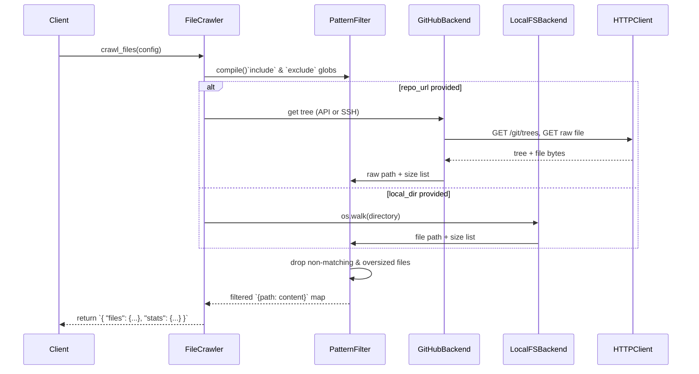

# Chapter 5: File Crawling Abstraction

In the previous chapter on [LLM Communication Abstraction](04_llm_communication_abstraction_.md), we isolated all prompt dispatch, caching, logging and retry logic behind a single `call_llm` function. Now we turn to the very first step of our pipeline: fetching source files—whether from GitHub or your local disk—through a unified **File Crawling Abstraction**.

## 5.1 Motivation & Central Use Case

Imagine you’re building a tutorial generator for `https://github.com/example/project` and also want to support onboarding from a local directory. You need:

- A single API that handles both **remote** GitHub repos and **local** folders  
- Glob-style **include/exclude** filters (`"*.py"`, `"tests/*"`)  
- Enforcement of a **max file‐size** (e.g. 100 KB)  
- Transparent handling of **HTTP rate limits** and **retries**  
- A clean mapping of **relative paths → file contents**  

Without this abstraction, every consumer (CLI, nodes, tests) would reimplement cloning, walking, filtering and retry logic. The File Crawling Abstraction acts like a digital librarian: it scans your local shelves or online archives, prunes anything too large, skips unwanted genres, and hands you back only the code you asked for.

## 5.2 Key Concepts

1. **Unified Interface**  
   - `crawl_github_files(...)` and `crawl_local_files(...)` share the same arguments.  
2. **Include / Exclude Glob Patterns**  
   - Powered by Python’s `fnmatch` to match `"*.py"`, `"docs/*"`, etc.  
3. **File‐Size Limits**  
   - Drop any file larger than `max_file_size` to avoid huge blobs.  
4. **HTTP Rate‐Limit Handling**  
   - Detect `403` with “rate limit exceeded,” wait until reset, then retry.  
5. **SSH vs. REST Cloning**  
   - If the URL is SSH (`git@…`), perform a `git clone`; otherwise call the GitHub REST API (`/git/trees`, `/contents`).  
6. **Local Filesystem Walker**  
   - Recursively `os.walk()`, apply the identical filters and size checks.  
7. **Relative Paths**  
   - Optionally return paths relative to a subdirectory or the repo root.

## 5.3 High‐Level Walkthrough

Below is a simplified sequence of what happens when you invoke the abstraction:



1. **PatternFilter** compiles your glob patterns once.  
2. **GitHubBackend** chooses SSH clone or REST API, handling rate‐limit sleeps.  
3. **LocalFSBackend** does a fast `os.walk` and identical filtering.  
4. The final result is a dict of **relative paths** to **UTF-8 strings**, plus download statistics.

## 5.4 Usage Examples

### 5.4.1 Fetching a GitHub Repository

```python
import os
from utils.crawl_github_files import crawl_github_files

result = crawl_github_files(
    repo_url="https://github.com/example/project.git",
    token=os.getenv("GITHUB_TOKEN"),         # fallback on env var
    include_patterns={"*.py", "*.md"},
    exclude_patterns={"tests/*", "examples/*"},
    max_file_size=100 * 1024,                # 100 KB
    use_relative_paths=True
)

files = result["files"]                     # dict: "src/app.py" → content
stats = result["stats"]                     # downloaded_count, skipped_count, etc.
print(f"Fetched {stats['downloaded_count']} files, skipped {stats['skipped_count']}.")
```

**Explanation**  

- The call returns a JSON-style dict with two keys:  
  - `"files"`: the mapping you’ll feed into downstream nodes  
  - `"stats"`: download counts, skipped files (too big or filtered out), source type

### 5.4.2 Scanning a Local Directory

```python
from utils.crawl_local_files import crawl_local_files

result = crawl_local_files(
    directory="/home/alex/projects/example",
    include_patterns={"*.py", "*.md"},
    exclude_patterns={".git/*", "__pycache__/*"},
    max_file_size=100 * 1024,
    use_relative_paths=True
)

files = result["files"]                     # dict of relative paths → content
print(f"Found {len(files)} files on disk.")
```

**Explanation**  

- The same filters and size checks apply.  
- No network calls or rate‐limit logic; fast, CPU‐bound walk.

### 5.4.3 Integration in `FetchRepo` Node

```python
# nodes.py, inside FetchRepo.exec()
if prep_res["repo_url"]:
    result = crawl_github_files(**prep_res)
else:
    result = crawl_local_files(**prep_res)

files_list = list(result["files"].items())
return files_list    # [(path, content), ...]
```

- The Node doesn’t care about SSH vs. API vs. filesystem: it simply unpacks the config and gets back a list of `(path, content)` tuples.

## 5.5 Internal Implementation Deep Dive

Below we highlight the core pieces of `utils/crawl_github_files.py` and `utils/crawl_local_files.py`.

### 5.5.1 Pattern Matching & Size Filtering

```python
import fnmatch

def should_include_file(path: str,
                        include_patterns: Set[str],
                        exclude_patterns: Set[str]) -> bool:
    # 1. Include if it matches any include or include_patterns is empty
    included = any(fnmatch.fnmatch(path, pat) for pat in include_patterns) \
               if include_patterns else True

    # 2. Exclude if it matches any exclude
    excluded = any(fnmatch.fnmatch(path, pat) for pat in exclude_patterns) \
               if exclude_patterns else False

    return included and not excluded
```

- **fnmatch** lets you use shell-style wildcards (`*`, `?`, `[…]`).  
- We first check inclusion, then filter out anything explicitly excluded.

### 5.5.2 GitHub REST API + Rate-Limit Back-Off

```python
def fetch_contents(path):
    url = f"https://api.github.com/repos/{owner}/{repo}/contents/{path}"
    response = requests.get(url, headers=headers, params=params)

    # Handle rate‐limit
    if response.status_code == 403 and 'rate limit exceeded' in response.text.lower():
        reset = int(response.headers.get('X-RateLimit-Reset', 0))
        wait = max(reset - time.time(), 0) + 1
        time.sleep(wait)
        return fetch_contents(path)  # retry

    response.raise_for_status()
    data = response.json()
    # process files and directories…
```

- On hitting GitHub’s rate limit, we compute `X-RateLimit-Reset`, sleep until it clears, and **recursively retry**.

### 5.5.3 SSH Clone Path

```python
import tempfile, git

if repo_url.startswith("git@") or repo_url.endswith(".git"):
    with tempfile.TemporaryDirectory() as tmpdir:
        repo = git.Repo.clone_from(repo_url, tmpdir)
        # Walk tmpdir with os.walk() (same pattern + size checks)
```

- Uses **GitPython** to clone via SSH or HTTPS.  
- Falls back to REST API only if URL is not recognized as SSH.

### 5.5.4 Local Filesystem Crawler

```python
import os

def crawl_local_files(directory, include_patterns, exclude_patterns, max_file_size, use_relative_paths):
    files = {}
    for root, _, filenames in os.walk(directory):
        for name in filenames:
            abs_path = os.path.join(root, name)
            rel_path = os.path.relpath(abs_path, directory) if use_relative_paths else abs_path

            if not should_include_file(rel_path, include_patterns, exclude_patterns):
                continue

            if max_file_size and os.path.getsize(abs_path) > max_file_size:
                continue

            with open(abs_path, 'r', encoding='utf-8') as f:
                files[rel_path] = f.read()
    return {"files": files}
```

- Mirrors the GitHub logic but purely on local disk.  
- Same error handling and pattern filtering.

## 5.6 File Layout & Responsibilities

```plaintext
utils/
├─ crawl_github_files.py    # Remote fetching (SSH + REST API)
└─ crawl_local_files.py     # Local os.walk crawler
nodes.py                   # FetchRepo node delegates here
```

- **Separation of concerns**: backends under `utils/`, orchestration in `nodes.py`.  
- **Single signature** for both crawlers means no branching logic in the CLI or higher-level nodes.

## 5.7 Conclusion

In this chapter we built a robust **File Crawling Abstraction** that:

- Unifies GitHub (SSH or REST API) and local directory scanning  
- Applies include/exclude patterns and file‐size limits  
- Handles HTTP rate‐limit sleeps and automatic retries  
- Returns a clean mapping of relative paths to file contents  

With every file now safely in memory, our next step is to identify core abstractions in the code: see [Abstraction Identification Node](06_abstraction_identification_node_.md).

---

Generated by fork of [AI Codebase Knowledge Builder](https://github.com/vegeta03/PocketFlow-Tutorial-Codebase-Knowledge.git)
