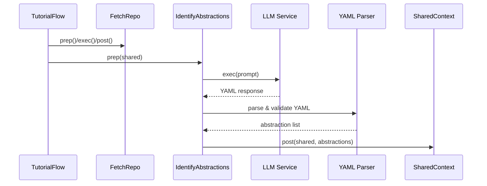

# Chapter 6: Abstraction Identification Node

In the previous chapter we fetched and filtered source files with our [File Crawling Abstraction](05_file_crawling_abstraction_.md). Now we turn those raw snippets into **semantic building blocks**. The **Abstraction Identification Node** sifts through the entire codebase—like an archaeologist unearthing artifacts—and asks an LLM to name, explain and link each core concept back to its source files.

---

## 6.1 Motivation & Central Use Case

Imagine onboarding to a large, unfamiliar repository. You have hundreds of files, classes and functions—but what are the “big ideas”?  

- Which component glues everything together?  
- What data model drives the system?  
- Where are the key entry points?  

Manually hunting through code is tedious. The **Abstraction Identification Node** automates this by:

1. Concatenating every source file into a single prompt  
2. Listing each file with a numeric index  
3. Instructing the LLM to return a YAML list of abstractions  
4. Parsing and validating the model’s output  
5. Populating `shared["abstractions"]` with `{ name, description, files }` entries  

With these abstractions in hand, downstream nodes can analyze relationships, order chapters and generate prose.

---

## 6.2 Key Responsibilities

- **Context Assembly**  
  Build a text blob containing every file’s content, prefixed by  

  ```text
  --- File Index 0: src/app.py ---
  <file contents>
  ```

- **Prompt Construction**  
  Ask the LLM to:
  - Name each abstraction  
  - Provide a beginner-friendly description (~100 words)  
  - List relevant file indices  
  - Return a well-formed YAML list  
- **YAML Parsing & Validation**  
  Use `yaml.safe_load` to:
  - Ensure output is a list of dicts  
  - Verify each item has `name` (str), `description` (str), `file_indices` (list of ints)  
  - Normalize and dedupe indices  
- **State Injection**  
  Write the validated list into `shared["abstractions"]` for downstream consumption.

---

## 6.3 Workflow Overview



---

## 6.4 Usage Example

Below is a minimal illustration of how `IdentifyAbstractions` transforms a two-file codebase into conceptual artifacts.

```python
from nodes import IdentifyAbstractions

# Suppose shared["files"] was set by FetchRepo as:
shared = {
    "project_name": "MyProject",
    "files": [
        ("src/utils.py", "def compute(x): return x * 2\n"),
        ("src/main.py",  "from utils import compute\nprint(compute(5))\n")
    ],
    "language": "english"
}

node = IdentifyAbstractions()
# 1) Prepare prompt components
prep_res = node.prep(shared)

# 2) Call LLM to get YAML text
abstractions = node.exec(prep_res)

# abstractions might look like:
# [
#   {
#     "name": "Utility Function",
#     "description": "A helper that doubles its input, used across the app as a core transform.",
#     "files": [0]
#   },
#   {
#     "name": "Application Entry Point",
#     "description": "Loads the utility and prints results to stdout, orchestrating user-facing behavior.",
#     "files": [1]
#   }
# ]

# 3) Merge into shared
node.post(shared, prep_res, abstractions)

print(shared["abstractions"])
```

---

## 6.5 Step-by-Step Flow

1. **prep(shared)**  
   - Reads `shared["files"]`, `shared["project_name"]`, `shared["language"]`  
   - Builds a giant string of file contexts and a bullet-list of indices  
2. **exec(prep_res)**  
   - Constructs a prompt embedding the file blob and instructions  
   - Calls `call_llm(prompt)`  
   - Splits out the ```yaml``` block  
   - Uses `yaml.safe_load`  
   - Runs type and range checks on every field  
3. **post(shared, …)**  
   - Stores the validated list under `shared["abstractions"]`

---

## 6.6 Internal Implementation Deep Dive

### 6.6.1 prep() Method

```python
# nodes.py

def prep(self, shared):
    files_data      = shared["files"]      # List[(path, content)]
    project_name    = shared["project_name"]
    language        = shared.get("language", "english")

    # 1) Build context text
    context = ""
    index_entries = []
    for idx, (path, content) in enumerate(files_data):
        context += f"--- File Index {idx}: {path} ---\n{content}\n\n"
        index_entries.append(f"- {idx} # {path}")

    file_listing = "\n".join(index_entries)
    return context, file_listing, len(files_data), project_name, language
```

- We return a 5-tuple:  
  `(context, file_listing, file_count, project_name, language)`  
- No external calls—just in-memory string assembly.

### 6.6.2 exec() Method & Validation

```python
import yaml
from utils.call_llm import call_llm

def exec(self, prep_res):
    context, listing, count, name, language = prep_res

    # 2) Build prompt with YAML schema
    prompt = f"""
For project `{name}`:
{context}
Analyze and list the top 5–10 abstractions as YAML.
Each must have:
  name: A short title
  description: ~100-word beginner-friendly explanation
  file_indices: list of integers

Available files:
{listing}

Return only the YAML list in a ```yaml``` block.
"""
    raw = call_llm(prompt)

    # 3) Extract YAML section
    body = raw.split("```yaml")[1].split("```")[0].strip()
    items = yaml.safe_load(body)

    # 4) Validate structure
    if not isinstance(items, list):
        raise ValueError("Expected a YAML list of abstractions")
    validated = []
    for item in items:
        # Required keys
        for key in ("name", "description", "file_indices"):
            if key not in item:
                raise ValueError(f"Missing `{key}` in {item}")
        # Type checks
        if not isinstance(item["file_indices"], list):
            raise ValueError("file_indices must be a list")
        # Normalize indices
        idxs = []
        for entry in item["file_indices"]:
            idx = int(str(entry).split("#")[0].strip())
            if not (0 <= idx < count):
                raise ValueError(f"Index {idx} out of range")
            idxs.append(idx)
        # Deduplicate
        item["files"] = sorted(set(idxs))
        validated.append({
            "name":        item["name"],
            "description": item["description"],
            "files":       item["files"]
        })

    return validated
```

- We guard against malformed output at every step.  
- We normalize strings like `"2 # src/foo.py"` to an integer index.  
- We assemble the final list of `{ name, description, files }`.

---

## 6.7 Conclusion & Next Steps

You’ve seen how the **Abstraction Identification Node** transforms raw source files into a concise, structured set of core concepts. These abstractions power the next phase—understanding how they interconnect. Proceed to the [Relationship Analysis Node](07_relationship_analysis_node_.md) to map interactions and generate high-level summaries.

---

Generated by fork of [AI Codebase Knowledge Builder](https://github.com/vegeta03/PocketFlow-Tutorial-Codebase-Knowledge.git)
