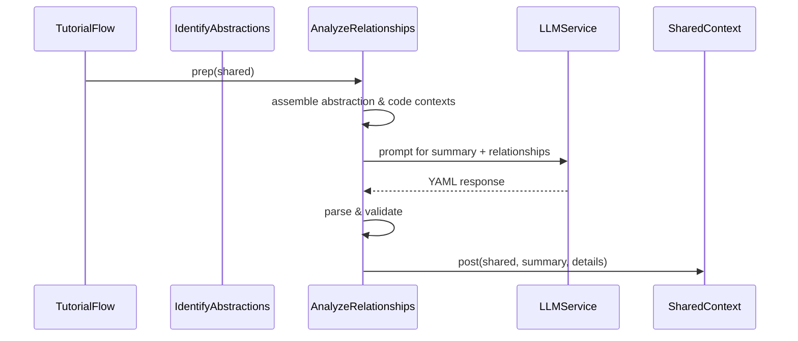

# Chapter 7: Relationship Analysis Node

In [Chapter 6: Abstraction Identification Node](06_abstraction_identification_node_.md) we distilled a list of `{ name, description, files }` abstractions. The **Relationship Analysis Node** now takes those abstractions, gathers their referenced code snippets, and asks an LLM to produce:

1. A high-level project **summary**  
2. A directed list of **relationships** between abstractions, each with  
   - `from_abstraction`  
   - `to_abstraction`  
   - `label` (a concise verb or phrase)

Conceptually, this is like charting a social-network graph: you’ve identified the “people” (abstractions), now you map who calls whom, who configures whom, and how data or control flows between them.

---

## Motivation & Central Use Case

A senior engineer wants not only to know *what* the core components are, but *how* they interact:

- Which abstraction orchestrates the workflow?  
- Which modules supply data to others?  
- What is the overall behavior in plain language?

By centralizing this in one node, we can automatically generate both a human-friendly summary and a machine-parsable graph of interactions for diagrams or further analysis.

---

## Key Concepts

- **Context Assembly**  
  Collect abstraction names, descriptions and only the *relevant* code snippets.  
- **Prompt Construction**  
  Embed language hints (for localization), project name, abstraction listing, and code context.  
- **YAML Response Parsing**  
  Extract the ```yaml``` block, load with `yaml.safe_load`, and validate types.  
- **Validation Rules**  
  - Every abstraction must appear at least once as source or target  
  - Labels must be short (e.g. ≤30 characters)  
  - Indices map back to valid abstraction entries  
- **State Injection**  
  Store the result in `shared["relationships"] = { summary: str, details: [ {from, to, label} ] }`

---

## Workflow Overview



---

## Usage Example

```python
from nodes import AnalyzeRelationships

# Suppose shared has:
#   shared["abstractions"] = [
#     {"name": "CoreEngine", "description": "...", "files": [0,2]},
#     {"name": "DataModel",  "description": "...", "files": [1]},
#     {"name": "Serializer","description": "...","files": [2]}
#   ]
#   shared["files"] = [ ("core.py", "..."), ("model.py", "..."), ("serialize.py", "...") ]
#   shared["project_name"] = "ExampleProject"

node = AnalyzeRelationships()
prep_res = node.prep(shared)        # build context strings
exec_res = node.exec(prep_res)      # call LLM, parse & validate
node.post(shared, prep_res, exec_res)

print(shared["relationships"])
# {
#   "summary": "ExampleProject is a lightweight processing pipeline that ...",
#   "details": [
#     {"from": 0, "to": 1, "label": "Loads Data"},
#     {"from": 1, "to": 2, "label": "Serializes"},
#     {"from": 2, "to": 0, "label": "Returns Output"}
#   ]
# }
```

---

## Internal Implementation Walkthrough

### prep(shared)

- Reads `shared["abstractions"]`, `shared["files"]`, `shared["project_name"]`, `shared["language"]`  
- Builds two strings:  
  1. **Abstraction Listing** (e.g. `0 # CoreEngine`)  
  2. **Code Context**: only the files referenced by any abstraction via `get_content_for_indices`  

```python
def prep(self, shared):
    abstractions = shared["abstractions"]
    files_data    = shared["files"]
    project_name  = shared["project_name"]
    language      = shared.get("language", "english")

    # 1) List abstractions
    abstraction_listing = "\n".join(
        f"{i} # {ab['name']}" for i, ab in enumerate(abstractions)
    )

    # 2) Gather relevant code snippets
    all_idxs = {idx for ab in abstractions for idx in ab["files"]}
    snippet_map = get_content_for_indices(files_data, sorted(all_idxs))
    code_context = "\n\n".join(
        f"--- File: {key.split('# ')[1]} ---\n{content}"
        for key, content in snippet_map.items()
    )

    return abstraction_listing, code_context, project_name, language
```

### exec(prep_res)

1. **Compose Prompt**  
   - Insert language instructions if `language != "english"`  
   - Demand a YAML dict with `summary` and `relationships` fields  
2. **Call LLM**  

   ```python
   prompt = f"""

   Based on {project_name} abstractions:
   {abstraction_listing}

   Relevant code:
   {code_context}

   IMPORTANT: Ensure each abbreviation appears in at least one relationship.

   Format as YAML:

   ```yaml
   summary: |
     <high-level summary>
   relationships:
     - from_abstraction: 0 # CoreEngine
       to_abstraction: 1 # DataModel
       label: "Loads Data"
     ...
   ```"""
   raw = call_llm(prompt)
   ```

3. **Extract & Parse YAML**  

   ```python
   body = raw.split("```yaml")[1].split("```")[0].strip()
   data = yaml.safe_load(body)
   summary   = data["summary"]
   relations = data["relationships"]
   ```

4. **Validate & Normalize**  
   - Confirm `summary` is `str`; `relationships` is `list`  
   - For each `rel` ensure keys `from_abstraction`,`to_abstraction`,`label` exist  
   - Parse indices by splitting on `#`, cast to `int`, and check `0 ≤ idx < N`  
   - Truncate labels to ≤30 chars if necessary  

```python
validated = []
for rel in relations:
    fidx = int(str(rel["from_abstraction"]).split("#")[0])
    tidx = int(str(rel["to_abstraction"]).split("#")[0])
    label = rel["label"].strip()
    if len(label) > 30:
        label = label[:27] + "..."
    validated.append({"from": fidx, "to": tidx, "label": label})
return {"summary": summary, "details": validated}
```

### post(shared, prep_res, exec_res)

```python
def post(self, shared, prep_res, exec_res):
    shared["relationships"] = exec_res
```

---

## Conclusion

The **Relationship Analysis Node** turns isolated abstractions into a coherent map of interactions and a concise project summary. You now have:

- A **summary** that any newcomer can read for a quick overview  
- A **list of directed edges** ready for visualization or further processing  

Next up, we’ll decide in which order to present these abstractions in your tutorial: see [Chapter 8: Chapter Ordering Node](08_chapter_ordering_node_.md).

---

Generated by fork of [AI Codebase Knowledge Builder](https://github.com/vegeta03/PocketFlow-Tutorial-Codebase-Knowledge.git)
