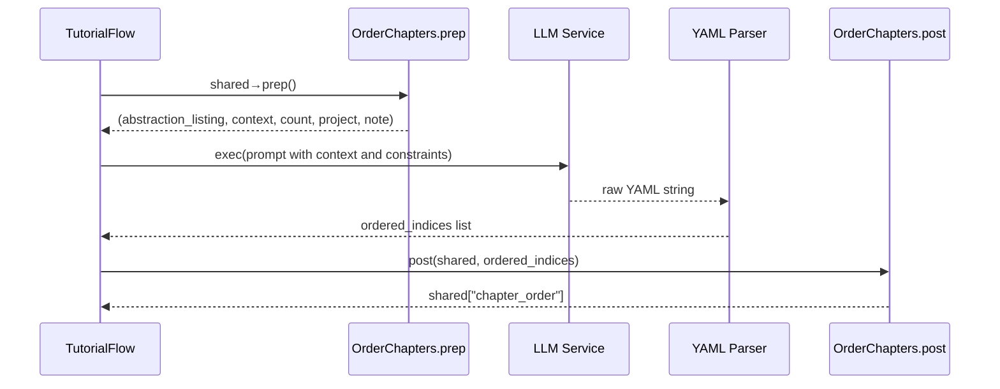

# Chapter 8: Chapter Ordering Node

In the previous chapter, [Relationship Analysis Node](07_relationship_analysis_node_.md) produced a high-level summary of the project and a directed graph of how each abstraction interacts. Now it’s time to decide **in what order** to introduce those abstractions to a learner. The **Chapter Ordering Node** functions like a curriculum planner: given your list of abstractions and their dependencies, it asks an LLM to generate a pedagogically sound sequence from foundational concepts up to advanced details. Finally, it parses and validates that every concept appears exactly once and dependencies are respected.

---

## 8.1 Motivation & Central Use Case

Imagine you have identified these core components in a large codebase:

1. `APIEndpoint` – the user-facing entry point  
2. `AuthManager` – verifies credentials  
3. `DataModel` – defines your domain objects  
4. `StorageAdapter` – persists data  

You know, for example, that `AuthManager` must come before `APIEndpoint`, and `DataModel` underpins everything. But manually sorting them every time you analyze a project is tedious and error-prone. The Chapter Ordering Node automates this by:

- Consuming the **abstraction list** and the **relationship graph**  
- Prompting the LLM to propose a natural teaching sequence  
- Parsing a YAML list of indices with comments (e.g. `- 2 # DataModel`)  
- Enforcing that each index appears exactly once and in valid dependency order  

Analogy: it’s like building a staircase—you place the foundation (`DataModel`), then the support beams (`StorageAdapter`), then the roof (`APIEndpoint`), ensuring you never explain high-level orchestration before its prerequisites.

---

## 8.2 Key Concepts

1. **Context Assembly**  
   Gather the abstraction names (with indices) and the summarized relationships into a single prompt.  
2. **Curriculum Planning**  
   Instruct the LLM to sort topics from most foundational (no incoming edges) to most advanced (leaf nodes).  
3. **YAML Ordering & Validation**  
   Parse the LLM’s YAML output into a list of integer indices. Verify:
   - No index is missing or duplicated  
   - All indices are in the valid range  
   - The resulting order respects dependency constraints  

---

## 8.3 Usage Example

Below is a minimal example demonstrating how to invoke the `OrderChapters` node in code:

```python
from nodes import OrderChapters

# Prepare shared context coming out of AnalyzeRelationships
shared = {
    "project_name": "MyProject",
    "language": "english",
    "abstractions": [
        {"name":"APIEndpoint","description":"...","files":[0]},
        {"name":"AuthManager","description":"...","files":[1]},
        {"name":"DataModel","description":"...","files":[2]},
        {"name":"StorageAdapter","description":"...","files":[3]}
    ],
    "relationships": {
        "summary":"MyProject handles HTTP requests, authenticates users, maps data, then persists it.",
        "details":[
            {"from":2,"to":3,"label":"Persists"},
            {"from":1,"to":0,"label":"Secures"},
            {"from":3,"to":1,"label":"Reads configs"},
            {"from":0,"to":3,"label":"Saves data"}
        ]
    }
}

node = OrderChapters()
prep_res = node.prep(shared)
ordered = node.exec(prep_res)
node.post(shared, prep_res, ordered)

print("Chapter order (indices):", shared["chapter_order"])
# Example output:
# Chapter order (indices): [2, 3, 1, 0]
```

In this example, the LLM might suggest:

```yaml
- 2 # DataModel
- 3 # StorageAdapter
- 1 # AuthManager
- 0 # APIEndpoint
```

This sequence introduces the data structures first, then persistence, then security, and finally the public API.

---

## 8.4 Step-by-Step Workflow



1. **prep()** reads `shared["abstractions"]` and `shared["relationships"]`, formats them as numbered list and narrative context.  
2. **exec()** builds a prompt asking the LLM for a YAML-formatted ordering, calls `call_llm()`, extracts the ```yaml``` block and uses `yaml.safe_load()`.  
3. It runs validation: correct range, no duplicates, length matches number of abstractions.  
4. **post()** writes the final `shared["chapter_order"]` for downstream nodes.

---

## 8.5 Internal Implementation Deep Dive

### 8.5.1 prep() Method

```python
def prep(self, shared):
    abstractions = shared["abstractions"]
    rels         = shared["relationships"]
    project      = shared["project_name"]
    lang_note    = "" if shared.get("language","english")=="english" else f" (names may be translated)"
    
    # Build a bullet list of "index # name"
    abstraction_listing = "\n".join(
        f"- {i} # {ab['name']}" for i,ab in enumerate(abstractions)
    )

    # Build a context describing relationships
    context = f"Project Summary:\n{rels['summary']}\n\nRelationships:\n"
    for r in rels["details"]:
        from_name = abstractions[r["from"]]["name"]
        to_name   = abstractions[r["to"]]["name"]
        context += f"- {r['from']} ({from_name}) → {r['to']} ({to_name}): {r['label']}\n"

    return abstraction_listing, context, len(abstractions), project, lang_note
```

This method returns all the pieces the LLM needs:  

- `abstraction_listing` (e.g. `- 0 # DataModel`)  
- `context` summarizing project summary + each directed edge  
- total count, project name, and a note if names are localized  

### 8.5.2 exec() Method

```python
import yaml
from utils.call_llm import call_llm

def exec(self, prep_res):
    abstraction_listing, context, count, project, note = prep_res
    prompt = f"""
Given the project `{project}`, here are its abstractions{note}:
{abstraction_listing}

And their relationships:
{context}

What is the best order to teach these abstractions, from most foundational to most advanced?
Return a YAML list of indices with comments, including each index exactly once:

```yaml
- 2 # DataModel
- 3 # StorageAdapter
- 1 # AuthManager
- 0 # APIEndpoint
```"""
    raw = call_llm(prompt)

    # Extract YAML and parse
    body = raw.split("```yaml")[1].split("```")[0].strip()
    ordered_raw = yaml.safe_load(body)

    # Validation
    if not isinstance(ordered_raw, list):
        raise ValueError("Expected a YAML list")
    seen = set()
    ordered = []
    for entry in ordered_raw:
        # parse index before the '#'
        idx = int(str(entry).split("#")[0].strip())
        if idx in seen or not (0 <= idx < count):
            raise ValueError(f"Invalid or duplicate index: {idx}")
        seen.add(idx)
        ordered.append(idx)

    if len(ordered) != count:
        missing = set(range(count)) - seen
        raise ValueError(f"Missing indices: {missing}")

    return ordered
```

**Key points**:  

- We instruct the LLM to return a strict YAML format.  
- We split on the ```yaml``` fences, use `yaml.safe_load()`, then enforce uniqueness and completeness.

### 8.5.3 post() Method

```python
def post(self, shared, prep_res, exec_res):
    shared["chapter_order"] = exec_res
```

A simple merge into the shared context for the next node to consume.

---

## 8.6 Conclusion

You’ve now seen how the **Chapter Ordering Node** transforms a graph of abstractions and relationships into a linear tutorial roadmap:

- Assembles teaching context from summaries and edges  
- Prompts the LLM as a “curriculum planner”  
- Parses and rigorously validates a YAML-formatted sequence  
- Exposes `shared["chapter_order"]` for chapter generation  

In the next chapter, we will flesh out each ordered abstraction into full Markdown chapters with the **[Chapter Generation Node](09_chapter_generation_node_.md)**.

---

Generated by fork of [AI Codebase Knowledge Builder](https://github.com/vegeta03/PocketFlow-Tutorial-Codebase-Knowledge.git)
