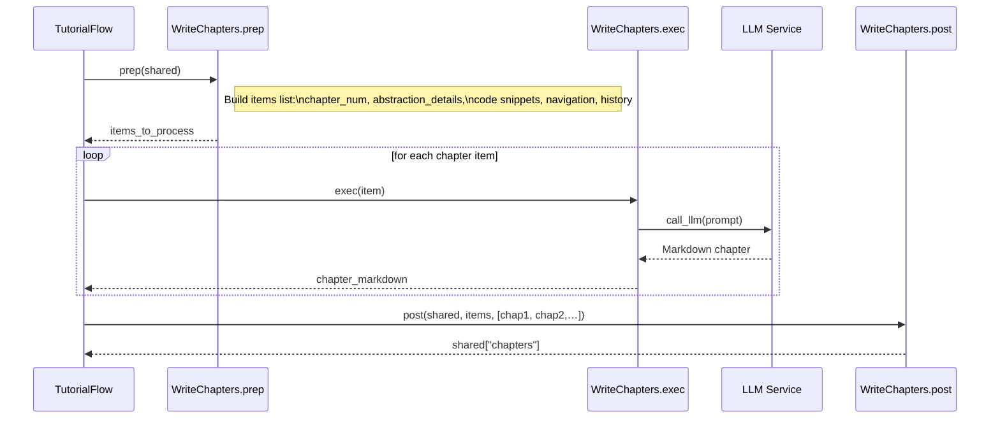
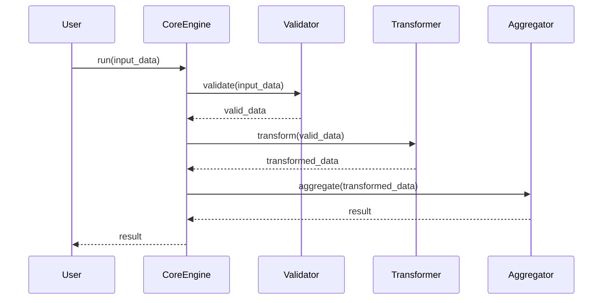

# Chapter 9: Chapter Generation Node

<– Previous: [Chapter 8: Chapter Ordering Node](08_chapter_ordering_node_.md)  

## 9.1 Motivation & Central Use Case

After we’ve  

1. Crawled files ([Chapter 5](05_file_crawling_abstraction_.md)),  
2. Identified abstractions ([Chapter 6](06_abstraction_identification_node_.md)),  
3. Mapped relationships ([Chapter 7](07_relationship_analysis_node_.md)), and  
4. Determined a teaching sequence ([Chapter 8](08_chapter_ordering_node_.md)),  

we need to **draft** each tutorial chapter as Markdown. The **Chapter Generation Node** (a `BatchNode`) is our AI co-author: it iterates over each abstraction in order, weaving in:

- Concept details (name & description)  
- Relevant code snippets  
- The full chapter listing for navigation  
- Summaries of previous chapters for smooth transitions  
- Translation or language instructions  

This node maintains a running history (`chapters_written_so_far`) so that chapter _n+1_ can refer back to what chapter _n_ covered. Think of it like a novelist writing one chapter at a time, then using a synopsis of earlier chapters to ensure consistency and narrative flow.

## 9.2 Key Concepts

1. **BatchNode Lifecycle**  
   - `prep(shared)` → build an _item list_ where each item carries everything needed for one chapter.  
   - `exec(item)` → for each item, call the LLM with a rich prompt to generate one Markdown chapter.  
   - `post(shared, ..., exec_res_list)` → collect all chapter texts into `shared["chapters"]`.
2. **Running History**  
   - `self.chapters_written_so_far` accumulates previously generated Markdown strings, enabling natural “Previously on…” transitions.
3. **Prompt Composition**  
   - Inject concept name/description  
   - Insert code context  
   - Prepend full TOC (so links are correct)  
   - Add translation hints if `language != "english"`  
   - Include transition text from the last chapter  
4. **Analogy**  
   - Like an editor who reads earlier chapters and ensures consistency in style, terminology and references.

## 9.3 High-Level Sequence Diagram



## 9.4 Step-by-Step Walkthrough

### 1) prep(shared)

- Read:
  - `shared["chapter_order"]` (list of abstraction indices in teaching order)  
  - `shared["abstractions"]` (each with `name`, `description`, `files`)  
  - `shared["files"]` (path→content)  
  - `shared["project_name"]`, `shared["language"]`

- Build:
  - **Full Chapter Listing** (TOC) as a numbered Markdown list with links to each file.  
  - **Item Map** for each chapter _i_:
    - `chapter_num`: 1-based index  
    - `abstraction_details`: `{name, description}`  
    - `related_files_content_map`: code snippets for that abstraction  
    - `prev_chapter`: metadata for transitions  
    - `next_chapter`: metadata for next link  
    - `full_chapter_listing`, `chapter_filenames`, `language`

### 2) exec(item)

- Formulate a detailed prompt containing:
  - Chapter heading: `# Chapter {chapter_num}: {abstraction_name}`  
  - Concept details  
  - Full TOC  
  - “Context from previous chapters” (or “first chapter”)  
  - Relevant code snippets  
  - Translation/instruction block if non-English  
  - Clear bullet-point instructions on structure: motivation, examples, simplified code blocks (<20 lines), Mermaid diagrams, analogies, links to other chapters, conclusion with link to next.

- **Example snippet**:

    ```python
    prompt = f"""
    IMPORTANT: Write this ENTIRE tutorial chapter in {language.capitalize()}...
    # Chapter {chapter_num}: {abstraction_name}

    Concept Details:
    - Name: {abstraction_name}
    - Description:
      {abstraction_description}

    Complete Tutorial Structure:
    {full_chapter_listing}

    Context from previous chapters:
    {previous_chapters_summary or 'This is the first chapter.'}

    Relevant Code Snippets:
    {file_context_str}

    Instructions:
    - Begin with motivation...
    - Use code blocks ≤20 lines...
    - Provide a simple Mermaid sequenceDiagram:
      ```mermaid
      sequenceDiagram
        participant U as User
        participant C as {abstraction_name}
        participant S as System
        participant R as RelatedModule
        participant N as NextChapter
        U->>C: invoke feature
        C->>S: calls underlying service
        S->>R: fetch data
        R-->>C: returns data
        C-->>U: respond
      ```
    - End with a transition to [Next Chapter Title](next_filename.md).
    """
    chapter_md = call_llm(prompt)
    ```

- Validate that the returned Markdown starts with the correct heading; if not, inject or correct it.  

- Append `chapter_md` to `self.chapters_written_so_far`.

### 3) post(shared, prep_res, exec_res_list)

- Collate `exec_res_list` (ordered list of Markdown strings) into `shared["chapters"]`.  
- Delete the temporary `chapters_written_so_far`.  

## 9.5 Internal Implementation (Simplified Code)

```python
class WriteChapters(BatchNode):
    def prep(self, shared):
        order        = shared["chapter_order"]
        abstractions = shared["abstractions"]
        files_data   = shared["files"]
        language     = shared["language"]
        self.chapters_written_so_far = []

        # Build TOC and filename map
        toc_lines, filename_map = [], {}
        for idx, ab_idx in enumerate(order):
            name = abstractions[ab_idx]["name"]
            num  = idx + 1
            fn   = f"{num:02d}_{sanitize(name)}.md"
            toc_lines.append(f"{num}. [{name}]({fn})")
            filename_map[ab_idx] = (num, name, fn)
        full_toc = "\n".join(toc_lines)

        items = []
        for idx, ab_idx in enumerate(order):
            prev = filename_map.get(order[idx-1]) if idx>0 else None
            nxt  = filename_map.get(order[idx+1]) if idx<len(order)-1 else None
            files_map = get_content_for_indices(files_data,
                         abstractions[ab_idx]["files"])
            items.append({
                "chapter_num": idx+1,
                "abstraction": abstractions[ab_idx],
                "files_map": files_map,
                "full_toc": full_toc,
                "prev": prev, "next": nxt,
                "language": language,
            })
        return items

    def exec(self, item):
        # Build prompt (see above)
        chapter_md = call_llm(prompt)
        # Ensure heading
        chapter_md = normalize_heading(chapter_md, item["chapter_num"], item["abstraction"]["name"])
        self.chapters_written_so_far.append(chapter_md)
        return chapter_md

    def post(self, shared, prep_res, exec_res_list):
        shared["chapters"] = exec_res_list
        del self.chapters_written_so_far
```

## 9.6 Example Output Snippet

Here’s a **fragment** of what Chapter 1 might look like:

```markdown
# Chapter 1: CoreEngine

In the previous chapter, you learned how we mapped the high-level flow of components. Now we dive into the **CoreEngine**, the heart that orchestrates data processing.

## Motivation

Imagine you have a pipeline that must…

```python
# core.py

class CoreEngine:
    def __init__(self, config):
        self.config = config  # simplified

    def run(self, input_data):
        # Step 1: validate
        # Step 2: transform
        # Step 3: aggregate
        return result
```

*This class validates, transforms, and aggregates your data in three clear steps._



## 9.7 Conclusion & Next Steps

In this chapter you saw how the **Chapter Generation Node**:

- Uses a `BatchNode` to draft each chapter in isolation  
- Maintains `chapters_written_so_far` for coherent transitions  
- Combines concept details, full TOC, code snippets and language hints into one rich LLM prompt  
- Produces polished, link-aware Markdown chapters  

Next up, we’ll **assemble** everything—index, chapters and diagrams—into a final output directory in [Chapter 10: Tutorial Assembly Node](10_tutorial_assembly_node_.md).

---

Generated by fork of [AI Codebase Knowledge Builder](https://github.com/vegeta03/PocketFlow-Tutorial-Codebase-Knowledge.git)
