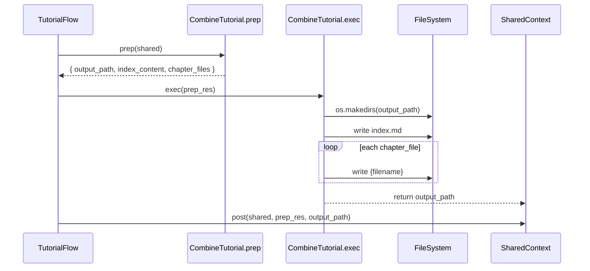

# Chapter 10: Tutorial Assembly Node

In the previous chapter, [Chapter 9: Chapter Generation Node](09_chapter_generation_node_.md) we drafted each Markdown chapter with AI assistance. Now it’s time to act like a **bookbinder**—gathering all generated chapters, diagrams and metadata—and produce the final, self-contained tutorial on disk. The **Tutorial Assembly Node** finalizes the output:

1. It generates a **Mermaid graph** of abstraction relationships.  
2. It builds `index.md` with the project summary and chapter links.  
3. It writes each chapter file with consistent filenames, proper attributions, and directory structure.  

By the end of this chapter, you’ll understand how the code in `CombineTutorial` turns in-memory content into a ready-to-publish tutorial.

---

## 10.1 Motivation & Central Use Case

Imagine you’ve just run your AI-driven pipeline and now have:

- A project name (`MyProject`)  
- A high-level **summary** and a list of **directed relationships**  
- An ordered list of **chapter Markdown strings**  
- A target **output directory**  

Without a final assembly step, you’d manually paste, rename and link dozens of files. The **Tutorial Assembly Node** automates:

- **Filesystem orchestration** (creating directories, writing files)  
- **Naming conventions** (prefixing `01_`, `02_`, etc.)  
- **Diagram generation** (visualizing the relationship graph)  
- **Consistent attributions** in `index.md` and each chapter  

It ensures your output directory is a fully self-contained tutorial—ready for version control or static site hosting.

---

## 10.2 Key Responsibilities

1. **prep(shared)**  
   - Read `shared["project_name"]`, `shared["relationships"]`, `shared["chapter_order"]`, `shared["abstractions"]`, `shared["chapters"]` and `shared["output_dir"]`.  
   - Build a Mermaid **flowchart** that maps each abstraction node and edge.  
   - Compose the **index.md** content: title, summary, repository link, Mermaid diagram and chapter links.  
   - Assemble a list of `{ filename, content }` for each chapter, appending an attribution footer.  

2. **exec(prep_res)**  
   - Create the output directory (e.g. `output/MyProject/`).  
   - Write `index.md` and every chapter file (`01_name.md`, `02_other.md`, …).  

3. **post(shared, …)**  
   - Update `shared["final_output_dir"]` with the path to the assembled tutorial.  
   - Print a completion message.

---

## 10.3 Detailed Workflow

### 10.3.1 Sequence Diagram



---

### 10.3.2 prep(shared)

```python
def prep(self, shared):
    import os
    project = shared["project_name"]
    base_dir = shared.get("output_dir", "output")
    output_path = os.path.join(base_dir, project)

    # 1) Build Mermaid flowchart
    rels   = shared["relationships"]["details"]
    absts  = shared["abstractions"]
    mermaid = ["flowchart TD"]
    for idx, ab in enumerate(absts):
        # Node A0, A1, … labeled with abstraction names
        node_id = f"A{idx}"
        label   = ab["name"].replace('"','')
        mermaid.append(f'    {node_id}["{label}"]')
    for r in rels:
        frm = f"A{r['from']}"
        to  = f"A{r['to']}"
        lbl = r["label"].replace('"','').strip()
        # Truncate very long labels
        if len(lbl) > 30:
            lbl = lbl[:27] + "..."
        mermaid.append(f'    {frm} -- "{lbl}" --> {to}')
    mermaid_diagram = "\n".join(mermaid)

    # 2) Compose index.md content
    summary = shared["relationships"]["summary"]
    repo    = shared.get("repo_url", "")
    index_md = f"# Tutorial: {project}\n\n"
    index_md += f"{summary}\n\n"
    if repo:
        index_md += f"**Source Repository:** [{repo}]({repo})\n\n"
    index_md += "```mermaid\n" + mermaid_diagram + "\n```\n\n"
    index_md += "## Chapters\n\n"

    # 3) Prepare chapter links and file list
    chapter_files = []
    order = shared["chapter_order"]
    chapters = shared["chapters"]
    for i, ab_idx in enumerate(order):
        ab_name = absts[ab_idx]["name"]
        num     = i + 1
        # Sanitize name → filename
        safe = "".join(c if c.isalnum() else "_" for c in ab_name).lower()
        fname  = f"{num:02d}_{safe}.md"
        index_md += f"{num}. [{ab_name}]({fname})\n"
        # Append attribution to chapter content
        content = chapters[i].rstrip() + "\n\n"
        content += "---\n\nGenerated by [AI Codebase Knowledge Builder](https://github.com/The-Pocket/Tutorial-Codebase-Knowledge)"
        chapter_files.append({"filename": fname, "content": content})

    # 4) Attribution on index
    index_md += "\n---\n\nGenerated by [AI Codebase Knowledge Builder](https://github.com/The-Pocket/Tutorial-Codebase-Knowledge)"

    return {
        "output_path":  output_path,
        "index_content": index_md,
        "chapter_files": chapter_files
    }
```

> Explanation  
>
> - We iterate over `shared["abstractions"]` to build each Mermaid node.  
> - We then add directed edges from `shared["relationships"]["details"]`.  
> - We construct `index.md` with summary, repo link, diagram and a numbered chapter list.  
> - Each chapter’s Markdown gets an attribution footer before writing.

---

### 10.3.3 exec(prep_res)

```python
def exec(self, prep_res):
    import os

    out_dir       = prep_res["output_path"]
    index_md      = prep_res["index_content"]
    chapter_files = prep_res["chapter_files"]

    # 1) Create the directory
    os.makedirs(out_dir, exist_ok=True)

    # 2) Write index.md
    idx_path = os.path.join(out_dir, "index.md")
    with open(idx_path, "w", encoding="utf-8") as f:
        f.write(index_md)
    print(f"  - Wrote {idx_path}")

    # 3) Write each chapter file
    for ch in chapter_files:
        path = os.path.join(out_dir, ch["filename"])
        with open(path, "w", encoding="utf-8") as f:
            f.write(ch["content"])
        print(f"  - Wrote {path}")

    return out_dir
```

> Explanation  
>
> - We ensure the output directory exists.  
> - We write `index.md` then loop over all chapters, writing each file in turn.  
> - We print status messages for visibility.

---

### 10.3.4 post(shared, prep_res, exec_res)

```python
def post(self, shared, prep_res, exec_res):
    shared["final_output_dir"] = exec_res
    print(f"\nTutorial generation complete! Output directory: {exec_res}")
```

> Explanation  
>
> - We record the final path in the shared context for any downstream reporting or automation.  
> - A friendly completion message confirms success.

---

## 10.4 Conclusion

In this final node, **Tutorial Assembly Node** acts as the publisher:

- It **visualizes** abstraction relationships with a Mermaid diagram.  
- It **indexes** chapters and unifies them under `index.md`.  
- It **writes** each chapter Markdown to disk with consistent filenames and attributions.  
- It produces a **self-contained** output directory, ready for distribution or hosting.

With this chapter, you now have a complete end-to-end pipeline—from fetching source code to producing a polished, navigable tutorial. Congratulations on building a full **AI-driven tutorial generator** for any codebase!

---

Generated by fork of [AI Codebase Knowledge Builder](https://github.com/vegeta03/PocketFlow-Tutorial-Codebase-Knowledge.git)
