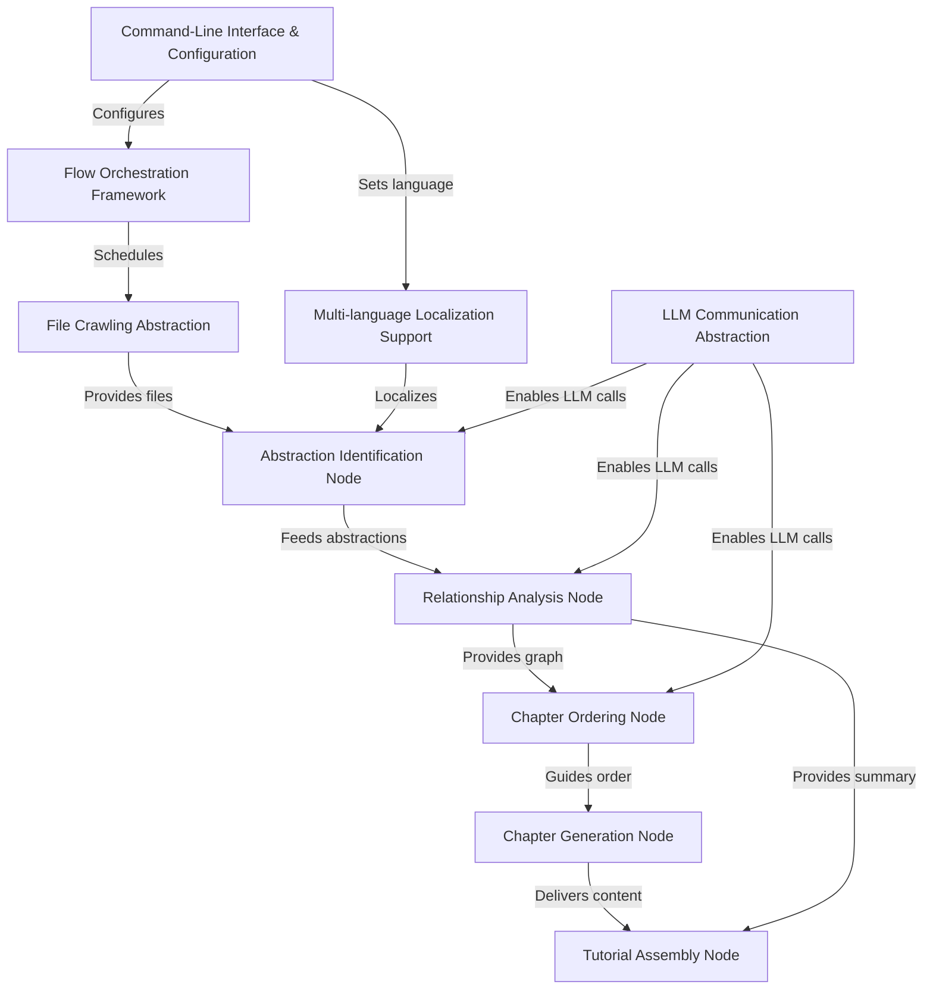

# Tutorial: PocketFlow-Tutorial-Codebase-Knowledge

The **PocketFlow-Tutorial-Codebase-Knowledge** project implements a lightweight *workflow engine* to orchestrate a sequence of nodes that automatically generate a beginner-friendly tutorial for any codebase. It combines file crawling, abstraction identification, relationship mapping, pedagogical ordering, LLM-powered chapter drafting, multi-language localization, and final assembly into a self-contained Markdown tutorial.

**Source Repository:** [https://github.com/The-Pocket/PocketFlow-Tutorial-Codebase-Knowledge](https://github.com/The-Pocket/PocketFlow-Tutorial-Codebase-Knowledge)

## Chapters

1. [Command-Line Interface & Configuration](01_command_line_interface___configuration_.md)
2. [Flow Orchestration Framework](02_flow_orchestration_framework_.md)
3. [Multi-language Localization Support](03_multi_language_localization_support_.md)
4. [LLM Communication Abstraction](04_llm_communication_abstraction_.md)
5. [File Crawling Abstraction](05_file_crawling_abstraction_.md)
6. [Abstraction Identification Node](06_abstraction_identification_node_.md)
7. [Relationship Analysis Node](07_relationship_analysis_node_.md)
8. [Chapter Ordering Node](08_chapter_ordering_node_.md)
9. [Chapter Generation Node](09_chapter_generation_node_.md)
10. [Tutorial Assembly Node](10_tutorial_assembly_node_.md)

---

Generated by fork of [AI Codebase Knowledge Builder](https://github.com/vegeta03/PocketFlow-Tutorial-Codebase-Knowledge.git)
