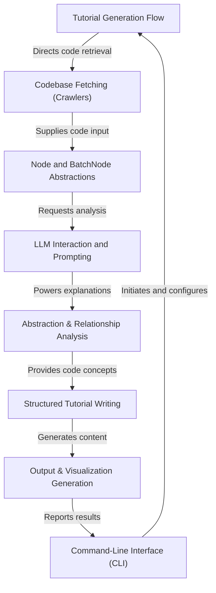

# Tutorial: PocketFlow-Tutorial-Codebase-Knowledge

**PocketFlow-Tutorial-Codebase-Knowledge** is an *intelligent system* that automatically converts complex codebases into clear, beginner-friendly tutorials. It works like an *assembly line*, fetching code from GitHub or local sources, analyzing main components, and generating structured, easy-to-understand chapters. Using the power of large language models (LLMs), it not only explains code but does so in multiple languages with diagrams and visual aids. This helps newcomers quickly grasp the core logic and structure of any software project.

**Source Repository:** [https://github.com/The-Pocket/PocketFlow-Tutorial-Codebase-Knowledge](https://github.com/The-Pocket/PocketFlow-Tutorial-Codebase-Knowledge)

## Chapters

1. [Command-Line Interface (CLI)
](01_command_line_interface__cli__.md)
2. [Tutorial Generation Flow
](02_tutorial_generation_flow_.md)
3. [Codebase Fetching (Crawlers)
](03_codebase_fetching__crawlers__.md)
4. [Node and BatchNode Abstractions
](04_node_and_batchnode_abstractions_.md)
5. [LLM Interaction and Prompting
](05_llm_interaction_and_prompting_.md)
6. [Abstraction & Relationship Analysis
](06_abstraction___relationship_analysis_.md)
7. [Structured Tutorial Writing
](07_structured_tutorial_writing_.md)
8. [Output & Visualization Generation
](08_output___visualization_generation_.md)

---

Generated by [AI Codebase Knowledge Builder](https://github.com/The-Pocket/Tutorial-Codebase-Knowledge)