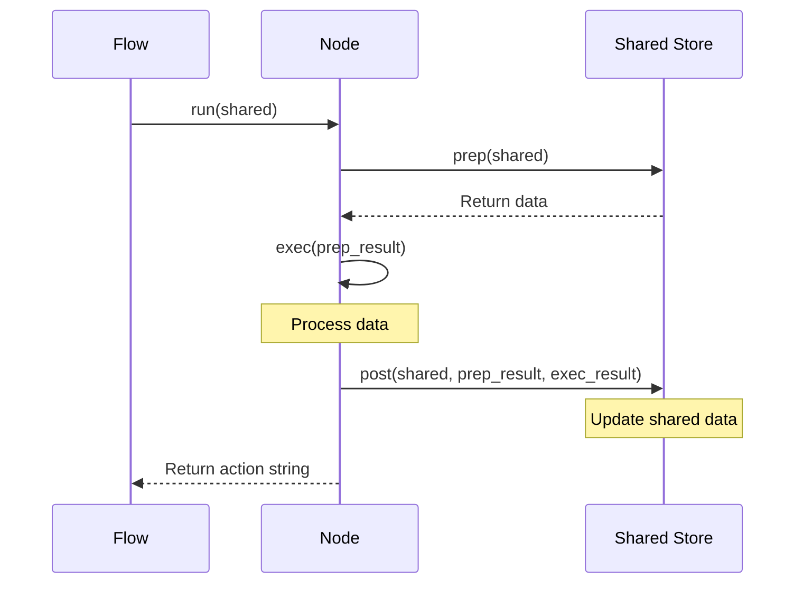

# Chapter 1: Node

## Introduction to Nodes in PocketFlow

Imagine you're building a text processing app that needs to:
1. Get input from the user
2. Count the words in the text
3. Track statistics across multiple inputs
4. Display these statistics to the user

How would you structure this code? You could put everything in one big function, but that would be hard to maintain and extend.

PocketFlow offers a better way: **Nodes**. A Node is like a specialized worker on an assembly line that does just one specific task really well. In our text processing app, one Node would handle user input, another would count words, and a third would display statistics.

In this chapter, we'll learn what Nodes are, how they work, and how to create them. We'll use our text processing app as a concrete example throughout.

## What is a Node?

A Node in PocketFlow is a building block that:
1. Takes some input
2. Processes it 
3. Produces an output
4. Decides what should happen next

Nodes are like LEGO pieces that snap together to build a workflow. Each Node does one small part of the overall job.

### The Three-Stage Lifecycle

Every Node follows a three-stage lifecycle:

1. **Preparation (prep)**: Gets the data needed for processing
2. **Execution (exec)**: Does the actual work
3. **Post-processing (post)**: Handles the results and determines what's next

This structure helps organize the code and makes it clear what each part of the Node does.

```mermaid
sequenceDiagram
    participant S as Shared Store
    participant N as Node
    
    N->>S: prep(shared)
    Note over N: "I need some data to work with"
    S->>N: Return data
    
    N->>N: exec(prep_result)
    Note over N: "Let me process this data"
    
    N->>S: post(shared, prep_result, exec_result)
    Note over N, S: "Here's my result; let me save it"
    N-->>N: Return next action
    Note over N: "Here's what should happen next"
```

## Creating Your First Node

Let's create our first Node for the text processing app - one that gets input from the user:

```python
from pocketflow import Node

class TextInput(Node):
    """Node that reads text input from the user."""
    
    def prep(self, shared):
        """Ask the user for input."""
        return input("Enter text (or 'q' to quit): ")
    
    def post(self, shared, prep_res, exec_res):
        """Store the text and decide what to do next."""
        # If user wants to quit
        if prep_res == 'q':
            return "exit"
        
        # Store the text in the shared store
        shared["text"] = prep_res
        
        # Go to the word counting node next
        return "count"
```

Let's break this down:

- We create a class that extends `Node` from PocketFlow
- The `prep` method asks the user for input and returns what they typed
- We don't need an `exec` method for this simple Node (more on this later)
- The `post` method stores the text and returns an "action string" that determines what happens next

Notice the `shared` parameter? It's a dictionary that all Nodes in a workflow can access - like a shared whiteboard where Nodes can read and write information.

## Processing Data with Nodes

Now let's create a Node that counts words in the text:

```python
class WordCounter(Node):
    """Node that counts words in the text."""
    
    def prep(self, shared):
        """Get the text from the shared store."""
        return shared["text"]
    
    def exec(self, text):
        """Count the words by splitting on spaces."""
        return len(text.split())
    
    def post(self, shared, prep_res, exec_res):
        """Store the word count and go to the stats node."""
        # If we don't have a stats dictionary yet, create one
        if "stats" not in shared:
            shared["stats"] = {
                "total_texts": 0,
                "total_words": 0
            }
        
        # Update our statistics
        shared["stats"]["total_texts"] += 1
        shared["stats"]["total_words"] += exec_res
        
        # Go to the stats display node next
        return "show"
```

This Node:
1. Gets the text from the shared store
2. Counts the words by splitting the text on spaces
3. Updates the statistics and returns "show" to indicate the next Node

Notice that this time we defined an `exec` method. This is where the main work happens - in this case, counting words.

## Displaying Results with Nodes

Finally, let's create a Node to display the statistics:

```python
class ShowStats(Node):
    """Node that displays statistics to the user."""
    
    def prep(self, shared):
        """Get the statistics from the shared store."""
        return shared["stats"]
    
    def post(self, shared, prep_res, exec_res):
        """Display the statistics and go back to input."""
        stats = prep_res
        
        # Show the user some nice statistics
        print(f"\nStatistics:")
        print(f"- Texts processed: {stats['total_texts']}")
        print(f"- Total words: {stats['total_words']}")
        avg = stats['total_words'] / stats['total_texts']
        print(f"- Average words per text: {avg:.1f}\n")
        
        # Go back to the input node for more text
        return "continue"
```

This Node:
1. Gets the statistics from the shared store
2. Displays them to the user
3. Returns "continue" to go back to the input Node

## How Nodes Work Under the Hood

Let's understand what happens when a Node runs:



1. The `prep` method gets data from the shared store
2. The `exec` method processes this data
3. The `post` method updates the shared store and returns an action string

If you don't define an `exec` method, PocketFlow uses a default implementation that simply returns the prep result. This is useful for simple Nodes like our TextInput that don't need to transform the data.

## Making Nodes Robust with Error Handling

What if something goes wrong during execution? PocketFlow Nodes have built-in retry capabilities:

```python
class ApiCall(Node):
    def __init__(self):
        # Retry up to 3 times with a 2 second wait between attempts
        super().__init__(max_retries=3, wait=2)
    
    def exec(self, data):
        """Make an API call that might occasionally fail."""
        response = call_external_api(data)  # This might raise an exception
        return response
    
    def exec_fallback(self, data, exception):
        """If all retries fail, use this fallback."""
        print(f"Warning: API call failed after 3 attempts: {exception}")
        return {"error": "API unavailable", "fallback_data": "Some default data"}
```

This Node:
1. Will retry the `exec` method up to 3 times if it fails
2. Waits 2 seconds between retries
3. Uses `exec_fallback` to provide a graceful fallback if all retries fail

This makes Nodes robust against temporary failures, which is especially important when interacting with external services.

## A Real-World Example: The DecideAction Node

Let's look at a more practical example from the provided code snippets - a Node that helps an AI agent decide what action to take:

```python
class DecideAction(Node):
    def prep(self, shared):
        """Prepare context and question for decision-making."""
        # Get current context (or use default if none exists)
        context = shared.get("context", "No previous search")
        # Get the question
        question = shared["question"]
        return question, context
        
    def exec(self, inputs):
        """Call the LLM to decide whether to search or answer."""
        question, context = inputs
        
        print(f"🤔 Agent deciding what to do next...")
        
        # Create a simplified prompt for the LLM
        prompt = f"""
Based on this question: {question}
And this context: {context}
Should I search for more information or answer now?
"""
        
        # Call the LLM to make a decision
        response = call_llm(prompt)
        
        # Determine the decision (simplified)
        if "search" in response.lower():
            return {"action": "search"}
        else:
            return {"action": "answer"}
    
    def post(self, shared, prep_res, exec_res):
        """Save the decision and determine the next step."""
        if exec_res["action"] == "search":
            shared["search_query"] = "query based on question"
            print(f"🔍 Agent decided to search")
        else:
            print(f"💡 Agent decided to answer")
        
        # Return the action to determine the next node
        return exec_res["action"]
```

This Node:
1. Gets the question and current context
2. Asks an LLM whether to search for more information or answer directly
3. Saves the decision and returns an action that determines the next Node

This example shows how Nodes can encapsulate more complex logic while maintaining a clear structure.

## Putting It All Together

Now let's see how we would connect our text processing Nodes to create a complete workflow:

```python
from pocketflow import Flow, Node

# Create our Nodes
text_input = TextInput()
word_counter = WordCounter()
show_stats = ShowStats()
end_node = Node()  # A simple Node to end the flow

# Connect the Nodes
text_input.next(word_counter, "count")
text_input.next(end_node, "exit")
word_counter.next(show_stats, "show")
show_stats.next(text_input, "continue")

# Create a Flow with our starting Node
flow = Flow(start=text_input)

# Run the Flow with an empty shared store
shared = {}
flow.run(shared)
```

This creates a workflow that:
1. Gets input from the user
2. Counts words if the user entered text
3. Displays statistics
4. Goes back to step 1
5. Ends if the user enters 'q'

The power of Nodes comes from how they can be connected in different ways to create diverse workflows.

## Conclusion

In this chapter, we've learned about the **Node** concept in PocketFlow - a fundamental building block that processes a single task using a three-stage lifecycle (prep, exec, post).

By breaking down complex tasks into small, reusable Nodes, we can create flexible and maintainable workflows. This approach makes our code easier to understand, test, and debug.

Key takeaways about Nodes:
- A Node is like a specialized worker that does one task well
- Nodes follow a three-stage lifecycle: prep → exec → post
- Nodes share data using a shared store
- Nodes use action strings to determine what happens next
- Nodes have built-in retry capabilities for robust error handling

In the next chapter, we'll explore [Flow](02_flow_.md) - how to orchestrate multiple Nodes to create powerful processing pipelines.

---

Generated by [AI Codebase Knowledge Builder](https://github.com/The-Pocket/Tutorial-Codebase-Knowledge)