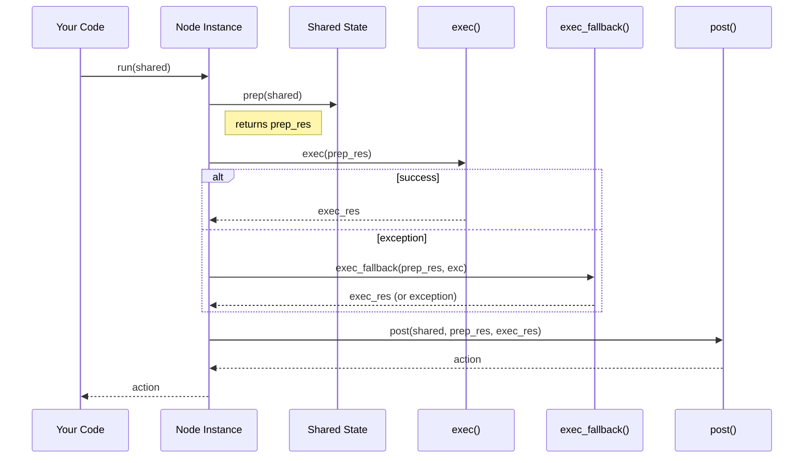

# Chapter 1: Node

In any workflow engine, the atomic unit of computation is crucial. In **PocketFlow**, that unit is called a **Node**. A Node encapsulates exactly one logical step of work—fetch inputs, do something, write outputs, and decide “what’s next?”. In this chapter, we’ll learn why Nodes exist, how to author them, how they’re wired together, and even peek under the hood at the retry logic and transition machinery. By the end, you’ll be ready to write your own Nodes and compose them into flows.

---

## 1. Motivation & Central Use Case

Imagine you’re building a simple ETL pipeline for processing sensor data:

1. **Load** raw readings from a database.
2. **Transform** those readings into standardized units.
3. **Store** cleaned data into a time-series store.

Each step is conceptually independent, but they must share state, handle failures (retry on transient DB timeouts), and decide the next step dynamically. That’s exactly what a `Node` gives you:

- **prep(shared)**: fetch _only_ what you need from shared state.
- **exec(prep_res)**: do the core work (I/O, computation).
- **post(shared, prep_res, exec_res)**: write results back and return an **action** string, e.g. `"success"` or `"retry"`, to drive the next Node.

Furthermore, you can configure **retries**, **fallbacks**, and **wait intervals** inside each Node.

---

## 2. Key Concepts

### 2.1 Lifecycle Phases

Every Node implements three phases:

1. **prep(shared)**  
   Extracts or computes inputs.  
   Signature:  

   ```python
   def prep(self, shared: dict) -> Any:
       ...
   ```

2. **exec(prep_res)**  
   Does the main work, may raise exceptions.  

   ```python
   def exec(self, prep_res: Any) -> Any:
       ...
   ```

3. **post(shared, prep_res, exec_res)**  
   Writes outputs into `shared` and returns an “action” string.  

   ```python
   def post(self, shared: dict, prep_res: Any, exec_res: Any) -> str:
       ...
   ```

### 2.2 Transitions & Successors

You wire Nodes into a directed graph:

- `a >> b` means “on action `'default'`, go from a → b”.
- `a - "error" >> c` means “if a.post() returns `'error'`, go a → c”.

Under the hood, `BaseNode.next()` manages a `successors` map of action → next­Node.

### 2.3 Retry, Fallback & Wait

A plain `Node` (vs. `BaseNode`) adds robust retry support:

- `max_retries`: how many attempts to make
- `wait` (seconds): pause between retries
- `exec_fallback(prep_res, exc)`: final handler (by default re-raises)

---

## 3. Authoring Your First Nodes

Let’s build our ETL example:

### 3.1 LoadReadingsNode

```python
# file: etl_nodes.py
from pocketflow import Node

class LoadReadingsNode(Node):
    def __init__(self, db_client, max_retries=3, wait=1):
        super().__init__(max_retries=max_retries, wait=wait)
        self.db = db_client

    def prep(self, shared):
        # Expect 'query' in shared state
        return shared.get("query")

    def exec(self, query):
        # Potential DB timeout here
        return self.db.fetch(query)

    def post(self, shared, query, records):
        shared["records"] = records
        # If no records, route to a special node
        return "no_data" if not records else "default"
```

> **Explanation:**  
>
> - `prep` reads the database query from the shared dict.  
> - `exec` calls the DB client (might need retries).  
> - `post` writes fetched records back and returns `"no_data"` or `"default"`.

### 3.2 TransformReadingsNode

```python
# file: etl_nodes.py
class TransformReadingsNode(Node):
    def prep(self, shared):
        return shared["records"]

    def exec(self, records):
        # Convert each reading to standard units
        return [r * 0.001 for r in records]

    def post(self, shared, records, transformed):
        shared["cleaned"] = transformed
        return "default"
```

### 3.3 SaveResultsNode

```python
# file: etl_nodes.py
class SaveResultsNode(Node):
    def __init__(self, store_client):
        super().__init__()
        self.store = store_client

    def prep(self, shared):
        return shared["cleaned"]

    def exec(self, cleaned):
        self.store.write(cleaned)
        return True

    def post(self, shared, prep, success):
        shared["status"] = "ok" if success else "failed"
        return "default"
```

### 3.4 Wiring & Running (Preview)

> **Note:** Full orchestration via `Flow` is in [Flow](02_flow_.md). But you can still run a single Node:

```python
from etl_nodes import LoadReadingsNode
shared = {"query": "SELECT * FROM sensors WHERE ts > NOW() - INTERVAL '1 HOUR'"}
node = LoadReadingsNode(db_client)
action = node.run(shared)
# shared now contains 'records'; action is "default" or "no_data"
```

---

## 4. Internal Execution Walkthrough

Before diving into code, here’s what happens when you call `node.run(shared)`:



1. **prep** extracts inputs.  
2. **exec** tries up to `max_retries`, sleeping `wait` s between failures, and finally calls `exec_fallback`.  
3. **post** writes back and returns an action string.  
4. `run()` returns that action to the caller.

### 4.1 Core Code Snippets

#### BaseNode._run (in `pocketflow/__init__.py`)

```python
def _run(self, shared):
    p = self.prep(shared)
    e = self._exec(p)
    return self.post(shared, p, e)
```

#### Node._exec (adds retry & fallback)

```python
def _exec(self, prep_res):
    for self.cur_retry in range(self.max_retries):
        try:
            return self.exec(prep_res)
        except Exception as e:
            if self.cur_retry == self.max_retries - 1:
                # Final attempt → fallback
                return self.exec_fallback(prep_res, e)
            if self.wait > 0:
                time.sleep(self.wait)
```

- Loops up to `max_retries`.  
- On last failure, invokes `exec_fallback`, which by default re-raises.

#### Adding Successors (transition logic)

```python
def next(self, node, action="default"):
    self.successors[action] = node
    return node
```

Operators `>>` and `- "action" >>` are thin wrappers around it.

---

## 5. Analogy: Assembly Line Worker

- Think of each **Node** as a **workstation** on an assembly line.  
- **Shared state** is the conveyor belt carrying parts.  
- Each station:
  1. **inspects** what’s on the belt (`prep`),  
  2. **processes** the part (`exec`),  
  3. **tags** or **places** it back (`post`), then  
  4. **signals** which station should go next (the action string).  
- If a transient tool malfunction occurs, the station retries automatically (retry logic) and eventually falls back to a supervisor if needed.

---

## 6. Summary & What’s Next

You’ve learned:

- The three‐phase Node lifecycle: **prep**, **exec**, **post**.  
- How to configure retries, wait intervals, and fallbacks.  
- How to wire simple Nodes with `>>` or `- "action" >>`.  
- The under-the-hood implementation in `BaseNode` and `Node`.

Next up, we’ll see how to orchestrate many Nodes into a complete workflow with automatic routing and parameter propagation in [Flow](02_flow_.md).

---

Generated by fork of [AI Codebase Knowledge Builder](https://github.com/vegeta03/PocketFlow-Tutorial-Codebase-Knowledge.git)
