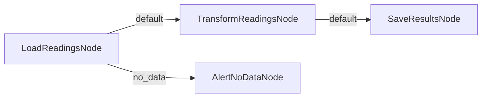
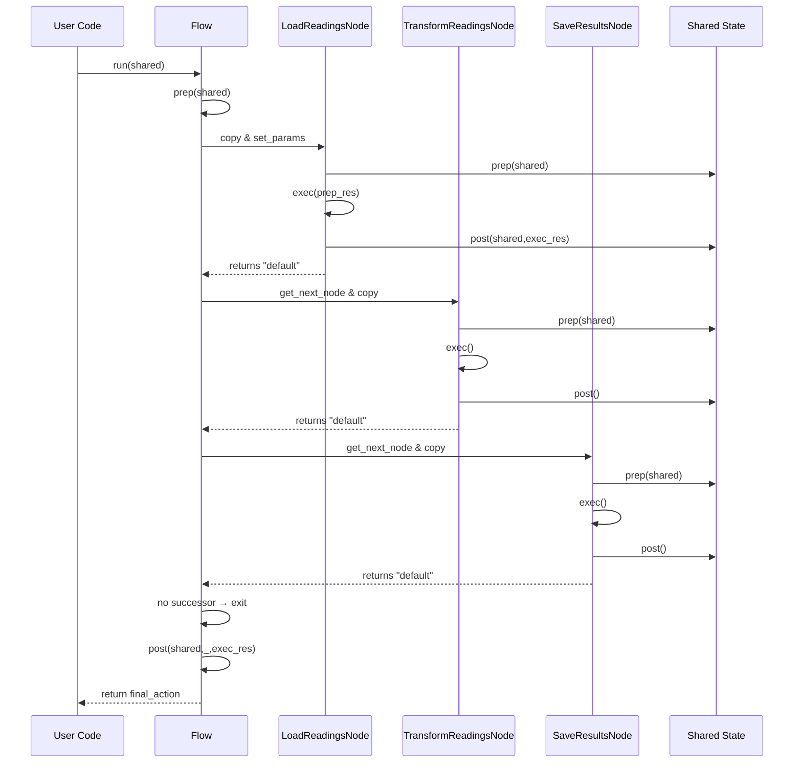

# Chapter 2: Flow

As we saw in [Node](01_node_.md), Nodes encapsulate a three‐phase lifecycle (`prep` → `exec` → `post`) and dynamically return an action label to drive transitions. However, manually invoking Nodes one by one and wiring control flow in application code quickly becomes tedious and error‐prone. **Flow** automates this orchestration, executing a directed graph of Nodes from a designated start node until termination.

---

## 1. Motivation & Central Use Case

Imagine our ETL pipeline from [Chapter 1](01_node_.md):

1. **Load** raw sensor readings from a database.  
2. **Transform** them into standardized units.  
3. **Save** the cleaned data to a time‐series store.

We already authored three Nodes:

- `LoadReadingsNode`  
- `TransformReadingsNode`  
- `SaveResultsNode`  

What’s left is wiring them into a workflow that:

- Routes control based on each Node’s returned action (`"default"`, `"no_data"`, etc.).  
- Propagates shared state (and optional parameters) across all steps.  
- Handles retries, side‐effects, and clean shutdown when no successor remains.

Enter **Flow**: a synchronous directed-graph executor, akin to a finite-state machine or packet router, which:

- Takes a **start node**.  
- Repeatedly **clones** the current node (to avoid leftover state).  
- Runs its `prep`→`exec`→`post` cycle.  
- Inspects the returned **action** label.  
- Follows the matching outgoing edge to the next node.  
- Stops when no successor is found (with optional warning).

Advanced variants like **BatchFlow** and **AsyncFlow** build atop this core logic; we’ll cover them in later chapters.

---

## 2. Key Concepts

### 2.1 Defining & Starting a Flow

```python
from pocketflow import Flow

flow = Flow()                   # create a Flow
start_node = LoadReadingsNode(db_client)
flow.start(start_node)          # designate the entry point
```

- `flow.start(node)` stores `node` as the start of orchestration and returns it (for chaining).

### 2.2 Wiring Transitions

Use the `>>` operator to connect Nodes on the **default** action:

```python
start_node >> transform_node
transform_node >> save_node
```

Or branch on custom action labels:

```python
load_node - "no_data" >> handle_no_data_node
```

Internally, this populates each node’s `successors` map:

- `node.successors["default"] = next_node`
- `node.successors["no_data"] = handler_node`

### 2.3 Running a Flow

Once nodes are wired, call:

```python
final_action = flow.run(shared_state)
```

- **`shared_state`** (`dict`) carries inputs (`"query"`) and accumulates outputs (`"records"`, `"cleaned"`, `"status"`).
- The Flow:
  1. Calls optional `flow.prep(shared_state)`.  
  2. Enters its orchestration loop:
     - Clones the current node.  
     - Pushes Flow parameters via `node.set_params(...)`.  
     - Runs `node._run(shared_state)` → an action string.  
     - Looks up the successor in `node.successors`.  
     - Repeats until no successor is found.  
  3. Calls optional `flow.post(shared_state, prep_res, last_action)` and returns `last_action`.

### 2.4 Visualizing the Graph



---

## 3. Solving the ETL Pipeline

Here’s a complete, self‐contained example:

```python
# file: etl_flow.py
from pocketflow import Flow
from etl_nodes import LoadReadingsNode, TransformReadingsNode, SaveResultsNode, AlertNoDataNode

# 1. Instantiate nodes
load_node      = LoadReadingsNode(db_client, max_retries=3, wait=1)
transform_node = TransformReadingsNode()
save_node      = SaveResultsNode(store_client)
no_data_node   = AlertNoDataNode()

# 2. Build the flow
flow = Flow()
flow.start(load_node)

# Default path: load → transform → save
load_node >> transform_node
transform_node >> save_node

# Branch on no‐data
load_node - "no_data" >> no_data_node

# 3. Prepare shared state and run
shared_state = {
    "query": "SELECT * FROM sensors WHERE ts > NOW() - INTERVAL '1 HOUR'"
}
final_action = flow.run(shared_state)

print(f"Final action: {final_action}")
print("Shared state:", shared_state)
```

What happens:

- `LoadReadingsNode` reads `"query"` and writes `"records"`.  
- If no records: it returns `"no_data"`, routing to `AlertNoDataNode`.  
- Otherwise returns `"default"`, moves to `TransformReadingsNode`, which writes `"cleaned"`.  
- Next, `SaveResultsNode` persists the data and writes `"status"`.  
- When `SaveResultsNode.post` returns `"default"`, Flow finds no more successors and exits.  
- `final_action` is the last action label; `shared_state` holds all intermediate data.

---

## 4. Internal Orchestration Walkthrough

### 4.1 Step‐by‐Step (Non‐Code)

1. **Flow.run(shared)** is invoked.  
2. **Flow.prep(shared)** runs (by default, a no-op).  
3. The **orchestrator loop** (`_orch`):
   - **Clone** the start node via `copy.copy`.  
   - **Set parameters** on the node.  
   - **Execute** the node’s `_run(shared)` (prep→exec→post).  
   - **Receive** an action label.  
   - **Lookup** the successor node for that action.  
   - **Repeat** with a fresh clone of the successor.  
4. Loop **ends** when no successor is found (warning if edges existed).  
5. **Flow.post(shared, prep_res, exec_res)** runs (default returns the last action).  
6. **Flow.run** returns the final action label.

### 4.2 Sequence Diagram



### 4.3 Core Implementation Snippets

**File:** `pocketflow/__init__.py`

```python
class Flow(BaseNode):
    def __init__(self, start=None):
        super().__init__()
        self.start_node = start

    def start(self, start_node):
        """Designate the start node of this Flow."""
        self.start_node = start_node
        return start_node

    def _run(self, shared):
        # 1) Flow‐level prep hook
        prep_res = self.prep(shared)
        # 2) Orchestrate all Nodes
        exec_res = self._orch(shared)
        # 3) Flow‐level post hook
        return self.post(shared, prep_res, exec_res)

    def _orch(self, shared, params=None):
        import copy
        curr = copy.copy(self.start_node)
        p = params or {**self.params}
        last_action = None

        while curr:
            curr.set_params(p)
            last_action = curr._run(shared)
            nxt = self.get_next_node(curr, last_action)
            curr = copy.copy(nxt) if nxt else None

        return last_action

    def get_next_node(self, curr, action):
        nxt = curr.successors.get(action or "default")
        if not nxt and curr.successors:
            warnings.warn(
                f"Flow ends: action '{action}' not in successors {list(curr.successors)}"
            )
        return nxt

    def post(self, shared, prep_res, exec_res):
        # By default, return the last action label
        return exec_res
```

- **Cloning** with `copy.copy` resets any transient state on nodes (e.g., retry counters).  
- **`set_params`** pushes Flow‐wide parameters into each Node before execution.  
- **Warning** if a Node returns an action with no matching edge but had successors defined.

---

## 5. Analogy & Insights

- Think of **Flow** as a **packet router**:  
  - **Packets** = shared state.  
  - **Routers** = Nodes.  
  - **Routing tags** = action strings.  
  - **Flow** reads a tag and forwards the packet along that link.

- Or like a **finite‐state machine**:  
  - **States** = Nodes.  
  - **Transition labels** = actions.  
  - **Flow** executes transitions until reaching a terminal state (no outgoing transitions).

---

## 6. Summary & Next Steps

You’ve learned how to:

- Instantiate and start a **Flow**.  
- Wire Nodes into a directed graph with `>>` and conditional transitions.  
- Execute `flow.run(shared_state)` to process your shared context through the graph.  
- Understand Flow’s internal orchestration loop, including node cloning, parameter propagation, and edge‐lookup warnings.  
- Leverage optional Flow‐level `prep`/`post` hooks for custom setup and teardown.

Next up: extending Flow for **batch processing**, where you run multiple parameter sets through the same graph, in sequence or in parallel, using **BatchNode** and **BatchFlow** in [Batch Processing (BatchNode & BatchFlow)](03_batch_processing__batchnode___batchflow__.md).

---

Generated by fork of [AI Codebase Knowledge Builder](https://github.com/vegeta03/PocketFlow-Tutorial-Codebase-Knowledge.git)
