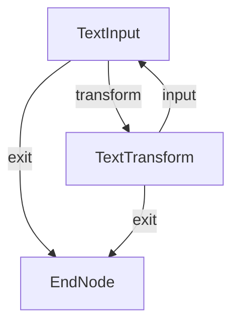
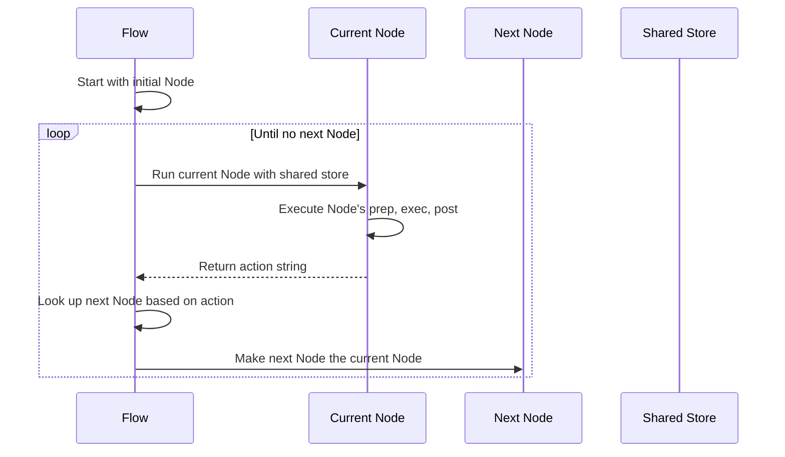
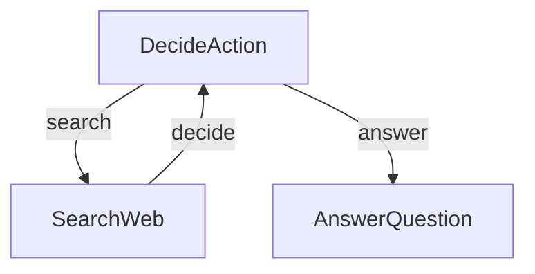

# Chapter 2: Flow

In [Chapter 1: Node](01_node_.md), we learned about Nodes as the individual workers in our data processing assembly line. Each Node performs a specific task, but how do we connect them together to create a cohesive workflow? That's where Flow comes in!

## What is a Flow?

A Flow is like a subway map or a musical conductor - it connects Nodes together and manages which one should run next. Just as a subway system connects stations with tracks that passengers follow, a Flow connects Nodes with paths that data travels along.

Imagine you're planning a vacation. You need to:
1. Choose a destination
2. Book flights
3. Reserve a hotel
4. Create an itinerary

You could do all these tasks in one massive function, but it would be cleaner to create a separate Node for each task. A Flow would then connect these Nodes together, making sure each one runs at the right time and in the right order.

## Creating Your First Flow

Let's create a simple text transformation application to demonstrate how Flow works. We'll build on the text processing example from the previous chapter.

First, let's define our Nodes:

```python
from pocketflow import Node, Flow

class TextInput(Node):
    def prep(self, shared):
        """Get text input from user."""
        text = input("\nEnter text to convert: ")
        return text
    
    def post(self, shared, prep_res, exec_res):
        """Store the text and ask what to do next."""
        shared["text"] = prep_res
        
        print("\nChoose transformation:")
        print("1. Convert to UPPERCASE")
        print("2. Convert to lowercase")
        print("3. Exit")
        
        choice = input("\nYour choice (1-3): ")
        
        if choice == "3":
            return "exit"
            
        shared["choice"] = choice
        return "transform"
```

This Node gets input from the user and determines what to do next based on their choice.

Next, let's create a Node to transform the text:

```python
class TextTransform(Node):
    def prep(self, shared):
        """Get text and choice from shared storage."""
        return shared["text"], shared["choice"]
    
    def exec(self, inputs):
        """Transform the text based on user choice."""
        text, choice = inputs
        
        if choice == "1":
            return text.upper()
        elif choice == "2":
            return text.lower()
        else:
            return "Invalid option!"
    
    def post(self, shared, prep_res, exec_res):
        """Show result and ask if user wants to continue."""
        print("\nResult:", exec_res)
        
        if input("\nConvert another text? (y/n): ").lower() == 'y':
            return "input"
        return "exit"
```

This Node transforms the text based on the user's choice and decides whether to continue or exit.

Now let's create a simple Node to end our flow:

```python
class EndNode(Node):
    def post(self, shared, prep_res, exec_res):
        """Display a goodbye message."""
        print("\nThank you for using Text Converter!")
        return "default"
```

## Connecting Nodes with Flow

Now comes the magic part - connecting these Nodes together using a Flow:

```python
# Create our Node instances
text_input = TextInput()
text_transform = TextTransform()
end_node = EndNode()

# Connect the Nodes
text_input.next(text_transform, "transform")
text_input.next(end_node, "exit")
text_transform.next(text_input, "input")
text_transform.next(end_node, "exit")

# Create our Flow
flow = Flow(start=text_input)

# Run the Flow
shared = {}  # Initialize an empty shared store
flow.run(shared)
```

Let's break down what's happening:

1. We create instances of each Node
2. We connect them using the `next()` method, specifying action strings
3. We create a Flow with `text_input` as the starting Node
4. We initialize an empty shared store and run the Flow

This creates the following workflow:



## A More Elegant Way to Connect Nodes

PocketFlow provides a more elegant syntax for connecting Nodes using the `>>` and `-` operators:

```python
# Create our Node instances
text_input = TextInput()
text_transform = TextTransform()
end_node = EndNode()

# Connect the Nodes with the elegant syntax
text_input - "transform" >> text_transform
text_input - "exit" >> end_node
text_transform - "input" >> text_input
text_transform - "exit" >> end_node

# Create our Flow
flow = Flow(start=text_input)
```

This does exactly the same thing as our previous example, but it's more readable. The code reads like "if text_input returns 'transform', then go to text_transform".

## How Flow Works Under the Hood

Let's understand what happens when a Flow runs:



1. The Flow starts with the initial Node
2. It runs that Node with the shared store
3. The Node returns an action string
4. The Flow looks up which Node should run next based on that action
5. It continues this process until there's no next Node

This orchestration is handled by the `_orch` method in the Flow class:

```python
def _orch(self, shared, params=None):
    # Start with the initial node
    curr = copy.copy(self.start_node)
    # Initialize parameters and last_action
    p = (params or {**self.params})
    last_action = None
    
    # Continue as long as there's a current node
    while curr:
        # Set parameters on current node
        curr.set_params(p)
        # Run the current node
        last_action = curr._run(shared)
        # Find the next node based on the returned action
        curr = copy.copy(self.get_next_node(curr, last_action))
    
    # Return the final action
    return last_action
```

The Flow simply keeps running Nodes and following their action strings until there are no more Nodes to run.

## A More Complex Example: Decision-Making Flow

Let's look at a more practical example - an agent that decides whether to search for information or answer a question directly:

```python
from pocketflow import Flow, Node

class DecideAction(Node):
    def prep(self, shared):
        """Get question and context."""
        context = shared.get("context", "No previous search")
        question = shared["question"]
        return question, context
        
    def exec(self, inputs):
        """Decide whether to search or answer."""
        question, context = inputs
        print(f"🤔 Agent deciding what to do next...")
        
        # Simplified decision - in real code, this would use an LLM
        if "who" in question.lower() or "what" in question.lower():
            return {"action": "search"}
        else:
            return {"action": "answer"}
    
    def post(self, shared, prep_res, exec_res):
        """Return the next action."""
        return exec_res["action"]
```

Let's add two more Nodes for searching and answering:

```python
class SearchWeb(Node):
    def exec(self, inputs):
        """Simulate a web search."""
        print(f"🔍 Searching the web...")
        # In a real app, this would do an actual search
        return "Found information about the topic."
    
    def post(self, shared, prep_res, exec_res):
        """Update context and return to decision."""
        shared["context"] = exec_res
        return "decide"

class AnswerQuestion(Node):
    def prep(self, shared):
        """Get question and context."""
        return shared["question"], shared.get("context", "")
    
    def exec(self, inputs):
        """Generate an answer."""
        question, context = inputs
        print(f"💡 Generating answer...")
        # In a real app, this would use an LLM
        return f"Here's an answer about {question} using {context}"
```

Now let's create our Flow:

```python
# Create instances of each node
decide = DecideAction()
search = SearchWeb()
answer = AnswerQuestion()

# Connect the nodes
decide - "search" >> search
decide - "answer" >> answer
search - "decide" >> decide

# Create the flow
flow = Flow(start=decide)

# Run the flow with a question
shared = {"question": "Who was Albert Einstein?"}
flow.run(shared)
```

This creates a workflow like this:



The Flow:
1. Starts with the DecideAction Node
2. Decides whether to search or answer
3. If it searches, it updates the context and goes back to deciding
4. If it answers, it generates an answer and ends

## Why Flow Matters

Flow provides several key benefits:

1. **Separation of Concerns**: Each Node focuses on one task, making your code more modular
2. **Reusability**: Nodes can be reused in different Flows
3. **Flexibility**: You can easily change the workflow by reconnecting Nodes
4. **Readability**: The workflow is expressed explicitly, making it easier to understand
5. **Testability**: You can test each Node independently

In our agent example, we could easily modify the Flow to include additional Nodes for citation, summarization, or other tasks. We could even create entirely different Flows using the same Nodes.

## Flow as a Node

One powerful feature of PocketFlow is that a Flow is itself a Node. This means you can nest Flows within other Flows, creating hierarchical workflows.

```python
# Create a sub-flow
sub_flow = Flow(start=decide)

# Create a higher-level flow
main_flow = Flow(start=some_other_node)

# Connect to the sub-flow
some_other_node - "process" >> sub_flow
```

This allows you to build complex applications from smaller, reusable components.

## Conclusion

In this chapter, we've learned about **Flow** - the conductor that orchestrates Nodes to form a processing pipeline. We've seen how to create Flows, connect Nodes together, and run them to perform complex tasks.

Flows bring Nodes to life by determining which one to run next based on their output. This orchestration enables us to build flexible, modular applications that are easy to understand and modify.

Key takeaways about Flow:
- A Flow connects Nodes together to form a processing pipeline
- Nodes return action strings to tell the Flow what to do next
- The Flow uses these action strings to determine which Node to run next
- Flows can be nested within other Flows

In the next chapter, we'll explore the [Shared Store](03_shared_store_.md) - the mechanism that allows Nodes within a Flow to share data with each other.

---

Generated by [AI Codebase Knowledge Builder](https://github.com/The-Pocket/Tutorial-Codebase-Knowledge)