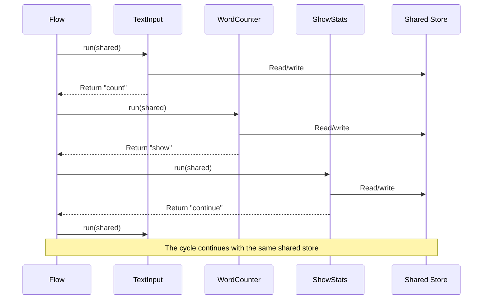

# Chapter 3: Shared Store

In [Chapter 2: Flow](02_flow_.md), we learned how to connect Nodes together to create processing pipelines. However, we didn't deeply explore how these Nodes actually share information with each other. How does output from one Node become input to another? This is where the Shared Store comes in.

## What is a Shared Store?

Think of the Shared Store as a shared whiteboard in a team meeting. Everyone in the room (each Node in your Flow) can see what's written on it, add new information, or modify what's already there. This whiteboard persists throughout the entire meeting (Flow execution), allowing the team to build upon each other's contributions.

The Shared Store is simply a Python dictionary that gets passed from one Node to the next as your Flow runs. Each Node can read values from this dictionary and write new values to it.

## Why Do We Need a Shared Store?

Let's consider a simple example: you're building a chatbot that needs to:

1. Receive a user's message
2. Keep track of the conversation history
3. Generate a response based on that history
4. Update the conversation history with the new response

Without a Shared Store, each Node would need to explicitly pass all this information to the next Node. As your application grows more complex, this would become unwieldy. The Shared Store gives you a central place to store and access data across your entire Flow.

## How to Use the Shared Store

Let's build a simple word counter application to demonstrate how the Shared Store works. This application will:

1. Accept text input from the user
2. Count words in each input
3. Keep track of statistics across multiple inputs
4. Display these statistics to the user

### Step 1: Creating Nodes That Use the Shared Store

First, let's create a Node to receive text input:

```python
from pocketflow import Node

class TextInput(Node):
    def prep(self, shared):
        """Ask the user for input."""
        return input("Enter text (or 'q' to quit): ")
    
    def post(self, shared, prep_res, exec_res):
        """Store the text in the shared store."""
        # If user wants to quit
        if prep_res == 'q':
            return "exit"
        
        # Store the text in the shared store
        shared["text"] = prep_res
        
        # Initialize stats if this is the first time
        if "stats" not in shared:
            shared["stats"] = {
                "total_texts": 0,
                "total_words": 0
            }
        
        # Go to the word counting node next
        return "count"
```

Notice that our Node:
1. Takes `shared` as a parameter in both `prep` and `post` methods
2. Writes the user's input to `shared["text"]`
3. Initializes the statistics dictionary if it doesn't exist yet

The `shared` parameter is the Shared Store - a dictionary that will be passed to all Nodes in our Flow.

Next, let's create a Node to count words:

```python
class WordCounter(Node):
    def prep(self, shared):
        """Get the text from the shared store."""
        return shared["text"]
    
    def exec(self, text):
        """Count the words."""
        return len(text.split())
    
    def post(self, shared, prep_res, exec_res):
        """Update the statistics in the shared store."""
        # Update our statistics
        shared["stats"]["total_texts"] += 1
        shared["stats"]["total_words"] += exec_res
        
        # Go to the stats display node next
        return "show"
```

This Node:
1. Reads `shared["text"]` to get the text input
2. Counts the words in the text
3. Updates the statistics in `shared["stats"]`

Finally, let's create a Node to display statistics:

```python
class ShowStats(Node):
    def prep(self, shared):
        """Get the statistics from the shared store."""
        return shared["stats"]
    
    def post(self, shared, prep_res, exec_res):
        """Display the statistics."""
        stats = prep_res
        
        # Show the user some nice statistics
        print(f"\nStatistics:")
        print(f"- Texts processed: {stats['total_texts']}")
        print(f"- Total words: {stats['total_words']}")
        
        if stats['total_texts'] > 0:
            avg = stats['total_words'] / stats['total_texts']
            print(f"- Average words per text: {avg:.1f}\n")
        
        # Go back to the input node for more text
        return "continue"
```

This Node:
1. Reads `shared["stats"]` to get the current statistics
2. Displays these statistics to the user

### Step 2: Connecting the Nodes into a Flow

Now let's connect these Nodes into a Flow:

```python
from pocketflow import Flow

# Create our Nodes
text_input = TextInput()
word_counter = WordCounter()
show_stats = ShowStats()
end_node = Node()  # A simple Node to end the flow

# Connect the Nodes
text_input - "count" >> word_counter
text_input - "exit" >> end_node
word_counter - "show" >> show_stats
show_stats - "continue" >> text_input

# Create a Flow with our starting Node
flow = Flow(start=text_input)
```

### Step 3: Running the Flow with a Shared Store

Finally, let's run our Flow with an empty Shared Store:

```python
# Initialize an empty shared store
shared = {}

# Run the flow
flow.run(shared)

# After the flow completes, shared contains all our data
print("Final statistics:", shared["stats"])
```

When we run this code:
1. We initialize an empty dictionary as our Shared Store
2. We pass this dictionary to the `run` method of our Flow
3. The Flow passes this dictionary to each Node it runs
4. Each Node reads from and writes to this dictionary
5. After the Flow completes, the dictionary contains all the data that was accumulated

## How the Shared Store Works Under the Hood

What happens behind the scenes when a Flow runs with a Shared Store?



As you can see, the same Shared Store is passed to each Node. This allows Nodes to share information with each other indirectly. Rather than explicitly passing data from one Node to the next, they read from and write to the Shared Store.

Let's look more closely at what happens when a Node runs:

```mermaid
sequenceDiagram
    participant N as Node
    participant S as Shared Store
    
    N->>S: prep(shared)
    Note over N: "I need some data to work with"
    S->>N: Return data
    
    N->>N: exec(prep_result)
    Note over N: "Let me process this data"
    
    N->>S: post(shared, prep_result, exec_result)
    Note over N, S: "Here's my result; let me save it"
```

1. In the `prep` stage, the Node reads from the Shared Store to get the data it needs
2. In the `exec` stage, the Node processes this data
3. In the `post` stage, the Node writes its results back to the Shared Store

The actual implementation in the PocketFlow codebase is quite simple:

```python
def _run(self, shared):
    """Run this node with the given shared store."""
    # Get the data we need from the shared store
    prep_res = self.prep(shared)
    
    # Process the data
    exec_res = self.exec(prep_res)
    
    # Save our results and determine what to do next
    return self.post(shared, prep_res, exec_res)
```

The `shared` dictionary is passed to each method, allowing the Node to read from and write to it.

## Best Practices for Using the Shared Store

The Shared Store is powerful, but with that power comes responsibility. Here are some best practices to keep in mind:

### 1. Initialize the Shared Store

Always initialize the Shared Store with the values your Flow expects. This makes your code more robust and easier to understand:

```python
# Initialize the shared store with default values
shared = {
    "conversation_history": [],
    "user_preferences": {"language": "en"},
    "system_config": {"max_tokens": 100}
}

# Run the flow
flow.run(shared)
```

### 2. Use Consistent Keys

Be consistent with the keys you use in the Shared Store. This makes your code more maintainable and reduces the risk of bugs:

```python
# Good - consistent keys
shared["user_message"] = "Hello"
shared["bot_message"] = "Hi there!"

# Not as good - inconsistent keys
shared["user_msg"] = "Hello"
shared["response"] = "Hi there!"
```

### 3. Check for Key Existence

Always check if a key exists before trying to access it:

```python
class SafeNode(Node):
    def prep(self, shared):
        # Check if the key exists
        if "user_message" in shared:
            return shared["user_message"]
        else:
            return "No message found"
```

### 4. Document Your Shared Store Structure

Document the structure of your Shared Store to make it easier for others (and future you) to understand:

```python
"""
Shared Store Structure:
- user_message (str): The user's latest message
- conversation_history (list): A list of previous messages
- user_preferences (dict): User preferences like language
"""
```

## Real-World Example: A Simple Chatbot

Let's build a simple chatbot that uses the Shared Store to maintain conversation history:

```python
class GetUserInput(Node):
    def prep(self, shared):
        """Get input from the user."""
        # Display the bot's last message if there is one
        if "bot_message" in shared:
            print(f"Bot: {shared['bot_message']}")
            
        # Get user input
        return input("You: ")
    
    def post(self, shared, prep_res, exec_res):
        """Store the user's message and update history."""
        user_message = prep_res
        
        # Store the user's message
        shared["user_message"] = user_message
        
        # Initialize the conversation history if it doesn't exist
        if "conversation" not in shared:
            shared["conversation"] = []
            
        # Add the user's message to the history
        shared["conversation"].append(f"User: {user_message}")
        
        # Exit if the user says goodbye
        if user_message.lower() in ["bye", "goodbye", "exit", "quit"]:
            return "exit"
            
        return "respond"
```

This Node:
1. Gets input from the user
2. Stores it in the Shared Store
3. Updates the conversation history
4. Determines what to do next based on the input

Next, let's create a Node to generate a response:

```python
class GenerateResponse(Node):
    def prep(self, shared):
        """Get the user's message and conversation history."""
        return shared["user_message"], shared["conversation"]
    
    def exec(self, inputs):
        """Generate a response based on the user's message and history."""
        user_message, conversation = inputs
        
        # In a real chatbot, this would use an LLM
        # For simplicity, we'll just echo the user's message
        if "hello" in user_message.lower():
            return "Hello there! How can I help you today?"
        elif "how are you" in user_message.lower():
            return "I'm doing well, thank you for asking!"
        else:
            return f"You said: {user_message}"
    
    def post(self, shared, prep_res, exec_res):
        """Store the bot's response and update history."""
        # Store the bot's response
        shared["bot_message"] = exec_res
        
        # Add the bot's response to the history
        shared["conversation"].append(f"Bot: {exec_res}")
        
        return "get_input"
```

This Node:
1. Gets the user's message and conversation history from the Shared Store
2. Generates a response based on this information
3. Stores the response in the Shared Store
4. Updates the conversation history

Finally, let's connect these Nodes into a Flow:

```python
from pocketflow import Flow

# Create our Nodes
get_input = GetUserInput()
generate_response = GenerateResponse()
end_node = Node()  # A simple Node to end the flow

# Connect the Nodes
get_input - "respond" >> generate_response
get_input - "exit" >> end_node
generate_response - "get_input" >> get_input

# Create a Flow with our starting Node
flow = Flow(start=get_input)

# Initialize the shared store
shared = {}

# Run the flow
flow.run(shared)

# After the flow completes, we have the entire conversation history
print("\nConversation Summary:")
for message in shared["conversation"]:
    print(message)
```

## Conclusion

The Shared Store is a powerful mechanism in PocketFlow that allows Nodes to share data with each other. By passing a single dictionary to each Node, you can maintain state across your entire Flow and build complex applications where each Node builds upon the work of others.

In this chapter, we've learned:
- What the Shared Store is and why it's useful
- How to use the Shared Store in your Nodes
- Best practices for working with the Shared Store
- How to build a simple chatbot using the Shared Store

The Shared Store is especially powerful when combined with batch processing, which we'll explore in the next chapter: [BatchNode](04_batchnode_.md). While individual Nodes process one item at a time, BatchNodes process multiple items together, which can significantly improve efficiency for certain tasks.

---

Generated by [AI Codebase Knowledge Builder](https://github.com/The-Pocket/Tutorial-Codebase-Knowledge)