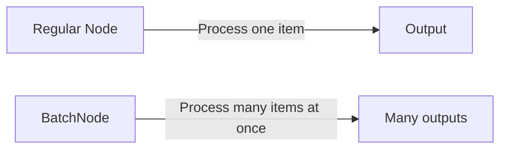
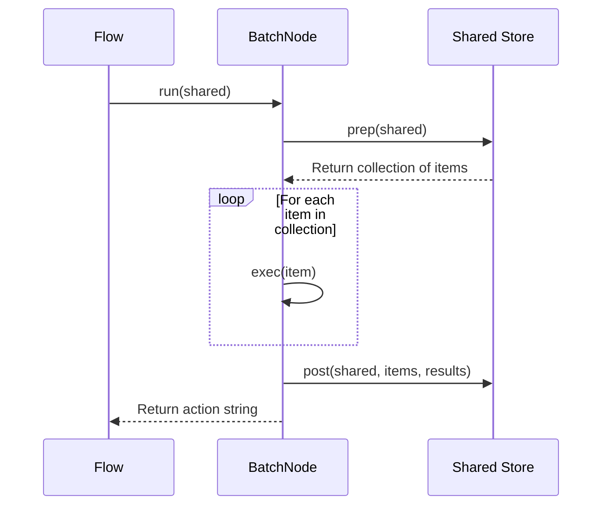

# Chapter 4: BatchNode

In [Chapter 3: Shared Store](03_shared_store_.md), we explored how Nodes in PocketFlow can share data with each other. Now, let's solve a common problem: what if you need to process many similar items at once?

## The Problem: Processing Many Items

Imagine you're a chef in a busy restaurant. Would you cook one dish at a time, completing it before starting the next? Of course not! You'd batch similar orders together to work efficiently.

In programming, we face the same challenge. Let's say you need to:
- Process 1,000 customer reviews
- Analyze 10,000 product images
- Summarize 500 documents

Using regular [Node](01_node_.md)s, you'd process these items one at a time. This is like cooking one dish at a time - inefficient!

## What is a BatchNode?

A **BatchNode** is a specialized version of [Node](01_node_.md) that processes collections of items rather than single items.

Think of BatchNode as a mail room sorter who handles stacks of letters all at once, rather than one at a time. It takes a list of items, applies the same process to each one, and returns a list of results.



## How BatchNode Works

Like a regular [Node](01_node_.md), a BatchNode follows the three-stage lifecycle:

1. **prep**: Gets a collection of items to process
2. **exec**: Processes each item in the collection
3. **post**: Combines the results from all items

The key difference is that a BatchNode's `exec` method is automatically applied to each item in the collection, and the results are gathered into a list.

## Creating Your First BatchNode

Let's start with a simple example: a BatchNode that doubles each number in a list.

```python
from pocketflow import BatchNode

class NumberDoubler(BatchNode):
    def prep(self, shared):
        """Get numbers from the shared store."""
        return shared.get("numbers", [])
    
    def exec(self, number):
        """Double a single number."""
        return number * 2
    
    def post(self, shared, numbers, doubled_numbers):
        """Store the doubled numbers in the shared store."""
        shared["doubled_numbers"] = doubled_numbers
        return "complete"
```

Notice how:
- `prep` returns a list of numbers to process
- `exec` only needs to handle one number (BatchNode applies it to each item)
- `post` receives the original list and a list of results

Let's run this BatchNode:

```python
# Create and run the BatchNode
doubler = NumberDoubler()
shared = {"numbers": [1, 2, 3, 4, 5]}
doubler.run(shared)

# Print the results
print(shared["doubled_numbers"])  # Output: [2, 4, 6, 8, 10]
```

The magic happens behind the scenes - BatchNode automatically applies your `exec` method to each item in the collection!

## A Real-World Example: Processing Reviews

Let's create something more useful: a BatchNode that analyzes customer reviews to determine sentiment (positive, negative, or neutral).

```python
from pocketflow import BatchNode

class SentimentAnalyzer(BatchNode):
    def prep(self, shared):
        """Get reviews from the shared store."""
        return shared.get("reviews", [])
    
    def exec(self, review):
        """Analyze the sentiment of a single review."""
        # Simple sentiment analysis (in a real app, use a proper library)
        positive_words = ["great", "excellent", "good", "love", "best"]
        negative_words = ["bad", "terrible", "poor", "worst", "hate"]
        
        review = review.lower()
        positive_count = sum(word in review for word in positive_words)
        negative_count = sum(word in review for word in negative_words)
        
        if positive_count > negative_count:
            return "positive"
        elif negative_count > positive_count:
            return "negative"
        else:
            return "neutral"
    
    def post(self, shared, reviews, sentiments):
        """Store the sentiment analysis results."""
        shared["sentiments"] = sentiments
        
        # Count the sentiments
        sentiment_counts = {
            "positive": sentiments.count("positive"),
            "neutral": sentiments.count("neutral"),
            "negative": sentiments.count("negative")
        }
        shared["sentiment_counts"] = sentiment_counts
        
        return "complete"
```

This BatchNode:
1. Takes a list of customer reviews
2. Analyzes each review for sentiment
3. Returns a list of sentiments and counts them

Let's see it in action:

```python
# Sample reviews
reviews = [
    "This product is great! I love it.",
    "Poor quality, would not buy again.",
    "It's okay, nothing special.",
    "Excellent service and fast shipping!",
    "Terrible experience, worst purchase ever."
]

# Run the sentiment analyzer
analyzer = SentimentAnalyzer()
shared = {"reviews": reviews}
analyzer.run(shared)

# Print the results
print("Sentiments:", shared["sentiments"])
print("Counts:", shared["sentiment_counts"])

# Output:
# Sentiments: ['positive', 'negative', 'neutral', 'positive', 'negative']
# Counts: {'positive': 2, 'neutral': 1, 'negative': 2}
```

With just a few lines of code, we've created a batch processor that can analyze any number of reviews at once!

## Processing Large Datasets: CSV Example

BatchNode really shines when dealing with large datasets. Let's look at how to process a CSV file in chunks:

```python
import pandas as pd
from pocketflow import BatchNode

class CSVProcessor(BatchNode):
    def __init__(self, chunk_size=1000):
        super().__init__()
        self.chunk_size = chunk_size
    
    def prep(self, shared):
        """Split CSV file into chunks."""
        # Read CSV in chunks
        chunks = pd.read_csv(
            shared["input_file"],
            chunksize=self.chunk_size
        )
        return chunks
    
    def exec(self, chunk):
        """Process a single chunk of the CSV."""
        return {
            "total_sales": chunk["amount"].sum(),
            "num_transactions": len(chunk)
        }
    
    def post(self, shared, chunks, results):
        """Combine results from all chunks."""
        total_sales = sum(res["total_sales"] for res in results)
        total_transactions = sum(res["num_transactions"] for res in results)
        
        shared["statistics"] = {
            "total_sales": total_sales,
            "average_sale": total_sales / total_transactions,
            "total_transactions": total_transactions
        }
        
        return "show_stats"
```

This BatchNode:
1. Breaks a large CSV file into manageable chunks
2. Processes each chunk independently
3. Combines the results into final statistics

This approach is perfect for files too large to fit in memory!

## How BatchNode Works Under the Hood

Let's see what happens when a BatchNode runs:



The key difference from a regular [Node](01_node_.md) is that `exec` is called multiple times - once for each item in the collection.

Looking at the PocketFlow implementation, here's the core of how BatchNode works:

```python
class BatchNode(Node):
    def _exec(self, items):
        return [super(BatchNode, self)._exec(i) for i in (items or [])]
```

This simple but powerful code:
1. Takes a collection of items
2. Calls the parent class's `_exec` method on each item
3. Collects the results into a list

It's like having a helper that applies the same recipe to each dish!

## Map-Reduce Pattern with BatchNode

BatchNode is perfect for implementing the map-reduce pattern - a powerful technique for processing large datasets:

1. **Map phase**: Apply a function to each item (the `exec` method)
2. **Reduce phase**: Combine the results (in the `post` method)

Here's a simple example that counts word frequencies across multiple documents:

```python
class WordCounter(BatchNode):
    def prep(self, shared):
        """Get documents from the shared store."""
        return shared.get("documents", [])
    
    def exec(self, document):
        """Count words in a single document."""
        words = document.lower().split()
        word_counts = {}
        
        for word in words:
            word_counts[word] = word_counts.get(word, 0) + 1
            
        return word_counts
    
    def post(self, shared, documents, word_counts_list):
        """Combine word counts from all documents."""
        combined_counts = {}
        
        for counts in word_counts_list:
            for word, count in counts.items():
                combined_counts[word] = combined_counts.get(word, 0) + count
                
        shared["word_counts"] = combined_counts
        return "complete"
```

This pattern lets you efficiently process data across multiple documents, files, or any collection of items.

## When to Use BatchNode

BatchNode is ideal when:

1. You have many similar items to process
2. Each item can be processed independently
3. The results need to be combined

Common use cases include:
- Processing data in chunks (like CSV files)
- Analyzing collections (like customer reviews)
- Running the same operation on many items (like image processing)

## Conclusion

In this chapter, we've learned about **BatchNode** - a powerful tool for processing collections of items efficiently. Instead of handling items one at a time, BatchNode processes them all at once, making your code more efficient and elegant.

We've seen how to:
- Create a basic BatchNode
- Process collections of items
- Handle large datasets in chunks
- Implement the map-reduce pattern

BatchNode is like having a team of workers all following the same instructions, rather than a single worker doing everything sequentially.

In the next chapter, we'll explore [BatchFlow](05_batchflow_.md) - how to orchestrate multiple BatchNodes to create even more powerful data processing pipelines.

---

Generated by [AI Codebase Knowledge Builder](https://github.com/The-Pocket/Tutorial-Codebase-Knowledge)