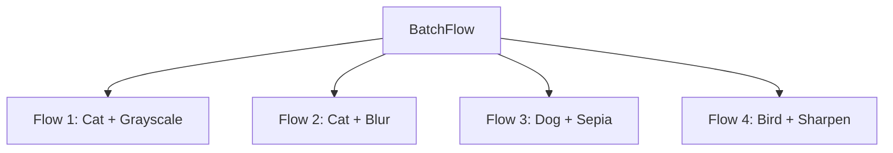
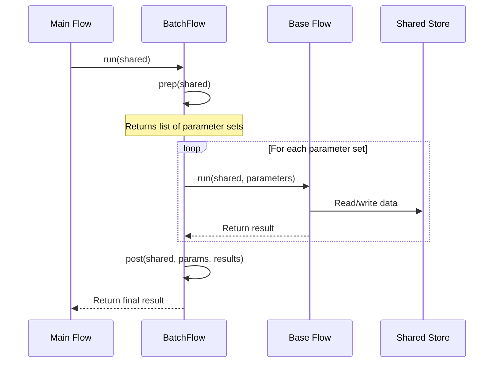

# Chapter 5: BatchFlow

In [Chapter 4: BatchNode](04_batchnode_.md), we learned how to process multiple items at once with a single Node. Now, let's take it to the next level - what if you want to run an entire workflow multiple times with different parameters?

## What is BatchFlow?

A **BatchFlow** is like a production manager who oversees multiple identical assembly lines, each processing different materials. It takes your existing [Flow](02_flow_.md) and runs it multiple times, each time with a different set of parameters.

Imagine you're running a photo editing studio. You have a standard editing process:
1. Load the image
2. Apply effects
3. Save the result

With BatchFlow, you can run this same workflow on multiple images with different effects - all at once!



## Why Use BatchFlow?

BatchFlow helps when you need to:

1. Process multiple items through the same workflow
2. Apply different parameters to each run
3. Keep your code organized and avoid duplication

Instead of writing repetitive code like this:

```python
# Load cat image, apply grayscale, save result
flow.run({"image": "cat.jpg", "filter": "grayscale"})

# Load cat image, apply blur, save result
flow.run({"image": "cat.jpg", "filter": "blur"})

# Load dog image, apply sepia, save result
flow.run({"image": "dog.jpg", "filter": "sepia"})
```

With BatchFlow, you can simply define the parameter sets once and let it handle the rest!

## Creating Your First BatchFlow

Let's build a simple image processing application with BatchFlow:

First, we need a base [Flow](02_flow_.md) that processes a single image:

```python
from pocketflow import Flow, Node

# Simple image processing nodes
class LoadImage(Node):
    def exec(self, prep_res):
        image_name = self.params["image"]
        print(f"Loading image: {image_name}")
        return f"image_data_for_{image_name}"
    
    def post(self, shared, prep_res, exec_res):
        shared["image_data"] = exec_res
        return "process"

class ApplyFilter(Node):
    def prep(self, shared):
        return shared["image_data"]
    
    def exec(self, image_data):
        filter_name = self.params["filter"]
        print(f"Applying {filter_name} filter")
        return f"{image_data}_with_{filter_name}"
```

Now we connect these Nodes into a Flow:

```python
# Create and connect our nodes
load_image = LoadImage()
apply_filter = ApplyFilter()

# Connect them together
load_image - "process" >> apply_filter

# Create our base flow
base_flow = Flow(start=load_image)
```

This Flow loads an image and applies a filter. Now let's create a BatchFlow to run it multiple times:

```python
from pocketflow import BatchFlow

class ImageBatchFlow(BatchFlow):
    def prep(self, shared):
        """Generate parameter sets for each batch."""
        # List of images and filters
        images = ["cat.jpg", "dog.jpg"]
        filters = ["grayscale", "blur", "sepia"]
        
        # Create all combinations of images and filters
        params_list = []
        for img in images:
            for flt in filters:
                params_list.append({
                    "image": img,
                    "filter": flt
                })
        
        return params_list
```

The magic happens in the `prep` method, which returns a list of parameter dictionaries. Each dictionary will be used for one run of the base Flow.

Let's run our BatchFlow:

```python
# Create our BatchFlow with the base_flow as its starting point
batch_flow = ImageBatchFlow(start=base_flow)

# Run it!
shared = {}
batch_flow.run(shared)
```

When we run this code, our output will look like:

```
Loading image: cat.jpg
Applying grayscale filter
Loading image: cat.jpg
Applying blur filter
Loading image: cat.jpg
Applying sepia filter
Loading image: dog.jpg
Applying grayscale filter
...and so on
```

BatchFlow automatically:
1. Gets the parameter sets from `prep`
2. Runs the base Flow for each parameter set
3. Handles the orchestration of all these runs

## A More Practical Example: Report Generator

Let's build something more useful - a report generator that processes data for multiple departments:

```python
from pocketflow import Flow, BatchFlow, Node

class LoadDepartmentData(Node):
    def exec(self, prep_res):
        dept = self.params["department"]
        month = self.params["month"]
        print(f"Loading data for {dept} department, {month}")
        
        # In a real app, this would load actual data
        return {"sales": 100 + hash(dept + month) % 900}
    
    def post(self, shared, prep_res, exec_res):
        # Store the data
        if "department_data" not in shared:
            shared["department_data"] = {}
            
        dept = self.params["department"]
        shared["department_data"][dept] = exec_res
        return "generate"
```

Let's add a simple report generator Node:

```python
class GenerateReport(Node):
    def prep(self, shared):
        dept = self.params["department"]
        return shared["department_data"][dept]
    
    def exec(self, data):
        dept = self.params["department"]
        print(f"Generating report for {dept}")
        return f"Report for {dept}: Sales = ${data['sales']}"
    
    def post(self, shared, prep_res, exec_res):
        # Store the report
        if "reports" not in shared:
            shared["reports"] = {}
            
        dept = self.params["department"]
        shared["reports"][dept] = exec_res
        return "complete"
```

Now let's create our base Flow and BatchFlow:

```python
# Connect the nodes into a base flow
load_data = LoadDepartmentData()
generate_report = GenerateReport()
load_data - "generate" >> generate_report

# Create the base flow
report_flow = Flow(start=load_data)

# Create the BatchFlow
class ReportBatchFlow(BatchFlow):
    def prep(self, shared):
        departments = ["sales", "marketing", "engineering"]
        month = "January"  # Could be a parameter
        
        return [{"department": dept, "month": month} 
                for dept in departments]
    
    def post(self, shared, prep_res, exec_res):
        """Print a summary after all reports are generated."""
        print("\nSummary of all department reports:")
        for dept, report in shared["reports"].items():
            print(f"- {report}")
        return "complete"
```

The BatchFlow not only runs the base Flow for each department but also provides a summary at the end through its `post` method.

## Understanding How BatchFlow Works

Let's see what happens when a BatchFlow runs:



1. The BatchFlow calls its `prep` method to get a list of parameter sets
2. For each parameter set, it runs the base Flow, passing both the shared store and the parameters
3. After all runs are complete, it calls its `post` method

Looking at PocketFlow's implementation, here's the core of how BatchFlow works:

```python
class BatchFlow(Flow):
    def _run(self, shared):
        # Get list of parameter sets from prep
        pr = self.prep(shared) or []
        
        # Run the flow once for each parameter set
        for bp in pr:
            # Merge base parameters with batch parameters
            params = {**self.params, **bp}
            # Run the orchestration
            self._orch(shared, params)
            
        # Call post after all batches are complete
        return self.post(shared, pr, None)
```

This simple code:
1. Gets parameter sets from the `prep` method
2. Runs the Flow's `_orch` method once for each parameter set
3. Calls the `post` method when all runs are complete

## Nested BatchFlows: Processing at Multiple Levels

BatchFlows can be nested to handle hierarchical batch processing. For example, imagine a school with multiple classes, each with multiple students:

```python
# First level: Process one student
student_flow = create_student_flow()

# Second level: Process all students in a class
class ClassBatchFlow(BatchFlow):
    def prep(self, shared):
        # Get the class name from parameters
        class_name = self.params["class"]
        # Generate parameters for each student in this class
        students = get_students_in_class(class_name)
        return [{"student": student} for student in students]

# Third level: Process all classes in the school
class SchoolBatchFlow(BatchFlow):
    def prep(self, shared):
        # Get all class names
        classes = ["class_1A", "class_2B", "class_3C"]
        return [{"class": class_name} for class_name in classes]
```

The SchoolBatchFlow runs the ClassBatchFlow for each class, which runs the student_flow for each student. This creates a powerful hierarchical processing structure.

## When to Use BatchFlow

Use BatchFlow when:

1. You need to run the same workflow multiple times
2. Each run needs different parameters
3. You want to maintain a single [Shared Store](03_shared_store_.md) across all runs
4. You need to generate a summary of all runs

BatchFlow is perfect for:
- Processing multiple files or datasets
- Generating reports for different departments/periods
- Applying different configurations to the same workflow
- Running simulations with different input parameters

## Conclusion

In this chapter, we've learned about **BatchFlow** - a powerful tool for running a workflow multiple times with different parameters. Just as [BatchNode](04_batchnode_.md) processes multiple items at once, BatchFlow runs multiple workflows at once, making your code more organized and efficient.

We've seen how to:
- Create a BatchFlow by extending the BatchFlow class
- Generate parameter sets in the `prep` method
- Process many items through the same workflow
- Create summaries using the `post` method
- Understand how BatchFlow works under the hood

BatchFlow turns your single-item workflow into a batch processor that can handle multiple items efficiently. It's like having a factory that can simultaneously produce different products using the same assembly line design.

In the next chapter, we'll explore [AsyncNode](06_asyncnode_.md) - how to create Nodes that can perform asynchronous operations, ideal for I/O-bound tasks like API calls and database queries.

---

Generated by [AI Codebase Knowledge Builder](https://github.com/The-Pocket/Tutorial-Codebase-Knowledge)