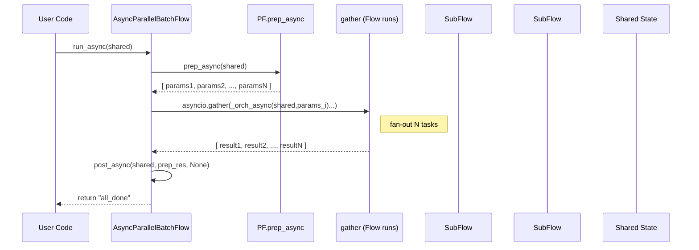

# Chapter 5: Parallel Batch Processing (AsyncParallelBatchNode & AsyncParallelBatchFlow)

In [Chapter 4: Asynchronous Nodes & Flow (AsyncNode & AsyncFlow)](04_asynchronous_nodes___flow__asyncnode___asyncflow__.md) we learned how to write non-blocking Nodes and orchestrate them in an event loop. Often, however, you don’t just want to interleave I/O—you want to **fan-out** many similar tasks at once, leveraging full concurrency for network-bound or file-bound workloads. Enter **AsyncParallelBatchNode** and **AsyncParallelBatchFlow**, PocketFlow’s primitives for parallel batch execution.

---

## 1. Motivation & Central Use Case

Imagine you have ten large documents and you need to call an LLM to summarize each. If you do this sequentially, each `await` blocks until the previous call finishes—10 seconds becomes 100 seconds (at 10 calls × 1 s each). With a **parallel batch** abstraction you can fire all 10 LLM calls at once and wait for them to complete together, bringing runtime back down close to 1 s.

Concrete example:  

- Input: a mapping of filenames → text  
- Task: call `await llm_summarize(text)` on each file  
- Output: collect all summaries into a single dictionary  

**Goals** of parallel batch processing:  

- Launch tasks concurrently, not sequentially  
- Preserve per-item retry/fallback semantics  
- Collapse results into lists or dicts for easy downstream use  
- Mirror distributed “fan-out/fan-in” patterns  

---

## 2. Key Concepts

### 2.1 AsyncParallelBatchNode

- Combines **AsyncNode** (async lifecycle) with **BatchNode** (map abstraction).  
- Overrides `_exec` to call each `exec_async(item)` **concurrently** via `asyncio.gather`.  
- Transparent retry logic per item, inherited from **AsyncNode**.

Rough sketch:

```python
class AsyncParallelBatchNode(AsyncNode, BatchNode):
    async def _exec(self, items):
        # Launch one coroutine per item, then gather all results
        tasks = [super(AsyncParallelBatchNode, self)._exec(item)
                 for item in (items or [])]
        return await asyncio.gather(*tasks)
```

### 2.2 AsyncParallelBatchFlow

- Extends **AsyncFlow** and **BatchFlow**.  
- Runs an entire sub-flow **in parallel** across multiple parameter sets.  
- Replaces the sequential `for each params: await self._orch_async(...)` with a single `await asyncio.gather(...)`.

Sketch:

```python
class AsyncParallelBatchFlow(AsyncFlow, BatchFlow):
    async def _run_async(self, shared):
        batch_params = await self.prep_async(shared) or []
        # Fan-out: one _orch_async call per param‐dict
        await asyncio.gather(
          *(self._orch_async(shared, {**self.params, **bp})
            for bp in batch_params)
        )
        return await self.post_async(shared, batch_params, None)
```

### 2.3 Fan-Out / Fan-In Pattern

- **Fan-Out**: distribute independent tasks across the event loop.  
- **Fan-In**: collect all their results once complete.  
- This pattern is ideal for network calls (LLM, HTTP APIs), disk I/O (image filters), or any I/O-bound workload.

### 2.4 Comparison with AsyncBatchNode / AsyncBatchFlow

| Abstraction                 | Execution Style                                      |
| --------------------------- | ---------------------------------------------------- |
| AsyncBatchNode              | sequential: await each `exec_async(item)` in a loop |
| AsyncParallelBatchNode      | concurrent: gather all `exec_async(item)` calls      |
| AsyncBatchFlow              | sequential: run each sub-flow one after another      |
| AsyncParallelBatchFlow      | concurrent: schedule sub-flows via gather            |

---

## 3. Example: Summarizing Documents in Parallel

Let’s build a small end-to-end example:

1. **Define** an `AsyncParallelBatchNode` that summarizes one document at a time.  
2. **Wire** it into an `AsyncFlow`.  
3. **Run** and observe near-constant runtime regardless of item count.

### 3.1 Node Implementation

```python
# file: summarizer.py
import asyncio
from pocketflow import AsyncParallelBatchNode

# Dummy async function simulating a 1s LLM call
async def dummy_llm_summarize(text: str) -> str:
    await asyncio.sleep(1)
    return f"Summary({len(text)} chars)"

class SummariesAsyncParallelNode(AsyncParallelBatchNode):
    async def prep_async(self, shared):
        # Convert dict of filename→text into list of tuples
        return list(shared["documents"].items())

    async def exec_async(self, item):
        filename, content = item
        print(f"[Parallel] Summarizing {filename}...")
        summary = await dummy_llm_summarize(content)
        return (filename, summary)

    async def post_async(self, shared, prep_res, exec_res_list):
        # exec_res_list: list of (filename, summary)
        shared["summaries"] = dict(exec_res_list)
        print(f"[Parallel] Collected {len(exec_res_list)} summaries.")
        return "done"
```

Explanation:

- `prep_async` returns a list of `(filename, content)`.  
- `AsyncParallelBatchNode._exec` schedules each `exec_async` concurrently.  
- `post_async` merges results into `shared["summaries"]`.  

### 3.2 Wiring & Running

```python
# file: main_summarizer.py
import asyncio
from pocketflow import AsyncFlow
from summarizer import SummariesAsyncParallelNode

async def main():
    # Shared input: 5 documents of varying length
    shared = {
        "documents": {
            "doc1.txt": "Lorem ipsum...",
            "doc2.txt": "Quick brown fox...",
            "doc3.txt": "Data pipelines rock.",
            "doc4.txt": "Hello world!",
            "doc5.txt": "Async is awesome."
        }
    }

    node = SummariesAsyncParallelNode(max_retries=2, wait=0.5)
    flow = AsyncFlow(start=node)

    print("=== Starting parallel summarization ===")
    action = await flow.run_async(shared)

    print("Final action:", action)
    print("Summaries:", shared["summaries"])

if __name__ == "__main__":
    asyncio.run(main())
```

**Expected Behavior**:  

- All five LLM calls start immediately.  
- Total runtime ≈ 1 s (plus minimal overhead), not 5 s.  
- `shared["summaries"]` contains a mapping of each filename to its summary.

---

## 4. Example: Parallel Image Filtering Flow

We can also apply parallel batch at the **Flow** level. Suppose we have a simple image-processing flow:

1. **LoadImage**: read an image from disk  
2. **ApplyFilter**: run a CPU-bound filter  
3. **SaveImage**: write the result  

We want to process dozens of images with multiple filters **in parallel**.

### 4.1 Defining the Base Flow

```python
# file: image_flow.py
from pocketflow import BaseNode

class LoadImage(BaseNode):
    def prep(self, shared): return shared["image_path"]
    def exec(self, path): return open(path, "rb").read()  # pseudocode
    def post(self, shared, p, img_bytes):
        shared["image_bytes"] = img_bytes
        return "apply_filter"

class ApplyFilter(BaseNode):
    def prep(self, shared): return (shared["image_bytes"], shared["filter"])
    def exec(self, args):
        img, filt = args
        # apply CPU-bound filter… (pseudocode)
        return img  # filtered
    def post(self, shared, p, filtered):
        shared["filtered_bytes"] = filtered
        return "save"

class SaveImage(BaseNode):
    def prep(self, shared): return (shared["image_path"], shared["filtered_bytes"])
    def exec(self, args):
        path, img = args
        out = path.replace(".jpg", f"_{shared['filter']}.jpg")
        open(out, "wb").write(img)
        return out
    def post(self, shared, p, saved_path):
        print(f"Saved filtered image to {saved_path}")
        return "default"

def create_base_flow():
    # Wire the three steps together
    load = LoadImage()
    apply_filter = ApplyFilter()
    save = SaveImage()

    load - "apply_filter" >> apply_filter
    apply_filter - "save"       >> save

    return load
```

### 4.2 Parallel Batch Flow

```python
# file: image_parallel_batch.py
import os
from pocketflow import AsyncParallelBatchFlow
from image_flow import create_base_flow

class ImageParallelBatchFlow(AsyncParallelBatchFlow):
    async def prep_async(self, shared):
        # Build parameter combinations: one per (image, filter) pair
        images = shared.get("images", [])
        filters = ["grayscale", "sepia", "blur"]
        params = [
            {"image_path": img, "filter": f}
            for img in images for f in filters
        ]
        print(f"Dispatching {len(params)} tasks in parallel...")
        return params

    async def post_async(self, shared, prep_res, exec_res):
        # All sub-flows have completed by now
        print("[ImageParallelBatchFlow] All images processed.")
        return "all_done"
```

### 4.3 Running the Parallel Flow

```python
# file: main_image_parallel.py
import asyncio
from image_parallel_batch import ImageParallelBatchFlow
from image_flow import create_base_flow

async def main():
    shared = {
        "images": ["img1.jpg", "img2.jpg", "img3.jpg"]
    }
    base = create_base_flow()
    flow = ImageParallelBatchFlow(start=base)

    final = await flow.run_async(shared)
    print("Final action:", final)

if __name__ == "__main__":
    asyncio.run(main())
```

**What Happens**:  

- `prep_async` returns 9 (3 images × 3 filters) parameter dicts.  
- `AsyncParallelBatchFlow` fires 9 concurrent invocations of the base flow.  
- Each invocation loads, filters, and saves one image.  
- When all 9 finish, `post_async` logs completion.

---

## 5. Internal Execution Walkthrough

Below is a simplified sequence diagram showing what happens when you call `await flow.run_async(shared)` on an `AsyncParallelBatchFlow`:



Key points:

1. **PF.prep_async** builds a list of parameter sets.  
2. **PF** fans out `N` concurrent calls to `_orch_async` (each runs the base flow).  
3. **asyncio.gather** waits for all tasks, then returns.  
4. **PF.post_async** aggregates or logs the final outcome.

---

## 6. Under-the-Hood: Core Code Snippets

### 6.1 AsyncParallelBatchNode._exec

```python
# pocketflow/__init__.py
class AsyncParallelBatchNode(AsyncNode, BatchNode):
    async def _exec(self, items):
        # items: list of prep_async results
        tasks = [
            super(AsyncParallelBatchNode, self)._exec(item)
            for item in (items or [])
        ]
        # Schedule them all at once
        return await asyncio.gather(*tasks)
```

- `super()._exec(item)` invokes AsyncNode’s retry-aware `_exec`.  
- `asyncio.gather` fires all coroutines immediately, returning a list of per-item results.

### 6.2 AsyncParallelBatchFlow._run_async

```python
# pocketflow/__init__.py
class AsyncParallelBatchFlow(AsyncFlow, BatchFlow):
    async def _run_async(self, shared):
        # 1) Gather batch parameters
        param_list = await self.prep_async(shared) or []
        # 2) Fan-out: run each sub-flow in parallel
        await asyncio.gather(*[
            self._orch_async(shared, {**self.params, **bp})
            for bp in param_list
        ])
        # 3) Final aggregation hook
        return await self.post_async(shared, param_list, None)
```

- Leverages **AsyncFlow**’s `_orch_async` to execute one copy of the graph.  
- Merges Flow-level params with each `bp`.  
- Uses `asyncio.gather` to co-schedule all runs.

---

## 7. Analogies & Insights

- **Fan-Out/Fan-In**: like broadcasting a message to many workers and then collecting their responses.  
- **Thread-Pool Equivalent**: under the hood, `asyncio` multiplexes many in-flight coroutines on one thread, similar to a thread-pool but without thread-context overhead.  
- **Distributed Systems**: this mirrors map tasks in MapReduce—each worker runs the same job on different data, and you aggregate at the end.

---

## 8. Conclusion & Next Steps

In this chapter you discovered how to:

- Use **AsyncParallelBatchNode** to process items concurrently within one Node.  
- Use **AsyncParallelBatchFlow** to orchestrate entire Flows in parallel across parameter sets.  
- Leverage `asyncio.gather` to implement “fan-out/fan-in” concurrency.  

With this pattern, network-bound or file-bound workloads (LLM calls, image filters, embeddings) can run at maximum concurrency, drastically reducing wall-clock time.

Next up: we’ll dive into how PocketFlow’s **A2A Server** exposes your workflows over JSON-RPC in [A2A Server (A2AServer)](06_a2a_server__a2aserver__.md).

---

Generated by fork of [AI Codebase Knowledge Builder](https://github.com/vegeta03/PocketFlow-Tutorial-Codebase-Knowledge.git)
