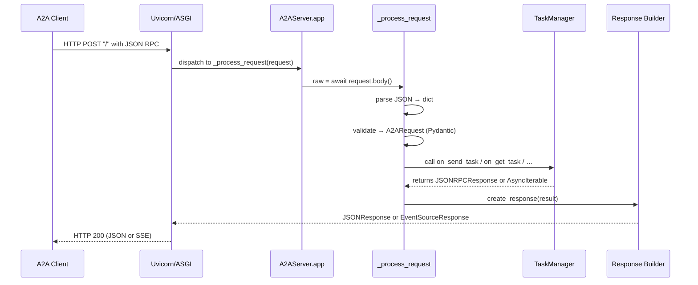

# Chapter 6: A2A Server (A2AServer)

In the previous chapter we saw how to fan-out parallel workloads with [AsyncParallelBatchNode & AsyncParallelBatchFlow](05_parallel_batch_processing__asyncparallelbatchnode___asyncparallelbatchflow__.md). Now, imagine you want to **expose** your PocketFlow pipelines as a network‐accessible agent so that remote clients (or other services) can send tasks, poll results, or even subscribe to streaming updates. The **A2AServer** is exactly that: an ASGI application (built on Starlette and Uvicorn) that speaks the A2A JSON‐RPC protocol, demultiplexes incoming methods into your `TaskManager`, and emits responses or Server‐Sent Events (SSE) back to clients.

Whether you’re turning an ETL flow into a microservice or deploying an LLM skill behind a REST/JSON-RPC facade, A2AServer handles:

- HTTP transport details  
- JSON parsing and request validation  
- Routing JSON-RPC methods (SendTask, GetTask, CancelTask, etc.)  
- Error mapping (JSONParseError → JSONRPC error, internal exceptions → `InternalError`)  
- Synchronous JSON responses or **streaming** via SSE  
- Serving your agent’s metadata (the **AgentCard**) at `/.well-known/agent.json`

In this chapter we’ll build a simple A2AServer, step through its key components, examine the request handling lifecycle, and peek under the hood at the core implementation.

---

## 1. Motivation & Central Use Case

Suppose you’ve built a PocketFlow pipeline that answers natural-language queries by chaining:

1. **Search the web** for relevant docs  
2. **Summarize** pages with an LLM  
3. **Aggregate** into a final answer  

You want to run this as a standalone service so that any A2A-compliant client can do:

- `SendTask` with user input  
- Optionally `SendTaskStreaming` to receive partial LLM tokens  
- `GetTask` to poll final results  
- `CancelTask` if the user aborts  

You also need to advertise your agent’s capabilities (name, version, supported content types) so clients can discover it. **A2AServer** provides:

- An HTTP **GET** handler at `/.well-known/agent.json` serving an **AgentCard**  
- A single HTTP **POST** handler at `/` for all JSON-RPC calls  
- Automatic dispatch to your custom **TaskManager**  
- Clean error responses conforming to the A2A spec  
- Support for streaming responses via Server-Sent Events  

By the end of this chapter you’ll have a ready-to-run server that wraps your PocketFlow workflows in a production-grade ASGI application.

---

## 2. Key Concepts

1. **ASGI App & Routes**  
   - Built on [Starlette](https://www.starlette.io/)  
   - Runs under [Uvicorn](https://www.uvicorn.org/)  
   - Two routes:  
     - `GET /.well-known/agent.json` → returns your AgentCard  
     - `POST /` → accepts all JSON-RPC requests  

2. **AgentCard**  
   - A Pydantic model describing your agent:  
     name, version, URL, capabilities, skills, input/output modes  
   - Clients fetch it once to learn what you support  

3. **JSON-RPC Endpoint**  
   - Accepts a JSON body like:  

     ```json
     {
       "jsonrpc": "2.0",
       "id": "1234",
       "method": "SendTask",
       "params": { /* task payload */ }
     }
     ```  

   - Parses into an `A2ARequest` (Pydantic models)  
   - Routes to methods on your `TaskManager` (`on_send_task`, `on_get_task`, …)  

4. **TaskManager**  
   - Your custom subclass implementing business logic  
   - Returns either:  
     - A `JSONRPCResponse` (sync result or error)  
     - An `AsyncIterable[JSONRPCResponse]` for streaming (SSE)  

5. **Error Handling**  
   - **JSON parse errors** → return a `JSONParseError` object  
   - **Validation errors** (bad params) → `InvalidRequestError`  
   - **Unexpected exceptions** → catch all and return `InternalError`  
   - Always responds with HTTP 200 and an error structure in JSON  

6. **Response Emission**  
   - **Synchronous**: wrap `JSONRPCResponse.model_dump()` in Starlette’s `JSONResponse`  
   - **Streaming**: wrap the async iterable in `EventSourceResponse` (SSE)  

---

## 3. A Simple A2AServer Example

Below is a complete CLI script that:

1. Checks for an API key  
2. Defines your AgentCard (capabilities & skills)  
3. Instantiates a custom `PocketFlowTaskManager`  
4. Creates and starts the `A2AServer` under Uvicorn  

```python
# file: run_a2a_server.py

import os
import click
import logging

from common.types import AgentCard, AgentCapabilities, AgentSkill, MissingAPIKeyError
from common.server import A2AServer
from task_manager import PocketFlowTaskManager

logging.basicConfig(
    level=logging.INFO,
    format="%(asctime)s - %(name)s - %(levelname)s - %(message)s"
)

@click.command()
@click.option("--host", default="localhost", help="Bind host")
@click.option("--port", default=8000, help="Bind port")
def main(host, port):
    # 1. Validate environment
    if not os.getenv("OPENAI_API_KEY"):
        raise MissingAPIKeyError("Please set OPENAI_API_KEY")

    # 2. Build AgentCard metadata
    capabilities = AgentCapabilities(
        streaming=True,
        pushNotifications=False,
        stateTransitionHistory=False
    )
    skill = AgentSkill(
        id="web-qa",
        name="Web QA Agent",
        description="Answers questions via web search + LLM summarization",
        tags=["qa", "search"],
        examples=["Who won the 2024 Nobel Prize in Physics?"],
        inputModes=["text/plain"],  # as defined on your TaskManager
        outputModes=["text/plain"]
    )
    agent_card = AgentCard(
        name="PocketFlow Web QA Agent",
        description="A2A-wrapped PocketFlow agent for web research",
        url=f"http://{host}:{port}/",
        version="0.1.0",
        capabilities=capabilities,
        skills=[skill]
    )

    # 3. Instantiate your TaskManager (implements on_send_task, on_get_task, etc.)
    task_manager = PocketFlowTaskManager()

    # 4. Create and start the server
    server = A2AServer(host=host, port=port, agent_card=agent_card, task_manager=task_manager)
    logging.info(f"Starting A2A server at http://{host}:{port}")
    server.start()

if __name__ == "__main__":
    main()
```

Explanation:

- We use `click` for a nice CLI.  
- `AgentCapabilities` and `AgentSkill` describe what our agent can do.  
- `PocketFlowTaskManager` is your business logic (covered elsewhere).  
- **A2AServer** spins up a Starlette app and runs Uvicorn under the hood.

---

## 4. Request Lifecycle Walkthrough

Here’s what happens when an A2A client sends a JSON-RPC POST to `/`:



1. **Body read & JSON parse**  
2. **Validation** into typed request models  
3. **Dispatch** to the correct `TaskManager` method  
4. **Result** is either a single `JSONRPCResponse` (sync) or a stream  
5. **_create_response** logs the outgoing payload and wraps it in the proper Starlette response  

---

## 5. Under the Hood: Core Implementation

### 5.1 Route Definition & Startup

```python
class A2AServer:
    def __init__(self, host, port, endpoint="/", agent_card, task_manager):
        self.app = Starlette()
        # JSON-RPC endpoint (all methods)
        self.app.add_route(endpoint, self._process_request, methods=["POST"])
        # Agent metadata
        self.app.add_route("/.well-known/agent.json", self._get_agent_card, methods=["GET"])
        self.host = host
        self.port = port
        self.agent_card = agent_card
        self.task_manager = task_manager

    def start(self):
        import uvicorn
        uvicorn.run(self.app, host=self.host, port=self.port)
```

- **Starlette** mounts two handlers.  
- `start()` invokes Uvicorn, exposing your app.

### 5.2 AgentCard Handler

```python
def _get_agent_card(self, request):
    """Serve agent metadata to clients."""
    data = self.agent_card.model_dump(exclude_none=True)
    return JSONResponse(data)
```

### 5.3 Request Processor

```python
async def _process_request(self, request: Request):
    raw_body = await request.body()
    try:
        # 1) Parse JSON
        body = json.loads(raw_body)
        req_id = body.get("id", "N/A")
        # 2) Validate against A2ARequest Pydantic models
        rpc = A2ARequest.validate_python(body)

        # 3) Route to TaskManager
        if isinstance(rpc, SendTaskRequest):
            result = await self.task_manager.on_send_task(rpc)
        elif isinstance(rpc, GetTaskRequest):
            result = await self.task_manager.on_get_task(rpc)
        # … other methods …
        else:
            raise ValueError("Unsupported method")

        # 4) Wrap and return
        return self._create_response(result)

    except json.JSONDecodeError as e:
        # JSON parse error → JSONParseError
        return self._error_response(JSONRPCResponse(id=None, error=JSONParseError()))

    except ValidationError as ve:
        # Bad params → InvalidRequestError
        return self._error_response(JSONRPCResponse(id=body.get("id"), error=InvalidRequestError(data=ve.json())))

    except Exception as exc:
        # Unexpected → InternalError
        return self._error_response(JSONRPCResponse(id=body.get("id"), error=InternalError(message=str(exc))))
```

### 5.4 Building the Response

```python
def _create_response(self, result):
    # 1) Streaming case: AsyncIterable → SSE
    if isinstance(result, AsyncIterable):
        return EventSourceResponse(self._sse_generator(result))

    # 2) Regular JSONRPCResponse → JSON
    payload = result.model_dump(exclude_none=True)
    return JSONResponse(payload)

def _sse_generator(self, stream):
    async def gen():
        async for item in stream:
            json_text = item.model_dump_json(exclude_none=True)
            yield {"data": json_text}
    return gen()
```

- **`EventSourceResponse`** takes an async generator of `{data: "..."}` dicts  
- Every outgoing message (error or success) is logged for observability

---

## 6. Analogy & Insights

- Think of **A2AServer** as a **communications hub** or **RPC gateway**:
  - **HTTP transport** ↔ underlying wires  
  - **JSON-RPC** ↔ envelopes with method names and payloads  
  - **TaskManager** ↔ back-end “office” workers who actually handle the work  
- The server **demultiplexes** all incoming methods into separate handlers, much like how a network switch forwards packets based on port numbers.

This clean separation means you can evolve your PocketFlow logic (the TaskManager) independently of your transport layer (the A2AServer), simplifying deployment, scaling, and testing.

---

## 7. Conclusion & Next Steps

In this chapter you learned how to:

- Expose your PocketFlow agents over **HTTP** and **JSON-RPC**  
- Serve an **AgentCard** at `/.well-known/agent.json` for discovery  
- Route A2A methods to your **TaskManager**, handling sync and streaming results  
- Map parsing and validation errors into standard JSON-RPC error objects  
- Use **Starlette** and **Uvicorn** to build a production-ready ASGI service  

Up next, we’ll build the counterpart client that speaks this A2A protocol: [A2A Client (A2AClient)](07_a2a_client__a2aclient__.md).

---

Generated by fork of [AI Codebase Knowledge Builder](https://github.com/vegeta03/PocketFlow-Tutorial-Codebase-Knowledge.git)
