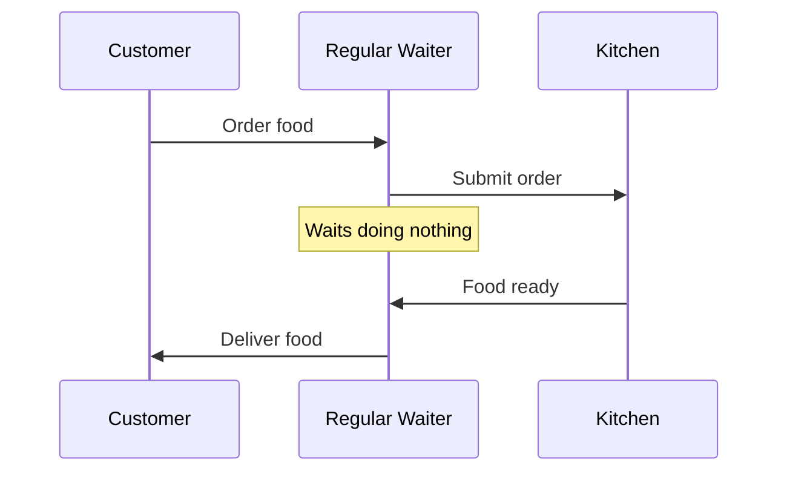
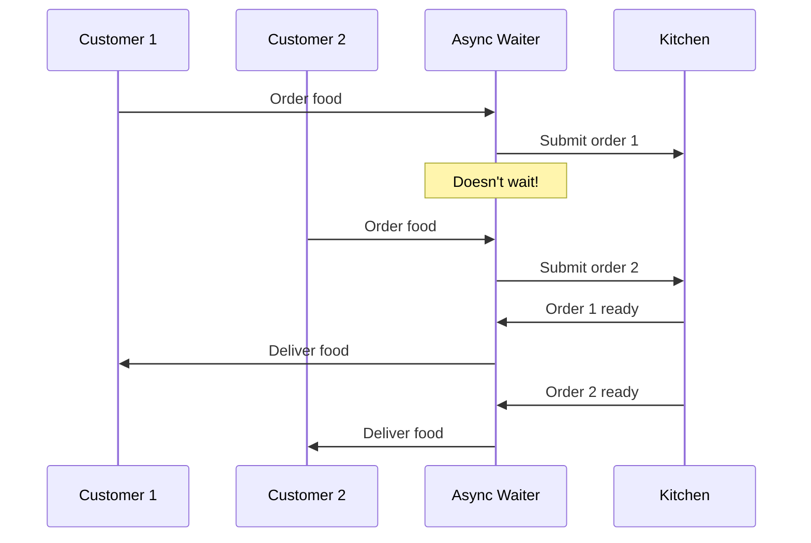
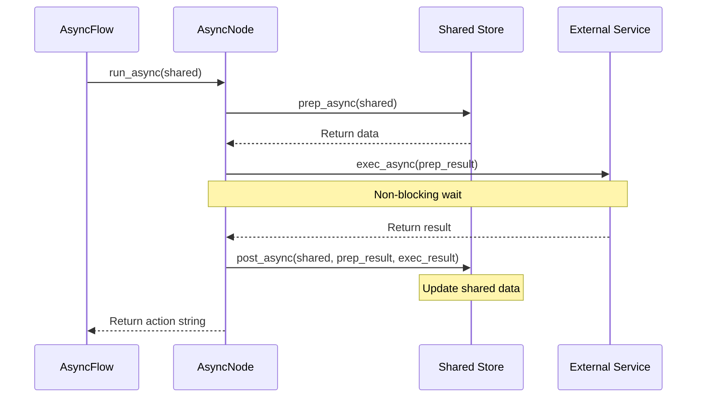

# Chapter 6: AsyncNode

In [Chapter 5: BatchFlow](05_batchflow_.md), we learned how to run the same workflow multiple times with different parameters. Now, let's explore a different way to improve efficiency: handling operations that involve waiting.

## The Problem: Waiting Wastes Time

Imagine you're using PocketFlow to build a recipe app that:
1. Searches an online database for recipes
2. Generates cooking tips with an AI service
3. Waits for the user to confirm their choice

Using regular [Node](01_node_.md)s, your app would:
1. Wait for the API to return recipes (doing nothing else)
2. Wait for the AI to generate tips (doing nothing else)
3. Wait for user input (doing nothing else)

This is like a chef who stands idle waiting for water to boil instead of chopping vegetables in the meantime!

## What is AsyncNode?

An **AsyncNode** is a special type of [Node](01_node_.md) designed for operations that involve waiting - especially when interacting with external resources like:
- API calls
- Database queries
- User input
- File operations

Think of AsyncNode as a skilled waiter in a restaurant:
- A regular waiter (Node) takes an order, goes to the kitchen, waits for the meal to be prepared, then delivers it
- An async waiter (AsyncNode) takes an order, submits it to the kitchen, then serves other tables while waiting for the meal to be ready





This allows your application to be more efficient - doing other work while waiting for slow operations to complete.

## How Async Programming Works

Asynchronous programming uses a concept called "non-blocking operations." Instead of waiting for an operation to complete before moving on, your code:

1. Starts the operation
2. Continues executing other code
3. Gets notified when the operation completes

In Python, this is done using `async` and `await` keywords:
- `async def` defines a function that can run asynchronously
- `await` pauses execution of the function until the awaited operation completes, but allows other async functions to run

## Creating Your First AsyncNode

Let's create a simple AsyncNode that makes an API call to get weather data:

```python
from pocketflow import AsyncNode
import aiohttp  # Async HTTP library

class GetWeather(AsyncNode):
    async def prep_async(self, shared):
        """Get the city from the shared store."""
        return shared.get("city", "New York")
    
    async def exec_async(self, city):
        """Get weather data for the city."""
        print(f"Fetching weather for {city}...")
        
        # Make an async API call
        async with aiohttp.ClientSession() as session:
            url = f"https://api.example.com/weather?city={city}"
            async with session.get(url) as response:
                # Simulate API delay
                await asyncio.sleep(2)
                return f"72°F and sunny in {city}"
    
    async def post_async(self, shared, prep_res, exec_res):
        """Store the weather data and continue."""
        shared["weather"] = exec_res
        print(f"Got weather: {exec_res}")
        return "display"
```

Notice the key differences from a regular [Node](01_node_.md):
1. We use `async def` for all methods
2. Method names end with `_async` (`prep_async`, `exec_async`, `post_async`)
3. We use `await` when calling async functions

This AsyncNode can now make an API call without blocking the entire workflow.

## A Real-World Example: Recipe Finder

Let's build a more useful application: a recipe finder that demonstrates three types of async operations:

1. API calls (searching for recipes)
2. AI service calls (suggesting the best recipe)
3. User input (getting approval)

First, let's create an AsyncNode to fetch recipes:

```python
from pocketflow import AsyncNode
import asyncio  # Python's async library

class FetchRecipes(AsyncNode):
    async def prep_async(self, shared):
        """Get ingredient from user."""
        ingredient = input("Enter ingredient: ")
        return ingredient
    
    async def exec_async(self, ingredient):
        """Fetch recipes asynchronously."""
        print(f"Fetching recipes for {ingredient}...")
        
        # Simulate API call with delay
        await asyncio.sleep(2)
        
        # Normally this would be a real API call
        recipes = [
            f"Grilled {ingredient} with herbs",
            f"{ingredient} stir fry",
            f"Baked {ingredient} with vegetables"
        ]
        
        print(f"Found {len(recipes)} recipes.")
        return recipes
```

Next, let's create an AsyncNode to suggest a recipe using an AI service:

```python
class SuggestRecipe(AsyncNode):
    async def prep_async(self, shared):
        """Get recipes from shared store."""
        return shared["recipes"]
    
    async def exec_async(self, recipes):
        """Get suggestion from AI (simulated)."""
        print("\nAsking AI for suggestion...")
        
        # Simulate AI service call with delay
        await asyncio.sleep(1.5)
        
        # Normally this would call an actual AI service
        suggestion = recipes[0]  # Just pick the first one
        
        print(f"AI suggests: {suggestion}")
        return suggestion
```

Finally, let's create an AsyncNode to get user approval:

```python
class GetApproval(AsyncNode):
    async def prep_async(self, shared):
        """Get current suggestion."""
        return shared["suggestion"]
    
    async def exec_async(self, suggestion):
        """Ask for user approval."""
        print(f"\nHow about: {suggestion}")
        
        # This is a blocking operation, but we'll make it async
        loop = asyncio.get_event_loop()
        answer = await loop.run_in_executor(
            None, 
            lambda: input("Accept this recipe? (y/n): ")
        )
        
        return answer
    
    async def post_async(self, shared, prep_res, answer):
        """Handle user's decision."""
        if answer.lower() == "y":
            print("\nGreat choice! Here's your recipe...")
            return "accept"
        else:
            print("\nLet's try another recipe...")
            return "retry"
```

Notice how:
1. The `FetchRecipes` node makes an async API call
2. The `SuggestRecipe` node makes an async AI service call
3. The `GetApproval` node handles user input asynchronously

## Running AsyncNode in a Flow

To run AsyncNodes, we need to use an [AsyncFlow](07_asyncflow_.md) (which we'll cover in the next chapter). For now, let's see how we would connect these nodes:

```python
from pocketflow import AsyncFlow

# Create the nodes
fetch_recipes = FetchRecipes()
suggest_recipe = SuggestRecipe()
get_approval = GetApproval()

# Connect the nodes
fetch_recipes - "default" >> suggest_recipe
suggest_recipe - "default" >> get_approval
get_approval - "retry" >> suggest_recipe
# (more connections...)

# Create the AsyncFlow
flow = AsyncFlow(start=fetch_recipes)

# Run the AsyncFlow
asyncio.run(flow.run_async({}))
```

The key difference when running AsyncNodes is:
1. We use `AsyncFlow` instead of `Flow`
2. We use `run_async` instead of `run`
3. We wrap it with `asyncio.run()` at the top level

## How AsyncNode Works Under the Hood

Let's see what happens when an AsyncNode runs:



The key difference from a regular [Node](01_node_.md) is that during the `exec_async` call, the AsyncNode doesn't block execution of other code.

Let's look at the PocketFlow implementation:

```python
class AsyncNode(Node):
    async def prep_async(self, shared): pass
    async def exec_async(self, prep_res): pass
    async def post_async(self, shared, prep_res, exec_res): pass
    
    async def _exec(self, prep_res): 
        for i in range(self.max_retries):
            try:
                return await self.exec_async(prep_res)
            except Exception as e:
                if i == self.max_retries-1:
                    return await self.exec_fallback_async(prep_res, e)
                if self.wait > 0:
                    await asyncio.sleep(self.wait)
    
    async def _run_async(self, shared):
        p = await self.prep_async(shared)
        e = await self._exec(p)
        return await self.post_async(shared, p, e)
```

The implementation is similar to a regular [Node](01_node_.md), but:
1. All methods use `async/await` syntax
2. Retries use `asyncio.sleep()` instead of `time.sleep()`
3. The main entry point is `_run_async` instead of `_run`

## When to Use AsyncNode

Use AsyncNode when:

1. Your operation involves waiting for external resources:
   - API calls
   - Database queries
   - File I/O
   - User input

2. You want to improve efficiency by doing other work while waiting

3. The operation could benefit from non-blocking behavior

AsyncNode is not beneficial for CPU-intensive tasks like complex calculations, as these don't involve waiting for external resources.

## Best Practices for AsyncNode

1. **Keep async and sync code separate**: Don't mix AsyncNodes with regular Nodes in ways that could cause blocking.

2. **Use proper async libraries**: Make sure to use async-compatible libraries (like `aiohttp` instead of `requests`).

3. **Handle errors properly**: Async code can fail in different ways than sync code.

```python
class RobustAsyncNode(AsyncNode):
    async def exec_fallback_async(self, prep_res, exc):
        """Provide fallback if async operation fails."""
        print(f"Error during async operation: {exc}")
        return {"error": str(exc), "fallback_data": "default data"}
```

4. **Be careful with CPU-intensive tasks**: If you need to run CPU-intensive code, consider using `run_in_executor` to avoid blocking the event loop.

## Conclusion

In this chapter, we've learned about **AsyncNode** - a powerful tool for handling operations that involve waiting, such as API calls, database queries, and user input.

By using AsyncNode, you can make your applications more efficient by doing other work while waiting for slow operations to complete, just like a waiter who serves multiple tables.

We've seen how to:
- Create AsyncNodes with `async/await` syntax
- Make non-blocking API calls
- Handle user input asynchronously
- Understand how AsyncNode works under the hood

In the next chapter, we'll explore [AsyncFlow](07_asyncflow_.md) - the special type of Flow designed to orchestrate AsyncNodes and create fully asynchronous workflows.

---

Generated by [AI Codebase Knowledge Builder](https://github.com/The-Pocket/Tutorial-Codebase-Knowledge)