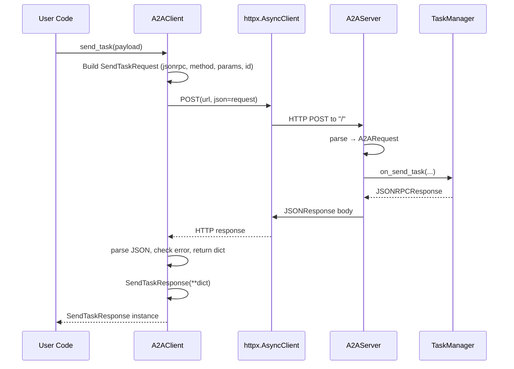

# Chapter 7: A2A Client (A2AClient)

In [Chapter 6: A2A Server (A2AServer)](06_a2a_server__a2aserver__.md) we wrapped our PocketFlow pipelines in a JSON-RPC ASGI service. Now it’s time to build the counterpart: an **A2AClient** that speaks the same protocol, sends tasks to remote agents, handles streaming updates, polls status, cancels tasks, and maps raw JSON into rich Pydantic models—much like a gRPC stub or SOAP client, but over HTTP + SSE.

## 1. Motivation & Central Use Case

Imagine you’ve deployed a “Web QA” agent via **A2AServer**. As an application developer, you want to:

1. **Discover** the agent’s endpoint and capabilities.
2. **Send** a question as a task (`SendTask`).
3. **Optionally** receive incremental streaming updates (`SendTaskStreaming`).
4. **Poll** the task status until it completes (`GetTask`).
5. **Cancel** the task if the user aborts (`CancelTask`).

Manually crafting HTTP POSTs, generating unique JSON-RPC IDs, parsing errors, retrying, and decoding SSE frames is tedious and error-prone. **A2AClient** automates it all:

- Wraps request creation in Pydantic models (`SendTaskRequest`, `GetTaskRequest`, …).  
- Auto-generates unique `id`s per call.  
- Logs JSON payloads on both sides.  
- Distinguishes HTTP errors vs. JSON-RPC errors.  
- Parses the JSON body into typed response models (`SendTaskResponse`, `GetTaskResponse`, …).  
- Exposes high-level async methods: `send_task`, `send_task_streaming`, `get_task`, `cancel_task`, etc.

By the end of this chapter you’ll know how to use **A2AClient** to implement the above workflow, and you’ll peek under the hood to see how it’s implemented.

---

## 2. Key Concepts

1. **AgentCard Resolution**  
   Clients first fetch `/.well-known/agent.json` to get the agent’s URL and metadata—using `A2ACardResolver`.

2. **Initialization**  
   `A2AClient` accepts either an `AgentCard` or direct `url`. It constructs an `httpx.AsyncClient` for all HTTP calls.

3. **JSON-RPC Request Models**  
   All calls use Pydantic classes (`SendTaskRequest`, `GetTaskRequest`, …) inheriting from a base `JSONRPCRequest`:
   - `jsonrpc`: always `"2.0"`
   - `method`: e.g. `"SendTask"`
   - `params`: payload dict
   - `id`: auto-filled if missing

4. **_send_request()**  
   A private method that:
   - Logs the outgoing JSON.  
   - POSTs to the agent URL.  
   - On HTTP 4xx/5xx raises `A2AClientHTTPError`.  
   - Parses the raw response bytes into JSON; on failure raises `A2AClientJSONError`.  
   - If the JSON has an `"error"` field, throws `RpcError`.  
   - Otherwise returns the raw dict.

5. **Typed Response Models**  
   Each public method calls `_send_request`, then wraps the result in a Pydantic response model (`SendTaskResponse(**dict)`), giving you typed attributes.

6. **Streaming via SSE**  
   For long-running tasks (LLM token streams), `send_task_streaming` uses `httpx.AsyncClient.stream` to open an SSE connection, parses lines prefixed with `data:`, yields `SendTaskStreamingResponse` objects as they arrive.

7. **Error Hierarchy**  
   - `A2AClientHTTPError`: non-200 HTTP status  
   - `A2AClientJSONError`: invalid JSON in response  
   - `RpcError`: JSON-RPC level error with `code`, `message`, optional `data`  
   - `A2AClientError`: catch-all for network/logic errors

---

## 3. Using A2AClient: An End-to-End Example

Below is a complete example showing the typical workflow: resolve the agent, send a task, stream partial updates, poll final status, and cancel if needed.

```python
# file: app.py
import asyncio
from common.client.card_resolver import A2ACardResolver
from common.client.client import A2AClient, RpcError, A2AClientError

async def main():
    # 1) Discover the agent's metadata & endpoint
    resolver = A2ACardResolver("http://localhost:8000")
    agent_card = resolver.get_agent_card()
    print("Discovered agent:", agent_card.name, agent_card.url)

    # 2) Instantiate the client
    client = A2AClient(agent_card=agent_card)

    # 3) Define our task payload
    payload = {"query": "Who won the 2024 Nobel Prize in Physics?"}

    try:
        # 4) Send the task
        send_resp = await client.send_task(payload)
        task_id = send_resp.result.taskId
        print(f"Task sent. ID = {task_id}, initial status = {send_resp.result.status}")

        # 5) Stream partial results (if supported)
        async for chunk in client.send_task_streaming(payload):
            print(f"[stream] {chunk.result.update}")

        # 6) Poll until final
        while True:
            get_resp = await client.get_task({"taskId": task_id})
            status = get_resp.result.status
            print(f"Polled status: {status}")
            if status in ("completed", "failed"):
                print("Final output:", get_resp.result.output)
                break
            await asyncio.sleep(1)

    except RpcError as rpc:
        print(f"RPC error {rpc.code}: {rpc}")
    except A2AClientError as e:
        print("Client error:", e)

    # 7) Optionally cancel (demonstration; most tasks are done)
    cancel_resp = await client.cancel_task({"taskId": task_id})
    print("Cancel acknowledged:", cancel_resp.result.success)

if __name__ == "__main__":
    asyncio.run(main())
```

Explanation:

- We fetch the **AgentCard** via `A2ACardResolver.get_agent_card()`.  
- We build `A2AClient(agent_card=...)`—it takes care of the base URL.  
- `send_task(payload)` posts once and returns a typed `SendTaskResponse`.  
- `send_task_streaming(payload)` returns an async iterator of `SendTaskStreamingResponse`.  
- `get_task({"taskId": …})` polls status.  
- `cancel_task({"taskId": …})` asks the server to abort the job.  

---

## 4. Under the Hood: Request Lifecycle

Let’s trace what happens on a `await client.send_task(payload)` call.



1. **Request object**: Pydantic builds a dict with `{"jsonrpc":"2.0","method":"SendTask",…}` and a unique `id`.  
2. **HTTP transport**: `httpx.AsyncClient.post` sends the JSON body, awaits the server response.  
3. **Server handling**: `A2AServer._process_request` routes to your `TaskManager`.  
4. **JSONRPCResponse** flows back; on SSE paths an `EventSourceResponse` streams chunks.  
5. **Client parsing**: raw bytes → JSON → dict → detect `"error"` → wrap into exceptions or dict.  
6. **High-level return**: caller receives a typed Pydantic model.

---

## 5. Inside A2AClient: Simplified Code Walkthrough

### 5.1 Initialization & ID Generation

```python
class A2AClient:
    def __init__(self, agent_card: AgentCard = None, url: str = None):
        if agent_card:
            self.url = agent_card.url.rstrip("/")
        elif url:
            self.url = url.rstrip("/")
        else:
            raise ValueError("Provide agent_card or url")
        # Async HTTP client with no timeout
        self.fetchImpl = httpx.AsyncClient(timeout=None)

    def _generateRequestId(self):
        # Millisecond timestamp as ID
        import time
        return int(time.time() * 1000)
```

- Choose URL from `AgentCard` or direct string.  
- Use a single `httpx.AsyncClient` for connection pooling.  
- IDs are simple epoch ms values (unique per process).

### 5.2 Core HTTP + JSON-RPC Logic

```python
    async def _send_request(self, request: JSONRPCRequest) -> dict[str, Any]:
        # 1) Ensure ID
        if not request.id:
            request.id = self._generateRequestId()
        dump = request.model_dump(exclude_none=True)
        logger.info(f"→ {request.method} (ID: {request.id})\n{dump}")

        try:
            # 2) POST to server
            resp = await self.fetchImpl.post(self.url, json=dump)
            logger.info(f"← HTTP {resp.status_code} for ID {request.id}")
            resp.raise_for_status()

            # 3) Parse JSON
            data = resp.json()
        except httpx.HTTPStatusError as e:
            raise A2AClientHTTPError(e.response.status_code, str(e)) from e
        except Exception as e:
            raise A2AClientError(f"Network/JSON error: {e}") from e

        # 4) JSON-RPC error?
        if data.get("error"):
            err = data["error"]
            raise RpcError(err["code"], err["message"], err.get("data"))

        logger.info(f"← {request.method} Response (ID: {request.id})\n{data}")
        return data
```

- We log both sides for observability.  
- `resp.raise_for_status()` maps HTTP 4xx/5xx to exceptions.  
- Non-2xx → `A2AClientHTTPError`.  
- JSON-RPC errors → `RpcError`.  
- Success returns the raw dict.

### 5.3 Public Methods

```python
    async def send_task(self, payload: dict[str,Any]) -> SendTaskResponse:
        req = SendTaskRequest(params=payload)
        raw = await self._send_request(req)
        return SendTaskResponse(**raw)

    async def get_task(self, payload: dict[str,Any]) -> GetTaskResponse:
        req = GetTaskRequest(params=payload)
        raw = await self._send_request(req)
        return GetTaskResponse(**raw)

    async def cancel_task(self, payload: dict[str,Any]) -> CancelTaskResponse:
        req = CancelTaskRequest(params=payload)
        raw = await self._send_request(req)
        return CancelTaskResponse(**raw)
```

Each method:

1. Wraps `payload` into a typed `JSONRPCRequest` subclass.  
2. Invokes `_send_request`.  
3. Unpacks the returned dict into a typed response model for easy attribute access.

### 5.4 Streaming Method

```python
    async def send_task_streaming(self, payload: dict[str,Any]) -> AsyncIterable[SendTaskStreamingResponse]:
        req = SendTaskStreamingRequest(params=payload)
        dump = req.model_dump(exclude_none=True)
        logger.info(f"→ {req.method} (streaming) ID={req.id}")

        # Open an SSE-style stream
        async with self.fetchImpl.stream("POST", self.url, json=dump) as resp:
            resp.raise_for_status()
            buffer = ""
            async for line in resp.aiter_lines():
                if line.startswith("data:"):
                    json_str = line[len("data:"):].strip()
                    yield SendTaskStreamingResponse(**json.loads(json_str))
                # ignore comments or empty lines
```

- We open a streaming HTTP connection.  
- The server emits `data: {...}` lines.  
- We parse each JSON payload into a `SendTaskStreamingResponse` and yield it.

---

## 6. Analogies & Insights

- **gRPC Stub Parallel**:  
  Just like you import a generated gRPC client and call `stub.SendTask(request)`, here you import `A2AClient` and call `await client.send_task(...)`. Under the hood it does HTTP + JSON-RPC, but you never see that boilerplate.

- **Remote Procedure Call Gateway**:  
  Think of **A2AClient** as your front-end “driver” for the agent: all network, retry, error-mapping, and JSON marshalling is encapsulated behind simple async methods.

- **SSE = Streaming RPC**:  
  `send_task_streaming` is akin to a bidirectional streaming RPC call, except it uses Server-Sent Events and you only need to iterate an async generator to receive tokens.

---

## 7. Conclusion & Next Steps

In this chapter you learned how to:

- Discover an agent’s endpoint via `A2ACardResolver`.  
- Instantiate `A2AClient` and automatically manage JSON-RPC IDs, logging, and errors.  
- Send tasks (`send_task`), poll status (`get_task`), cancel (`cancel_task`), and stream updates (`send_task_streaming`).  
- Understand the internal request flow from your code to the remote `A2AServer`, including HTTP transport and JSON-RPC semantics.

Next up, we’ll explore how to describe agents’ capabilities and skills using **AgentCard** and **AgentSkill** metadata in [Agent Metadata (AgentCard & Skills)](08_agent_metadata__agentcard___skills__.md).

---

Generated by fork of [AI Codebase Knowledge Builder](https://github.com/vegeta03/PocketFlow-Tutorial-Codebase-Knowledge.git)
