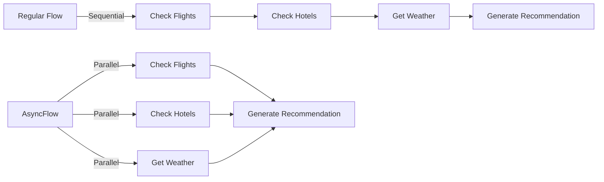
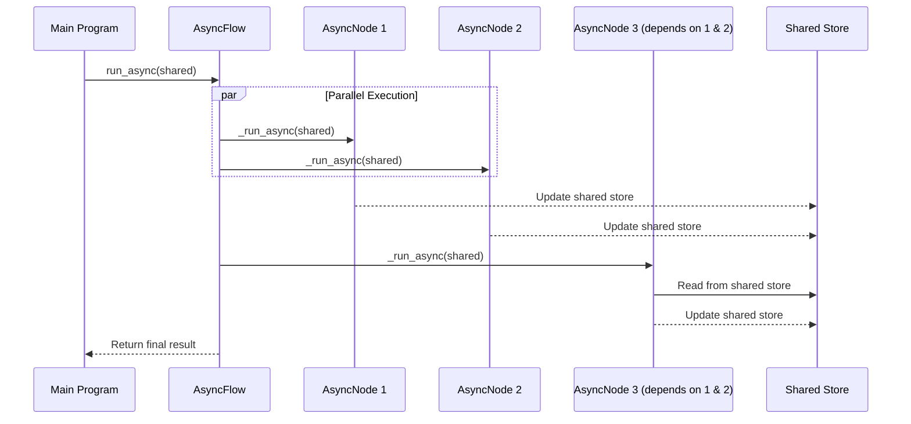

# Chapter 7: AsyncFlow

In [Chapter 6: AsyncNode](06_asyncnode_.md), we learned how to create individual Nodes that can perform asynchronous operations. But what if we want to connect multiple AsyncNodes together? How do we create an entire workflow that's asynchronous? That's where AsyncFlow comes in!

## What is AsyncFlow?

**AsyncFlow** is like a project manager who coordinates team members working on different tasks independently. Just as a good project manager knows which team members can work in parallel and which ones need to wait for others to finish, AsyncFlow orchestrates AsyncNodes to run efficiently together.

Imagine you're building a travel planning app that needs to:
1. Check flight prices from multiple airlines
2. Look up hotel availability 
3. Get weather forecasts for the destination
4. Generate a trip recommendation

These tasks involve waiting for external services, but they don't all depend on each other. For example, you can check flights and hotels at the same time instead of doing one after the other.



## Creating Your First AsyncFlow

Let's create a simple example to show how AsyncFlow works. We'll build a program that fetches information about a city from two different APIs simultaneously:

```python
from pocketflow import AsyncNode, AsyncFlow
import asyncio  # Python's async library
import random  # Just for our simulation

class FetchWeather(AsyncNode):
    async def exec_async(self, prep_res):
        """Fetch weather data for a city."""
        city = self.params.get("city", "New York")
        print(f"Fetching weather for {city}...")
        
        # Simulate API call with random delay
        await asyncio.sleep(random.uniform(1, 3))
        
        # Simulate weather data
        temp = random.randint(60, 90)
        weather = random.choice(["Sunny", "Cloudy", "Rainy"])
        print(f"Weather fetch complete!")
        
        return f"{temp}°F and {weather}"
```

This AsyncNode simulates fetching weather data with a random delay. Now let's create another AsyncNode:

```python
class FetchAttractions(AsyncNode):
    async def exec_async(self, prep_res):
        """Fetch tourist attractions for a city."""
        city = self.params.get("city", "New York")
        print(f"Fetching attractions for {city}...")
        
        # Simulate API call with random delay
        await asyncio.sleep(random.uniform(1, 3))
        
        # Simulate attractions data
        attractions = ["Park", "Museum", "Restaurant"]
        print(f"Attractions fetch complete!")
        
        return attractions
```

Now let's create an AsyncNode to combine the results:

```python
class CreateCityGuide(AsyncNode):
    async def prep_async(self, shared):
        """Get weather and attractions data."""
        return {
            "weather": shared.get("weather", ""),
            "attractions": shared.get("attractions", [])
        }
    
    async def exec_async(self, data):
        """Create a city guide."""
        print("Creating city guide...")
        
        # Simple guide creation
        city = self.params.get("city", "New York")
        weather = data["weather"]
        attractions = data["attractions"]
        
        guide = f"City Guide for {city}:\n"
        guide += f"Weather: {weather}\n"
        guide += f"Top attractions: {', '.join(attractions)}"
        
        return guide
```

Now let's connect these AsyncNodes with an AsyncFlow:

```python
# Create AsyncNodes
weather_node = FetchWeather()
attractions_node = FetchAttractions()
guide_node = CreateCityGuide()

# Connect nodes
weather_node - "default" >> guide_node  
attractions_node - "default" >> guide_node

# Create AsyncFlow with two starting nodes!
flow = AsyncFlow(start=[weather_node, attractions_node])

# Run the AsyncFlow
async def main():
    shared = {}
    params = {"city": "Paris"}
    # Set parameters for all nodes
    flow.set_params(params)
    # Run the flow
    await flow.run_async(shared)
    # Print the result
    print("\nResult:")
    print(shared.get("result", "No result found"))

# Run the main function
asyncio.run(main())
```

The key differences from a regular [Flow](02_flow_.md) are:
1. We use `AsyncFlow` instead of `Flow`
2. We call `run_async()` instead of `run()`
3. We can have multiple starting nodes that run in parallel
4. We need to wrap everything in `asyncio.run()` to start the async execution

## A Real-World Example: Multi-API News Aggregator

Let's build something more practical: a news aggregator that fetches articles from multiple sources in parallel and combines them.

First, let's create AsyncNodes for each news source:

```python
class FetchNewsSource(AsyncNode):
    async def exec_async(self, prep_res):
        """Fetch news from a specific source."""
        source = self.params.get("source", "Unknown")
        print(f"Fetching news from {source}...")
        
        # Simulate API call with delay
        await asyncio.sleep(random.uniform(1, 4))
        
        # Simulate news articles (in real app, this would be an API call)
        articles = [
            f"{source} - Breaking News Story",
            f"{source} - Feature Article"
        ]
        
        print(f"Retrieved {len(articles)} articles from {source}")
        return articles
```

Now let's create an AsyncNode to combine the results:

```python
class CombineNews(AsyncNode):
    async def prep_async(self, shared):
        """Get all news articles from the shared store."""
        return {
            "bbc": shared.get("bbc_news", []),
            "cnn": shared.get("cnn_news", []),
            "local": shared.get("local_news", [])
        }
    
    async def exec_async(self, sources):
        """Combine and sort news articles."""
        print("Combining news from all sources...")
        
        # Combine all articles
        all_articles = []
        for source, articles in sources.items():
            all_articles.extend(articles)
        
        # Sort (in a real app, we might sort by relevance or date)
        all_articles.sort()
        
        return all_articles
```

Now let's set up the AsyncFlow:

```python
# Create the nodes
bbc = FetchNewsSource()
bbc.set_params({"source": "BBC"})

cnn = FetchNewsSource()
cnn.set_params({"source": "CNN"})

local = FetchNewsSource()
local.set_params({"source": "Local News"})

combine = CombineNews()

# Store results in shared store
bbc - "default" >> lambda s, p, e: s.update({"bbc_news": e}) or "combine"
cnn - "default" >> lambda s, p, e: s.update({"cnn_news": e}) or "combine"
local - "default" >> lambda s, p, e: s.update({"local_news": e}) or "combine"

# Connect all sources to the combine node
bbc - "combine" >> combine
cnn - "combine" >> combine
local - "combine" >> combine

# Create AsyncFlow with multiple starting nodes
flow = AsyncFlow(start=[bbc, cnn, local])
```

In this example, all three news sources are fetched simultaneously, and the results are combined once all three are complete. The real power of AsyncFlow is that it can handle these complex coordination patterns for you.

## How AsyncFlow Works Under the Hood

AsyncFlow orchestrates multiple AsyncNodes, ensuring they run efficiently and data flows correctly between them. Let's see what happens when an AsyncFlow runs:



The key features of AsyncFlow are:
1. It can start multiple AsyncNodes in parallel
2. It manages the dependencies between nodes using action strings
3. It ensures data is correctly shared through the shared store
4. It handles all the async/await complexity for you

Let's look at the core implementation in the PocketFlow codebase:

```python
class AsyncFlow(Flow, AsyncNode):
    async def _orch_async(self, shared, params=None):
        # Start with initial node(s)
        curr = copy.copy(self.start_node)
        # Initialize parameters
        p = (params or {**self.params})
        last_action = None
        
        # If we have multiple starting nodes, run them in parallel
        if isinstance(curr, list):
            # Run all starting nodes concurrently
            tasks = [node._run_async(shared) for node in curr]
            # Wait for all to complete
            results = await asyncio.gather(*tasks)
            # Use last action from any node
            last_action = results[-1]
            # Move to the next node based on last action
            curr = self.get_next_node(curr[-1], last_action)
        
        # Continue as long as there's a current node
        while curr:
            # Set parameters on current node
            curr.set_params(p)
            # Run the current node asynchronously
            last_action = await curr._run_async(shared)
            # Find the next node based on returned action
            curr = self.get_next_node(curr, last_action)
        
        # Return the final action
        return last_action
```

This is a simplification of the actual implementation, but it shows the key ideas:
1. If there are multiple starting nodes, `asyncio.gather()` runs them in parallel
2. The flow continues by following action strings, just like in a regular [Flow](02_flow_.md)
3. Everything uses `async/await` to prevent blocking

## Complex Example: Web Scraper with Rate Limiting

Let's look at a more complex example: a web scraper that respects rate limits while fetching data from multiple pages.

First, let's create a rate limiter to avoid overloading the website:

```python
class RateLimiter:
    def __init__(self, requests_per_second=1):
        self.interval = 1.0 / requests_per_second
        self.last_request_time = 0
        self.lock = asyncio.Lock()
    
    async def wait(self):
        """Wait if necessary to maintain the rate limit."""
        async with self.lock:
            now = asyncio.get_event_loop().time()
            elapsed = now - self.last_request_time
            
            if elapsed < self.interval:
                # Need to wait to respect rate limit
                await asyncio.sleep(self.interval - elapsed)
                
            # Update the last request time
            self.last_request_time = asyncio.get_event_loop().time()
```

Now let's create an AsyncNode to fetch URLs with rate limiting:

```python
class FetchURL(AsyncNode):
    def __init__(self, rate_limiter):
        super().__init__()
        self.rate_limiter = rate_limiter
    
    async def exec_async(self, url):
        """Fetch a URL, respecting rate limits."""
        # Wait if needed to respect rate limits
        await self.rate_limiter.wait()
        
        print(f"Fetching {url}...")
        
        # Simulate web request with random delay
        await asyncio.sleep(random.uniform(0.5, 1.5))
        
        # In a real app, this would use aiohttp to fetch the page
        content = f"Content of {url}"
        
        return {"url": url, "content": content}
```

Now we can set up our AsyncFlow:

```python
# Create a shared rate limiter (1 request per second)
rate_limiter = RateLimiter(requests_per_second=1)

# Create AsyncBatchFlow for multiple URLs
class ScraperFlow(AsyncBatchFlow):
    async def prep_async(self, shared):
        """Get list of URLs to scrape."""
        return [
            {"url": "https://example.com/page1"},
            {"url": "https://example.com/page2"},
            {"url": "https://example.com/page3"}
        ]
    
    async def post_async(self, shared, urls, results):
        """Store all results in the shared store."""
        shared["results"] = results
        print(f"Scraped {len(results)} pages successfully")
        return "complete"

# Create the flow
fetch_node = FetchURL(rate_limiter)
flow = ScraperFlow(start=fetch_node)
```

This example demonstrates how AsyncFlow can be combined with [BatchFlow](05_batchflow_.md) to create an `AsyncBatchFlow` that processes multiple items asynchronously while respecting rate limits.

## Best Practices for AsyncFlow

When working with AsyncFlow, keep these tips in mind:

### 1. Use AsyncNodes for I/O-bound tasks

AsyncFlow works best with tasks that involve waiting for external resources (like API calls), not CPU-intensive calculations.

### 2. Handle errors properly

Async code can fail in different ways than sync code. Use try/except blocks and proper error handling:

```python
class RobustAsyncNode(AsyncNode):
    async def exec_async(self, prep_res):
        try:
            # Potentially failing API call
            return await make_api_call()
        except Exception as e:
            print(f"Error during API call: {e}")
            return {"error": str(e)}
```

### 3. Use locks for shared resources

If multiple AsyncNodes access the same external resource, use locks to prevent race conditions:

```python
# Create a shared lock
lock = asyncio.Lock()

class SafeAsyncNode(AsyncNode):
    async def exec_async(self, prep_res):
        # Acquire lock before accessing shared resource
        async with lock:
            result = await access_shared_resource()
        return result
```

### 4. Be mindful of the event loop

Don't block the event loop with CPU-intensive tasks or synchronous operations:

```python
class GoodAsyncNode(AsyncNode):
    async def exec_async(self, prep_res):
        # Run CPU-intensive task in a separate thread pool
        loop = asyncio.get_event_loop()
        result = await loop.run_in_executor(
            None, cpu_intensive_calculation, prep_res
        )
        return result
```

## Conclusion

In this chapter, we've learned about **AsyncFlow** - the orchestrator that coordinates multiple AsyncNodes to create powerful asynchronous workflows. AsyncFlow lets us run independent operations in parallel while ensuring that dependent operations wait for their prerequisites.

We've seen how to:
- Create an AsyncFlow with multiple starting nodes
- Coordinate AsyncNodes running in parallel
- Build complex systems like a news aggregator
- Understand how AsyncFlow works under the hood
- Follow best practices for efficient async workflows

AsyncFlow is particularly powerful when you need to interact with multiple external services or process large amounts of data concurrently. It handles all the complex async coordination for you, letting you focus on building your application logic.

In the next chapter, we'll explore [AsyncParallelBatchNode](08_asyncparallelbatchnode_.md) - a specialized node that combines asynchronous execution with parallel batch processing for ultimate efficiency.

---

Generated by [AI Codebase Knowledge Builder](https://github.com/The-Pocket/Tutorial-Codebase-Knowledge)