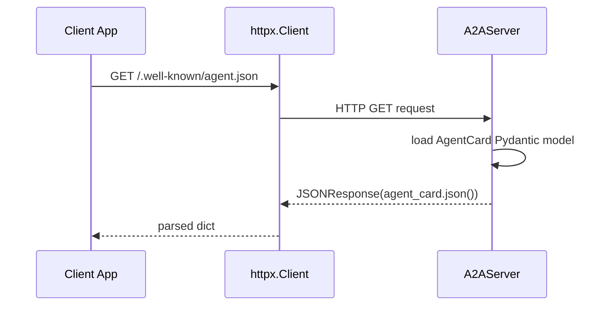
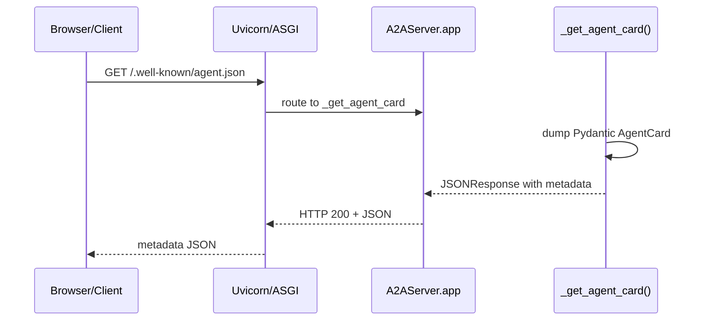

# Chapter 8: Agent Metadata (AgentCard & Skills)

In the previous chapter we saw how to interact with a remote PocketFlow agent over JSON-RPC using the [A2A Client (A2AClient)](07_a2a_client__a2aclient__.md). Before you can send a task, your client needs to know **what** the agent can do and **how** to call it. That’s where **Agent Metadata** comes in: a structured, machine-readable description of an agent’s capabilities and published skills, packaged as an **AgentCard** with one or more **AgentSkill** entries.

---

## 1. Motivation & Central Use Case

Imagine you’re building a marketplace of AI agents—each agent might support different features: some stream partial responses, others accept files or images, and each exposes a distinct set of skills (e.g. “web-search QA”, “document summarization”, “code generation”). Rather than hard-coding method names and parameter schemas in your client, you want a **discovery** step:

1. **Fetch** the agent’s metadata (AgentCard).  
2. **Inspect** `capabilities` to see if it streams or supports push notifications.  
3. **List** its `skills` to display options to your users.  
4. **Choose** a skill by `id` and call it with the appropriate input/output modes.

In this chapter you’ll learn how to:

- Define **AgentCapabilities**, **AgentSkill**, and **AgentCard** in your code.  
- Expose them via the A2A server at `/.well-known/agent.json`.  
- Consume the metadata in your client for dynamic discovery and routing.  
- Peek under the hood at how the server serves this JSON.

By the end, you’ll treat AgentCard as your agent’s “service registry entry”—self-documenting and machine-readable.

---

## 2. Key Concepts

### 2.1 AgentCapabilities

Describes global agent features:

- `streaming` (bool): can you subscribe to partial updates?  
- `pushNotifications` (bool): does it support server-to-client pushes?  
- `stateTransitionHistory` (bool): will it keep a full task history?

Pydantic schema in **common/types.py**:

```python
class AgentCapabilities(BaseModel):
    streaming: bool = False
    pushNotifications: bool = False
    stateTransitionHistory: bool = False
```

### 2.2 AgentSkill

A single, named ability your agent publishes. Fields include:

- `id` (str): unique skill identifier  
- `name` (str): human-readable title  
- `description` (str): what it does  
- `tags` (List[str]): for client filtering or search  
- `examples` (List[str]): sample inputs  
- `inputModes` / `outputModes` (List[str]): MIME/content types  

Pydantic schema excerpt:

```python
class AgentSkill(BaseModel):
    id: str
    name: str
    description: str | None = None
    tags: List[str] | None = None
    examples: List[str] | None = None
    inputModes: List[str] | None = None
    outputModes: List[str] | None = None
```

### 2.3 AgentCard

The top-level document that wraps everything:

- `name`, `description`, `url`, `version`  
- `capabilities`: an **AgentCapabilities** instance  
- `authentication` / `provider` (optional)  
- `defaultInputModes` / `defaultOutputModes`  
- `skills`: a list of **AgentSkill**

Pydantic schema excerpt:

```python
class AgentCard(BaseModel):
    name: str
    description: str | None = None
    url: str
    provider: AgentProvider | None = None
    version: str
    documentationUrl: str | None = None
    capabilities: AgentCapabilities
    authentication: AgentAuthentication | None = None
    defaultInputModes: List[str] = ["text"]
    defaultOutputModes: List[str] = ["text"]
    skills: List[AgentSkill]
```

---

## 3. Authoring Your Agent Metadata

### 3.1 Define Global Capabilities

In your server startup script (e.g., `run_a2a_server.py`):

```python
from common.types import AgentCapabilities

capabilities = AgentCapabilities(
    streaming=True,
    pushNotifications=False,
    stateTransitionHistory=False
)
```

This tells clients they can use streaming JSON-RPC calls (`tasks/sendSubscribe`), but not push notifications or history retrieval.

### 3.2 Define One or More Skills

Each skill represents an entry point your TaskManager implements:

```python
from common.types import AgentSkill

web_qa_skill = AgentSkill(
    id="web-qa",
    name="Web QA",
    description="Answers user questions via web search and LLM summarization.",
    tags=["qa", "search", "web"],
    examples=["Who won the 2024 Nobel Prize in Physics?"],
    inputModes=["text/plain"],
    outputModes=["text/plain"]
)

summarization_skill = AgentSkill(
    id="summarize-doc",
    name="Document Summarization",
    description="Summarizes long documents into brief abstracts.",
    tags=["summarization", "nlp", "doc"],
    examples=["<long text here>"],
    inputModes=["text/plain", "application/json"],
    outputModes=["text/plain"]
)
```

### 3.3 Assemble the AgentCard

```python
from common.types import AgentCard

agent_card = AgentCard(
    name="PocketFlow Research Agent",
    description="A2A-wrapped agent for web research and summarization.",
    url="http://localhost:8000/",
    version="0.1.0",
    capabilities=capabilities,
    skills=[web_qa_skill, summarization_skill]
)
```

You then pass this `agent_card` into your `A2AServer`:

```python
server = A2AServer(
    agent_card=agent_card,
    task_manager=PocketFlowTaskManager(),
    host="0.0.0.0",
    port=8000
)
server.start()
```

---

## 4. Discovery & Client-Side Usage

Clients fetch the metadata before sending any task:

```python
import httpx

resp = httpx.get("http://localhost:8000/.well-known/agent.json")
agent_meta = resp.json()
print("Agent name:", agent_meta["name"])
print("Supports streaming?", agent_meta["capabilities"]["streaming"])
print("Skills available:")
for skill in agent_meta["skills"]:
    print(f" - {skill['id']}: {skill['name']}")
```

### Sequence Diagram: AgentCard Discovery



Once you have `agent_meta`, you can dynamically route calls based on `skills[].id` or validate payloads against supported `inputModes`.

---

## 5. Under the Hood

### 5.1 Route Registration

In **common/server.py**, the `A2AServer` constructor mounts the metadata endpoint:

```python
# common/server.py
class A2AServer:
    def __init__(self, ..., agent_card: AgentCard, ...):
        self.app = Starlette()
        # Serve metadata
        self.app.add_route(
            "/.well-known/agent.json",
            self._get_agent_card,
            methods=["GET"]
        )
        # JSON-RPC endpoint for tasks
        self.app.add_route("/", self._process_request, methods=["POST"])
```

### 5.2 Handler Implementation

```python
# common/server.py
def _get_agent_card(self, request):
    # Exclude None fields for a compact JSON
    data = self.agent_card.model_dump(exclude_none=True)
    return JSONResponse(data)
```

No extra logic—Pydantic’s `model_dump` turns your Python objects into a JSON-compatible dict.

### 5.3 Flow of a GET Request



---

## 6. Analogies & Insights

- Think of **AgentCard** as a **WSDL** (Web Services Description Language) or a **service registry** entry in a microservices mesh—clients look it up to know what methods exist, what parameters are expected, and what return types to prepare for.

- **AgentSkill** entries are like **RPC function signatures**: each has an `id`, documentation (`description`, `examples`), and data contracts (`inputModes`/`outputModes`).

This abstraction decouples client logic from server implementation: you never hard-code method names or content types, you simply query the AgentCard and adapt.

---

## 7. Conclusion & Next Steps

In this chapter you learned how to:

- Model your agent’s global features via **AgentCapabilities**.  
- Publish named abilities using **AgentSkill**.  
- Bundle everything into an **AgentCard** Pydantic schema.  
- Expose your metadata at `/.well-known/agent.json` through the A2A server.  
- Discover and consume agent metadata from the client side.  

Next up, we’ll dive deeper into the A2A protocol’s data models—examining task payloads, status updates, and artifact structures in [A2A JSON-RPC Data Models](09_a2a_json_rpc_data_models_.md).

---

Generated by fork of [AI Codebase Knowledge Builder](https://github.com/vegeta03/PocketFlow-Tutorial-Codebase-Knowledge.git)
