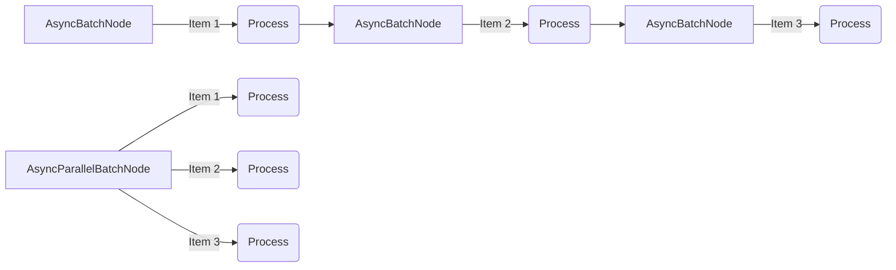
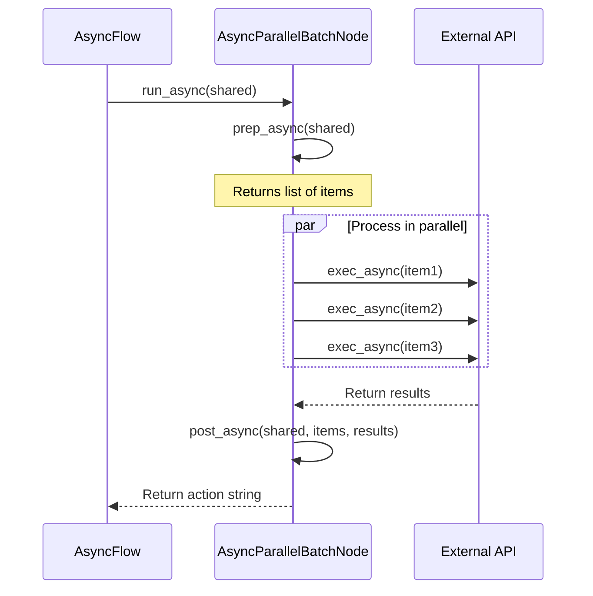

# Chapter 8: AsyncParallelBatchNode

In [Chapter 7: AsyncFlow](07_asyncflow_.md), we learned how to orchestrate multiple AsyncNodes to create asynchronous workflows. Now, let's address a common bottleneck: what if you need to process a large batch of similar items all at once?

## The Problem: Sequential vs Parallel Processing

Imagine you're a food delivery service manager with multiple delivery orders and several drivers. You have two options:

1. **Sequential approach**: Send one driver out, wait for them to return, then send the next driver.
2. **Parallel approach**: Send all drivers out simultaneously to deliver different orders.

Which approach is more efficient? Obviously, the parallel approach! 

This is exactly the problem that AsyncParallelBatchNode solves. While [AsyncBatchNode](06_asyncnode_.md) processes items one after another (sequentially), AsyncParallelBatchNode tackles them all at once (in parallel), dramatically improving performance for I/O-bound operations.

## What is AsyncParallelBatchNode?

**AsyncParallelBatchNode** is a specialized Node that processes multiple items concurrently, leveraging Python's asyncio for parallel execution. It combines the batch processing capabilities of [BatchNode](04_batchnode_.md) with the asynchronous power of [AsyncNode](06_asyncnode_.md), but with a crucial difference: it processes all items in parallel rather than one at a time.



The difference is dramatic:
- With AsyncBatchNode, if each item takes 1 second, 3 items take 3 seconds total
- With AsyncParallelBatchNode, if each item takes 1 second, 3 items still take about 1 second total!

## Creating Your First AsyncParallelBatchNode

Let's create a simple example to demonstrate the power of parallel processing. We'll create a Node that fetches weather information for multiple cities simultaneously:

```python
from pocketflow import AsyncParallelBatchNode
import asyncio
import random  # Just for simulation purposes

class ParallelWeatherFetcher(AsyncParallelBatchNode):
    async def prep_async(self, shared):
        """Get list of cities from shared store."""
        return shared.get("cities", ["New York", "London", "Tokyo"])
    
    async def exec_async(self, city):
        """Fetch weather for a single city."""
        print(f"Fetching weather for {city}...")
        
        # Simulate API call with 1 second delay
        await asyncio.sleep(1)
        
        # In a real app, this would call a weather API
        temp = random.randint(0, 35)  # Random temperature
        return f"{city}: {temp}°C"
    
    async def post_async(self, shared, cities, results):
        """Store all weather results in the shared store."""
        shared["weather_results"] = results
        print(f"Fetched weather for {len(results)} cities")
        return "complete"
```

This AsyncParallelBatchNode:
1. Gets a list of cities from the shared store
2. For each city, makes a simulated API call to fetch weather data
3. Stores all results back in the shared store

The magic happens behind the scenes - all the API calls run simultaneously!

## Running the AsyncParallelBatchNode

Let's run our weather fetcher and see how it performs:

```python
from pocketflow import AsyncFlow
import asyncio

# Create our node
fetcher = ParallelWeatherFetcher()

# Create a simple flow
flow = AsyncFlow(start=fetcher)

# Run the flow
async def main():
    shared = {"cities": ["New York", "London", "Tokyo", "Paris", "Sydney"]}
    await flow.run_async(shared)
    print("\nResults:")
    for result in shared["weather_results"]:
        print(f"  {result}")

# Run the async program
asyncio.run(main())
```

When you run this, you'll see something remarkable - all five API calls start almost simultaneously, and the entire operation completes in about 1 second (the time of a single API call), not 5 seconds!

## A Real-World Example: Parallel Document Processing

Let's build something more practical: a system that summarizes multiple documents in parallel using an AI service.

```python
from pocketflow import AsyncParallelBatchNode
import asyncio

class ParallelDocumentSummarizer(AsyncParallelBatchNode):
    async def prep_async(self, shared):
        """Get documents to summarize."""
        return list(shared.get("documents", {}).items())
    
    async def exec_async(self, item):
        """Summarize a single document."""
        filename, content = item
        print(f"Summarizing {filename}...")
        
        # In a real app, this would call an AI service
        # Here we just simulate a 2-second API call
        await asyncio.sleep(2)
        
        summary = f"Summary of {filename}: {content[:20]}..."
        print(f"Finished summarizing {filename}")
        return filename, summary
```

This node:
1. Takes a dictionary of documents (filename → content)
2. Processes each document in parallel
3. Returns the filename and summary for each document

Let's add a post method to store the results:

```python
    async def post_async(self, shared, items, exec_results):
        """Organize summaries by filename."""
        # Convert list of (filename, summary) tuples to a dictionary
        summaries = dict(exec_results)
        shared["summaries"] = summaries
        
        print(f"\nProcessed {len(summaries)} documents in parallel!")
        return "complete"
```

Now, let's see how it performs with multiple documents:

```python
async def run_summarizer():
    # Sample documents
    documents = {
        "doc1.txt": "This is a sample document about AI.",
        "doc2.txt": "Python programming is fun and powerful.",
        "doc3.txt": "Asynchronous programming improves efficiency.",
        "doc4.txt": "PocketFlow makes building workflows easy.",
        "doc5.txt": "Parallel processing saves time."
    }
    
    # Create and run the flow
    summarizer = ParallelDocumentSummarizer()
    flow = AsyncFlow(start=summarizer)
    
    shared = {"documents": documents}
    start_time = asyncio.get_event_loop().time()
    await flow.run_async(shared)
    end_time = asyncio.get_event_loop().time()
    
    print(f"\nTotal time: {end_time - start_time:.2f} seconds")
    print("Summaries:")
    for filename, summary in shared["summaries"].items():
        print(f"  {filename}: {summary}")
```

The entire operation will take around 2 seconds (the time of a single API call), not 10 seconds!

## How AsyncParallelBatchNode Works Under the Hood

Let's see what happens when an AsyncParallelBatchNode runs:



The key difference from [AsyncBatchNode](06_asyncnode_.md) is that AsyncParallelBatchNode uses `asyncio.gather()` to run all item executions in parallel.

Here's the actual implementation from the PocketFlow codebase:

```python
class AsyncParallelBatchNode(AsyncNode, BatchNode):
    async def _exec(self, items): 
        return await asyncio.gather(
            *(super(AsyncParallelBatchNode, self)._exec(i) for i in items)
        )
```

This short but powerful code:
1. Takes a list of items to process
2. Starts the execution of each item
3. Uses `asyncio.gather()` to run them all in parallel
4. Waits for all executions to complete
5. Returns all results together

To understand the difference, let's compare it with [AsyncBatchNode](06_asyncnode_.md):

```python
class AsyncBatchNode(AsyncNode, BatchNode):
    async def _exec(self, items): 
        return [await super(AsyncBatchNode, self)._exec(i) for i in items]
```

The key difference is in how they handle the `await`:

- AsyncBatchNode awaits each item inside the loop, so it processes items one after another
- AsyncParallelBatchNode uses `asyncio.gather()` to await all items at once, processing them in parallel

## When to Use AsyncParallelBatchNode vs AsyncBatchNode

AsyncParallelBatchNode is most beneficial when:

1. **You have many independent I/O-bound operations** - like API calls, database queries, or file operations
2. **Resources aren't constrained** - when you don't need to worry about overwhelming the system
3. **Order doesn't matter** - when items can be processed in any order

Use AsyncBatchNode instead when:

1. **You need to maintain order** - when items must be processed sequentially
2. **You need to control resource usage** - to avoid overwhelming APIs with rate limits
3. **Results of one item affect processing of others** - when there are dependencies between items

## A Practical Example: Rate-Limited vs Unlimited API Calls

Let's demonstrate when to use each approach with a more practical example - calling APIs with and without rate limits:

```python
# For APIs without rate limits - use AsyncParallelBatchNode
class UnlimitedAPICaller(AsyncParallelBatchNode):
    async def exec_async(self, endpoint):
        """Call API endpoint with no rate limits."""
        print(f"Calling {endpoint} (unlimited)...")
        await asyncio.sleep(1)  # Simulate API call
        return f"Result from {endpoint}"

# For rate-limited APIs - use AsyncBatchNode to control pace
class RateLimitedAPICaller(AsyncBatchNode):
    async def exec_async(self, endpoint):
        """Call API endpoint respecting rate limits."""
        print(f"Calling {endpoint} (rate limited)...")
        await asyncio.sleep(1)  # Simulate API call
        return f"Result from {endpoint}"
```

When calling 5 endpoints:
- The unlimited version completes in ~1 second (all calls run at once)
- The rate-limited version takes ~5 seconds (one call at a time)

## Best Practices for AsyncParallelBatchNode

To get the most out of AsyncParallelBatchNode, follow these best practices:

### 1. Limit the number of parallel operations

While running operations in parallel is efficient, running too many can overwhelm resources. Consider adding a concurrency limit:

```python
class LimitedParallelNode(AsyncParallelBatchNode):
    def __init__(self, max_concurrency=10):
        super().__init__()
        self.semaphore = asyncio.Semaphore(max_concurrency)
    
    async def exec_async(self, item):
        """Process with concurrency limit."""
        async with self.semaphore:
            # Only max_concurrency operations run at once
            return await super().exec_async(item)
```

### 2. Handle errors in parallel operations

When running operations in parallel, errors in one operation shouldn't affect others:

```python
class RobustParallelNode(AsyncParallelBatchNode):
    async def exec_async(self, item):
        try:
            return await super().exec_async(item)
        except Exception as e:
            print(f"Error processing {item}: {e}")
            return {"item": item, "error": str(e)}
```

### 3. Use progress tracking

For large batches, it's helpful to track progress:

```python
class ProgressTrackingNode(AsyncParallelBatchNode):
    async def post_async(self, shared, items, results):
        success_count = sum(1 for r in results if "error" not in r)
        print(f"Processed {len(results)} items: "
              f"{success_count} successful, "
              f"{len(results) - success_count} failed")
        return "complete"
```

## Conclusion

In this chapter, we've learned about **AsyncParallelBatchNode** - a powerful tool for processing multiple items concurrently with asyncio. Like a team of delivery drivers dispatched simultaneously, AsyncParallelBatchNode allows your application to handle many operations at once, dramatically speeding up I/O-bound tasks.

We've seen how to:
- Create basic AsyncParallelBatchNodes
- Process documents and API calls in parallel
- Understand the performance benefits of parallel processing
- Choose between AsyncParallelBatchNode and AsyncBatchNode based on your needs
- Implement best practices for concurrent operations

AsyncParallelBatchNode is particularly valuable when working with APIs, external services, or any operation that involves waiting - allowing your application to make efficient use of that waiting time by doing other work.

In the next chapter, we'll explore the [Agent Pattern](09_agent_pattern_.md) - a powerful technique for creating intelligent workflows that can make decisions and take actions autonomously.

---

Generated by [AI Codebase Knowledge Builder](https://github.com/The-Pocket/Tutorial-Codebase-Knowledge)