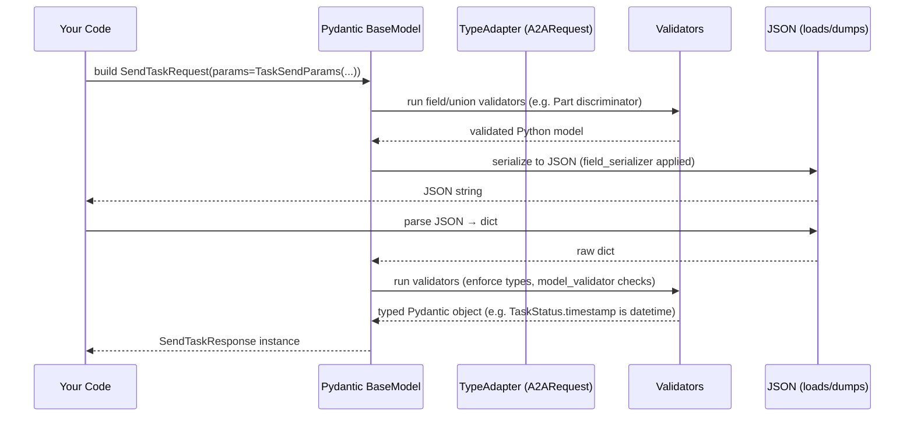

# Chapter 9: A2A JSON-RPC Data Models

In the previous chapter [Agent Metadata (AgentCard & Skills)](08_agent_metadata__agentcard___skills__.md), we saw how to describe an agent’s capabilities and skills so clients can discover them. Now we’ll dive into the **A2A JSON-RPC Data Models** in `common/types.py`, the strongly-typed Pydantic schemas that define every JSON-RPC request, response, task payload, event, artifact, message part, and error type in the A2A protocol.

## 1. Motivation & Central Use Case

Imagine two PocketFlow agents talking to each other (or a client talking to an agent) over HTTP using JSON-RPC:

1. **Client** builds a `SendTaskRequest` with a `TaskSendParams` envelope.
2. **Server** parses it into Pydantic models, routes to your `TaskManager`.
3. **TaskManager** returns a `SendTaskResponse` wrapping a `Task` with `TaskStatus`, optional `artifacts`, and `history`.
4. **Client** inspects the typed response, handles errors like `TaskNotFoundError` or `ContentTypeNotSupportedError`.

These Pydantic models are your **schema**—analogous to Protobuf or OpenAPI. They:

- Define **transport envelopes** (`JSONRPCRequest`, `JSONRPCResponse`).
- Specify **task payloads** (`TaskSendParams`, `Task`, `TaskStatus`, `Artifact`).
- Describe **message contents** with a discriminated union of `TextPart`, `FilePart`, `DataPart`.
- Enforce **validation rules** (e.g. a `FilePart` must have either `bytes` or `uri`, not both).
- Serialize fields (e.g. ISO timestamps).
- Enumerate **error types** with specific JSON-RPC `code` and `message`.

By the end of this chapter you’ll know how to:

- Use these models to build and validate requests/responses.
- Extend or customize parts of the schema.
- Understand the validation/serialization pipeline under the hood.
- Ensure interoperability and safe payload handling across languages.

---

## 2. Key Concepts

### 2.1 Transport Envelopes: JSONRPCRequest & JSONRPCResponse

Every call uses the JSON-RPC 2.0 envelope:

```python
from common.types import JSONRPCRequest, JSONRPCResponse

# Base class: includes 'jsonrpc' and 'id'
class JSONRPCMessage(BaseModel):
    jsonrpc: Literal["2.0"] = "2.0"
    id: int | str | None

class JSONRPCRequest(JSONRPCMessage):
    method: str
    params: dict[str, Any] | None

class JSONRPCResponse(JSONRPCMessage):
    result: Any | None = None
    error: JSONRPCError | None = None
```

- `id` binds requests to responses.
- `method` tells the server which RPC to invoke.
- `params` holds the typed payload.

### 2.2 Task Models

#### TaskSendParams

```python
from common.types import TaskSendParams

# Automatically generates a unique sessionId if none provided
params = TaskSendParams(
    id="user-task-123",
    message=Message(
        role="user",
        parts=[TextPart(text="Summarize this document...")]
    )
)
```

Fields:

- `id` (str): client-side task identifier.
- `sessionId` (auto uuid4 hex).
- `message`: a `Message` containing 1+ `Part` items.
- Optional: `acceptedOutputModes`, `pushNotification`, `historyLength`, `metadata`.

#### Task & TaskStatus

```python
from common.types import Task, TaskStatus

# A server-side TaskStatus
status = TaskStatus(
    state=TaskState.WORKING,
    message=Message(role="agent", parts=[TextPart(text="Working...")])
)

task = Task(
    id="user-task-123",
    status=status,
    artifacts=[/* Artifact list */],
    history=[/* Message history */]
)
```

- `TaskStatus.timestamp` is serialized to ISO via a `@field_serializer`.
- `Artifact` bundles zero or more `Part` items with metadata.

### 2.3 Message Parts & Discriminated Unions

A `Message` is:

```python
from common.types import Message, TextPart, FilePart, DataPart

text = TextPart(text="Hello world")
file = FilePart(file=FileContent(uri="s3://bucket/key.png"))
data = DataPart(data={"foo": 42})

msg = Message(role="user", parts=[text, file, data])
```

Internally:

```python
Part = Annotated[
    Union[TextPart, FilePart, DataPart],
    Field(discriminator="type")
]
```

Pydantic picks the right submodel based on the `"type"` field.

### 2.4 Error Types

All JSON-RPC errors are subclasses of `JSONRPCError` with fixed codes:

- **Standard JSON-RPC**  
  - `JSONParseError` (code ‑32700)  
  - `InvalidRequestError` (-32600)  
  - `MethodNotFoundError` (-32601)  
  - `InvalidParamsError` (-32602)  
  - `InternalError` (-32603)

- **Domain Errors**  
  - `TaskNotFoundError` (-32001)  
  - `TaskNotCancelableError` (-32002)  
  - `ContentTypeNotSupportedError` (-32005)  
  - etc.

When the server raises one of these, the A2A server wraps it into a `JSONRPCResponse.error`.

### 2.5 Pydantic Validators & Serializers

- **`@model_validator(mode="after")`** in `FileContent` enforces:
  - Exactly one of `bytes` or `uri` must be present.
- **`@field_serializer("timestamp")`** in `TaskStatus`:
  - Converts `datetime` → ISO string.

---

## 3. Using the Data Models

Let’s walk through building a `tasks/send` request, serializing to JSON, then parsing a response.

### 3.1 Constructing & Serializing a SendTaskRequest

```python
# file: examples/send_task_example.py
from common.types import (
    SendTaskRequest, TaskSendParams,
    Message, TextPart
)

# 1) Build the inner params
params = TaskSendParams(
    id="task-001",
    message=Message(
        role="user",
        parts=[TextPart(text="Translate this into French.")]
    )
)

# 2) Wrap into a JSON-RPC request
req = SendTaskRequest(params=params)

# 3) Dump to JSON string to send over HTTP
json_payload = req.model_dump_json(exclude_none=True, indent=2)
print(json_payload)
```

Expected output (pretty-printed):

```json
{
  "jsonrpc": "2.0",
  "id": "some-uuid-here",
  "method": "tasks/send",
  "params": {
    "id": "task-001",
    "sessionId": "auto-generated-hex",
    "message": {
      "role": "user",
      "parts": [
        {
          "type": "text",
          "text": "Translate this into French."
        }
      ]
    }
  }
}
```

### 3.2 Parsing & Inspecting a SendTaskResponse

```python
# file: examples/parse_response.py
from common.types import SendTaskResponse

# Simulate raw JSON from the server
raw_json = {
  "jsonrpc": "2.0",
  "id": "some-uuid-here",
  "result": {
    "id": "task-001",
    "status": {
      "state": "submitted",
      "timestamp": "2024-08-01T12:34:56.789"
    }
  }
}

# Validate + convert into a typed model
resp = SendTaskResponse.model_validate(raw_json)
print("Task ID:", resp.result.id)
print("State:", resp.result.status.state)
print("Timestamp (datetime):", type(resp.result.status.timestamp))
```

- Pydantic turns `"timestamp"` into a `datetime`.
- Access everything via typed attributes.

---

## 4. Under the Hood: Validation & Serialization Walkthrough

Here’s what happens when you call `SendTaskRequest.model_dump_json()` or `SendTaskResponse.model_validate()`:



1. **Construction**: Pydantic checks all fields, default factories run (`uuid4().hex`, `datetime.now()`).
2. **Union discrimination**: `Part` uses `Field(discriminator="type")` to pick `TextPart` vs `FilePart`.
3. **Custom validators**: `FileContent.check_content` ensures content shape.
4. **Serialization**: `field_serializer` on `timestamp` → ISO string.
5. **Deserialization**: JSON → dict → validators → final Python types.

---

## 5. Internal Implementation Snippets

Below are the most crucial excerpts from **`common/types.py`**.

### 5.1 Discriminated Union for Message Parts

```python
from pydantic import Field
from typing import Annotated, Union, Literal

class TextPart(BaseModel):
    type: Literal["text"] = "text"
    text: str

class FilePart(BaseModel):
    type: Literal["file"] = "file"
    file: FileContent

class DataPart(BaseModel):
    type: Literal["data"] = "data"
    data: dict[str, Any]

Part = Annotated[
    Union[TextPart, FilePart, DataPart],
    Field(discriminator="type")
]
```

### 5.2 FileContent Validator

```python
class FileContent(BaseModel):
    name: str | None = None
    mimeType: str | None = None
    bytes: str | None = None
    uri: str | None = None

    @model_validator(mode="after")
    def check_content(self) -> Self:
        if not (self.bytes or self.uri):
            raise ValueError("Either 'bytes' or 'uri' must be present")
        if self.bytes and self.uri:
            raise ValueError("Only one of 'bytes' or 'uri' allowed")
        return self
```

### 5.3 Timestamp Serialization

```python
class TaskStatus(BaseModel):
    state: TaskState
    timestamp: datetime = Field(default_factory=datetime.now)

    @field_serializer("timestamp")
    def serialize_dt(self, dt: datetime, _info):
        return dt.isoformat()
```

### 5.4 JSON-RPC Error Base & Subclasses

```python
class JSONRPCError(BaseModel):
    code: int
    message: str
    data: Any | None = None

class JSONParseError(JSONRPCError):
    code: int = -32700
    message: str = "Invalid JSON payload"

class TaskNotFoundError(JSONRPCError):
    code: int = -32001
    message: str = "Task not found"
```

---

## 6. Analogies & Insights

- Think of these Pydantic models as your **IDL** (Interface Definition Language), similar to `.proto` files in gRPC:
  - They compile down to Python classes with validation, default values, and serialization rules.
- The **discriminated union** for `Part` is like a tagged union in system programming (C `union` + a tag field).  
- **Validators** are your type‐safe guards—if you violate them, Pydantic raises immediately, catching malformed payloads early in the call stack.

---

## 7. Conclusion & Next Steps

You’ve now mastered the core A2A JSON-RPC Data Models:

- Envelope definitions (`JSONRPCRequest`/`Response`).  
- Task payloads and events (`TaskSendParams`, `Task`, `TaskStatus`, `Artifact`, `TaskStatusUpdateEvent`, etc.).  
- Message parts and discriminators (`TextPart`, `FilePart`, `DataPart`).  
- Error classes for every step in the JSON-RPC lifecycle.  
- Pydantic validators and serializers that enforce schema constraints.

These models are the backbone of every A2A interaction—ensuring **interoperability**, **self-documentation**, and **safe payload handling** across diverse implementations.

In the next chapter we’ll see how to implement your own task lifecycle using these models in a **TaskManager**, with both an in-memory default and a customizable subclass: [TaskManager (InMemoryTaskManager & Custom)](10_taskmanager__inmemorytaskmanager___custom__.md).

---

Generated by fork of [AI Codebase Knowledge Builder](https://github.com/vegeta03/PocketFlow-Tutorial-Codebase-Knowledge.git)
