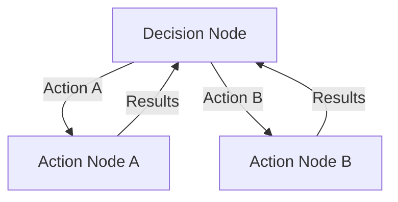
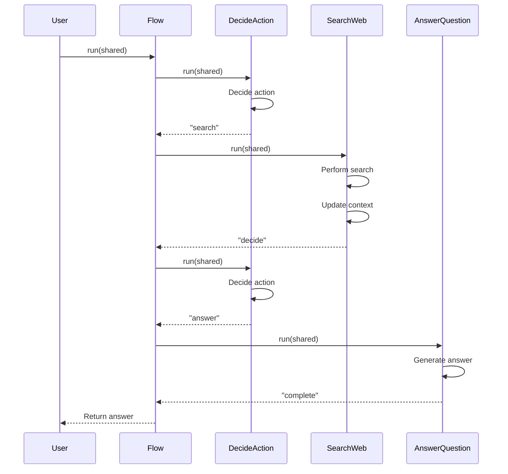
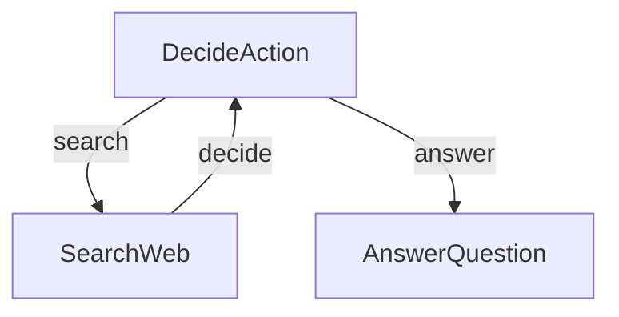
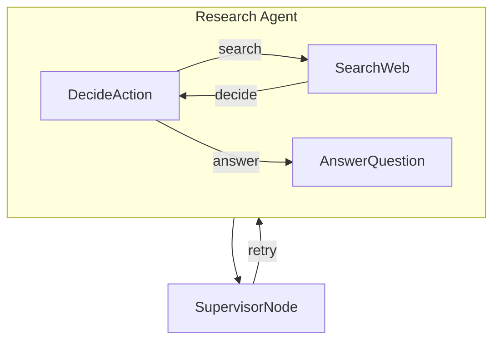

# Chapter 9: Agent Pattern

In [Chapter 8: AsyncParallelBatchNode](08_asyncparallelbatchnode_.md), we explored how to process multiple items concurrently for maximum efficiency. Now, let's discover a powerful design pattern that brings intelligence and autonomy to our workflows: the Agent Pattern.

## What is the Agent Pattern?

Imagine you have a smart robot assistant that can:
1. Look at a situation and decide what to do
2. Take action based on that decision
3. Observe the results of its action
4. Make a new decision based on what it learned

This is the essence of the Agent Pattern in PocketFlow - a way to create workflows that can make decisions, take actions, and learn from results, all in a continuous loop.

Think of it like a robot vacuum cleaner:
- It decides which room to clean next
- It moves there and starts cleaning
- It detects obstacles and dirty areas
- It adjusts its plan based on what it finds

## A Real-World Example: Research Assistant

Let's say we want to build a research assistant that can answer questions by searching the internet. For each question, it needs to:

1. Decide if it has enough information to answer or needs to search
2. Search the web if it needs more information
3. Review what it found and decide again
4. Eventually provide a comprehensive answer

This isn't a simple linear workflow - it requires decisions at each step. The Agent Pattern is perfect for this scenario!

## The Key Components of an Agent

An Agent typically consists of three main components:



1. **Decision Node**: The "brain" that decides what to do next
2. **Action Nodes**: The "hands" that carry out specific tasks
3. **Observation Loop**: The "eyes" that gather results and feed them back to the brain

Let's build a simple research agent to see how this works.

## Building a Simple Research Agent

### Step 1: Create the Decision Node

First, let's create a Node that decides whether to search or answer:

```python
from pocketflow import Node

class DecideAction(Node):
    def prep(self, shared):
        """Get the current context and question."""
        context = shared.get("context", "No previous search")
        question = shared["question"]
        return question, context
        
    def exec(self, inputs):
        """Decide whether to search or answer."""
        question, context = inputs
        
        print(f"🤔 Agent deciding what to do next...")
        
        # Simple decision logic - in a real agent, this might use an LLM
        if "who" in question.lower() and "context" not in context:
            return {"action": "search"}
        else:
            return {"action": "answer"}
    
    def post(self, shared, prep_res, exec_res):
        """Return the decided action."""
        return exec_res["action"]
```

This Node examines the question and current context, then decides whether to search for more information or answer immediately.

### Step 2: Create the Search Action Node

Now, let's create a Node that searches for information:

```python
class SearchWeb(Node):
    def prep(self, shared):
        """Get the question to search for."""
        return shared["question"]
        
    def exec(self, question):
        """Simulate searching the web."""
        print(f"🔍 Searching the web for: {question}")
        
        # In a real app, this would call a search API
        search_result = f"Found information about {question}"
        
        return search_result
    
    def post(self, shared, prep_res, exec_res):
        """Update the context with search results."""
        shared["context"] = exec_res
        print(f"📚 Updated context with search results")
        
        # Go back to the decision node
        return "decide"
```

This Node performs a web search and updates the shared context with the results.

### Step 3: Create the Answer Action Node

Next, let's create a Node that generates an answer:

```python
class AnswerQuestion(Node):
    def prep(self, shared):
        """Get the question and context."""
        return shared["question"], shared.get("context", "")
        
    def exec(self, inputs):
        """Generate an answer."""
        question, context = inputs
        
        print(f"✍️ Generating answer based on context")
        
        # In a real app, this might use an LLM
        answer = f"The answer to '{question}' is... (based on: {context})"
        
        return answer
    
    def post(self, shared, prep_res, exec_res):
        """Save the answer."""
        shared["answer"] = exec_res
        print(f"✅ Answer generated successfully")
        
        # We're done
        return "complete"
```

This Node generates an answer based on the question and accumulated context.

### Step 4: Connect Everything into an Agent

Now, let's connect these Nodes to form our research agent:

```python
from pocketflow import Flow

def create_agent_flow():
    """Create a complete research agent flow."""
    # Create instances of each node
    decide = DecideAction()
    search = SearchWeb()
    answer = AnswerQuestion()
    
    # Connect the nodes
    decide - "search" >> search
    decide - "answer" >> answer
    search - "decide" >> decide
    
    # Create and return the flow
    return Flow(start=decide)
```

This creates a workflow where:
1. The agent starts by deciding what to do
2. If it needs more information, it searches and then goes back to deciding
3. When it's ready to answer, it generates a response and completes

The key insight is that the flow can loop back to previous nodes, creating a cycle of decision and action.

### Step 5: Run the Agent

Let's run our agent with a question:

```python
# Create the agent flow
agent_flow = create_agent_flow()

# Initialize with a question
shared = {"question": "Who won the Nobel Prize in Physics in 2023?"}

# Run the agent
agent_flow.run(shared)

# Print the final answer
print("\nFinal Answer:")
print(shared["answer"])
```

When we run this code, the agent will:
1. Decide it needs to search (because the question starts with "who")
2. Search for information about Nobel Prize winners
3. Return to the decision node
4. Now with context, decide it can answer
5. Generate an answer based on the search results

## How the Agent Pattern Works Behind the Scenes

Let's understand what happens when an agent runs:



The agent pattern works because:

1. The [Flow](02_flow_.md) handles node transitions based on action strings
2. The [Shared Store](03_shared_store_.md) maintains state between nodes
3. Action strings can direct the flow back to previous nodes

This creates a self-improving loop where the agent can revisit decisions as it gathers more information.

## A More Realistic Example: LLM-Powered Research Agent

Let's look at a more realistic example from the PocketFlow cookbook - a research agent that uses an LLM to make decisions and generate answers:

```python
# Simplified from the cookbook example
class DecideAction(Node):
    def exec(self, inputs):
        question, context = inputs
        
        # Create a prompt for the LLM
        prompt = f"""
Based on this question: {question}
And this context: {context}
Should I search for more information or answer now?
"""
        
        # Call an LLM to make a decision
        response = call_llm(prompt)
        
        # Determine the action based on the response
        if "search" in response.lower():
            return {"action": "search", "search_query": "relevant search terms"}
        else:
            return {"action": "answer"}
```

This Decision Node uses a Language Model to make intelligent decisions about whether to search or answer based on the current context.

The full agent connects these nodes in the same pattern we've seen:



## Advanced Pattern: Supervised Agent

For critical applications, we might want to add a supervisor to ensure high-quality outputs:

```python
class SupervisorNode(Node):
    def prep(self, shared):
        """Get the answer to evaluate."""
        return shared.get("answer", "")
    
    def exec(self, answer):
        """Evaluate the quality of the answer."""
        print("🔍 Supervisor checking answer quality...")
        
        # In a real app, this might use an LLM
        if len(answer) < 20:
            print("❌ Answer rejected: Too short")
            return {"approved": False}
        else:
            print("✅ Answer approved: Good quality")
            return {"approved": True}
    
    def post(self, shared, prep_res, exec_res):
        """Decide whether to retry or accept."""
        if exec_res["approved"]:
            return "complete"
        else:
            # Clear the answer and try again
            shared.pop("answer", None)
            return "retry"
```

This creates a supervised agent pattern:



## Best Practices for the Agent Pattern

When implementing the Agent Pattern, consider these tips:

1. **Avoid Infinite Loops**: Add a counter to limit the number of iterations:

```python
def prep(self, shared):
    # Increment iteration counter
    iterations = shared.get("iterations", 0) + 1
    shared["iterations"] = iterations
    
    # Stop if too many iterations
    if iterations > 5:
        print("Maximum iterations reached")
        shared["force_answer"] = True
```

2. **Provide Clear Context**: Make sure each node has the information it needs to make good decisions.

3. **Add Observability**: Include logging so you can see what's happening in each step.

4. **Handle Errors Gracefully**: Ensure that errors in one node don't crash the entire agent.

## Conclusion

The Agent Pattern is a powerful way to create intelligent, autonomous workflows in PocketFlow. By combining a Decision Node with Action Nodes in a self-improving loop, you can build systems that can analyze situations, make decisions, and learn from results - just like a human assistant would.

This pattern is particularly useful for:
- Research assistants that search for information
- Customer service bots that troubleshoot problems
- Workflow automations that require decision-making
- Any system that needs to adapt based on intermediate results

In the next chapter, we'll explore another powerful pattern: the [RAG Pattern](10_rag_pattern_.md), which combines retrieval with generation to create knowledge-enhanced applications.

---

Generated by [AI Codebase Knowledge Builder](https://github.com/The-Pocket/Tutorial-Codebase-Knowledge)