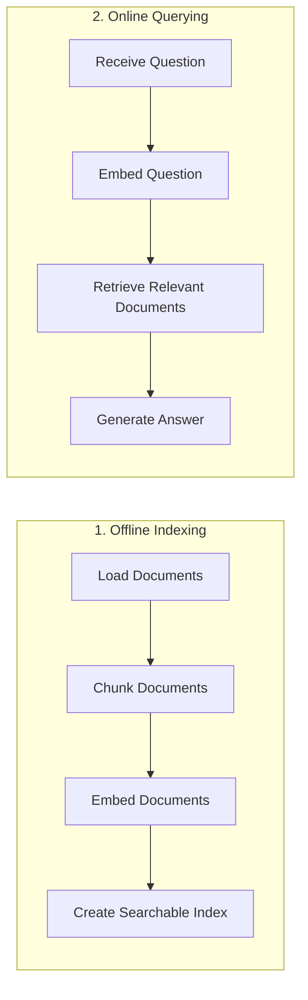
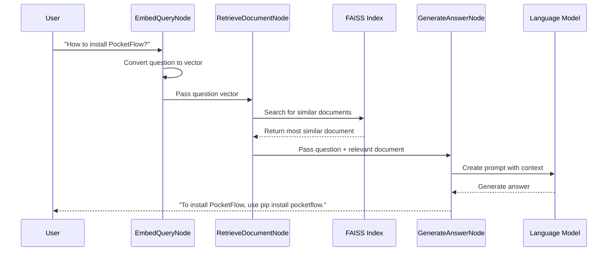

# Chapter 10: RAG Pattern

In [Chapter 9: Agent Pattern](09_agent_pattern_.md), we learned how to create intelligent autonomous workflows that can make decisions and take actions. Now, let's explore another powerful pattern that enhances AI systems with external knowledge: the RAG Pattern.

## What is the RAG Pattern?

Imagine you're asking a friend a difficult question. There are two ways they might answer:
1. From memory alone (which might be incomplete or incorrect)
2. By first checking references, then combining that information with their expertise

The second approach is almost always better, right? This is exactly what **Retrieval-Augmented Generation (RAG)** does for AI systems!

RAG is like giving your AI system a library card and teaching it how to:
1. Break down documents into manageable chunks
2. Convert those chunks into a searchable format
3. Find the most relevant information when asked a question
4. Generate a comprehensive answer based on that information

## Why Use RAG?

Traditional AI models are limited to what they learned during training. This creates several problems:
- They might have outdated information
- They can't access specialized knowledge
- They might "hallucinate" facts when uncertain

RAG solves these problems by connecting AI to external knowledge sources, allowing it to:
- Access up-to-date information
- Retrieve specialized domain knowledge
- Ground its responses in actual documents
- Cite sources for greater transparency

## Building a Simple RAG System

Let's build a simple RAG system that can answer questions about fictional technologies, historical events, and other specialized knowledge. We'll break this down into two main phases:



### Phase 1: Preparing Our Knowledge Base

The first step is to process our documents and create a searchable index. Let's walk through this step by step.

#### Step 1: Chunk Documents

Large documents need to be broken into smaller chunks for effective retrieval. Let's create a Node to do this:

```python
from pocketflow import BatchNode

class ChunkDocumentsNode(BatchNode):
    def prep(self, shared):
        """Read texts from shared store"""
        return shared["texts"]
    
    def exec(self, text):
        """Chunk a single text into smaller pieces"""
        return fixed_size_chunk(text)
    
    def post(self, shared, prep_res, exec_res_list):
        """Store chunked texts in the shared store"""
        # Flatten the list of lists into a single list of chunks
        all_chunks = []
        for chunks in exec_res_list:
            all_chunks.extend(chunks)
        
        # Store all chunks in the shared store
        shared["texts"] = all_chunks
        
        print(f"✅ Created {len(all_chunks)} chunks from {len(prep_res)} documents")
        return "default"
```

This [BatchNode](04_batchnode_.md) processes multiple documents in one go. For each document, it:
1. Breaks it into smaller chunks using a helper function
2. Collects all chunks into a flat list
3. Updates the shared store with these chunks

#### Step 2: Convert Text to Vectors (Embedding)

Next, we need to convert our text chunks into numerical vectors that can be efficiently searched:

```python
class EmbedDocumentsNode(BatchNode):
    def prep(self, shared):
        """Read texts from shared store"""
        return shared["texts"]
    
    def exec(self, text):
        """Embed a single text"""
        return get_embedding(text)
    
    def post(self, shared, prep_res, exec_res_list):
        """Store embeddings in the shared store"""
        embeddings = np.array(exec_res_list, dtype=np.float32)
        shared["embeddings"] = embeddings
        print(f"✅ Created {len(embeddings)} document embeddings")
        return "default"
```

This Node:
1. Takes each text chunk
2. Converts it to a vector using a helper function
3. Stores all embeddings as a numerical array

Think of embeddings as translating text into a language that computers can understand and compare efficiently.

#### Step 3: Create a Searchable Index

Now we'll create a searchable index using these embeddings:

```python
class CreateIndexNode(Node):
    def prep(self, shared):
        """Get embeddings from shared store"""
        return shared["embeddings"]
    
    def exec(self, embeddings):
        """Create FAISS index and add embeddings"""
        print("🔍 Creating search index...")
        dimension = embeddings.shape[1]
        
        # Create a flat L2 index
        index = faiss.IndexFlatL2(dimension)
        
        # Add the embeddings to the index
        index.add(embeddings)
        
        return index
```

This Node:
1. Takes all our document embeddings
2. Creates a FAISS index (a library for efficient similarity search)
3. Adds the embeddings to this index

Think of this like creating a specialized library catalog that can quickly find books based on their content rather than just their title.

### Phase 2: Answering Questions with RAG

Now that we've prepared our knowledge base, let's see how we can use it to answer questions.

#### Step 1: Convert the Question to a Vector

First, we need to convert the user's question into the same vector space as our documents:

```python
class EmbedQueryNode(Node):
    def prep(self, shared):
        """Get query from shared store"""
        return shared["query"]
    
    def exec(self, query):
        """Embed the query"""
        print(f"🔍 Embedding query: {query}")
        query_embedding = get_embedding(query)
        return np.array([query_embedding], dtype=np.float32)
    
    def post(self, shared, prep_res, exec_res):
        """Store query embedding in shared store"""
        shared["query_embedding"] = exec_res
        return "default"
```

This Node:
1. Takes the user's question
2. Converts it to a vector using the same method we used for documents
3. Stores this vector in the shared store

#### Step 2: Retrieve Relevant Documents

Now we can find the most relevant document chunks based on our question:

```python
class RetrieveDocumentNode(Node):
    def prep(self, shared):
        """Get query embedding, index, and texts"""
        return shared["query_embedding"], shared["index"], shared["texts"]
    
    def exec(self, inputs):
        """Search the index for similar documents"""
        print("🔎 Searching for relevant documents...")
        query_embedding, index, texts = inputs
        
        # Search for the most similar document
        distances, indices = index.search(query_embedding, k=1)
        
        # Get the index of the most similar document
        best_idx = indices[0][0]
        distance = distances[0][0]
        
        # Get the corresponding text
        most_relevant_text = texts[best_idx]
        
        return {
            "text": most_relevant_text,
            "index": best_idx,
            "distance": distance
        }
```

This Node:
1. Takes the question vector and our document index
2. Searches for the most similar document chunk
3. Returns the most relevant text along with metadata

Think of this like asking a librarian to find the most relevant book based on your research question.

#### Step 3: Generate an Answer

Finally, we'll generate an answer that combines the retrieved information with the capabilities of an AI model:

```python
class GenerateAnswerNode(Node):
    def prep(self, shared):
        """Get query and retrieved document"""
        return shared["query"], shared["retrieved_document"]
    
    def exec(self, inputs):
        """Generate an answer using the LLM"""
        query, retrieved_doc = inputs
        
        prompt = f"""
Briefly answer the following question based on the context provided:
Question: {query}
Context: {retrieved_doc['text']}
Answer:
"""
        
        answer = call_llm(prompt)
        return answer
    
    def post(self, shared, prep_res, exec_res):
        """Store generated answer"""
        shared["generated_answer"] = exec_res
        print("\n🤖 Generated Answer:")
        print(exec_res)
        return "default"
```

This Node:
1. Takes the original question and the retrieved document
2. Creates a prompt that instructs the AI to use this context
3. Calls a language model to generate an answer
4. Saves and displays the result

## Connecting the Nodes into Flows

Now let's connect our Nodes into two separate flows - one for offline document indexing and one for online querying:

```python
from pocketflow import Flow

def get_offline_flow():
    # Create offline flow for document indexing
    chunk_docs_node = ChunkDocumentsNode()
    embed_docs_node = EmbedDocumentsNode()
    create_index_node = CreateIndexNode()
    
    # Connect the nodes
    chunk_docs_node >> embed_docs_node >> create_index_node
    
    return Flow(start=chunk_docs_node)

def get_online_flow():
    # Create online flow for document retrieval and answer generation
    embed_query_node = EmbedQueryNode()
    retrieve_doc_node = RetrieveDocumentNode()
    generate_answer_node = GenerateAnswerNode()
    
    # Connect the nodes
    embed_query_node >> retrieve_doc_node >> generate_answer_node
    
    return Flow(start=embed_query_node)
```

This code creates two separate [Flow](02_flow_.md)s:
1. An offline flow that processes documents and creates an index
2. An online flow that takes questions and generates answers

## Running the RAG System

Let's see how to run our RAG system with some sample documents:

```python
def run_rag_demo():
    # Sample texts (simplified for this example)
    texts = [
        """Pocket Flow is a 100-line minimalist LLM framework.
        To install, pip install pocketflow or just copy the source code.""",
        
        """Q-Mesh is QuantumLeap's data protocol.
        Utilizes graph consensus for 500,000 transactions per second."""
    ]
    
    # Shared store for both flows
    shared = {
        "texts": texts,
        "query": "How to install PocketFlow?"
    }
    
    # Run the offline flow (document indexing)
    offline_flow = get_offline_flow()
    offline_flow.run(shared)
    
    # Run the online flow (answering the question)
    online_flow = get_online_flow()
    online_flow.run(shared)
    
    # The answer is now in shared["generated_answer"]
    print(f"Final answer: {shared['generated_answer']}")
```

When we run this code, it will:
1. Process our sample documents and create an index
2. Take the question "How to install PocketFlow?"
3. Find the most relevant document (the first one)
4. Generate an answer based on that document

## How RAG Works Behind the Scenes

Let's see what happens when a RAG system processes a question:



The key insight is that the RAG pattern enhances AI responses by:
1. Finding relevant information from a knowledge base
2. Providing that information as context to the AI
3. Having the AI generate an answer based on this enhanced context

## Advanced RAG Techniques

The basic RAG system we've built can be enhanced in many ways:

### 1. Multiple Document Retrieval

Instead of retrieving just one document, we can retrieve multiple relevant documents:

```python
# Search for the top-k most similar documents
distances, indices = index.search(query_embedding, k=3)

# Get the corresponding texts
relevant_texts = [texts[idx] for idx in indices[0]]

# Combine all relevant texts
combined_context = "\n\n".join(relevant_texts)
```

### 2. Relevance Filtering

We can filter out documents that aren't relevant enough:

```python
# Only include documents if they're similar enough
relevant_texts = []
for i, idx in enumerate(indices[0]):
    if distances[0][i] < 0.75:  # Threshold for relevance
        relevant_texts.append(texts[idx])
```

### 3. Hybrid Search

We can combine vector search with keyword search for better results:

```python
# First get results from vector search
vector_results = get_vector_search_results(query)

# Also get results from keyword search
keyword_results = get_keyword_search_results(query)

# Combine and de-duplicate results
combined_results = combine_and_rank(vector_results, keyword_results)
```

## Conclusion

The RAG Pattern is a powerful approach that enhances AI systems by providing them with relevant information from a knowledge base. It's like giving your AI access to a specialized library that it can reference when answering questions.

By following the pattern of chunking documents, embedding text, retrieving relevant information, and generating enhanced responses, you can create AI systems that provide more accurate, up-to-date, and trustworthy answers.

RAG is particularly useful for:
- Building question-answering systems with specialized knowledge
- Creating virtual assistants that can access documentation
- Developing research tools that can analyze large document collections
- Building chatbots that can reference company-specific information

As you continue your journey with PocketFlow, consider combining the [RAG Pattern](10_rag_pattern_.md) with the [Agent Pattern](09_agent_pattern_.md) to create even more powerful systems that not only access external knowledge but also make autonomous decisions based on that knowledge.

---

Generated by [AI Codebase Knowledge Builder](https://github.com/The-Pocket/Tutorial-Codebase-Knowledge)