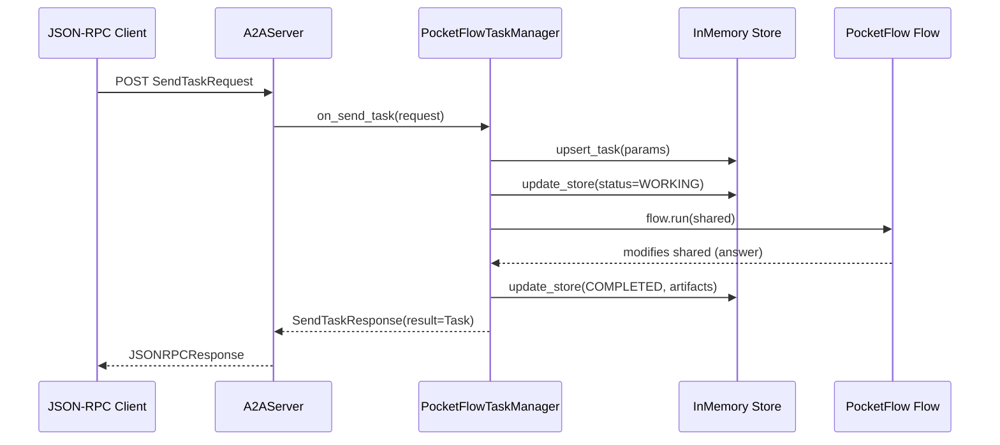

# Chapter 10: TaskManager (InMemoryTaskManager & Custom)

In [A2A JSON-RPC Data Models](09_a2a_json_rpc_data_models_.md) we defined every request, response, task and error schema for A2A. Now we need a runtime component to **store**, **update**, **query**, **cancel**, and even **stream** task events. That’s the role of the **TaskManager** abstraction.  

In this chapter you’ll learn:

1. Why TaskManager cleanly decouples JSON-RPC plumbing from application logic.  
2. How `InMemoryTaskManager` provides a thread-safe, dict-backed default store with history and SSE-subscriber queues.  
3. How to subclass it (e.g., `PocketFlowTaskManager`) to run your `Flow`, extract results, and package them into A2A `Artifacts`.  
4. Internal workflows and code snippets to guide your own custom implementations.

---

## 1. Motivation & Central Use Case

Imagine you’ve built a PocketFlow pipeline that answers user questions by chaining:

1. **Search** a document corpus.  
2. **Summarize** top hits with an LLM.  
3. **Compose** a final response.

You want to expose it over A2A:

- Clients call `tasks/send` with a `TaskSendParams`.  
- Your server must record the task, mark it **SUBMITTED**, then **WORKING**, then **COMPLETED** (or **FAILED**).  
- Clients poll via `tasks/get` or subscribe via `tasks/sendSubscribe` to get streaming updates.  
- You may also support `tasks/cancel`.

All JSON-RPC routing and HTTP in the A2AServer is generic. The **TaskManager** is your hook for **application logic**. You implement methods like `on_send_task`, `on_get_task`, `on_cancel_task`, and (optionally) streaming and push-notification handlers.  

By the end of this chapter, you’ll have a working in-memory task store and a custom `PocketFlowTaskManager` that runs your domain-specific `Flow`, updates task state and history, and ships back final results as A2A `Artifact`s.

---

## 2. Key Concepts

### 2.1 TaskManager Abstraction

`TaskManager` is an abstract base class defining all JSON-RPC methods your A2AServer can call:

- on_send_task / on_send_task_subscribe  
- on_get_task / on_cancel_task  
- on_set_task_push_notification / on_get_task_push_notification  
- on_resubscribe_to_task  

Each method receives a typed request (e.g. `SendTaskRequest`) and returns a typed response (e.g. `SendTaskResponse`) or an `AsyncIterable` of streaming responses.

### 2.2 InMemoryTaskManager

A concrete `TaskManager` storing tasks in a simple Python `dict`:

- **tasks**: `dict[str, Task]`  
- **push_notification_infos**: `dict[str, PushNotificationConfig]`  
- **Locks** (`asyncio.Lock`) for thread safety.  
- **SSE subscriber queues**: per-task `asyncio.Queue` lists for streaming updates.  

It implements:

- `on_get_task`: return the stored `Task`, optionally trimming history.  
- `on_cancel_task`: stub that always returns `TaskNotCancelableError`.  
- `upsert_task`: insert or append history on first send.  
- `update_store`: change `status`, append `history`, merge `artifacts`.  
- SSE helpers: `setup_sse_consumer`, `enqueue_events_for_sse`, `dequeue_events_for_sse`.

### 2.3 Custom TaskManager (PocketFlowTaskManager)

You subclass `InMemoryTaskManager` to:

1. **Validate** input/output content types.  
2. **Upsert** the task (mark `SUBMITTED`) then update status to `WORKING`.  
3. **Run** your PocketFlow logic (synchronously or in a thread pool).  
4. **Capture** final outputs from the Flow’s shared state.  
5. **Package** them as A2A `Artifact`s and update status to `COMPLETED`.  
6. **Handle** failures by updating status to `FAILED` with an error message.  

This cleanly decouples **protocol** (TaskManager methods) from **application** (Flow execution).

---

## 3. Example: Custom PocketFlowTaskManager

Below is the core of a `PocketFlowTaskManager` that runs a synchronous Flow under `on_send_task`. We split it into digestible pieces.

```python
# pocketflow_a2a_agent/task_manager.py

class PocketFlowTaskManager(InMemoryTaskManager):
    SUPPORTED_CONTENT_TYPES = ["text", "text/plain"]

    async def on_send_task(self, request: SendTaskRequest) -> SendTaskResponse:
        task_id = request.params.id
        logger.info(f"Received task: {task_id}")

        # 1. Validate accepted output modes
        if not are_modalities_compatible(
            request.params.acceptedOutputModes,
            self.SUPPORTED_CONTENT_TYPES
        ):
            return SendTaskResponse(
                id=request.id,
                error=new_incompatible_types_error(request.id).error
            )

        # 2. Create or update the Task record
        await self.upsert_task(request.params)
        # 3. Mark as WORKING
        await self.update_store(
            task_id,
            TaskStatus(state=TaskState.WORKING),
            artifacts=[]
        )

        # 4. Extract user query from the message parts
        query = self._get_user_query(request.params)
        if not query:
            fail = TaskStatus(
                state=TaskState.FAILED,
                message=Message(role="agent", parts=[
                    TextPart(text="No text query found")
                ])
            )
            await self.update_store(task_id, fail, [])
            return SendTaskResponse(
                id=request.id,
                error=InvalidParamsError(message="Missing text part")
            )

        # 5. Run your PocketFlow
        shared = {"question": query}
        flow = create_agent_flow()
        try:
            flow.run(shared)  # modifies shared in place
            answer = shared.get("answer", "")
            # 6. Package final result
            final_status = TaskStatus(state=TaskState.COMPLETED)
            artifact = Artifact(parts=[TextPart(text=answer)])
            updated = await self.update_store(task_id, final_status, [artifact])
            result_task = self.append_task_history(updated, request.params.historyLength)
            return SendTaskResponse(id=request.id, result=result_task)

        except Exception as exc:
            logger.error(f"Flow error: {exc}", exc_info=True)
            fail = TaskStatus(
                state=TaskState.FAILED,
                message=Message(role="agent", parts=[
                    TextPart(text=str(exc))
                ])
            )
            await self.update_store(task_id, fail, [])
            return SendTaskResponse(id=request.id, error=InternalError(message=str(exc)))

    async def on_send_task_subscribe(self, request: SendTaskStreamingRequest):
        # Streaming not supported by this agent
        return JSONRPCResponse(
            id=request.id,
            error=UnsupportedOperationError(message="Streaming not implemented")
        )

    def _get_user_query(self, params: TaskSendParams) -> str | None:
        for part in params.message.parts:
            if getattr(part, "type", None) == "text":
                return getattr(part, "text", None)
        return None
```

Explanation:

- We **upsert** the task to ensure a record exists even if execution fails.
- `update_store` handles atomic status updates, history, and artifact lists.
- Any exception during `flow.run` is caught, marking the task **FAILED**.
- Custom logic lives here; all JSON-RPC plumbing (ID, transport, error mapping) is handled by the server and Pydantic models.

---

## 4. Internal Implementation Walkthrough

### 4.1 Sequence Diagram: `on_send_task`



1. **upsert_task**: create or append history.  
2. **update_store** (WORKING): save intermediate status.  
3. **flow.run**: application logic.  
4. **update_store** (COMPLETED + artifacts): final state.  
5. Response flows back to the client.

### 4.2 Core Code: InMemoryTaskManager

Below are the most important pieces of `common/server/task_manager.py`.

```python
class InMemoryTaskManager(TaskManager):
    def __init__(self):
        self.tasks: dict[str, Task] = {}
        self.lock = asyncio.Lock()
        # SSE subscriber queues per task
        self.task_sse_subscribers: dict[str, list[asyncio.Queue]] = {}
        self.subscriber_lock = asyncio.Lock()

    async def on_get_task(self, request: GetTaskRequest) -> GetTaskResponse:
        async with self.lock:
            task = self.tasks.get(request.params.id)
            if not task:
                return GetTaskResponse(id=request.id, error=TaskNotFoundError())
            # Trim historyLength if provided
            result = self.append_task_history(task, request.params.historyLength)
        return GetTaskResponse(id=request.id, result=result)

    async def upsert_task(self, params: TaskSendParams) -> Task:
        async with self.lock:
            task = self.tasks.get(params.id)
            if not task:
                task = Task(
                    id=params.id,
                    sessionId=params.sessionId,
                    messages=[params.message],
                    status=TaskStatus(state=TaskState.SUBMITTED),
                    history=[params.message],
                )
                self.tasks[params.id] = task
            else:
                task.history.append(params.message)
            return task

    async def update_store(
        self, task_id: str,
        status: TaskStatus,
        artifacts: list[Artifact]
    ) -> Task:
        async with self.lock:
            task = self.tasks[task_id]
            task.status = status
            if status.message:
                task.history.append(status.message)
            if artifacts:
                task.artifacts = (task.artifacts or []) + artifacts
            return task

    def append_task_history(self, task: Task, length: int | None) -> Task:
        copy = task.model_copy()
        if length and length > 0:
            copy.history = copy.history[-length:]
        else:
            copy.history = []
        return copy
```

#### SSE Subscriber Management

```python
    async def setup_sse_consumer(self, task_id: str) -> asyncio.Queue:
        async with self.subscriber_lock:
            q = asyncio.Queue()
            self.task_sse_subscribers.setdefault(task_id, []).append(q)
            return q

    async def enqueue_events_for_sse(self, task_id: str, event):
        async with self.subscriber_lock:
            for q in self.task_sse_subscribers.get(task_id, []):
                await q.put(event)

    async def dequeue_events_for_sse(
        self, request_id, task_id, queue: asyncio.Queue
    ) -> AsyncIterable[SendTaskStreamingResponse]:
        try:
            while True:
                ev = await queue.get()
                yield SendTaskStreamingResponse(id=request_id, result=ev)
                if getattr(ev, "final", False):
                    break
        finally:
            # Clean up queue
            async with self.subscriber_lock:
                self.task_sse_subscribers.get(task_id, []).remove(queue)
```

- `setup_sse_consumer` registers a new queue per subscriber.  
- `enqueue_events_for_sse` fans out updates to all subscribers.  
- `dequeue_events_for_sse` yields streaming responses until a final event.

### 4.3 Core Code: PocketFlowTaskManager Helpers

```python
def _get_user_query(self, params: TaskSendParams) -> str | None:
    for part in params.message.parts:
        if part.type == "text":
            return part.text
    return None
```

- A small utility to extract the user’s text input from the A2A `Message`.

---

## 5. Analogies & Insights

- **Job Scheduler**:  
  - **TaskManager** = scheduler interface (enqueue, status, cancel).  
  - **InMemoryTaskManager** = single-node, in-memory queue with locks.  
  - **PocketFlowTaskManager** = job runner that dequeues tasks, runs a domain workflow, and marks completion.

- **Observer Pattern**:  
  - SSE subscriber queues are like observers listening for state transitions.  
  - `enqueue_events_for_sse` notifies all subscribers when task state changes.

- **Database vs. In-Memory**:  
  - Swap out `InMemoryTaskManager` for a DB-backed version by reimplementing the same interface, without touching the JSON-RPC server or your Flow code.

---

## 6. Conclusion

In this chapter you’ve learned how to:

- Use the **TaskManager** interface to hook application logic into the A2A server.  
- Leverage **InMemoryTaskManager** for a thread-safe, dict-backed store with history and SSE subscriber support.  
- Build a custom **PocketFlowTaskManager** that runs your Flow, packages results into **Artifacts**, and updates task state end-to-end.  
- Understand the internal flow of `on_send_task`, from upsert to working → completed, and how streaming subscribers are managed.

With this foundation, you can implement database-backed stores, push notifications, resubscription logic, or any advanced domain semantics, all while keeping transport and protocol details encapsulated.  

Happy coding!

---

Generated by fork of [AI Codebase Knowledge Builder](https://github.com/vegeta03/PocketFlow-Tutorial-Codebase-Knowledge.git)
