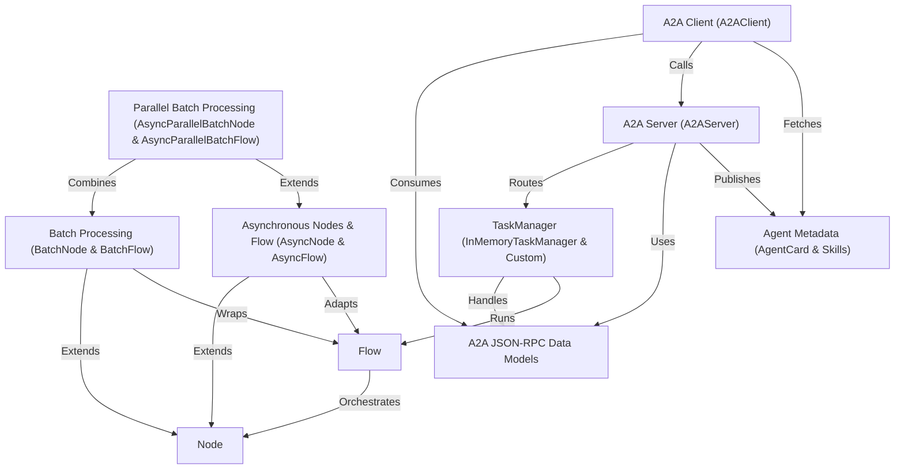

# Tutorial: PocketFlow

PocketFlow is a **dataflow**-oriented framework that models computation as interconnected *Nodes* and *Flows*, enabling easy composition of sequential, *batch*, *asynchronous*, and *parallel* pipelines.  
It also provides a standardized A2A JSON-RPC layer with **strongly-typed Pydantic models**, an ASGI **server** (A2AServer), a pluggable **TaskManager**, and an **async client** for remote agent invocation.  
Agent discovery and capability negotiation are driven by **AgentCard** metadata, making PocketFlow a versatile toolkit for building and wrapping AI or I/O workflows in distributed settings.

**Source Repository:** [https://github.com/The-Pocket/PocketFlow](https://github.com/The-Pocket/PocketFlow)

## Chapters

1. [Node](01_node_.md)
2. [Flow](02_flow_.md)
3. [Batch Processing (BatchNode & BatchFlow)](03_batch_processing__batchnode___batchflow__.md)
4. [Asynchronous Nodes & Flow (AsyncNode & AsyncFlow)](04_asynchronous_nodes___flow__asyncnode___asyncflow__.md)
5. [Parallel Batch Processing (AsyncParallelBatchNode & AsyncParallelBatchFlow)](05_parallel_batch_processing__asyncparallelbatchnode___asyncparallelbatchflow__.md)
6. [A2A Server (A2AServer)](06_a2a_server__a2aserver__.md)
7. [A2A Client (A2AClient)](07_a2a_client__a2aclient__.md)
8. [Agent Metadata (AgentCard & Skills)](08_agent_metadata__agentcard___skills__.md)
9. [A2A JSON-RPC Data Models](09_a2a_json_rpc_data_models_.md)
10. [TaskManager (InMemoryTaskManager & Custom)](10_taskmanager__inmemorytaskmanager___custom__.md)

---

Generated by fork of [AI Codebase Knowledge Builder](https://github.com/vegeta03/PocketFlow-Tutorial-Codebase-Knowledge.git)
