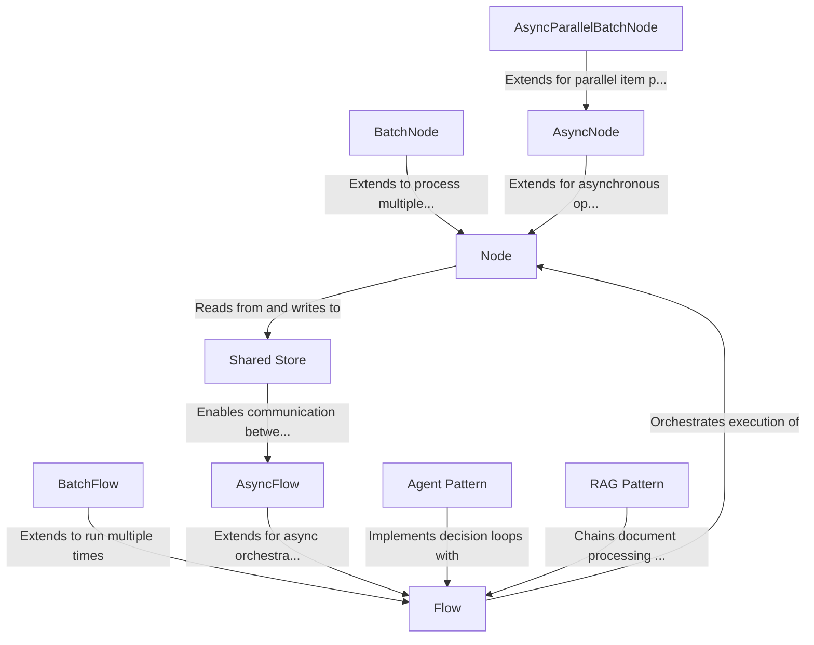

# Tutorial: PocketFlow

**PocketFlow** is a minimalist framework (only 100 lines of code!) for building **AI workflows and applications**. It provides a simple yet powerful way to construct processing pipelines by connecting **Node** components together in a **Flow**. The framework supports various patterns like *batch processing*, *asynchronous operations*, and *parallel execution*, making it ideal for creating complex AI agents, retrieval-augmented generation systems, and other LLM applications with minimal code.

**Source Repository:** [https://github.com/The-Pocket/PocketFlow](https://github.com/The-Pocket/PocketFlow)

## Chapters

1. [Node
](01_node_.md)
2. [Flow
](02_flow_.md)
3. [Shared Store
](03_shared_store_.md)
4. [BatchNode
](04_batchnode_.md)
5. [BatchFlow
](05_batchflow_.md)
6. [AsyncNode
](06_asyncnode_.md)
7. [AsyncFlow
](07_asyncflow_.md)
8. [AsyncParallelBatchNode
](08_asyncparallelbatchnode_.md)
9. [Agent Pattern
](09_agent_pattern_.md)
10. [RAG Pattern
](10_rag_pattern_.md)

---

Generated by [AI Codebase Knowledge Builder](https://github.com/The-Pocket/Tutorial-Codebase-Knowledge)