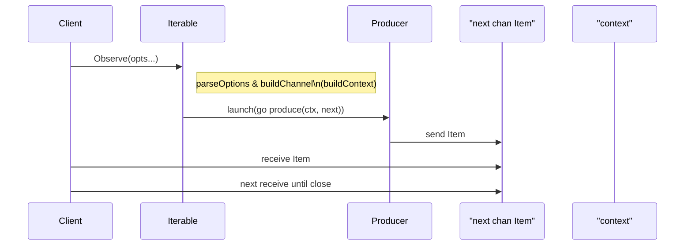

# Chapter 1: Iterable

The **Iterable** abstraction is the foundation of RxGo’s synchronous, pull-based data pipelines. It encapsulates the classic iterator pattern—clients call `Observe()` to pull items one at a time, while the `Iterable` itself knows how to yield items from some underlying source (a channel, a slice, a function, etc.). Think of it like paging through a magazine: you only turn to the next page when you ask for it, never loading the entire publication into memory.

---

## 1. Motivation & Central Use Case

Imagine you need to process a very large log file line by line, apply filters, transformations, and aggregate results. Loading the entire file into memory is neither feasible nor efficient. Instead, you want a pull-based sequence:

1. Open the file.
2. Read one line on demand.
3. Transform or filter that line.
4. Optionally pass it downstream to further operators.

The **Iterable** abstraction lets you compose these steps without buffering the whole file. You can chain operators like `Map`, `Filter`, or `Reduce` (covered in later chapters) while still only ever holding the current item in memory.

**Key benefits**:

- Low memory footprint (no full-buffering).
- Lazy evaluation (nothing executes until you call `Observe()`).
- Composability (build complex pipelines by chaining operators).

---

## 2. Key Concepts

1. **Pull-Based Sequence**  
   The consumer drives data retrieval by calling `Observe()`, receiving a Go channel of `Item`.  

2. **Synchronous Traversal**  
   Items are produced on-demand and delivered over a channel in the same goroutine (unless you connect it to run producers concurrently).  

3. **Cold vs. Hot / Connectable**  
   By default, each call to `Observe()` on a *cold* (non-connectable) `Iterable` returns a fresh sequence. Connectable iterables (via options) share a single producer across subscribers.  

4. **Separation of Concerns**  
   - **Producer** knows how to generate items.  
   - **Iterable** holds the producer and a set of subscribers.  
   - **Subscriber** consumes items from the returned channel.  

---

## 3. Getting Started: A Simple Range

Let’s create a simple range of integers from 1 to 5.

```go
package main

import (
  "fmt"
  "github.com/reactivex/rxgo/v2"
)

func main() {
  // newRangeIterable implements Iterable
  it := rxgo.Range(1, 5) 

  // Observe returns a channel of Items
  ch := it.Observe()
  
  for item := range ch {
    fmt.Println(item.V)  // prints 1,2,3,4,5
  }
}
```

Explanation:

- `rxgo.Range(1,5)` returns an `Iterable` that will generate integers 1 through 5.
- `Observe()` builds the internal channel and launches a goroutine to send values.
- We range-over the channel; when the producer is done, the channel closes automatically.

---

## 4. Building Iterables: Factory Functions

Most iterables in RxGo are created via helper constructors:

- `Just(...)` yields a fixed list of items.
- `Range(start, count)` yields a sequence of integers.
- `FromSlice([]Item)` yields items from an existing slice.
- `Create(producers...)` lets you feed a series of `Producer` functions.
- `Defer(producers...)` delays producer invocation until `Observe()`.

```go
// Just example
justIt := rxgo.Just("apple", "banana", "cherry")
justCh := justIt.Observe()
for it := range justCh {
  fmt.Println(it.V)  
}

// FromSlice example
sliceIt := rxgo.FromSlice([]rxgo.Item{
  rxgo.Of(10), rxgo.Of(20),
})
for it := range sliceIt.Observe() { 
  fmt.Println(it.V)  // 10, 20
}
```

---

## 5. Pull-Based Mechanics: What Happens Under the Hood

When you call `it.Observe(opts...)`:

1. **Option Parsing**  
   RxGo merges constructor and user-provided `Option`s.
2. **Channel Allocation**  
   A new delivery channel is built: `next := option.buildChannel()`.
3. **Context Setup**  
   A `context.Context` is created: `ctx := option.buildContext(...)`.
4. **Producer Launch**  
   A goroutine is started to feed `next` with items (depending on the iterable type).
5. **Return to Caller**  
   You receive `next` and start reading items one by one.

### Sequence Diagram



---

## 6. Dive Deeper: `channelIterable` Implementation

File: **iterable_channel.go**

```go
type channelIterable struct {
  next                   <-chan Item
  opts                   []Option
  subscribers            []chan Item
  mutex                  sync.RWMutex
  producerAlreadyCreated bool
}

func newChannelIterable(next <-chan Item, opts ...Option) Iterable {
  return &channelIterable{ next: next, opts: opts }
}

func (i *channelIterable) Observe(opts ...Option) <-chan Item {
  merged := append(i.opts, opts...)
  option := parseOptions(merged...)

  if !option.isConnectable() {
    // Cold iterable: just return the raw next channel
    return i.next
  }

  if option.isConnectOperation() {
    // Kick off the shared producer
    i.connect(option.buildContext(emptyContext))
    return nil
  }

  // Subscribe to a hot iterable
  ch := option.buildChannel()
  i.mutex.Lock()
    i.subscribers = append(i.subscribers, ch)
  i.mutex.Unlock()
  return ch
}

func (i *channelIterable) connect(ctx context.Context) {
  i.mutex.Lock()
  if !i.producerAlreadyCreated {
    go i.produce(ctx)
    i.producerAlreadyCreated = true
  }
  i.mutex.Unlock()
}

func (i *channelIterable) produce(ctx context.Context) {
  defer func() {
    // Close all subscriber channels when done
    i.mutex.RLock()
    for _, s := range i.subscribers {
      close(s)
    }
    i.mutex.RUnlock()
  }()
  for {
    select {
    case <-ctx.Done():
      return
    case item, ok := <-i.next:
      if !ok {
        return
      }
      // Fan-out to all subscribers
      i.mutex.RLock()
      for _, s := range i.subscribers {
        s <- item
      }
      i.mutex.RUnlock()
    }
  }
}
```

Explanation:

- **`Observe`**: decides if we’re cold (one channel) or hot (multiple subscribers).
- **`connect`**: lazily starts a single shared producer for hot observables.
- **`produce`**: reads from the original `next` channel and fans out to each subscriber, honoring cancellation.

---

## 7. Real-World Analogy

> You have a **publisher** (producer of magazine pages) and **readers** (subscribers).  
>
> - Cold: Each reader gets their own copy; the publisher reprints pages on demand.  
> - Hot/Connectable: All readers share one physical copy; once you “connect,” pages start being printed and every reader sees the same pages in real time.

---

## 8. Summary

In this chapter, we learned:

- What an **Iterable** is: a pull-based, synchronous sequence abstraction.
- How to construct basic iterables (`Just`, `Range`, `FromSlice`, etc.).
- The lifecycle of `Observe()`: option parsing, channel creation, context building, producer launch.
- Internal mechanics via the `channelIterable` type.
- Real-world analogies for cold vs. hot sequences.

Next, we’ll build on **Iterable** to introduce an **asynchronous**, push-based abstraction: the [Observable](02_observable.md). Enjoy exploring how RxGo takes the pull-based world and turns it on its head!

---

Generated by fork of [AI Codebase Knowledge Builder](https://github.com/vegeta03/PocketFlow-Tutorial-Codebase-Knowledge.git)
