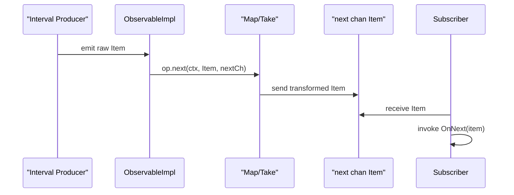

# Chapter 2: Observable

Building on our pull-based pipelines in [Chapter 1: Iterable](01_iterable.md), we now flip the model on its head. Whereas an `Iterable` lets you pull items on demand, an `Observable` lets data producers push items to you asynchronously. Welcome to the world of reactive, event-driven streams.

---

## 1. Motivation & Central Use Case

Imagine you’re building a real-time monitoring dashboard for a fleet of IoT sensors. Each sensor emits a temperature reading every second. You want to:

1. **Debounce** bursty updates (ignore rapid fluctuations).  
2. **Filter** out readings below a safety threshold.  
3. **Buffer** five readings at a time to compute a rolling average.  
4. **Merge** streams from multiple sensors.  
5. **Alert** when the average crosses a critical value.  

A pull-based approach forces you to poll each sensor channel continuously. Instead, with an `Observable`, each sensor “pushes” readings, you compose operators declaratively, and downstream subscribers react only when events arrive.

---

## 2. Key Concepts

1. **Push-based Sequence**  
   Producers emit `OnNext(item)` events whenever data is ready. Consumers register callbacks—`OnNext`, `OnError`, `OnComplete`—to handle those events.  

2. **Observer Pattern**  
   An `Observable` maintains a list of subscribers (Observers). It invokes:
   - `OnNext` for normal items  
   - `OnError` if something goes wrong  
   - `OnComplete` when the sequence ends  

3. **Cold vs. Hot**  
   - *Cold Observables* start their own producer for each subscription (e.g., calling `Observe()` twice spins two timers).  
   - *Hot Observables* share one producer across all subscribers (e.g., a live socket feed).  

4. **Connectable Observables**  
   A cold Observable can be “turned hot” by creating a *connectable* Observable (often via a `Publish()` operator or `WithConnect()` option) and then calling `.Connect(ctx)`.  

5. **Composable Operators**  
   You can chain transformations—`Map`, `Filter`, `Debounce`, `BufferWithCount`, `Merge`, `FlatMap`, …—to build sophisticated pipelines.  

6. **Concurrency & Back-Pressure**  
   Under the hood, RxGo can run operators in parallel or sequentially, buffer events, and propagate cancellation via `context.Context`.

---

## 3. Getting Started: A Simple Timer

Let’s build a simple program that:

- Emits a tick every 500 ms (cold by default).  
- Takes 5 ticks.  
- Maps each tick to an integer.  
- Prints each tick.

```go
package main

import (
  "context"
  "fmt"
  "time"

  "github.com/reactivex/rxgo/v2"
)

func main() {
  // 1. Create a cold Observable that emits increasing integers every 500ms
  ticker := rxgo.Interval(500 * time.Millisecond)

  // 2. Apply operators
  //    - Take only the first 5 ticks
  //    - Map each tick to its integer value
  sequence := ticker.
    Take(5).
    Map(func(_ context.Context, i interface{}) (interface{}, error) {
      return i.(int), nil
    })

  // 3. Subscribe with callbacks
  done := sequence.ForEach(
    func(item interface{}) {            // OnNext
      fmt.Println("Tick:", item.(int)) // prints Tick: 0, Tick: 1, …
    },
    func(err error) {                   // OnError
      fmt.Println("Error:", err)
    },
    func() {                            // OnComplete
      fmt.Println("Sequence complete.")
    },
  )

  // Block until complete
  <-done
}
```

Explanation:

1. **`Interval(d)`** returns an `Observable` that pushes 0,1,2,… every `d`.  
2. **`Take(5)`** stops after 5 items (`OnComplete` is signaled).  
3. **`Map`** transforms each `interface{}` into an `int`.  
4. **`ForEach`** hooks your callbacks and returns a `Disposed` channel you can await.

---

## 4. Diving Deeper: How an Observable Works

### 4.1 Sequence Diagram (Sequential Mode)



1. **Producer** (timer, channel, API) pushes Items into the operator chain.  
2. **ObservableImpl** wires up channels, contexts, and error strategies.  
3. **Operators** (created via `operatorFactory`) receive each Item and decide to forward, transform, or stop.  
4. Items flow into **`nextCh`**, from which your subscriber reads.

### 4.2 Under the Hood: `runSequential`

In **`observable.go`**, cold/sequential Observables use `runSequential`:

```go
func runSequential(
  ctx context.Context,
  next chan Item,
  src Iterable,
  operatorFactory func() operator,
  option Option, opts ...Option,
) {
  observe := src.Observe(opts...)
  go func() {
    op := operatorFactory()
    for {
      select {
      case <-ctx.Done():
        break
      case item, ok := <-observe:
        if !ok {
          break
        }
        if item.Error() {
          op.err(ctx, item, next, operatorOptions)
        } else {
          op.next(ctx, item, next, operatorOptions)
        }
      }
    }
    op.end(ctx, next)
    close(next)
  }()
}
```

- **`src.Observe()`**: kicks off the upstream producer.  
- **Loop**: on each `Item`, dispatch to `op.next` or `op.err`.  
- **`op.end`** emits any final value (e.g., `Take` may need to send completion).  
- **`close(next)`** signals `OnComplete` to downstream.

### 4.3 Hot Observables: `channelIterable`

Connectable (hot) Observables are managed by `channelIterable` in **`iterable_channel.go`**:

```go
func (i *channelIterable) Observe(opts ...Option) <-chan Item {
  option := parseOptions(append(i.opts, opts...)...)
  if !option.isConnectable() {
    return i.next // cold: just return the raw channel
  }
  if option.isConnectOperation() {
    i.connect(option.buildContext(emptyContext))
    return nil // starting the shared producer
  }
  // subscriber to hot sequence
  ch := option.buildChannel()
  i.mutex.Lock()
    i.subscribers = append(i.subscribers, ch)
  i.mutex.Unlock()
  return ch
}
```

- **Cold**: each `Observe()` returns a fresh channel.  
- **Connect**: the first `Observe(WithConnect())` triggers `i.connect()`, spawning a single goroutine.  
- **Fan-out**: the shared producer reads from `i.next` and fans out `OnNext` to every subscriber channel in `i.subscribers`.

---

## 5. Real-World Analogy

```plaintext
> An **Observable** is like a live sports broadcaster:
> - The **broadcaster** (producer) pushes play-by-play updates.  
> - **Viewers** (subscribers) tune in and receive live events (`OnNext`).  
> - If a feed error occurs, they get `OnError`.  
> - When the game ends, they get `OnComplete`.  
> - You can start a **new broadcast** (cold), or **play the same live feed** for all viewers (hot/connectable).
```

---

## 6. Summary

In this chapter we:

- Contrasted **pull** (`Iterable`) vs **push** (`Observable`).  
- Saw how to build a simple timer stream and subscribe with `ForEach`.  
- Explored the **Observer pattern**: `OnNext`, `OnError`, `OnComplete`.  
- Distinguished **cold** vs **hot** Observables and `Connect()`.  
- Peeked under the hood at `runSequential` and `channelIterable`.  

Next up, you’ll dive into single-value async results with [Chapter 3: Single](03_single.md). Enjoy building reactive pipelines!

---

Generated by fork of [AI Codebase Knowledge Builder](https://github.com/vegeta03/PocketFlow-Tutorial-Codebase-Knowledge.git)
