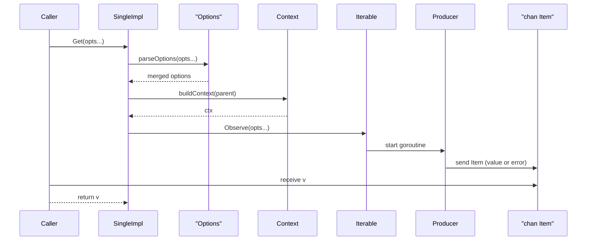

# Chapter 3: Single

Building on our asynchronous, push-based streams in [Chapter 2: Observable](02_observable.md), we now zero in on a **specialized** abstraction: the **Single**. Whereas an `Observable` can emit 0…N items over time, a `Single` represents exactly **one** asynchronous result (or an error), then completes—much like a Future or Promise in other ecosystems.

---

## 1. Motivation & Central Use Case

Imagine your application startup needs to fetch a remote configuration exactly once. You fire off an HTTP request, you want to:

1. Either receive the config payload  
2. Or handle a single failure  
3. Then proceed—no further values are expected  

This pattern shows up everywhere:

- Placing an online order (you expect either delivery or a failure notice).  
- Fetching a user profile by ID from a REST API.  
- Loading a singleton resource (TLS certificates, feature flags, etc.).  

A `Single<T>` models this “one-shot” asynchronous operation with built‐in support for:

- **Transformation** (`Map`)  
- **Conditional emission** (`Filter` → `OptionalSingle`)  
- **Blocking retrieval** (`Get`)  
- **Fire‐and‐forget** execution (`Run`)  

You still benefit from RxGo’s operator chain and cancellation via `context.Context`, but without the complexity of handling streams of values.

---

## 2. Key Concepts

- **Single**:  
  A push‐based source that emits exactly one `Item` (value or error), then terminates.

- **OptionalSingle**:  
  The result of filtering a `Single`. It may emit one `Item` or no item at all, then completes. Its `Get()` can return an empty marker.

- **Methods on Single**:  
  - `Observe(opts ...Option) <-chan Item` (from `Iterable`)  
  - `Get(opts ...Option) (Item, error)`  
  - `Map(apply Func, opts ...Option) Single`  
  - `Filter(apply Predicate, opts ...Option) OptionalSingle`  
  - `Run(opts ...Option) Disposed`  

- **Guarantees**:  
  - Exactly one emission (or error)  
  - No back‐pressure concerns (you only ever handle one item)  
  - Cancellation support via `context.Context`  

---

## 3. Getting Started: Using Single

Below we’ll build a simple `Single` by wrapping a one‐shot function, then demonstrate the core operations.

### 3.1. Creating a Basic Single

```go
package main

import (
  "context"
  "fmt"
  "time"

  "github.com/reactivex/rxgo/v2"
)

func main() {
  ctx := context.Background()

  // 1. Define a producer that emits exactly one value after 500ms
  producer := func(ctx context.Context, ch chan<- rxgo.Item) {
    defer close(ch)
    time.Sleep(500 * time.Millisecond)
    ch <- rxgo.Of("Hello, Single!")
  }

  // 2. Wrap it in an Iterable, then into a SingleImpl
  it := rxgo.Create(producer)
  mySingle := &rxgo.SingleImpl{
    parent:   ctx,
    iterable: it,
  }

  // 3. Block until we get the single result
  item, err := mySingle.Get()
  if err != nil {
    fmt.Println("Context error:", err)
    return
  }
  if item.Error() {
    fmt.Println("Single failed:", item.E)
  } else {
    fmt.Println("Received:", item.V) // → "Hello, Single!"
  }
}
```

**Explanation**  

1. We build a one‐shot `producer` function that eventually sends exactly one `Item`.  
2. We wrap it in an `Iterable` via `rxgo.Create`, then hand it off to a `SingleImpl`.  
3. Calling `Get()` merges options, spins up the pipeline, and blocks for the first `Item`.  

---

### 3.2. Transforming with `Map`

Chain a transformation on the single value:

```go
upper := mySingle.Map(func(ctx context.Context, v interface{}) (interface{}, error) {
  s := v.(string)
  return strings.ToUpper(s), nil
})

item2, _ := upper.Get()
fmt.Println(item2.V)  // → "HELLO, SINGLE!"
```

**Explanation**  

- `Map` returns a new `Single` whose internal operator applies your function to the lone emission.  
- Errors raised by your function are sent downstream as an `Error` item.

---

### 3.3. Conditional Emission with `Filter`

Apply a predicate and receive an `OptionalSingle` (it may emit zero items):

```go
opt := upper.Filter(func(v interface{}) bool {
  return strings.HasPrefix(v.(string), "HELLO")
})

// Get either the filtered item, an empty marker, or cancellation error.
res, err := opt.Get()
if err != nil {
  // context cancelled
}
if res == rxgo.OptionalSingleEmpty {
  fmt.Println("Nothing passed the filter")
} else {
  fmt.Println("Filtered value:", res.V)
}
```

**Explanation**  

- If the predicate returns `true`, the item is forwarded; otherwise you get an empty result.  
- `OptionalSingle.Get()` returns `OptionalSingleEmpty` when no value is emitted.

---

### 3.4. Fire‐and‐Forget with `Run`

Sometimes you only care about side‐effects in the pipeline:

```go
dispose := mySingle.Run()
// do other work...
<-dispose   // blocks until the producer has sent (or errored) and cleaned up
fmt.Println("Pipeline completed")
```

**Explanation**  

- `Run()` starts the pipeline but discards any items.  
- The returned channel is closed when the sequence ends or the context cancels.

---

## 4. Under the Hood: How Single Works

### 4.1. High‐Level Sequence



1. **Option Parsing** merges user‐ and constructor‐provided options.  
2. **Context Building** wraps the parent context with timeouts, etc.  
3. **Observe** triggers the underlying `Iterable` (which spins up the producer).  
4. **Get** blocks on the first emission or context cancellation.  

---

### 4.2. Key Code Walkthrough (single.go)

```go
// Single is a one‐shot Observable
type Single interface {
  Iterable
  Filter(apply Predicate, opts ...Option) OptionalSingle
  Get(opts ...Option) (Item, error)
  Map(apply Func, opts ...Option) Single
  Run(opts ...Option) Disposed
}

// SingleImpl holds a parent context and an Iterable
type SingleImpl struct {
  parent   context.Context
  iterable Iterable
}

// Get blocks for the single emission (or context error)
func (s *SingleImpl) Get(opts ...Option) (Item, error) {
  option := parseOptions(opts...)
  ctx := option.buildContext(s.parent)
  observe := s.Observe(opts...)
  for {
    select {
    case <-ctx.Done():
      return Item{}, ctx.Err()
    case v := <-observe:
      return v, nil
    }
  }
}

// Map returns a new Single that applies `apply` to the value
func (s *SingleImpl) Map(apply Func, opts ...Option) Single {
  return single(s.parent, s,
    func() operator { return &mapOperatorSingle{apply: apply} },
    false, true, opts...,
  )
}

// Run starts the sequence and ignores values
func (s *SingleImpl) Run(opts ...Option) Disposed {
  dispose := make(chan struct{})
  option := parseOptions(opts...)
  ctx := option.buildContext(s.parent)

  go func() {
    defer close(dispose)
    observe := s.Observe(opts...)
    for {
      select {
      case <-ctx.Done():
        return
      case _, ok := <-observe:
        if !ok {
          return
        }
      }
    }
  }()
  return dispose
}
```

Operators like `mapOperatorSingle` and the filter variant implement the `operator` interface, handling `next`, `err`, and `end` callbacks in the usual RxGo pipeline.

---

## 5. Real‐World Analogy

A **Single** is like placing an online order:

1. You submit **one** purchase request.  
2. You either receive the package (success) or an error notification (failure).  
3. You don’t expect a stream of updates—just the final outcome.  

You can “transform” the delivery (e.g., unwrap the box), “filter” if it meets certain criteria, or simply “run” for side‐effects (notify the warehouse).

---

## 6. Summary & Next Steps

In this chapter we explored:

- The **Single** abstraction for exactly one asynchronous result.  
- Core operations: `Get`, `Map`, `Filter` → `OptionalSingle`, and `Run`.  
- The high‐level and code‐level view of how `Single` sits on top of `Iterable`.  

Up next, you’ll discover a suite of **factory functions**—how to create `Observable`, `Single`, `OptionalSingle`, `Error` streams, and more in [Chapter 4: Factory](04_factory.md).

---

Generated by fork of [AI Codebase Knowledge Builder](https://github.com/vegeta03/PocketFlow-Tutorial-Codebase-Knowledge.git)
