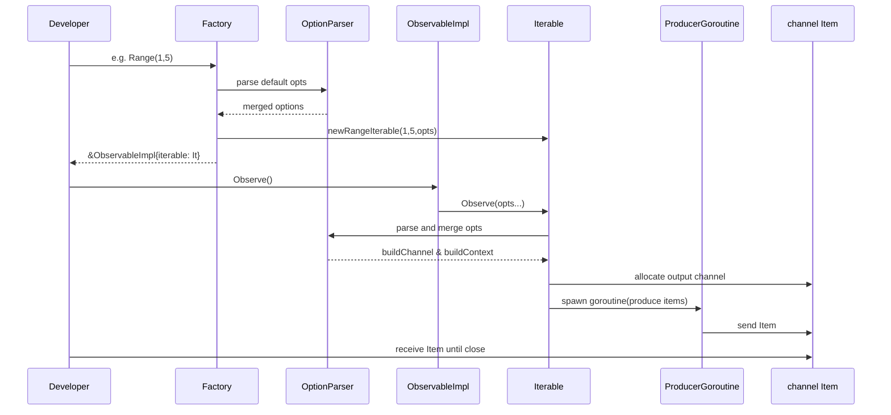

# Chapter 4: Factory

Building on [Chapter 3: Single](03_single.md), we now look at **Factory**—the centralized entry point for creating **Iterables**, **Observables**, and **Singles** from slices, channels, functions, event sources, ranges, timers, and more. In Go, this encapsulates the factory‐method pattern: client code simply calls a constructor, never worrying about the instantiation details.

---

## 1. Motivation & Central Use Case

Imagine you’re building a **real‐time analytics engine** that ingests:

1. A static list of user IDs (from a configuration file).  
2. Live telemetry events arriving on a Go channel.  
3. A heartbeat tick every second.

You need to:

- Create reactive streams for each source.  
- Merge them into one pipeline.  
- Apply transformations, filters, and side‐effects.  

Without a unified API, you’d write bespoke goroutine code for each source. **Factory** functions in RxGo give you a consistent “button panel”:

- Press `Just`, `Range` or `FromSlice` for static lists.  
- Press `FromChannel` or `FromEventSource` for channel‐based sources.  
- Press `Interval` or `Timer` for time-based streams.  
- Press `Merge`, `Concat` or `CombineLatest` to combine streams.  

You get back an `Observable` or `Single` every time—no plumbing details required.

---

## 2. Key Concepts

1. **Factory Abstraction**  
   A set of top-level functions (e.g., `Range`, `Just`, `FromChannel`, `Merge`) that return ready-to-use `Observable` or `Single` objects.

2. **Cold vs Hot Sources**  
   - *Cold* factories (e.g., `Range`, `Just`, `FromSlice`, `Create`, `Defer`) start producing only when you subscribe (`Observe`).  
   - *Hot* factories (e.g., `Interval`, `FromEventSource`) may launch a background producer immediately, sharing events among subscribers.

3. **Categories of Factories**  
   - **Static**: `Just`, `Range`, `Empty`, `Never`, `Thrown`.  
   - **Channel**: `FromChannel` (cold), `FromEventSource` (hot).  
   - **Function**: `Create`, `Defer`.  
   - **Timing**: `Interval`, `Timer`, `Start`.  
   - **Combining**: `Merge`, `Concat`, `CombineLatest`, `Amb`.  
   - **Single**: `JustItem`.

4. **Decoupling Instantiation**  
   Clients never see the underlying `Iterable` types (`justIterable`, `rangeIterable`, etc.). They only work with high-level `Observable` or `Single` interfaces.

---

## 3. Getting Started: Using Factory Functions

Below is an end-to-end example of merging three distinct sources into one reactive pipeline.

```go
package main

import (
  "fmt"
  "time"

  "github.com/reactivex/rxgo/v2"
)

func main() {
  // 1. A static list of user IDs (cold factory)
  usersObs := rxgo.Just("alice", "bob", "carol")()

  // 2. Live telemetry events on a channel (hot factory)
  telemetryCh := make(chan rxgo.Item)
  go func() {
    for i := 1; i <= 3; i++ {
      // Simulate an external event every 200ms
      time.Sleep(200 * time.Millisecond)
      telemetryCh <- rxgo.Of(fmt.Sprintf("evt-%d", i))
    }
    close(telemetryCh)
  }()
  telemetryObs := rxgo.FromEventSource(telemetryCh)

  // 3. A heartbeat tick every 500ms (hot factory)
  heartbeatObs := rxgo.Interval(500 * time.Millisecond).
    Take(2) // only first two ticks

  // 4. Merge all sources into one Observable
  merged := rxgo.Merge([]rxgo.Observable{
    usersObs,
    telemetryObs,
    heartbeatObs,
  })

  // 5. Subscribe and print each item as it arrives
  for item := range merged.Observe() {
    if item.Error() {
      fmt.Println("Error:", item.E)
      break
    }
    fmt.Println("Value:", item.V)
  }
}
```

Explanation:

- `Just("alice", "bob", "carol")()` produces a cold `Observable` of three names.  
- `FromEventSource` wraps an ongoing channel as a hot source—every subscriber sees the same events.  
- `Interval` launches a timer that emits `0,1,2,…` every 500 ms; we `Take(2)` ticks.  
- `Merge` interleaves items from all three streams into a single pipeline.  
- `Observe()` finally starts each source (if cold) or attaches to each hot stream.

**Sample Output** (order may vary due to timing):

```plaintext
Value: alice
Value: bob
Value: carol
Value: evt-1
Value: evt-2
Value: evt-3
Value: 0
Value: 1
```

---

## 4. Under the Hood: What Happens When You Call a Factory

### 4.1 Sequence Diagram



### 4.2 Key Factory Implementations

#### 4.2.1 Cold Range Factory

##### *File: factory.go*

```go
// Range creates a cold Observable that emits `count` ints starting at `start`.
func Range(start, count int, opts ...Option) Observable {
  if count < 0 {
    return Thrown(IllegalInputError{"count must be positive"})
  }
  return &ObservableImpl{
    iterable: newRangeIterable(start, count, opts...),
  }
}
```

##### *File: iterable_range.go*

```go
// rangeIterable produces a pull-based sequence of integers.
type rangeIterable struct {
  start, count int
  opts          []Option
}

func newRangeIterable(start, count int, opts ...Option) Iterable {
  return &rangeIterable{start: start, count: count, opts: opts}
}

func (r *rangeIterable) Observe(opts ...Option) <-chan Item {
  merged := append(r.opts, opts...)
  option := parseOptions(merged...)
  out := option.buildChannel()
  ctx := option.buildContext(emptyContext)

  go func() {
    defer close(out)
    for i := 0; i < r.count; i++ {
      select {
      case <-ctx.Done():
        return
      default:
      }
      // SendContext respects cancellation
      Of(r.start + i).SendContext(ctx, out)
    }
  }()
  return out
}
```

- **Cold**: no goroutine is spawned in `Range(...)` itself—only when `Observe()` is called.  
- **Option parsing** merges constructor and subscriber options.  
- **Context & channel** are built before launching the producer.

#### 4.2.2 Hot Interval Factory

##### *File: factory.go*

```go
// Interval emits incremental ints every given Duration, hot by default.
func Interval(interval Duration, opts ...Option) Observable {
  option := parseOptions(opts...)
  next := option.buildChannel()
  ctx := option.buildContext(emptyContext)

  go func() {
    i := 0
    for {
      select {
      case <-ctx.Done():
        close(next)
        return
      case <-time.After(interval.duration()):
        if !Of(i).SendContext(ctx, next) {
          return
        }
        i++
      }
    }
  }()

  return &ObservableImpl{
    iterable: newEventSourceIterable(ctx, next, option.getBackPressureStrategy()),
  }
}
```

##### *File: iterable_eventsource.go*

```go
// eventSourceIterable handles hot sources with optional backpressure.
type eventSourceIterable struct {
  ctx context.Context
  src <-chan Item
  bps BackPressureStrategy
}

func newEventSourceIterable(ctx context.Context, src <-chan Item, bps BackPressureStrategy) Iterable {
  return &eventSourceIterable{ctx: ctx, src: src, bps: bps}
}

func (e *eventSourceIterable) Observe(opts ...Option) <-chan Item {
  option := parseOptions(opts...)
  out := option.buildChannel()

  go func() {
    defer close(out)
    for {
      select {
      case <-e.ctx.Done():
        return
      case item, ok := <-e.src:
        if !ok {
          return
        }
        out <- item // could apply backpressureStrategy here
      }
    }
  }()
  return out
}
```

- **Hot**: the producer goroutine starts immediately when you call `Interval(...)`.  
- **Fan-out**: each `Observe()` call on the returned `Observable` sees the same timed events.  

---

## 5. Real-World Analogy

Think of **Factory** as a **vending machine**:

- You press **Button A** (e.g., `Just(…)`) to get a can of soda.  
- You press **Button B** (`FromChannel`) to tap into ongoing deliveries.  
- You press **Button C** (`Interval`) to request a new soda every minute.  
- **Internally**, the machine knows how to fetch, chill, and dispense—**you** only care about pressing buttons.

---

## 6. Conclusion

In this chapter you learned:

- The **Factory** abstraction: package-level constructors for all reactive types.  
- How to create Observables from static data, channels, functions, timers, and combinators.  
- The factory‐method pattern in action—decoupling instantiation from usage.  
- A peek under the hood at `Range` and `Interval` factories and their underlying `Iterable` implementations.

Next, we’ll see how to **customize** these pipelines using [Options](05_options.md), tailoring buffer sizes, back-pressure strategies, timeouts, and more. Enjoy!

---

Generated by fork of [AI Codebase Knowledge Builder](https://github.com/vegeta03/PocketFlow-Tutorial-Codebase-Knowledge.git)
