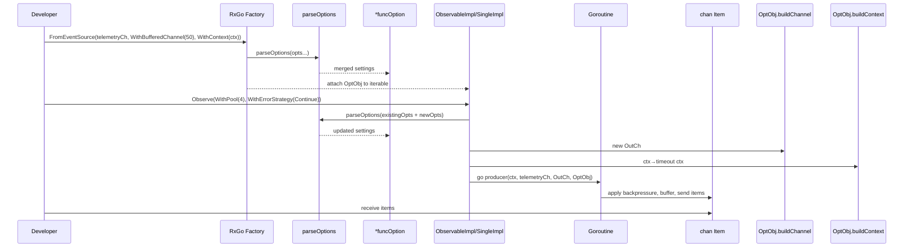

# Chapter 5: Options

Building on the factory-level creation of streams in [Chapter 4: Factory](04_factory.md), we now turn to the **Options** abstraction. By centralizing configuration into composable, functional options, RxGo avoids exploding constructor signatures and gains a flexible, extensible API surface for everything from buffer sizes to timeouts, concurrency pools, back-pressure and beyond.

---

## 1. Motivation & Central Use Case

Imagine you’re writing a **telemetry ingestion pipeline** for a fleet of IoT devices:

1. Sensors push readings into a Go channel at unpredictable rates.  
2. Your consumer may be busy—if you don’t buffer or apply back-pressure, you risk blocking the producer or losing data.  
3. You need to bound memory (buffer cap), drop old readings on overload, enforce an overall timeout, and run downstream operators on a worker pool.  
4. You may also want to publish a hot stream to multiple subscribers or serialize events for stateful processing.

Without _Options_, you’d need dozens of specialized constructors:

```go
FromEventSourceWithBufferAndTimeoutAndPoolAndDropStrategyAndPublish(…)
```

With the functional options pattern, we configure one factory call:

```go
obs := rxgo.FromEventSource(telemetryCh,
  rxgo.WithBufferedChannel(100),       // 1️⃣ 100-slot buffer
  rxgo.WithBackPressureStrategy(rxgo.DropOldest), // 2️⃣ drop oldest on full
  rxgo.WithContext(ctx),               // 3️⃣ 5s overall timeout
).Map(…).
  Filter(…)

// Subscribe on a 4-worker pool, continue on errors
out := obs.Observe(
  rxgo.WithPool(4),
  rxgo.WithErrorStrategy(rxgo.Continue),
)
for item := range out { … }
```

Here each `With…` call is just a function that tweaks an internal `funcOption`. The API surface remains small and clearly documents intent.

---

## 2. Key Concepts

1. **Option interface**  
   Every option implements `Option { apply(*funcOption); … }`. Options defer mutation until parsing time.  

2. **`funcOption` state**  
   A single struct holds all possible flags: buffer size, context, pool size, publish/connect flags, back-pressure and error strategies, serialization function, etc.  

3. **Parsing and merging**  
   `parseOptions(opts...)` walks each `Option`, applies it to a fresh `funcOption`, and returns the consolidated configuration.  

4. **Channel & Context builders**  
   - `funcOption.buildChannel()` honors `isBuffer` and `buffer` fields.  
   - `funcOption.buildContext(parent)` merges user-provided context with upstream parent via `onecontext.Merge()`.  

5. **Back-pressure & error strategies**  
   Options carry enums like `DropOldest`, `Block`, `Continue`, `FailFast`. These guide how producers and operators behave under load or error.  

6. **Execution pool**  
   `WithPool(n)` or `WithCPUPool()` sets a goroutine-pool size for parallel operators (e.g., `FlatMap`).  

7. **Connectable/publish**  
   `WithPublishStrategy()` marks an `Observable` as _connectable_ (hot). Internally, this toggles `isConnectable`, so `Observe(WithConnect())` will spawn a single shared producer.  

8. **Serialization**  
   `Serialize(keyFunc)` forces events with the same key to be processed sequentially (useful for per-device ordering).  

---

## 3. Applying Options: End-to-End Example

Below is a complete example of ingesting sensor data with several Options. We:

1. Simulate a hot channel of telemetry.  
2. Set up a 2-second global timeout.  
3. Buffer 50 items, drop oldest on overflow.  
4. Transform and filter readings.  
5. Subscribe on a 4-worker pool, continuing on errors.

```go
package main

import (
  "context"
  "fmt"
  "math/rand"
  "time"

  "github.com/reactivex/rxgo/v2"
)

func main() {
  // 1. Simulate a hot telemetry source
  telemetryCh := make(chan rxgo.Item)
  go func() {
    defer close(telemetryCh)
    for i := 0; i < 1000; i++ {
      // random burst
      time.Sleep(time.Duration(rand.Intn(20)) * time.Millisecond)
      telemetryCh <- rxgo.Of(fmt.Sprintf("reading-%d", i))
    }
  }()

  // 2. Build a context with 2s timeout
  ctx, cancel := context.WithTimeout(context.Background(), 2*time.Second)
  defer cancel()

  // 3. Configure the Observable with Options
  obs := rxgo.FromEventSource(telemetryCh,
      rxgo.WithContext(ctx),
      rxgo.WithBufferedChannel(50),
      rxgo.WithBackPressureStrategy(rxgo.DropOldest),
  ).
    Map(func(_ context.Context, i interface{}) (interface{}, error) {
      s := i.(string)
      return fmt.Sprintf("[processed] %s", s), nil
    }).
    Filter(func(i interface{}) bool {
      // only keep even-indexed readings
      // (extract number and mod2)
      var idx int
      fmt.Sscanf(i.(string), "[processed] reading-%d", &idx)
      return idx%2 == 0
    })

  // 4. Subscribe: use 4-worker pool, continue on error
  out := obs.Observe(
    rxgo.WithPool(4),
    rxgo.WithErrorStrategy(rxgo.Continue),
  )

  // 5. Drain results until context timeout or channel closes
  for item := range out {
    if item.Error() {
      fmt.Println("Error:", item.E)
      continue
    }
    fmt.Println(item.V)
  }
  fmt.Println("Done or timed out")
}
```

Explanation:

- **`WithContext`** ensures the entire pipeline halts after 2s.  
- **`WithBufferedChannel(50)`** pre-allocates a buffered channel of capacity 50.  
- **`WithBackPressureStrategy(DropOldest)`** drops oldest items when `telemetryCh` outpaces our buffer.  
- **`WithPool(4)`** spins a 4-worker scheduler for the `Map` and `Filter` operators.  
- **`WithErrorStrategy(Continue)`** logs errors but keeps processing.  

---

## 4. Under the Hood: How Options Drive RxGo

Before code, here’s a step-by-step of what happens when you call a factory or `Observe` with Options:



1. **Factory call** captures constructor-level Options.  
2. **`Observe` call** merges subscriber-level Options.  
3. **`parseOptions`** folds all `Option` functions into one `funcOption` state.  
4. **`buildChannel`** allocates a `chan Item` using buffer flags.  
5. **`buildContext`** returns a composed `context.Context` (parent + user).  
6. **Producer goroutine** reads from sources, honors back-pressure and context, and emits into the channel.

---

### 4.1 Core Code Walkthrough (`options.go`)

```go
// Option defines a functional configuration step
type Option interface {
  apply(*funcOption)
  toPropagate() bool
  // … other getters for channel, context, strategies …
}

// funcOption holds all possible settings
type funcOption struct {
  f                    func(*funcOption)
  isBuffer             bool
  buffer               int
  ctx                  context.Context
  pool                 int
  backPressureStrategy BackpressureStrategy
  onErrorStrategy      OnErrorStrategy
  propagate            bool
  connectable          bool
  connectOperation     bool
  serialized           func(interface{}) int
}

// newFuncOption wraps a lambda
func newFuncOption(f func(*funcOption)) *funcOption {
  return &funcOption{f: f}
}

// apply executes the Option’s setter
func (fdo *funcOption) apply(o *funcOption) {
  fdo.f(o)
}

// parseOptions merges many Option into one
func parseOptions(opts ...Option) *funcOption {
  o := &funcOption{}  // defaults
  for _, opt := range opts {
    opt.apply(o)
  }
  return o
}

// buildChannel allocates a buffered or unbuffered channel
func (o *funcOption) buildChannel() chan Item {
  if o.isBuffer {
    return make(chan Item, o.buffer)
  }
  return make(chan Item)
}

// buildContext merges parent + user contexts
func (o *funcOption) buildContext(parent context.Context) context.Context {
  if o.ctx != nil && parent != nil {
    merged, _ := onecontext.Merge(o.ctx, parent)
    return merged
  } else if o.ctx != nil {
    return o.ctx
  } else if parent != nil {
    return parent
  }
  return context.Background()
}
```

#### Sample Option Implementation

```go
// WithBufferedChannel configures channel capacity
func WithBufferedChannel(capacity int) Option {
  return newFuncOption(func(o *funcOption) {
    o.isBuffer = true
    o.buffer = capacity
  })
}

// WithContext attaches a custom context
func WithContext(ctx context.Context) Option {
  return newFuncOption(func(o *funcOption) {
    o.ctx = ctx
  })
}

// WithBackPressureStrategy sets drop/block policy
func WithBackPressureStrategy(strategy BackpressureStrategy) Option {
  return newFuncOption(func(o *funcOption) {
    o.backPressureStrategy = strategy
  })
}

// WithErrorStrategy sets how to handle OnError
func WithErrorStrategy(strategy OnErrorStrategy) Option {
  return newFuncOption(func(o *funcOption) {
    o.onErrorStrategy = strategy
  })
}

// WithPool sets a worker pool size for parallel ops
func WithPool(pool int) Option {
  return newFuncOption(func(o *funcOption) {
    o.pool = pool
  })
}

// WithPublishStrategy makes an Observable connectable
func WithPublishStrategy() Option {
  return newFuncOption(func(o *funcOption) {
    o.connectable = true
  })
}

// connect() is used internally to trigger .Connect()
func connect() Option {
  return newFuncOption(func(o *funcOption) {
    o.connectOperation = true
  })
}

// Serialize enforces keyed sequential processing
func Serialize(identifier func(interface{}) int) Option {
  return newFuncOption(func(o *funcOption) {
    o.serialized = identifier
  })
}
```

In most RxGo components—see [Chapter 1: Iterable](01_iterable.md), [Chapter 2: Observable](02_observable.md) or [Chapter 3: Single](03_single.md)—you’ll find calls like:

```go
option := parseOptions(append(parentOpts, subscriberOpts...)...)
ch     := option.buildChannel()
ctx    := option.buildContext(parentCtx)
```

from which the rest of the pipeline is driven.

---

## 5. Real-World Analogy

Think of **Options** like building the perfect coffee:

1. You start with a base (espresso, latte, tea…) → factory function.  
2. You add size (`WithBufferedChannel(large)`), milk type (`WithContext`… okay, a bit of a stretch!), sweetness (`WithBackPressureStrategy(Drop)`), and foam (`WithPool(4)`).  
3. Each modifier is a single, composable function—no need for ten different `NewLatteWithX` overloads.

---

## 6. Summary & Next Steps

In this chapter we’ve seen:

- **Why** RxGo uses a functional-options pattern.  
- **How** `Option` and `funcOption` centralize buffer, context, pool, back-pressure, error, publish and serialization settings.  
- **What** happens under the hood in `parseOptions`, `buildChannel` and `buildContext`.  
- **How** to apply Options end-to-end in a real telemetry ingestion pipeline.

Up next, you’ll learn how RxGo represents and manipulates time durations with [Chapter 6: Duration](06_duration.md). Enjoy!

---

Generated by fork of [AI Codebase Knowledge Builder](https://github.com/vegeta03/PocketFlow-Tutorial-Codebase-Knowledge.git)
