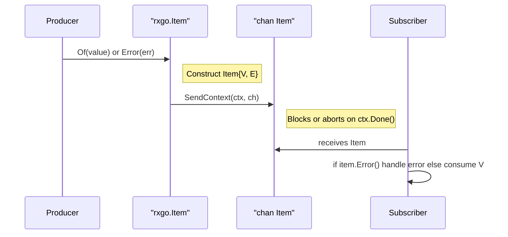

# Chapter 7: Item

Continuing from [Chapter 6: Duration](06_duration.md), this chapter introduces the `Item` abstraction—RxGo’s envelope for carrying either a value or an error through channels and pipelines. With `Item`, you never need a separate “error channel”: every value or failure is packaged in the same parcel, simplifying transport, buffering, and fan-out mechanics.

---

## 1. Motivation & Central Use Case

Imagine you’re building a reactive pipeline that processes rows from a CSV file. Some lines parse correctly; others are malformed. You want:

1. A single channel of “events” where each event is either a parsed record or an error description.  
2. Downstream operators to treat both uniformly—logging errors, transforming good records, aggregating results—without wiring extra error channels.  

The `Item` abstraction solves this by acting as a discriminated union (`Result<T,E>` in other languages). It carries exactly one of:

- A **value** (`V interface{}`)  
- An **error** (`E error`)  

downstream handlers inspect `Item.Error()` to decide how to proceed.

---

## 2. Key Concepts

1. **Discriminated Union**  
   `Item` holds exactly one of two variants: a value or an error.  

2. **Item Struct**  

   ```go
   type Item struct {
     V interface{}  // the payload if no error
     E error        // the error, if any
   }
   ```  

3. **Factory Functions**  
   - `Of(v)` wraps `v` as an `Item` value.  
   - `Error(err)` wraps `err` as an `Item` error.  

4. **Inspecting an Item**  
   - `item.Error() bool` returns `true` if `E != nil`.  
   - Access `item.V` or `item.E` accordingly.  

5. **Channel Send Helpers**  
   - `SendBlocking(ch)` blocks until the `Item` is sent.  
   - `SendContext(ctx, ch)` blocks or aborts on context cancellation.  
   - `SendNonBlocking(ch)` attempts to send without blocking (drops if full).  

6. **Bulk Sending**  
   `SendItems(ctx, ch, strategy, items...)` flattens slices, channels, values, and errors, sending each as an `Item`. The `CloseChannelStrategy` (`LeaveChannelOpen` vs `CloseChannel`) controls whether the channel is closed at the end.  

7. **TimestampItem**  
   A helper struct for operators that attach a timestamp:

   ```go
   type TimestampItem struct {
     Timestamp time.Time
     V         interface{}
   }
   ```

---

## 3. Getting Started: Sending and Receiving Items

### 3.1. Custom Producer with `Item`

Below is a complete program that divides 100 by a list of integers, packaging either the result or a division-by-zero error into `Item`s.

```go
package main

import (
  "context"
  "errors"
  "fmt"
  "github.com/reactivex/rxgo/v2"
)

func main() {
  // 1. Define a producer that emits Items
  producer := func(ctx context.Context, ch chan<- rxgo.Item) {
    defer close(ch)  // close when done

    inputs := []int{10, 0, 5}
    for _, n := range inputs {
      if n == 0 {
        // wrap an error
        rxgo.Error(errors.New("division by zero")).
          SendContext(ctx, ch)
      } else {
        // wrap a value
        rxgo.Of(100/n).
          SendContext(ctx, ch)
      }
    }
  }

  // 2. Build an Iterable, then an Observable
  iterable   := rxgo.Create(producer)
  observable := rxgo.ObservableOf(iterable)

  // 3. Subscribe and handle each Item
  for item := range observable.Observe() {
    if item.Error() {
      fmt.Println("Error event:", item.E)
    } else {
      fmt.Println("Value event:", item.V)
    }
  }
}
```

Explanation:  

- `Create(producer)` gives you an `Iterable` that your code controls.  
- `ObservableOf` wraps it into an `Observable` so you can call `Observe()`.  
- Each `Item` carries either a value (`V`) or an error (`E`).  

---

### 3.2. Bulk Sending with `SendItems`

You can send mixed batches of values, slices, errors, even channels in one call:

```go
func batchProducer(ctx context.Context, ch chan<- rxgo.Item) {
  dataCh := make(chan int, 2)
  dataCh <- 42
  dataCh <- 43
  close(dataCh)

  rxgo.SendItems(
    ctx,
    ch,
    rxgo.CloseChannel,      // auto-close ch when done
    1,                      // primitive → Of(1)
    []int{2, 3},            // slice → flattened
    errors.New("oops"),     // error → Error(err)
    dataCh,                 // channel → flattened
  )
}

// Usage:
iter := rxgo.Create(batchProducer)
for item := range iter.Observe() {
  if item.Error() {
    fmt.Println("Got error:", item.E)
  } else {
    fmt.Println("Got value:", item.V)
  }
}
```

Explanation:  

- `SendItems` inspects each argument via reflection.  
- Slices and channels are unwrapped element by element.  
- `CloseChannel` ensures the output channel is closed after all items are sent.

---

## 4. Internal Workflow: Sequence Diagram

What happens when your code calls `SendContext` on an `Item`?



---

## 5. Under the Hood: Code Walkthrough

### _File: item.go_

```go
// Item carries either a value or an error.
type Item struct {
  V interface{}
  E error
}

// Of wraps a non-error value.
func Of(i interface{}) Item {
  return Item{V: i}
}

// Error wraps an error.
func Error(err error) Item {
  return Item{E: err}
}

// Error reports true if this Item holds an error.
func (i Item) Error() bool {
  return i.E != nil
}
```

### Sending Helpers

```go
// SendBlocking blocks until the Item is sent.
func (i Item) SendBlocking(ch chan<- Item) {
  ch <- i
}

// SendContext blocks or aborts on context cancellation.
func (i Item) SendContext(ctx context.Context, ch chan<- Item) bool {
  select {
  case <-ctx.Done():
    return false
  default:
    select {
    case <-ctx.Done():
      return false
    case ch <- i:
      return true
    }
  }
}

// SendNonBlocking attempts to send without blocking.
func (i Item) SendNonBlocking(ch chan<- Item) bool {
  select {
  case ch <- i:
    return true
  default:
    return false
  }
}
```

### Bulk Sending & Reflection

```go
// SendItems flattens and sends mixed inputs as Items.
func SendItems(
  ctx context.Context,
  ch chan<- Item,
  strategy CloseChannelStrategy,
  items ...interface{},
) {
  if strategy == CloseChannel {
    defer close(ch)
  }
  send(ctx, ch, items...)
}

func send(ctx context.Context, ch chan<- Item, items ...interface{}) {
  for _, current := range items {
    switch v := current.(type) {
    case error:
      Error(v).SendContext(ctx, ch)
    default:
      rt := reflect.TypeOf(v)
      switch rt.Kind() {
      case reflect.Chan:
        // Flatten a channel
        in := reflect.ValueOf(v)
        for {
          val, ok := in.Recv()
          if !ok {
            break
          }
          send(ctx, ch, val.Interface())
        }
      case reflect.Slice:
        // Flatten a slice
        s := reflect.ValueOf(v)
        for i := 0; i < s.Len(); i++ {
          send(ctx, ch, s.Index(i).Interface())
        }
      default:
        Of(v).SendContext(ctx, ch)
      }
    }
  }
}
```

Explanation:  

- Uses Go’s `reflect` API to generically handle channels and slices.  
- Nested calls to `send` ensure full flattening of mixed structures.

### TimestampItem

For operators that stamp events with time:

```go
type TimestampItem struct {
  Timestamp time.Time
  V         interface{}
}
```

You might produce one in a `Map`:

```go
obs := rxgo.Just("a", "b")().
  Map(func(_ context.Context, v interface{}) (interface{}, error) {
    return rxgo.TimestampItem{time.Now(), v}, nil
  })
```

---

## 6. Real-World Analogy

Think of each `Item` as a **parcel** in a logistics system. It carries **either**:

- A **product** (your value)  
- A **failure notice** (your error)

Every downstream handler simply unpacks the parcel, inspects its label (`Error()`), and routes it to the next stage—no separate “error conveyor belt” needed.

---

## 7. Summary & Next Steps

In this chapter we’ve covered:

- The `Item` discriminated union for values or errors.  
- Factory functions `Of` and `Error`.  
- Sending primitives: `SendBlocking`, `SendContext`, `SendNonBlocking`.  
- Bulk sending with `SendItems` and `CloseChannelStrategy`.  
- The `TimestampItem` variant for timestamped events.

Next up, we’ll explore error-handling strategies built on top of `Item` in [Chapter 8: Error](08_error.md).

---

Generated by fork of [AI Codebase Knowledge Builder](https://github.com/vegeta03/PocketFlow-Tutorial-Codebase-Knowledge.git)
