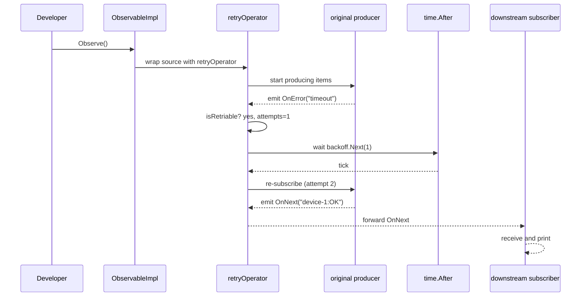

# Chapter 8: Error

Building on the uniform envelope of values and errors in [Chapter 7: Item](07_item.md), we now elevate error handling to a first-class abstraction. The **Error** package in RxGo gives you:

- Custom error types with contextual metadata (stack traces, timestamps, retry counts).  
- Utilities for **retry** with pluggable **backoff** strategies.  
- **Aggregation** of multiple failures into a single `AggregateError`.  
- Operators like `Retry`, `Catch`, `OnErrorResumeNext` that integrate seamlessly with your reactive pipelines.  

In practical terms, think of **Error** as an operations log attached to each failure—enabling robust recovery (retry-and-backoff), fail-fast, or graceful degradation strategies, all configurable via RxGo operators and Options.

---

## 1. Motivation & Central Use Case

Imagine you’re building a monitoring service for an IoT fleet. Every second you poll each device’s HTTP endpoint for status. Transient network glitches happen—timeouts, rate limits, DNS lookups fail. You want a pipeline that:

1. **Emits** a status string on success (`"device-42:OK"`).  
2. **Retries** timeouts up to 3 times with **exponential backoff**.  
3. **Fails fast** on non-retriable errors (e.g. HTTP 404).  
4. **Falls back** to a default status stream if all retries abort.  
5. **Accumulates** any unhandled errors into a summary before bubbling up.

Below is how you’d express that with RxGo’s Error abstraction:

```go
package main

import (
  "context"
  "errors"
  "fmt"
  "strings"
  "time"

  "github.com/reactivex/rxgo/v2"
)

func main() {
  ctx := context.Background()

  // 1. A cold Observable that polls a device every 1s
  statusObs := rxgo.Interval(rxgo.WithDuration(1*time.Second)).
    Map(func(_ context.Context, i interface{}) (interface{}, error) {
      // Simulate "timeout" every 3rd tick, "not found" every 5th
      tick := i.(int)
      switch {
      case tick%5 == 0 && tick != 0:
        return nil, errors.New("404 not found")
      case tick%3 == 0 && tick != 0:
        return nil, errors.New("timeout")
      default:
        return fmt.Sprintf("device-%d:OK", tick), nil
      }
    })

  // 2. Retry timeouts up to 3 times with exponential backoff
  resilient := statusObs.
    Retry(3,
      rxgo.ExponentialBackoff(200*time.Millisecond, 2.0),
      func(err error) bool {
        return strings.Contains(err.Error(), "timeout")
      },
    ).
    // 3. On fatal errors, switch to a fallback Observable
    Catch(func(err error) rxgo.Observable {
      // err may be *rxgo.ExtendedError or *rxgo.AggregateError
      return rxgo.Just(fmt.Sprintf("fallback: %v", err))()
    })

  // 4. Subscribe with error logging
  done := resilient.ForEach(
    func(item interface{}) {
      fmt.Println("→", item)
    },
    func(err error) {
      fmt.Println("Pipeline failed completely:", err)
    },
    func() {
      fmt.Println("Stream completed.")
    },
  )

  <-done
}
```

Explanation:

- **`Retry(3, backoff, predicate)`** re-subscribes on matching errors up to 3 times, waiting `200ms`, then `400ms`, then `800ms` before each retry.  
- **`Catch(...)`** intercepts any error that bubbled through (after retries) and switches to a fallback `Observable`.  
- Upstream **extended errors** carry retry counts and stack traces in their metadata.  

---

## 2. Key Concepts

1. **ExtendedError**  
   Wraps a Go `error` with:
   - Timestamp of occurrence  
   - Stack trace (`[]uintptr`)  
   - Retry count  
   - Arbitrary context map (`map[string]interface{}`)  

2. **AggregateError**  
   A container for multiple errors:

   ```go
   type AggregateError struct {
     Errors []error
   }
   ```

   Implements `Error()` by concatenating messages and supports unwrapping.

3. **BackoffStrategy**  
   Interface to compute wait intervals between retries:

   ```go
   type BackoffStrategy interface {
     Next(attempt int) time.Duration
   }
   ```

   Built-ins:
   - `ConstantBackoff(delay time.Duration)`  
   - `ExponentialBackoff(base time.Duration, factor float64)`

4. **Retry Operator**  
   `func (o Observable) Retry(maxAttempts int, b BackoffStrategy, pred func(error) bool) Observable`  
   - Re-subscribes to source on errors matching `pred`.  
   - Honors `maxAttempts` and delays via `b.Next(attempt)`.

5. **Catch & OnErrorResumeNext**  
   - `Catch(func(error) Observable)` switches to a new stream on error.  
   - `OnErrorResumeNext(obs2, obs3, …)` tries a sequence of fallbacks.

6. **OnErrorStrategy Option**  
   Via `WithErrorStrategy(...)` you can configure operators globally to `Continue`, `FailFast`, or `Retry`.

---

## 3. Getting Started: Patterns in Action

### 3.1. Wrapping Errors with Context Metadata

Whenever an operator or user code returns a non-nil `error`, RxGo automatically wraps it into an `ExtendedError`. If you need to create one yourself:

```go
package main

import (
  "errors"
  "fmt"
  "runtime"
  "time"

  "github.com/reactivex/rxgo/v2"
)

func main() {
  baseErr := errors.New("disk full")
  extErr := rxgo.NewExtendedError(baseErr).
    WithContext("partition", "root").
    WithRetryCount(0)
  fmt.Println(extErr.Error())       // "disk full"
  fmt.Println(extErr.Timestamp)     // time of occurrence
  fmt.Println(extErr.Context["partition"])
}
```

Explanation:

- `NewExtendedError(err)` captures the stack trace and timestamp.  
- `.WithContext(key, value)` attaches extra metadata.  
- `.WithRetryCount(n)` updates the retry count.

### 3.2. Retry with Exponential Backoff

```go
obs := rxgo.Just(1, 2, 3)().
  FlatMap(func(ctx context.Context, v interface{}) rxgo.Observable {
    return rxgo.Defer(func(ctx context.Context, ch chan<- rxgo.Item) {
      // simulate an operation that fails the first two times
      attempt := ctx.Value("attempt").(int)
      ctx = context.WithValue(ctx, "attempt", attempt+1)
      if attempt < 2 {
        rxgo.Error(errors.New("temporary failure")).
          SendContext(ctx, ch)
      } else {
        rxgo.Of(fmt.Sprintf("success on attempt %d", attempt+1)).
          SendContext(ctx, ch)
      }
      close(ch)
    })
  }).
  Retry(
    5,
    rxgo.ExponentialBackoff(100*time.Millisecond, 2.0),
    func(err error) bool { return strings.Contains(err.Error(), "temporary") },
  )

for item := range obs.Observe() {
  if item.Error() {
    fmt.Println("Still failing:", item.E)
  } else {
    fmt.Println("Result:", item.V)
  }
}
```

Output (approximation):

```plaintext
Result: success on attempt 3
```

Explanation:

1. The inner `Defer` tracks retries via context.  
2. `Retry` operator looks at each error, applies the predicate, waits `100ms`, `200ms`, then `400ms`, etc.  
3. On success, it continues downstream.

### 3.3. Aggregating Multiple Errors

You may want to collect errors across multiple streams before failing:

```go
obs1 := rxgo.Just(1, 2)().Map(func(_ context.Context, v interface{}) (interface{}, error) {
  if v.(int)%2 == 0 {
    return nil, errors.New("even failure")
  }
  return v, nil
})

obs2 := rxgo.Just(3, 4)().Map(func(_ context.Context, v interface{}) (interface{}, error) {
  if v.(int)%2 != 0 {
    return nil, errors.New("odd failure")
  }
  return v, nil
})

// Merge and aggregate errors
agg := rxgo.Merge([]rxgo.Observable{obs1, obs2}...).
  OnErrorAggregate()

for item := range agg.Observe() {
  if item.Error() {
    // item.E is *AggregateError
    fmt.Println("Aggregated failures:", item.E)
    break
  }
  fmt.Println("Value:", item.V)
}
```

Explanation:

- `OnErrorAggregate()` waits for all upstream to complete, then emits an `AggregateError` if any failed.  
- You can inspect `ae.Errors[]` for details.

---

## 4. Under the Hood: Error Workflow

### 4.1. Step-by-Step Sequence

Below is a simplified flow when you call `o.Retry(3, backoff, pred).Observe()`:



1. **Subscription**: `Observe()` builds channels & context.  
2. **Operator Wrapping**: `Retry` replaces the source with `retryOperator`.  
3. **Error Handling**: On each `Error` item, `retryOperator` checks the predicate & attempt count.  
4. **Backoff**: Waits via `time.After(backoff.Next(attempt))`.  
5. **Resubscription**: Re-runs the source; on success it forwards values downstream.

### 4.2. Core Implementation Highlights

#### File: errors.go

```go
package rxgo

import (
  "runtime"
  "time"
)

// ExtendedError carries extra failure metadata.
type ExtendedError struct {
  Err        error
  Timestamp  time.Time
  StackTrace []uintptr
  RetryCount int
  Context    map[string]interface{}
}

// NewExtendedError captures stack + timestamp.
func NewExtendedError(err error) *ExtendedError {
  pcs := make([]uintptr, 32)
  n := runtime.Callers(3, pcs)
  return &ExtendedError{
    Err:        err,
    Timestamp:  time.Now(),
    StackTrace: pcs[:n],
    Context:    make(map[string]interface{}),
  }
}

func (e *ExtendedError) Error() string        { return e.Err.Error() }
func (e *ExtendedError) Unwrap() error        { return e.Err }
func (e *ExtendedError) WithRetryCount(n int) *ExtendedError {
  e.RetryCount = n; return e
}
func (e *ExtendedError) WithContext(k string, v interface{}) *ExtendedError {
  e.Context[k] = v; return e
}

// AggregateError bundles multiple errors.
type AggregateError struct {
  Errors []error
}

func (ae *AggregateError) Error() string {
  msgs := make([]string, len(ae.Errors))
  for i, err := range ae.Errors {
    msgs[i] = err.Error()
  }
  return "aggregate errors: [" + strings.Join(msgs, "; ") + "]"
}
func (ae *AggregateError) Unwrap() []error { return ae.Errors }
```

#### File: backoff_strategy.go

```go
package rxgo

import "time"

// BackoffStrategy defines retry delays.
type BackoffStrategy interface {
  Next(attempt int) time.Duration
}

// ConstantBackoff waits a fixed delay.
type ConstantBackoff struct{ Delay time.Duration }

func (c ConstantBackoff) Next(_ int) time.Duration { return c.Delay }

// ExponentialBackoff multiplies delay by factor^(attempt-1).
type ExponentialBackoff struct {
  Base   time.Duration
  Factor float64
}

func (e ExponentialBackoff) Next(attempt int) time.Duration {
  return time.Duration(float64(e.Base) * math.Pow(e.Factor, float64(attempt-1)))
}
```

#### File: operator_retry.go

```go
package rxgo

import (
  "context"
  "time"
)

// Retry operator implementation.
func retryOperator(source Observable, maxAttempts int,
  backoff BackoffStrategy,
  pred func(error) bool,
) Observable {
  return NewObservable(func(ctx context.Context, out chan<- Item) {
    attempt := 0
    for {
      // subscribe to source
      errs := make(chan error, 1)
      source.ForEach(
        func(v interface{}) { out <- Of(v) },
        func(err error) { errs <- err },
        func() {},
      )
      select {
      case err := <-errs:
        attempt++
        if attempt <= maxAttempts && pred(err) {
          // wrap and emit ExtendedError for diagnostics
          ext := NewExtendedError(err).WithRetryCount(attempt)
          out <- Item{E: ext}
          // wait before retry
          select {
          case <-ctx.Done():
            return
          case <-time.After(backoff.Next(attempt)):
          }
          continue
        }
        // no more retries, emit final error
        out <- Item{E: err}
      default:
        // completed without error
      }
      close(out)
      return
    }
  })
}
```

---

## 5. Real-World Analogy

Think of **Error** as a **shipping guarantee** for your data:

- **ExtendedError** is like a parcel label that includes not only the failure code, but also where it came from (stack trace), when it happened (timestamp), and how many delivery attempts were made (retry count).  
- **BackoffStrategy** dictates how long the courier waits between reattempts.  
- **AggregateError** is the consolidated customs report listing every individual mishap.  
- Operators like **Retry** and **Catch** are the logistics protocols deciding when to retry, when to divert to a fallback route, or when to abandon and bubble up a summary failure.

With this toolkit, you can design fail-fast or fault-tolerant pipelines as your use case demands.

---

## 6. Summary & Next Steps

In this chapter we’ve explored:

- The **ExtendedError** wrapper with contextual metadata.  
- **AggregateError** for collecting multiple failures.  
- Pluggable **BackoffStrategy** implementations.  
- The **Retry** and **Catch** operators for robust recovery.  
- Internal workflows and code sketches (`errors.go`, `backoff_strategy.go`, `operator_retry.go`).  

Up next, we’ll survey all the built-in data **Types** that RxGo provides—from notifications to timestamps—in [Chapter 9: Types](09_types.md).

---

Generated by fork of [AI Codebase Knowledge Builder](https://github.com/vegeta03/PocketFlow-Tutorial-Codebase-Knowledge.git)
