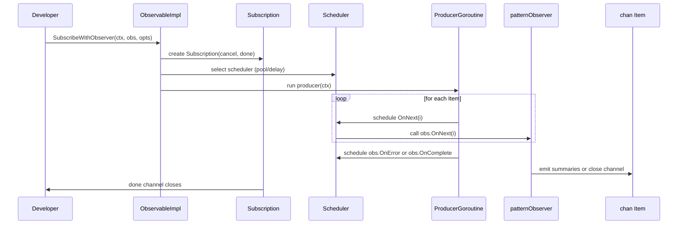

# Chapter 9: Types

Building on [Chapter 8: Error](08_error.md), this chapter dives into **Types**—the core contracts and helper definitions that shape how RxGo components communicate. Think of them as the blueprint in a factory: they specify exactly how each station (producer, operator, subscriber, scheduler) hands off work, reports success or failure, and shuts down cleanly.

---

## 1. Motivation & Central Use Case

Imagine you’re developing a **custom operator** that watches an `Observable`, buffers items until a certain pattern emerges, then emits a summary statistics object. To do this robustly, you need:

1. **Function types** (`Func`, `Predicate`, `FuncN`) to express your transform and buffer-flush logic.  
2. **Observer contracts** to receive `OnNext`, `OnError`, and `OnComplete` callbacks.  
3. A **Subscription** mechanism (`Disposable` / `Disposed`) to cancel mid-stream or detect end-of-stream.  
4. A **Scheduler** to offload heavy computation or schedule flushes at fixed intervals.  
5. Standard **enums** to govern back-pressure, error and observation strategies so your operator composes with any upstream or downstream.

By mastering the **Types** abstraction, you’ll be able to plug into RxGo at the raw interface level—building new operators, integrating with external event sources, or customizing scheduling behaviour—while preserving the library’s guarantees around cancellation, context propagation, and error semantics.

---

## 2. Key Concepts

Below are the foundational contracts defined in `types.go`. These pure-Go definitions carry no logic themselves—they merely prescribe the shapes of data and callbacks used throughout the library.

### 2.1. Function Signatures

```go
// Func computes a single output (or error) from an input.
type Func func(context.Context, interface{}) (interface{}, error)

// Func2 computes an output from two inputs.
type Func2 func(context.Context, interface{}, interface{}) (interface{}, error)

// FuncN computes an output from N inputs (e.g. CombineLatest).
type FuncN func(...interface{}) interface{}

// Predicate decides whether to keep an item.
type Predicate func(interface{}) bool
```

Usage:

- `Map` and `FlatMap` take a `Func`.  
- `Filter` takes a `Predicate`.  
- Combiners (`Zip`, `CombineLatest`) use `FuncN` to merge streams.

### 2.2. Observer Callbacks

```go
type (
  NextFunc      func(interface{}) // OnNext
  ErrFunc       func(error)       // OnError
  CompletedFunc func()            // OnComplete
)
```

Usage:

- Use `Observable.ForEach(next, err, complete)` to subscribe with these callbacks.  
- Internally, RxGo wraps them into an `Observer` implementation.

### 2.3. Subscription & Disposal

```go
// Disposable is an alias for context.CancelFunc.
type Disposable context.CancelFunc

// Disposed is a read-only channel closed when the Observable terminates.
type Disposed <-chan struct{}
```

Usage:

- Operators like `Run()` or `ForEach()` return a `Disposed` channel you can `<-` to await completion.  
- To cancel mid-stream, capture a `Disposable` (via an Option like `WithContext`) and call it.

### 2.4. Producer & Supplier

```go
// Producer is the raw function signature underlying Create/Defer.
type Producer func(ctx context.Context, next chan<- Item)

// Supplier supplies exactly one Item (used in Single).
type Supplier func(ctx context.Context) Item
```

Usage:

- `rxgo.Create(producer)` wraps a `Producer` into an `Iterable`.  
- `Single` uses a `Supplier` for one-shot results.

### 2.5. Supporting Contracts

```go
type (
  Comparator        func(interface{}, interface{}) int  // Sort/Min/Max
  ItemToObservable  func(Item) Observable               // FlatMap variants
  ErrorToObservable func(error) Observable              // Catch or Resume
  Marshaller        func(interface{}) ([]byte, error)   // Serialization
  Unmarshaller      func([]byte, interface{}) error     // Deserialization
)
```

Usage:

- `Sort` and `Distinct` use `Comparator`.  
- `FlatMap` family uses `ItemToObservable`.  
- `Catch` and `OnErrorResumeNext` use `ErrorToObservable`.  
- Advanced I/O operators (e.g. Kafka connectors) use `Marshaller` / `Unmarshaller`.

### 2.6. Strategies & Enums

```go
// BackpressureStrategy: how to handle full buffers
const (
  Block BackpressureStrategy = iota
  Drop
)

// OnErrorStrategy: upstream error handling policy
const (
  StopOnError OnErrorStrategy = iota
  ContinueOnError
)

// ObservationStrategy: subscribe-time behavior
const (
  Lazy ObservationStrategy = iota
  Eager
)
```

Usage:

- Passed via Options (`WithBackPressureStrategy`, `WithErrorStrategy`, `WithObservationStrategy`) to fine-tune operator and subscription behavior.

---

## 3. Using Types: Building a Custom Subscriber

Let’s implement a **pattern buffer** that watches for three consecutive identical events, then emits a summary. We’ll do this by manually implementing the Observer/Subscription contract.

```go
package main

import (
  "context"
  "fmt"
  "sync"

  "github.com/reactivex/rxgo/v2"
)

// 1. Define a custom Observer
type patternObserver struct {
  mu       sync.Mutex
  last     string
  count    int
  out      chan<- rxgo.Item
  complete func()
}

func (o *patternObserver) OnNext(i rxgo.Item) {
  o.mu.Lock()
  defer o.mu.Unlock()
  val := i.V.(string)
  if val == o.last {
    o.count++
  } else {
    o.last = val
    o.count = 1
  }
  if o.count >= 3 {
    summary := fmt.Sprintf("pattern %s × %d", val, o.count)
    o.out <- rxgo.Of(summary)
    o.count = 0
  }
}

func (o *patternObserver) OnError(err error) {
  o.out <- rxgo.Error(err)
}

func (o *patternObserver) OnComplete() {
  close(o.out)
  o.complete()
}

func main() {
  // 2. Source of repeating strings
  source := rxgo.Just("A", "A", "A", "B", "B", "B", "B")()

  // 3. Prepare context and output channel
  ctx, cancel := context.WithCancel(context.Background())
  defer cancel()

  outCh := make(chan rxgo.Item)
  done  := make(chan struct{})

  // 4. Instantiate Observer and subscribe
  obs := &patternObserver{
    out:      outCh,
    complete: func() { close(done) },
  }
  subscription := source.SubscribeWithObserver(
    ctx,
    obs,                                    // our Observer
    rxgo.WithBackPressureStrategy(rxgo.Block),
  )
  defer subscription.Cancel() // stop early if needed

  // 5. Consume summaries until complete
  go func() {
    for item := range outCh {
      if item.Error() {
        fmt.Println("Error:", item.E)
      } else {
        fmt.Println("Summary:", item.V)
      }
    }
  }()

  <-done
}
```

**Explanation**  

1. We implement `OnNext`, `OnError`, `OnComplete` on our `patternObserver`.  
2. Call `SubscribeWithObserver(ctx, obs, opts…)` to wire context-cancellation and back-pressure.  
3. Summaries (`rxgo.Of(summary)`) go into `outCh`; we close it on completion.

---

## 4. Under the Hood

Below is what happens when you invoke `SubscribeWithObserver`:



1. **SubscribeWithObserver** merges Options, builds a `Scheduler`, and returns a `Subscription`.  
2. **ProducerGoroutine** reads upstream items (from an `Iterable` or operator chain).  
3. **Scheduler** dispatches each callback (`OnNext`, `OnError`, `OnComplete`).  
4. **Observer** reacts to events and pushes results into the final channel.  
5. **Subscription**’s `Cancel()` aborts the context, stopping producer and scheduler.

---

### Core Definitions (`types.go`)

```go
package rxgo

import "context"

type Producer func(ctx context.Context, next chan<- Item)
type Supplier func(ctx context.Context) Item

type NextFunc      func(interface{})
type ErrFunc       func(error)
type CompletedFunc func()

type Disposable context.CancelFunc
type Disposed   <-chan struct{}

type BackpressureStrategy uint32
const (
  Block BackpressureStrategy = iota
  Drop
)

type OnErrorStrategy uint32
const (
  StopOnError OnErrorStrategy = iota
  ContinueOnError
)

type ObservationStrategy uint32
const (
  Lazy ObservationStrategy = iota
  Eager
)

type Func func(context.Context, interface{}) (interface{}, error)
type Func2 func(context.Context, interface{}, interface{}) (interface{}, error)
type FuncN func(...interface{}) interface{}
type Predicate func(interface{}) bool

type ItemToObservable  func(Item) Observable
type ErrorToObservable func(error) Observable
type Comparator        func(interface{}, interface{}) int
type Marshaller        func(interface{}) ([]byte, error)
type Unmarshaller      func([]byte, interface{}) error
```

These contracts live in [types.go](https://github.com/reactivex/rxgo/blob/master/types.go) and underlie everything from `Map` and `Filter` to `Retry` and custom `SubscribeWithObserver`.

---

## 5. Real‐World Analogy

Think of **Types** as the **rulebook** on a factory floor:

- **Func** and **Predicate** are assembly instructions: “combine part A and part B, or check if it fits.”  
- **Observer** is the QA inspector—recording each good item (`OnNext`), flagging failures (`OnError`), and stamping the lot complete (`OnComplete`).  
- **Subscription** is the workforce roster—you can clock-in (start) or clock-out (dispose) a production line.  
- **Scheduler** is the conveyor belt system—moving parts at the right pace, sometimes delaying, sometimes running parallel lines.  
- **Strategies** dictate how to handle overload: hold parts (`Block`) or drop them (`Drop`), keep going on minor hitches (`ContinueOnError`) or stop the line (`StopOnError`).

With this blueprint, any new component you build—custom operator, external connector, or application integration—slots neatly into RxGo’s assembly line, inheriting its guarantees around context management, error semantics, and resource cleanup.

---

## 6. Summary

In this chapter you discovered **Types**—the core interfaces, function signatures, and strategies that define how producers, operators, schedulers, and consumers interact in RxGo. You explored:

- Function types (`Func`, `Predicate`, `FuncN`) and how they power operators.  
- Observer callbacks (`NextFunc`, `ErrFunc`, `CompletedFunc`) and the `SubscribeWithObserver` hook.  
- The `Subscription` / `Disposable` / `Disposed` pattern for cancellation and completion.  
- How the `Scheduler` dispatches work according to user-specified strategies.  
- The enums governing back-pressure, error, and observation policies.  

Armed with this blueprint, you’re now free to extend RxGo—craft custom operators, integrate novel event sources, or optimize scheduling—while leveraging the library’s built-in guarantees around context propagation, error semantics, and resource cleanup.  

Happy building with RxGo!

---

Generated by fork of [AI Codebase Knowledge Builder](https://github.com/vegeta03/PocketFlow-Tutorial-Codebase-Knowledge.git)
