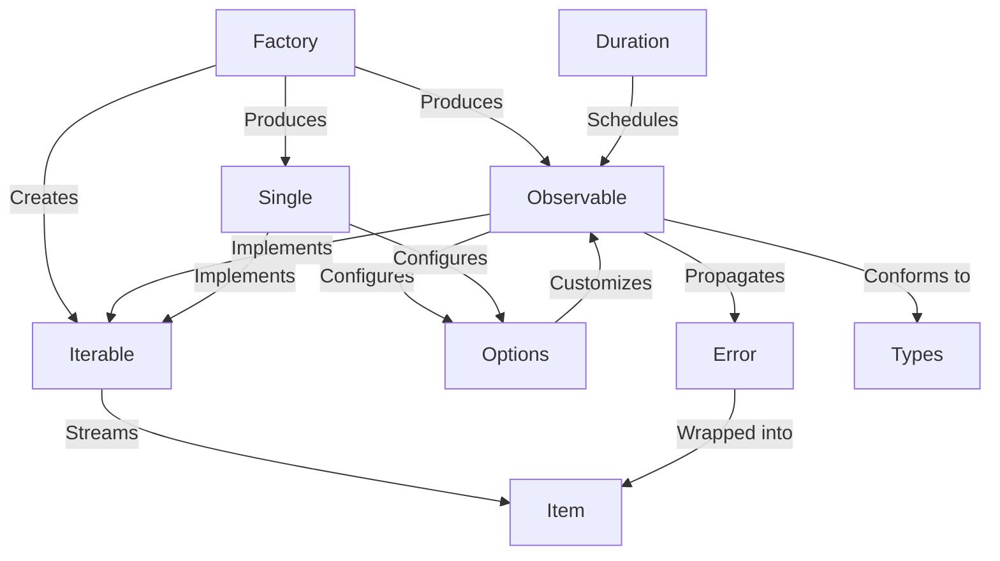

# Tutorial: RxGo

**RxGo** implements *reactive streams* over Go channels by providing **Iterable** (pull-based) and **Observable** (push-based) abstractions.  
**Single** represents a *future* of exactly one element.  
**Item** encloses a *discriminated union* that carries either a value or an error (**Error**) for uniform error propagation.  
A **Factory** exposes *factory methods* to instantiate streams from various sources, parameterized via **Options** (the *functional options* pattern) to configure *buffering*, *backpressure*, *concurrency*, and *scheduler* behaviors.  
**Duration** wraps native time primitives for *time-based* operators (interval, debounce, timer).  
Core **Types** define the *operator*, *subscription*, and *scheduler* contracts, enabling high-concurrency, non-blocking pipelines with *composable* transformations and error-handling strategies.

**Source Repository:** [https://github.com/ReactiveX/RxGo](https://github.com/ReactiveX/RxGo)

## Chapters

1. [Iterable](01_iterable.md)
2. [Observable](02_observable.md)
3. [Single](03_single.md)
4. [Factory](04_factory.md)
5. [Options](05_options.md)
6. [Duration](06_duration.md)
7. [Item](07_item.md)
8. [Error](08_error.md)
9. [Types](09_types.md)

---

Generated by fork of [AI Codebase Knowledge Builder](https://github.com/vegeta03/PocketFlow-Tutorial-Codebase-Knowledge.git)
