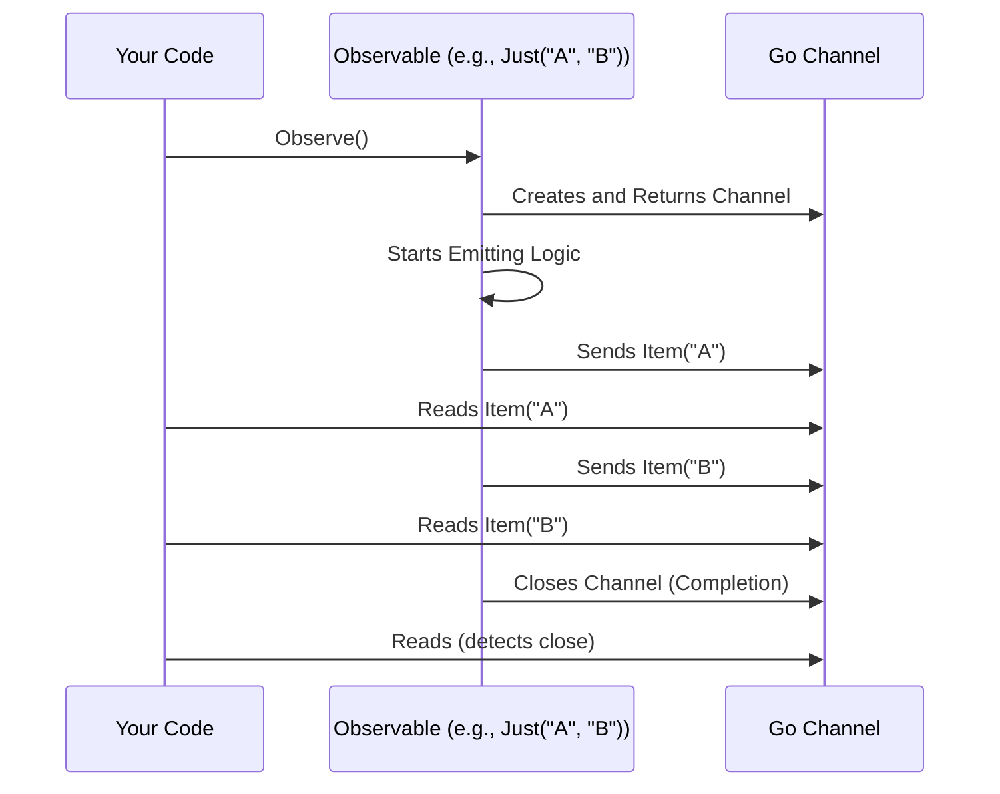

# Chapter 1: Observable

Welcome to the RxGo tutorial! We're excited to guide you through the world of reactive programming in Go. Let's start with the most fundamental concept: the **Observable**.

## What Problem Does an Observable Solve?

Imagine you're building an application that needs to react to events happening over time. Think about:

* User clicks on a button.
* Sensor readings arriving every second.
* Receiving messages from a chat server.

These aren't single, isolated pieces of data. They form a **sequence** or **stream** of events arriving asynchronously. How do you handle these streams efficiently and elegantly? Managing callbacks, channels, and potential errors manually can become complex quickly.

This is where RxGo and the `Observable` come in. An `Observable` provides a standard way to represent and work with these asynchronous streams of data.

## What is an Observable?

In RxGo, the `Observable` is the core building block.

> An **Observable** represents a stream of items that arrive over time. It can emit zero or multiple items, and might optionally terminate successfully (complete) or with an error.

Think of it like a **conveyor belt** in a factory:

```plaintext
 ベルト (Observable Stream)
------------------------------------------> Time
  [Item A]   [Item B]      [Item C] ... [Completion Signal | Error Signal]
```

* **Items:** Data packets (like `string`, `int`, `struct`, etc.) travel along the belt. We'll learn more about [Item](02_item_.md)s in the next chapter.
* **Over Time:** Items don't necessarily arrive all at once. They can appear Seconds, minutes, or even milliseconds apart.
* **Completion/Error:** The belt can eventually signal that it's finished normally (completion) or that something went wrong (error). Once it signals completion or error, it won't emit any more items.
* **Zero Items:** Some belts might finish without ever carrying an item.

You can create these "conveyor belts" (Observables) from various sources, such as:

* A fixed list of values you already have.
* Data coming from a Go channel.
* Events happening at regular time intervals.

We'll explore how to create Observables in [Observable Creation (Factories)](04_observable_creation__factories__.md).

## A Simple Example: Our First Observable

Let's create a very basic Observable that emits just two strings and then completes. We'll use the `rxgo.Just` factory function (don't worry too much about *how* `Just` works yet, we'll cover that later).

```go
package main

import (
 "fmt"
 "github.com/reactivex/rxgo/v2"
)

func main() {
 // 1. Create an Observable that emits "Hello" and then "World!"
 observable := rxgo.Just("Hello", "World!")()

 // 2. Start observing the stream
 //    Observe() returns a Go channel
 ch := observable.Observe()

 // 3. Receive items from the channel
 fmt.Println("Receiving items:")
 item1 := <-ch // Receive the first item ("Hello")
 fmt.Println(item1.V) // Print its value

 item2 := <-ch // Receive the second item ("World!")
 fmt.Println(item2.V) // Print its value

 // 4. Check if the stream is finished
 _, ok := <-ch // Try to receive again
 if !ok {
  fmt.Println("Observable is closed (completed)!")
 }
}
```

**Explanation:**

1. `rxgo.Just("Hello", "World!")()`: This creates an `Observable` instance. Think of it as setting up a conveyor belt pre-loaded with two items: "Hello" and "World!".
2. `observable.Observe()`: This is crucial! It's like turning on the conveyor belt and getting the output chute (a Go channel `<-chan rxgo.Item`). Until you call `Observe()`, the `Observable` is often "cold" or "lazy" – it hasn't started emitting anything yet.
3. `item1 := <-ch` and `item2 := <-ch`: We read items from the channel provided by `Observe()`. The items arrive in the order they were defined in `Just`. `item.V` gives us the actual value ("Hello" or "World!").
4. `_, ok := <-ch`: After all items are emitted, the `Observable` completes. When an `Observable` completes successfully, the channel returned by `Observe()` is closed. Reading from a closed channel in Go returns the zero value for the type and `false` for the `ok` flag. This is how we know the stream is finished.

**Output:**

```plaintext
Receiving items:
Hello
World!
Observable is closed (completed)!
```

## Under the Hood (Conceptual)

What happens when you create and observe an Observable?

1. **Definition:** When you use a function like `rxgo.Just(...)()`, you are defining the *potential* stream of data – the blueprint for the conveyor belt.
2. **Subscription:** Calling `Observe()` signals your interest in the stream. This is often called "subscribing". This triggers the Observable to start its work.
3. **Emission:** The Observable begins emitting items according to its definition (e.g., sending the items provided to `Just` one by one).
4. **Propagation:** Emitted items (or errors) are sent down the channel returned by `Observe()`.
5. **Termination:** Once the Observable has emitted all its items (like `Just` does) or encounters an error, it sends a termination signal (closing the channel for completion, sending an error `Item` for errors).

Here's a simplified view:



## Under the Hood (Code Interfaces)

Behind the scenes, RxGo defines interfaces and structures to make this work.

* **`Iterable` Interface:** This is the most basic interface. Anything that can be observed implements this. It has one method:
  * `Observe(opts ...Option) <-chan Item` (from `iterable.go`): Returns the channel you use to receive items.

* **`Observable` Interface:** This interface embeds `Iterable` and adds dozens of methods (like `Map`, `Filter`, `Debounce`, etc.) called "operators" that allow you to transform, filter, and combine streams. We'll start learning about these in [Operators](05_operators_.md).

    ```go
    // From: observable.go (simplified)
    type Observable interface {
        Iterable // Has the Observe() method
        // ... many other operator methods like Map, Filter, etc.
    }
    ```

* **`ObservableImpl` Struct:** This is the standard concrete implementation of the `Observable` interface (defined in `observable.go`). When you call functions like `rxgo.Just()`, you typically get an `*ObservableImpl` back. You usually don't interact with `ObservableImpl` directly, but rather through the `Observable` interface.

Don't worry about the complex internals of `ObservableImpl` for now. The key takeaway is that an `Observable` gives you a way to `Observe()` it, which returns a channel (`<-chan Item`) for receiving the stream's data.

## Conclusion

You've learned the fundamental concept in RxGo: the **Observable**. It's a powerful abstraction representing a stream of items arriving over time, much like a conveyor belt. You saw how to create a simple Observable using `rxgo.Just` and how to receive its items by calling `Observe()` to get a channel.

You now understand that Observables:

* Represent asynchronous data streams.
* Emit zero or more items.
* Can complete successfully or terminate with an error.
* Are often lazy, starting emission only when observed.

But what exactly are these "items" flowing through the Observable? Let's dive into that in the next chapter.

**Next:** [Chapter 2: Item](02_item_.md)

---

Generated by [AI Codebase Knowledge Builder](https://github.com/The-Pocket/Tutorial-Codebase-Knowledge)
