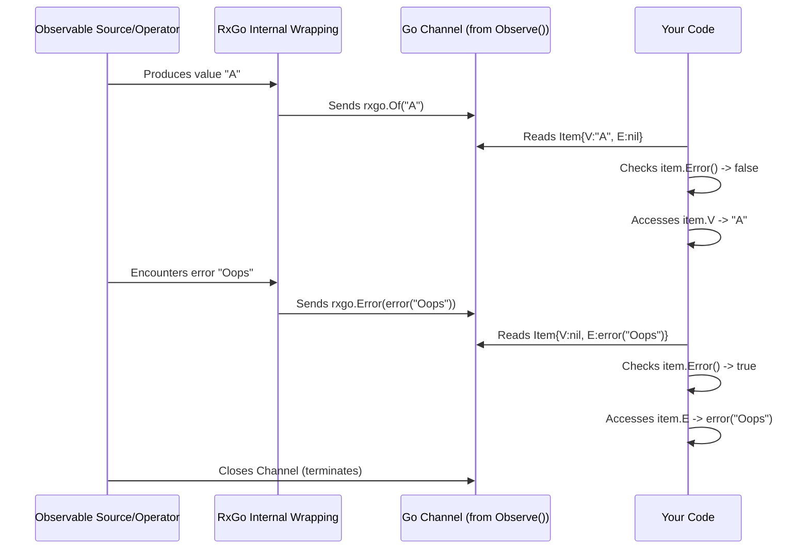

# Chapter 2: Item

Welcome back! In [Chapter 1: Observable](01_observable_.md), we learned about the `Observable`, which represents a stream of things arriving over time, like items on a conveyor belt. But what exactly *are* these "items" being carried by the stream? Let's find out!

## What Problem Does `Item` Solve?

Imagine our conveyor belt ([Observable](01_observable_.md)) again. Usually, it carries the things we expect – widgets, data packets, user events. But sometimes, something goes wrong *during* the processing on the belt. Maybe a machine jams, or a sensor reports a failure.

How can the conveyor belt signal this problem to the worker waiting at the end? It needs a standard way to carry *either* the normal product *or* a notification about an error that happened.

This is where the `Item` comes in. It's a standard container used within RxGo streams.

## What is an `Item`?

> An **`Item`** is the fundamental unit of data that flows through an Observable stream. It's a wrapper that holds either a successful **value** (`V`) or an **error** (`E`).

Think of it as the **box** travelling on the conveyor belt ([Observable](01_observable_.md)):

* **Normal Case:** The box (`Item`) contains the actual product or data (the **value**, `V`).
* **Error Case:** Something went wrong upstream. The box (`Item`) contains a note explaining the problem (the **error**, `E`).

Crucially, a single `Item` box will contain *either* a value *or* an error, never both. If it has an error (`E`), its value (`V`) will be `nil`. If it has a value (`V`), its error (`E`) field will be `nil`.

This design allows Observables to handle both successful data emission and error propagation using the exact same mechanism – sending `Item`s down the stream.

## Using `Item`: Checking the Box

In Chapter 1, we saw this code:

```go
package main

import (
 "fmt"
 "github.com/reactivex/rxgo/v2"
)

func main() {
 observable := rxgo.Just("Hello", "Danger!", "World!")() // Let's add an error

 ch := observable.Observe() // Get the channel of Items

 fmt.Println("Receiving items:")

 // Receive Item 1
 item1 := <-ch
 if item1.Error() { // Check if it's an error Item
  fmt.Println("Got an error:", item1.E)
 } else {
  fmt.Println("Got value:", item1.V) // Access the value
 }

 // Receive Item 2 (Let's pretend "Danger!" causes an error)
 // In a real scenario, an operator might transform "Danger!" into an error.
 // For simplicity here, we'll manually create an error item.
 // (Note: `Just` itself doesn't turn strings into errors.)
 // We'll simulate receiving an error item next.
 // let's just imagine the next item received WAS an error item:
 errItem := rxgo.Error(fmt.Errorf("something went wrong"))

 if errItem.Error() { // Check if it's an error Item
  fmt.Println("Got an error:", errItem.E) // Access the error
 } else {
  fmt.Println("Got value:", errItem.V)
 }

 // Normally, after an error, the stream stops.
    // Let's check if the channel is closed (it might not be immediately
    // after an error item depending on observable type, but often is).
 _, ok := <-ch
 if !ok {
  fmt.Println("Observable is closed!")
 } else {
        // We might receive "World!" if the stream continued,
        // but typically errors terminate the stream.
        // In the simple `Just` case, the channel closes after "World!".
        // The error simulation above is just for illustration.
        fmt.Println("Stream continued unexpectedly after error simulation.")
    }
}
```

**Explanation:**

1. `ch := observable.Observe()`: As before, this gives us a channel (`<-chan rxgo.Item`) that delivers `Item` instances.
2. `item1 := <-ch`: We receive the first box (`Item`) from the channel.
3. `if item1.Error()`: This is the crucial check! The `Item` type has an `Error()` method that returns `true` if the `Item` contains an error (`E` is not `nil`), and `false` otherwise.
4. `fmt.Println("Got value:", item1.V)`: If `item1.Error()` is `false`, we know it contains a value, which we can access using the `V` field.
5. `fmt.Println("Got an error:", item1.E)`: If `item1.Error()` is `true`, we know it contains an error, which we can access using the `E` field.
6. `errItem := rxgo.Error(...)`: We briefly use `rxgo.Error` here just to *show* what an error `Item` looks like and how to check it. In real streams, errors often originate from operators failing.
7. **Important:** Generally, when an `Observable` emits an error `Item`, it signals termination. No further value `Item`s will usually be emitted after an error. The channel might be closed shortly after.

**Simplified Conceptual Output (mixing the `Just` and the error simulation):**

```plaintext
Receiving items:
Got value: Hello
Got an error: something went wrong
Observable is closed!
```

*(Note: The actual output of the code above would differ slightly because `Just` completes normally after "World!", and we manually created the error `Item` outside the stream flow for illustration).*

## Creating Items (Quick Look)

While you mostly *receive* `Item`s when observing, RxGo provides simple helpers if you ever need to create them directly (e.g., when creating your own Observables):

* `rxgo.Of(someValue)`: Creates an `Item` containing the `someValue` in its `V` field.

    ```go
    item := rxgo.Of("Success!")
    // item.V == "Success!"
    // item.E == nil
    // item.Error() == false
    ```

* `rxgo.Error(someError)`: Creates an `Item` containing the `someError` in its `E` field.

    ```go
    item := rxgo.Error(fmt.Errorf("failed"))
    // item.V == nil
    // item.E != nil (it's the error we passed)
    // item.Error() == true
    ```

## Under the Hood (Conceptual)

How does an `Item` fit into the flow we saw in Chapter 1?

1. **Origin:** An [Observable](01_observable_.md) source (like `Just`, or data from a channel, or a timer) produces a raw value (e.g., `"Hello"`) or encounters an error (e.g., network timeout).
2. **Wrapping:** Before sending anything down the channel you get from `Observe()`, the `Observable` wraps the value or the error into an `Item` box using `rxgo.Of()` or `rxgo.Error()`.
3. **Transmission:** This `Item` box is sent through the channel.
4. **Receiving & Unpacking:** Your code receives the `Item` from the channel and uses the `.Error()`, `.V`, and `.E` fields/methods to check the box and get its contents.



## Under the Hood (Code)

The magic happens within the `Item` struct itself, defined in `item.go`:

```go
// From: item.go (simplified)

// Item is a wrapper having either a value or an error.
type Item struct {
 V interface{} // Holds the value (can be any type)
 E error       // Holds the error
}

// Error checks if an item is an error.
func (i Item) Error() bool {
 return i.E != nil
}

// Of creates an item from a value.
func Of(v interface{}) Item {
 return Item{V: v}
}

// Error creates an item from an error.
func Error(err error) Item {
 return Item{E: err}
}
```

**Explanation:**

* `type Item struct { ... }`: Defines the structure. It's quite simple!
* `V interface{}`: A field named `V` to hold the actual data. `interface{}` means it can hold a value of *any* Go type (string, int, struct, etc.). If the `Item` represents an error, `V` will be `nil`.
* `E error`: A field named `E` to hold an error value. If the `Item` represents a successful value, `E` will be `nil`.
* `func (i Item) Error() bool`: A method associated with the `Item` struct. It simply checks if the `E` field is non-`nil` and returns `true` or `false`. This is the standard way to check if an `Item` carries an error.
* `Of(v interface{}) Item` and `Error(err error) Item`: These are the factory functions we saw earlier for conveniently creating `Item` instances.

## Conclusion

You've now met the **`Item`**, the standard package carried by all RxGo [Observable](01_observable_.md) streams. You learned:

* An `Item` acts as a **wrapper** containing either a **value (`V`)** or an **error (`E`)**.
* This allows streams to handle success and failure consistently.
* You receive `Item`s from the channel returned by `Observe()`.
* You **must check** `item.Error()` before accessing `item.V` to avoid panics if the `Item` actually holds an error.
* Access the value with `item.V` and the error with `item.E`.

Now that we understand the `Observable` stream and the `Item`s it carries, how do we actually *process* these items in more detail? How do we react to values, handle errors gracefully, and know when the stream is finished?

**Next:** [Chapter 3: Observing / Subscribing](03_observing___subscribing_.md)

---

Generated by [AI Codebase Knowledge Builder](https://github.com/The-Pocket/Tutorial-Codebase-Knowledge)
