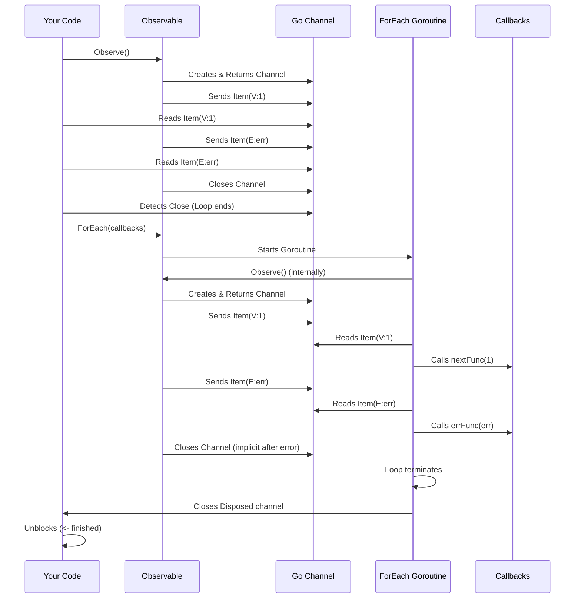

# Chapter 3: Observing / Subscribing

In the previous chapters, we learned about the [Observable](01_observable_.md) (our data stream conveyor belt) and the [Item](02_item_.md) (the boxes carrying values or errors on the belt). Great! We have a belt carrying boxes, but how do we actually *get* those boxes and do something with them? How do we set up our worker at the end of the belt?

This process of connecting to an [Observable](01_observable_.md) to receive its emissions is called **Observing** or **Subscribing**.

## What Problem Does Observing/Subscribing Solve?

Imagine our conveyor belt ([Observable](01_observable_.md)) is running, carrying boxes ([Item](02_item_.md)s). If nobody is there to watch it or take the boxes off, the belt runs for nothing! We need a way to:

1. **Connect** to the stream.
2. **Receive** each item as it arrives.
3. **React** appropriately: process the value if it's a normal box, handle the error if it's an error notification, and know when the belt has stopped.

RxGo provides two main ways to achieve this, catering to different needs and programming styles.

## Method 1: `Observe()` - The Direct Channel

The first, and often most Go-idiomatic way, is using the `Observe()` method we already saw briefly in previous chapters.

> Calling `Observe()` on an [Observable](01_observable_.md) **starts** the stream (if it's a "cold" observable, more on that later in [Hot vs. Cold Observables](07_hot_vs__cold_observables_.md)) and returns a **read-only Go channel** (`<-chan rxgo.Item`).

Think of `Observe()` as positioning a chute at the end of the conveyor belt. The boxes ([Item](02_item_.md)s) drop into this chute (the channel), and your code can pull them out one by one.

**How to Use It:**

1. Call `yourObservable.Observe()`.
2. Use a `for ... range` loop or direct channel reads (`<-ch`) to receive `Item`s from the returned channel.
3. Inside the loop/read, **always check `item.Error()`**:
    * If `true`, handle the error (`item.E`). Usually, the stream stops after an error.
    * If `false`, process the value (`item.V`).
4. When the [Observable](01_observable_.md) completes successfully *without* an error, the channel will be **closed**. A `for ... range` loop will naturally exit. If reading directly (`<-ch`), the read will return a zero `Item` and `false` for the `ok` value.

**Example:**

Let's observe a stream that emits numbers, one of which might be an error.

```go
package main

import (
 "context"
 "fmt"
 "github.com/reactivex/rxgo/v2"
 "errors"
)

func main() {
 // Create an Observable that emits 1, 2, then an error
 observable := rxgo.Create([]rxgo.Producer{
  func(ctx context.Context, next chan<- rxgo.Item) {
   next <- rxgo.Of(1)
   next <- rxgo.Of(2)
   next <- rxgo.Error(errors.New("something went wrong"))
   // Note: The stream usually stops after an error.
   // We won't send 3.
   // next <- rxgo.Of(3)
  }})

 // 1. Start observing and get the channel
 ch := observable.Observe()

 fmt.Println("Observing with channel...")
 // 2. & 3. Loop through items, checking for errors
 for item := range ch { // Loop continues until channel is closed
  if item.Error() {
   fmt.Println("Received Error:", item.E)
   // Error terminates the loop implicitly because the Observable stops
  } else {
   fmt.Println("Received Value:", item.V)
  }
 }

 // 4. The loop finishes when the channel is closed
 fmt.Println("Observation finished.")
}
```

**Explanation:**

1. `observable.Observe()`: We connect to the stream and get our channel `ch`.
2. `for item := range ch`: This loop reads from `ch`. It will automatically stop when `ch` is closed.
3. `if item.Error()`: We check each incoming `Item`. If it's an error, we print it. If it's a value, we print that.
4. When the `rxgo.Error` is sent, the `Observable` typically stops and closes the underlying channel, causing the `for...range` loop to terminate.

**Output:**

```plaintext
Observing with channel...
Received Value: 1
Received Value: 2
Received Error: something went wrong
Observation finished.
```

This channel-based approach feels very natural in Go, integrating directly with familiar concurrency patterns.

## Method 2: `ForEach()` - Callback Functions

The second way is using the `ForEach()` method.

> Calling `ForEach()` allows you to register **callback functions** that RxGo will invoke automatically when specific events occur: a new value arriving, an error occurring, or the stream completing.

Think of `ForEach()` like setting up sensors and actuators at the end of the conveyor belt:

* A sensor for good boxes (`NextFunc`) triggers an action (e.g., count the item).
* A sensor for damaged boxes (`ErrFunc`) triggers an alarm (e.g., log the error).
* A sensor that detects the belt stopping (`CompletedFunc`) triggers a final action (e.g., turn off the lights).

**How to Use It:**

1. Call `yourObservable.ForEach()`, passing three functions:
    * `nextFunc`: Executed for every **value** `Item`. Receives the value (`interface{}`) directly.
    * `errFunc`: Executed if an **error** `Item` is received. Receives the `error` directly. Only called once, as errors usually terminate the stream.
    * `completedFunc`: Executed when the stream **completes successfully** *without* an error. Takes no arguments.
2. `ForEach` is **non-blocking** by default. It starts the observation in a new goroutine and returns immediately. It returns a `Disposed` channel (`<-chan struct{}`), which is closed when the observation finishes (either by completion or error). You can wait on this channel (`<-observable.ForEach(...)`) to make your code block until the stream finishes.

**Example:**

Let's observe the same stream as before, but using callbacks.

```go
package main

import (
 "context"
 "fmt"
 "github.com/reactivex/rxgo/v2"
 "errors"
)

func main() {
 // Same Observable as before
 observable := rxgo.Create([]rxgo.Producer{
  func(ctx context.Context, next chan<- rxgo.Item) {
   next <- rxgo.Of(1)
   next <- rxgo.Of(2)
   next <- rxgo.Error(errors.New("something went wrong"))
   // next <- rxgo.Of(3) // Won't be sent
  }})

 fmt.Println("Observing with ForEach...")

 // 1. Call ForEach with callbacks
 // 2. Use <- to wait for completion/error
 <-observable.ForEach(
  // nextFunc: Called for values (Item.V)
  func(v interface{}) {
   fmt.Println("Received Value:", v)
  },
  // errFunc: Called for errors (Item.E)
  func(err error) {
   fmt.Println("Received Error:", err)
  },
  // completedFunc: Called on successful completion (no error)
  func() {
   fmt.Println("Observation completed successfully.")
  },
 )

 fmt.Println("Observation finished.")
}

```

**Explanation:**

1. We call `observable.ForEach()` with three inline functions.
2. `func(v interface{}) { ... }`: This is our `NextFunc`. It gets called for `1` and `2`.
3. `func(err error) { ... }`: This is our `ErrFunc`. It gets called when the `rxgo.Error` is emitted.
4. `func() { ... }`: This is our `CompletedFunc`. It **does not** get called in this case because the stream terminated with an error, not successful completion.
5. `<-observable.ForEach(...)`: We use the read `<-` to block the `main` function until the `ForEach` observation finishes (in this case, after the error callback is executed).

**Output:**

```plaintext
Observing with ForEach...
Received Value: 1
Received Value: 2
Received Error: something went wrong
Observation finished.
```

This callback approach can be convenient when you want to define distinct actions for each event type directly where you subscribe.

## Under the Hood (Conceptual)

How do these methods work internally?

* **`Observe()`:**
    1. You call `Observe()`.
    2. The [Observable](01_observable_.md) implementation creates a Go channel.
    3. It starts its underlying logic (e.g., reading from a source, iterating values).
    4. As it produces values or errors, it wraps them in an `Item` using `rxgo.Of()` or `rxgo.Error()`.
    5. It sends the `Item` onto the channel it created.
    6. When done (or error), it closes the channel.
    7. Your code reads directly from this channel.

* **`ForEach()`:**
    1. You call `ForEach()` with your callbacks.
    2. `ForEach` *internally* calls `Observe()` to get the channel (just like in the first method!).
    3. It starts a **new goroutine**.
    4. This goroutine reads from the channel using a `for ... range` loop.
    5. Inside *its* loop, it checks `item.Error()`:
        * If `false`: It calls your `nextFunc` with `item.V`.
        * If `true`: It calls your `errFunc` with `item.E` and stops the loop.
    6. If the channel closes *without* an error being sent, the loop finishes, and it calls your `completedFunc`.
    7. Finally, it closes the `Disposed` channel that `ForEach` returned to you.

Here’s a simplified diagram comparing the flows:



## Under the Hood (Code)

* **`Observe()`:** The `Iterable` interface (which [Observable](01_observable_.md) embeds) defines this method. It's the fundamental way to get data out.

    ```go
    // From: iterable.go
    type Iterable interface {
        // Observe starts the emission of items and returns a channel.
        Observe(opts ...Option) <-chan Item
    }
    ```

    Implementations like `ObservableImpl` provide the logic to create the channel and push items into it when `Observe()` is called.

* **`ForEach()`:** This is a method on the `Observable` interface.

    ```go
    // From: observable.go (simplified signature)
    type Observable interface {
        Iterable
        // ... other methods ...
        ForEach(nextFunc NextFunc, errFunc ErrFunc, completedFunc CompletedFunc, opts ...Option) Disposed
        // ... other methods ...
    }

    // From: types.go (simplified definitions)
    type NextFunc func(interface{})
    type ErrFunc func(error)
    type CompletedFunc func()
    type Disposed <-chan struct{} // Channel closed on completion/error
    ```

    The implementation of `ForEach` (in `observable.go` or related files) performs the steps described conceptually: call `Observe()`, start a goroutine, loop over the channel, call the appropriate callback, and close the returned `Disposed` channel. You can find more docs on ForEach [here](doc/foreach.md).

## Conclusion

You've learned the two primary ways to connect to an [Observable](01_observable_.md) and receive its emissions:

1. **`Observe()`**: Returns a Go channel (`<-chan rxgo.Item`). You read from the channel directly, check `Item.Error()`, and handle completion via channel closing. This is often preferred for its Go-idiomatic feel.
2. **`ForEach()`**: Takes `NextFunc`, `ErrFunc`, and `CompletedFunc` callbacks. It handles the channel reading internally and calls your functions for each event type. It's non-blocking by default but returns a `Disposed` channel to allow waiting.

Choosing between them depends on your preference and the specific situation. Sometimes direct channel manipulation is clearer, while other times callbacks fit the logic better.

Now that we know how to create a basic [Observable](01_observable_.md), understand the `Item`s it carries, and know how to *observe* the stream, let's explore the various ways RxGo allows us to *create* Observables from different sources.

**Next:** [Chapter 4: Observable Creation (Factories)](04_observable_creation__factories__.md)

---

Generated by [AI Codebase Knowledge Builder](https://github.com/The-Pocket/Tutorial-Codebase-Knowledge)
