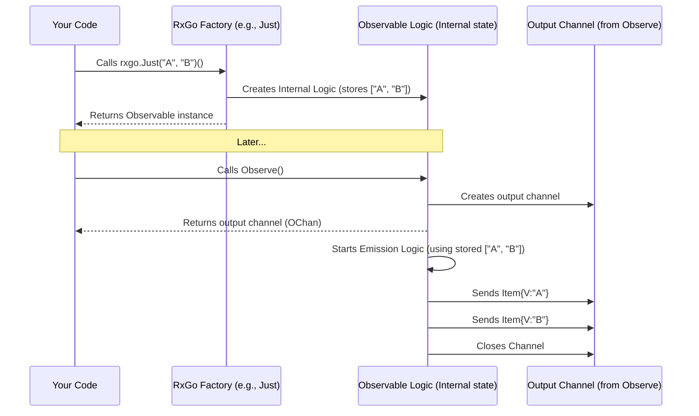

# Chapter 4: Observable Creation (Factories)

Welcome back! In [Chapter 3: Observing / Subscribing](03_observing___subscribing_.md), we learned how to connect to an [Observable](01_observable_.md) using `Observe()` or `ForEach()` to receive its [Item](02_item_.md)s. We saw how to handle values, errors, and completion.

But how do these [Observable](01_observable_.md)s (our conveyor belts) get created in the first place? How do we start the stream and define what items it will carry?

## What Problem Do Creation Functions Solve?

Think about our conveyor belt analogy. Sometimes you want to start a belt that carries specific items you already have (like pre-packaged boxes). Other times, you want the belt to activate based on something else happening, like items arriving from another machine (a Go channel) or maybe just sending a signal every few seconds (a timer).

We need different ways to **start** the stream based on the source of the data or the desired behavior. RxGo provides several "factory functions" specifically for creating Observables from common sources.

These factory functions are like different ways to build and start the conveyor belt:

* Load it with specific items you have right now.
* Connect its input to another machine's output (a channel).
* Set it up to send a pulse at regular intervals.
* Give it custom instructions for producing items.

Let's look at some of the most common ways to create Observables.

## Creating Observables: The Factory Functions

RxGo provides functions (often called "factories" or "creation operators") that build and return a new [Observable](01_observable_.md) instance.

### 1. `rxgo.Just`: From Fixed Items

This is the simplest way. You use `Just` when you already have a fixed list of values you want the [Observable](01_observable_.md) to emit, one after another, and then complete.

Think of it as pre-loading the conveyor belt with a specific set of boxes.

```go
package main

import (
 "fmt"
 "github.com/reactivex/rxgo/v2"
)

func main() {
 // Create an Observable emitting 10, 20, then 30
 observable := rxgo.Just(10, 20, 30)() // Pass items directly

 // Observe the stream
 ch := observable.Observe()

 fmt.Println("Observing items from Just():")
 for item := range ch {
  if item.Error() {
   fmt.Println("Error:", item.E)
  } else {
   fmt.Println("Value:", item.V)
  }
 }
 fmt.Println("Just() stream finished.")
}
```

**Explanation:**

* `rxgo.Just(10, 20, 30)()`: This creates an [Observable](01_observable_.md) that knows it needs to emit the [Item](02_item_.md) `rxgo.Of(10)`, then `rxgo.Of(20)`, then `rxgo.Of(30)`, and finally signal completion (close the channel). The `()` at the end executes the factory function.
* The `for item := range ch` loop receives these items sequentially.

**Output:**

```plaintext
Observing items from Just():
Value: 10
Value: 20
Value: 30
Just() stream finished.
```

### 2. `rxgo.FromChannel`: From a Go Channel

What if your data is coming from somewhere else asynchronously, maybe delivered via a standard Go channel? `FromChannel` bridges the gap. It creates an [Observable](01_observable_.md) that wraps an existing Go channel.

Think of connecting the input of your RxGo conveyor belt to the output chute of another machine (the Go channel).

```go
package main

import (
 "fmt"
 "github.com/reactivex/rxgo/v2"
)

func main() {
 // 1. Create a standard Go channel
 goCh := make(chan rxgo.Item, 1) // Buffer helps prevent blocking producer

 // 2. Start a goroutine to send data to the Go channel
 go func() {
  fmt.Println("Producer: Sending 'Apple'")
  goCh <- rxgo.Of("Apple") // Send an Item
  fmt.Println("Producer: Sending 'Banana'")
  goCh <- rxgo.Of("Banana") // Send another Item
  fmt.Println("Producer: Closing channel")
  close(goCh) // IMPORTANT: Close the channel to signal completion
 }()

 // 3. Create an Observable FROM the Go channel
 observable := rxgo.FromChannel(goCh)

 // 4. Observe the RxGo stream
 ch := observable.Observe()
 fmt.Println("Observing items from FromChannel():")
 for item := range ch {
  if item.Error() {
   fmt.Println("Error:", item.E)
  } else {
   fmt.Println("Received Value:", item.V)
  }
 }
 fmt.Println("FromChannel() stream finished.")
}
```

**Explanation:**

1. `goCh := make(chan rxgo.Item, 1)`: We create a regular Go channel that carries `rxgo.Item`s.
2. The goroutine simulates an external source sending items (wrapped with `rxgo.Of`) into `goCh` and then closing it. Closing the underlying Go channel is how `FromChannel` knows the stream has completed normally.
3. `rxgo.FromChannel(goCh)`: This creates the [Observable](01_observable_.md). It will read from `goCh` and pass the received `Item`s along its own stream.
4. Observing the `observable` works just like before.

**Output (order of producer/receiver lines may vary slightly):**

```plaintext
Observing items from FromChannel():
Producer: Sending 'Apple'
Producer: Sending 'Banana'
Producer: Closing channel
Received Value: Apple
Received Value: Banana
FromChannel() stream finished.
```

### 3. `rxgo.Interval`: Timed Emissions

Sometimes, you need an [Observable](01_observable_.md) that emits items at regular time intervals, like a metronome. `Interval` does this, emitting sequential integers (0, 1, 2, ...) spaced by a duration you specify.

Think of a machine that puts a numbered ticket onto the conveyor belt every N seconds.

```go
package main

import (
 "fmt"
 "github.com/reactivex/rxgo/v2"
 "time"
)

func main() {
 // Create an Observable that emits 0, 1, 2... every 500ms
 // We use rxgo.WithDuration to specify the interval.
 intervalObservable := rxgo.Interval(rxgo.WithDuration(500 * time.Millisecond))

 // Observe the stream (we'll only take the first 4 items for this demo)
 ch := intervalObservable.Observe()
 fmt.Println("Observing items from Interval():")
 for i := 0; i < 4; i++ {
  item := <-ch // Read directly from channel this time
  if item.Error() {
   fmt.Println("Error:", item.E)
   break // Stop if error
  } else {
   fmt.Println("Received Value:", item.V)
  }
 }
 fmt.Println("Finished observing Interval() snippet.")
 // Note: Interval() runs indefinitely unless stopped (e.g., via context or operators)
 // We manually stopped observing after 4 items here.
}
```

**Explanation:**

* `rxgo.Interval(rxgo.WithDuration(500 * time.Millisecond))`: This creates an [Observable](01_observable_.md) that will:
  * Wait 500ms, emit `rxgo.Of(0)`.
  * Wait another 500ms, emit `rxgo.Of(1)`.
  * Wait another 500ms, emit `rxgo.Of(2)`.
  * ...and so on, indefinitely.
* `rxgo.WithDuration(...)` is an **Option**, a way to configure operators. We'll cover [Options](06_options_.md) in more detail later.
* We manually read only 4 items using `<-ch` in a loop. In a real app, you'd often use operators like `Take(4)` or provide a `context` to manage the lifetime of the `Interval`.

**Output:**

```plaintext
Observing items from Interval():
Received Value: 0  // after ~500ms
Received Value: 1  // after ~1000ms
Received Value: 2  // after ~1500ms
Received Value: 3  // after ~2000ms
Finished observing Interval() snippet.
```

### 4. `rxgo.Create`: Programmatic Creation

What if none of the standard factories fit? Maybe you need custom logic to decide *when* and *what* to emit. `Create` gives you full control. You provide a `Producer` function that receives the output channel (`chan<- rxgo.Item`) and can push items into it programmatically.

Think of giving the conveyor belt factory a custom blueprint and worker instructions.

```go
package main

import (
 "context"
 "errors"
 "fmt"
 "github.com/reactivex/rxgo/v2"
)

func main() {
 // Create an Observable using a custom producer function
 customObservable := rxgo.Create([]rxgo.Producer{
  // This function defines the emission logic
  func(ctx context.Context, next chan<- rxgo.Item) {
   fmt.Println("Producer: Sending 'First'")
   next <- rxgo.Of("First") // Send a value

   fmt.Println("Producer: Sending 'Second'")
   next <- rxgo.Of("Second") // Send another value

   fmt.Println("Producer: Sending an Error")
   next <- rxgo.Error(errors.New("custom error")) // Send an error

   // Usually, nothing is sent after an error
   // next <- rxgo.Of("Third")
  },
  // You can provide multiple Producers, they usually run sequentially
  // func(ctx context.Context, next chan<- rxgo.Item) { ... }
 })

 // Observe the custom stream
 ch := customObservable.Observe()
 fmt.Println("Observing items from Create():")
 for item := range ch {
  if item.Error() {
   fmt.Println("Received Error:", item.E)
  } else {
   fmt.Println("Received Value:", item.V)
  }
 }
 fmt.Println("Create() stream finished.")
}
```

**Explanation:**

* `rxgo.Create([]rxgo.Producer{ ... })`: We pass a slice containing our custom producer function(s).
* `func(ctx context.Context, next chan<- rxgo.Item)`: Our function gets the `context` (for cancellation, see later chapters) and the `next` channel. This `next` channel is the input to the pipe that `Observe()` will eventually return.
* Inside the function, we use `next <- ...` to send `Item`s (values via `rxgo.Of` or errors via `rxgo.Error`).
* The [Observable](01_observable_.md) created by `Create` finishes when the producer function finishes *and* the `next` channel doesn't need to be written to anymore (or implicitly after sending an error).

**Output:**

```plaintext
Observing items from Create():
Producer: Sending 'First'
Received Value: First
Producer: Sending 'Second'
Received Value: Second
Producer: Sending an Error
Received Error: custom error
Create() stream finished.
```

### 5. `rxgo.Defer`: Fresh Observable Per Observer

Sometimes, you want the creation logic (like in `Create` or even a `Just`) to run *separately* for *each* observer that connects. `Defer` achieves this. It takes producer functions (similar to `Create`), but it doesn't execute them until someone calls `Observe()`. Furthermore, if a *second* observer calls `Observe()`, `Defer` runs the producer logic *again*, creating a completely independent stream.

Think of `Defer` as providing blueprints for the conveyor belt. Each time a worker asks for a belt (`Observe()`), the factory builds a brand new one based on the blueprint. This contrasts with `FromChannel` (hot) where everyone watches the *same* belt. `Just`, `Create`, `Interval` are typically "cold" like `Defer`, meaning they start fresh for each observer.

```go
package main

import (
 "context"
 "fmt"
 "github.com/reactivex/rxgo/v2"
 "sync"
)

func main() {
 fmt.Println("Defining Defer Observable...")
 // This producer will print when it's executed
 deferredObservable := rxgo.Defer([]rxgo.Producer{
  func(ctx context.Context, next chan<- rxgo.Item) {
   fmt.Println("--- Producer Logic Executing ---")
   next <- rxgo.Of("Alpha")
   next <- rxgo.Of("Beta")
   // Completion happens when function returns
  },
 })

 var wg sync.WaitGroup // Use WaitGroup to wait for observers

 // Observer 1
 wg.Add(1)
 go func() {
  defer wg.Done()
  fmt.Println("Observer 1: Subscribing...")
  ch1 := deferredObservable.Observe()
  for item := range ch1 {
   fmt.Println("Observer 1:", item.V)
  }
  fmt.Println("Observer 1: Finished.")
 }()

 // Observer 2 - Starts slightly later
 time.Sleep(10 * time.Millisecond) // Ensure observer 1 subscribes first
 wg.Add(1)
 go func() {
  defer wg.Done()
  fmt.Println("Observer 2: Subscribing...")
  ch2 := deferredObservable.Observe()
  for item := range ch2 {
   fmt.Println("Observer 2:", item.V)
  }
  fmt.Println("Observer 2: Finished.")
 }()

 // Wait for both observers to finish
 wg.Wait()
}

```

**Explanation:**

* `rxgo.Defer([]rxgo.Producer{...})`: We define the producer logic, but it doesn't run yet.
* When Observer 1 calls `Observe()`, the producer function executes *for the first time*, printing `--- Producer Logic Executing ---` and sending "Alpha", "Beta" to Observer 1.
* When Observer 2 calls `Observe()`, the producer function executes *again, completely independently*, printing its own `--- Producer Logic Executing ---` message and sending a *fresh* set of "Alpha", "Beta" items to Observer 2.

**Output (order within observers is fixed, relative order between observers may vary slightly):**

```plaintext
Defining Defer Observable...
Observer 1: Subscribing...
--- Producer Logic Executing ---
Observer 1: Alpha
Observer 1: Beta
Observer 1: Finished.
Observer 2: Subscribing...
--- Producer Logic Executing ---
Observer 2: Alpha
Observer 2: Beta
Observer 2: Finished.
```

Notice how `--- Producer Logic Executing ---` appears twice? This shows `Defer` ran the creation logic separately for each observer. This is characteristic of "Cold" Observables, which we'll discuss more in [Chapter 7: Hot vs. Cold Observables](07_hot_vs__cold_observables_.md).

## Under the Hood (Conceptual)

When you call a factory function like `rxgo.Just("A", "B")()`:

1. **Definition:** RxGo creates an internal representation of the [Observable](01_observable_.md). It stores the necessary information (e.g., the list `["A", "B"]` for `Just`, the channel for `FromChannel`, the producer function for `Create`/`Defer`). It doesn't usually *start* doing anything yet.
2. **Return:** The factory function returns this `Observable` instance to your code.
3. **Subscription:** Later, when you call `Observe()` on that instance:
    * The Observable creates the output Go channel.
    * It looks at its stored information (the items, the source channel, the producer function).
    * It starts executing its specific logic (e.g., iterating the list, reading the channel, calling the producer function).
    * As it generates values or errors, it wraps them in an `Item` (`rxgo.Of` or `rxgo.Error`) and sends them into the output channel.
    * When finished or failed, it closes the output channel.



## Under the Hood (Code)

These factory functions are typically located in `factory.go` within the RxGo library.

```go
// From: factory.go (Conceptual Signatures)

// Just creates an Observable with the provided items.
func Just(items ...interface{}) func(opts ...Option) Observable {
    // Returns a function that, when called with options,
    // creates an iterable/observable that holds onto 'items'.
}

// FromChannel creates a cold observable from a channel.
func FromChannel(next <-chan Item, opts ...Option) Observable {
    // Creates an iterable/observable that reads from 'next' channel.
}

// Interval creates an Observable emitting incremental integers infinitely between
// each given time interval.
func Interval(interval Duration, opts ...Option) Observable {
    // Creates an iterable/observable that uses timers based on 'interval'.
}

// Create creates an Observable from scratch by calling observer methods programmatically.
func Create(f []Producer, opts ...Option) Observable {
 // Creates an iterable/observable storing the producer functions 'f'.
}

// Defer does not create the Observable until the observer subscribes,
// and creates a fresh Observable for each observer.
func Defer(f []Producer, opts ...Option) Observable {
    // Creates an iterable/observable storing producers 'f', marked for deferred execution.
}
```

**Explanation:**

* These functions primarily set up the internal structure (often an implementation of the `Iterable` interface like `justIterable`, `channelIterable`, `createIterable`, `deferIterable`) that holds the necessary data or functions.
* They return this as an `Observable` (which embeds `Iterable`).
* The real work of emission usually happens inside the `Observe()` method implemented by these specific internal iterable types, which gets called when you subscribe.

You don't need to know the intricate details of each iterable implementation, just that calling the factory function prepares the [Observable](01_observable_.md) with the right logic for its source.

## Conclusion

You've now learned about **Observable Creation Factories** – the functions RxGo provides to start your streams. You saw how to create Observables from:

* Fixed values (`rxgo.Just`)
* Go channels (`rxgo.FromChannel`)
* Time intervals (`rxgo.Interval`)
* Custom programmatic logic (`rxgo.Create`)
* Deferred logic for each observer (`rxgo.Defer`)

These factories are your starting points for building reactive data flows. You know how to create the "conveyor belt" and put the initial items on it.

But what if you want to *change* the items as they flow down the belt? Filter out unwanted items? Combine items from different belts? That's where the power of **Operators** comes in. Let's explore them next!

**Next:** [Chapter 5: Operators](05_operators_.md)

---

Generated by [AI Codebase Knowledge Builder](https://github.com/The-Pocket/Tutorial-Codebase-Knowledge)
