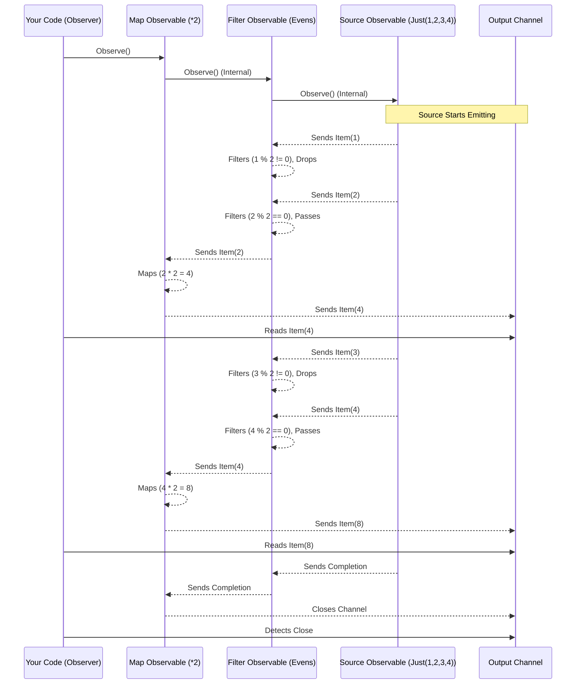

# Chapter 5: Operators

In [Chapter 4: Observable Creation (Factories)](04_observable_creation__factories__.md), we learned how to create our [Observable](01_observable_.md) streams (our conveyor belts) from various sources like lists, channels, or timers. Now we have a stream flowing, but what if we want to *modify* the [Item](02_item_.md)s as they travel along the belt?

## What Problem Do Operators Solve?

Imagine our conveyor belt ([Observable](01_observable_.md)) is carrying raw materials. We probably don't just want the raw materials at the end. We need to process them! Perhaps we need to:

* **Change** each item (e.g., paint a wooden block red).
* **Remove** certain items (e.g., discard defective blocks).
* **Group** items together (e.g., package blocks in sets of three).
* **Combine** items from different belts.

Doing this processing *after* you receive all items from `Observe()` can be inefficient or complex, especially for infinite streams or streams with many items. We need a way to apply these transformations *as the items flow through the stream*.

This is where **Operators** come in.

## What are Operators?

> **Operators** are functions that work on [Observable](01_observable_.md)s. They take an input [Observable](01_observable_.md), perform some manipulation on its [Item](02_item_.md)s, and return a **new** [Observable](01_observable_.md) with the modified stream.

Think of operators as **workstations** along the conveyor belt:

```plaintext
[Source Observable] ---> [Operator 1 Workstation] ---> [Operator 2 Workstation] ---> [Observer]
       |                         |                             |
   (Raw Item)               (Item Modified by Op 1)          (Item Modified by Op 2)
```

* One workstation might filter out defective items (`Filter`).
* Another might change the item's shape (`Map`).
* Another might bundle items together (`BufferWithCount`).

RxGo offers a rich collection of over 80 operators to handle various stream manipulation tasks. Let's look at a few fundamental types.

## Example Operators in Action

We'll use `rxgo.Just(1, 2, 3, 4)()` as our source [Observable](01_observable_.md) for these examples. It emits the numbers 1, 2, 3, 4 and then completes.

### 1. Transformation: `Map`

The `Map` operator transforms each [Item](02_item_.md) by applying a function you provide.

Imagine a workstation that takes each number and doubles it.

```go
package main

import (
 "context"
 "fmt"
 "github.com/reactivex/rxgo/v2"
)

func main() {
 // Source: Emits 1, 2, 3, 4
 source := rxgo.Just(1, 2, 3, 4)()

 // Apply the Map operator: Double each number
 mappedObservable := source.Map(func(_ context.Context, item interface{}) (interface{}, error) {
  number := item.(int) // Assert type
  return number * 2, nil // Return the doubled value
 })

 // Observe the result of the Map operation
 fmt.Println("Observing mapped items:")
 for item := range mappedObservable.Observe() {
  fmt.Println("Value:", item.V)
 }
 fmt.Println("Map stream finished.")
}
```

**Explanation:**

1. `source.Map(...)`: We call the `Map` operator on our `source` Observable.
2. `func(_ context.Context, item interface{}) (interface{}, error)`: We provide a function that takes the context and an incoming `item` (of type `interface{}`) and returns the transformed `item` (also `interface{}`) and an optional error.
3. `number := item.(int)`: We need to tell Go the actual type of the item (`int`) to work with it.
4. `return number * 2, nil`: We return the doubled number.
5. `mappedObservable`: The `Map` operator returns a *new* Observable that emits the transformed items.
6. Observing `mappedObservable` gives us the results `2, 4, 6, 8`.

**Output:**

```plaintext
Observing mapped items:
Value: 2
Value: 4
Value: 6
Value: 8
Map stream finished.
```

### 2. Filtering: `Filter`

The `Filter` operator examines each [Item](02_item_.md) and emits only those that satisfy a condition (predicate) you provide.

Imagine a workstation that only lets even numbers pass through.

```go
package main

import (
 "fmt"
 "github.com/reactivex/rxgo/v2"
)

func main() {
 // Source: Emits 1, 2, 3, 4
 source := rxgo.Just(1, 2, 3, 4)()

 // Apply the Filter operator: Keep only even numbers
 filteredObservable := source.Filter(func(item interface{}) bool {
  number := item.(int)
  return number%2 == 0 // Return true if even, false if odd
 })

 // Observe the result of the Filter operation
 fmt.Println("Observing filtered items:")
 for item := range filteredObservable.Observe() {
  fmt.Println("Value:", item.V)
 }
 fmt.Println("Filter stream finished.")
}
```

**Explanation:**

1. `source.Filter(...)`: We call the `Filter` operator.
2. `func(item interface{}) bool`: We provide a predicate function that takes an `item` and returns `true` if the item should be kept, or `false` if it should be discarded.
3. `return number%2 == 0`: This condition is true only for even numbers.
4. `filteredObservable`: The `Filter` operator returns a *new* Observable that emits only the items passing the filter (2 and 4).

**Output:**

```plaintext
Observing filtered items:
Value: 2
Value: 4
Filter stream finished.
```

### 3. Buffering: `BufferWithCount`

The `BufferWithCount` operator gathers items into bundles (slices) of a specified size.

Imagine a workstation that collects items and packages them in groups of two.

```go
package main

import (
 "fmt"
 "github.com/reactivex/rxgo/v2"
)

func main() {
 // Source: Emits 1, 2, 3, 4
 source := rxgo.Just(1, 2, 3, 4)()

 // Apply the BufferWithCount operator: Group items in pairs
 // It emits slices: []interface{}
 bufferedObservable := source.BufferWithCount(2)

 // Observe the result of the Buffer operation
 fmt.Println("Observing buffered items:")
 for item := range bufferedObservable.Observe() {
  // item.V is now a slice []interface{}
  fmt.Printf("Value: %v (Type: %T)\n", item.V, item.V)
 }
 fmt.Println("Buffer stream finished.")
}
```

**Explanation:**

1. `source.BufferWithCount(2)`: We call the `BufferWithCount` operator, specifying a buffer size of 2.
2. `bufferedObservable`: Returns a *new* Observable. This Observable waits until it has collected 2 items from the source, then emits a single `Item` whose value (`V`) is a slice `[]interface{}` containing those 2 items. It repeats this process.
3. When the source completes, `BufferWithCount` emits any remaining items in a final, potentially smaller, buffer.

**Output:**

```plaintext
Observing buffered items:
Value: [1 2] (Type: []interface {})
Value: [3 4] (Type: []interface {})
Buffer stream finished.
```

## Chaining Operators

The real power comes from the fact that **operators return new Observables**. This allows you to chain them together, creating a processing pipeline. Each operator works on the stream produced by the previous one.

Let's combine `Filter` and `Map`: Filter out odd numbers, then double the remaining even numbers.

```go
package main

import (
 "context"
 "fmt"
 "github.com/reactivex/rxgo/v2"
)

func main() {
 // Source: Emits 1, 2, 3, 4
 source := rxgo.Just(1, 2, 3, 4)()

 // Chain operators: Filter evens, then Map to double them
 resultObservable := source.
  Filter(func(item interface{}) bool { // First workstation: Filter
   number := item.(int)
   return number%2 == 0 // Keep 2, 4
  }).
  Map(func(_ context.Context, item interface{}) (interface{}, error) { // Second workstation: Map
   // This receives items that passed the Filter (2, 4)
   number := item.(int)
   return number * 2, nil // Output 4, 8
  })

 // Observe the final result
 fmt.Println("Observing chained result:")
 for item := range resultObservable.Observe() {
  fmt.Println("Value:", item.V)
 }
 fmt.Println("Chained stream finished.")
}
```

**Explanation:**

1. `source.Filter(...)`: Creates an intermediate Observable emitting only `2, 4`.
2. `.Map(...)`: This is called on the *result* of the `Filter`. It receives `2` and `4`, doubles them, and produces the final Observable emitting `4, 8`.
3. Observing `resultObservable` gives the final processed stream.

**Output:**

```plaintext
Observing chained result:
Value: 4
Value: 8
Chained stream finished.
```

Think of it as items moving along the conveyor belt from one workstation (`Filter`) to the next (`Map`) before reaching the observer.

## Under the Hood (Conceptual)

How does chaining work? RxGo operators are typically *lazy*. Nothing happens until you call `Observe()` on the *final* Observable in the chain.

1. **Subscription:** You call `Observe()` on the *last* Observable in the chain (e.g., the one returned by `Map` in the chained example).
2. **Upstream Subscription:** This last Observable turns around and subscribes (`Observe()`) to the Observable *before* it in the chain (e.g., the one returned by `Filter`).
3. **Chain Reaction:** This continues all the way back to the original source Observable (e.g., `Just(1, 2, 3, 4)`).
4. **Emission:** The source Observable starts emitting items (1, 2, 3, 4).
5. **Downstream Processing:** Each item travels *down* the chain.
    * The `Filter` operator receives `1`, checks its condition (`1%2 == 0` is false), and drops it.
    * The `Filter` operator receives `2`, checks its condition (`2%2 == 0` is true), and passes `2` downstream to the `Map` operator.
    * The `Map` operator receives `2`, applies its function (`2 * 2`), and emits `4` to the final output channel.
    * The `Filter` operator receives `3`, drops it.
    * The `Filter` operator receives `4`, passes it to `Map`.
    * The `Map` operator receives `4`, applies its function (`4 * 2`), and emits `8` to the final output channel.
6. **Completion/Error:** When the source completes or errors, the signal propagates down the chain, eventually closing the final output channel or sending an error [Item](02_item_.md).



## Under the Hood (Code)

Operators are defined as methods on the `Observable` interface (found in `observable.go`).

```go
// From: observable.go (Simplified Signatures)
type Observable interface {
 Iterable // Has the Observe() method

 // Transforming Operators
 Map(apply Func, opts ...Option) Observable
 Scan(apply Func2, opts ...Option) Observable
 BufferWithCount(count int, opts ...Option) Observable
 // ... and many more ...

 // Filtering Operators
 Filter(apply Predicate, opts ...Option) Observable
 Take(n uint, opts ...Option) Observable
 Skip(n uint, opts ...Option) Observable
 Debounce(timespan Duration, opts ...Option) Observable
 // ... and many more ...
}
```

The implementations for these methods are often found in `observable_operator.go`. When you call an operator like `Map`, it typically does the following (simplified):

1. Wraps your provided function (`apply`) along with the *source* Observable (`o`) into an internal structure representing the `Map` operation.
2. This structure implements the `Iterable` interface. Its `Observe` method will:
    * Call `Observe` on the *source* Observable to get its items.
    * Create a *new* output channel.
    * Start a goroutine that reads items from the source channel.
    * For each source item, apply the `apply` function.
    * Send the *result* of the `apply` function to the *new* output channel.
    * Handle errors and completion signals.
3. Returns a new `Observable` wrapping this internal structure.

Each operator essentially creates a new link in the chain, defining how items are processed when they pass through that link during the observation phase.

## Conclusion

You've learned about **Operators**, the powerful functions in RxGo that allow you to manipulate streams of data. You saw that:

* Operators take an [Observable](01_observable_.md) and return a new, transformed [Observable](01_observable_.md).
* They act like workstations on a conveyor belt, modifying [Item](02_item_.md)s as they flow.
* Examples include `Map` (transforming), `Filter` (removing), and `BufferWithCount` (grouping).
* Operators can be **chained** together to create sophisticated processing pipelines.
* The processing typically happens lazily when the final [Observable](01_observable_.md) in the chain is observed.

Operators are the workhorses of RxGo, enabling you to express complex asynchronous data flows declaratively. But how can we fine-tune the behavior of these operators, like telling `Map` to run in parallel or configuring `Interval`'s timing precisely? That's where Options come in.

**Next:** [Chapter 6: Options](06_options_.md)

---

Generated by [AI Codebase Knowledge Builder](https://github.com/The-Pocket/Tutorial-Codebase-Knowledge)
