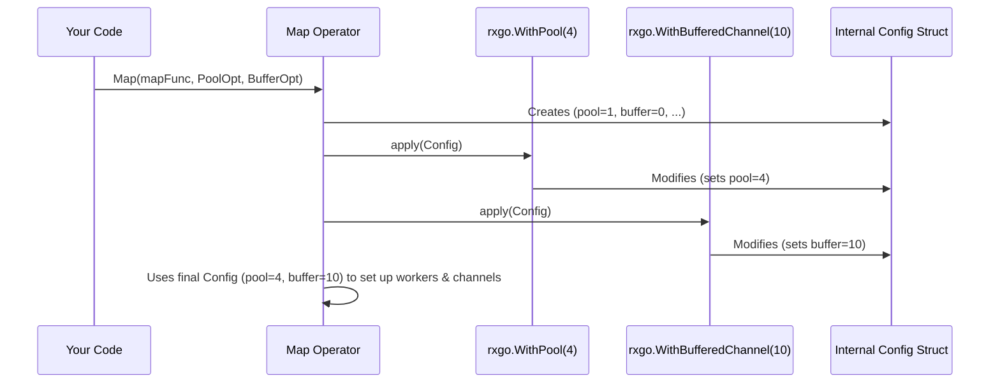

# Chapter 6: Options

Welcome back! In [Chapter 5: Operators](05_operators_.md), we saw how operators act like workstations on a conveyor belt, transforming and filtering items as they flow through an [Observable](01_observable_.md) stream. But what if we need to adjust *how* these workstations operate? Maybe we want one workstation to run faster by using multiple workers, or we need to change how it handles faulty items.

## What Problem Do Options Solve?

Imagine our `Map` operator workstation is tasked with painting wooden blocks. If painting each block takes a long time, the whole assembly line slows down. Wouldn't it be great if we could tell the painting station to use *multiple* paint sprayers (goroutines) simultaneously to speed things up?

Or consider the factory function `Interval` ([Chapter 4: Observable Creation (Factories)](04_observable_creation__factories__.md)), which puts numbered tickets on the belt. How do we tell it *how often* to put the tickets – every second? Every 500 milliseconds?

We need a way to **configure** the behavior of our factories and operators. We need controls, settings, or dials on these machines. This is precisely what **Options** provide in RxGo.

## What are Options?

> **Options** are configuration settings, passed as special functional arguments to factory functions or operators, that modify their internal behavior.

Think of them like this:

* **Factories & Operators:** The machines (e.g., `Just`, `Interval`, `Map`, `Filter`).
* **Options:** The dials, switches, and settings on those machines (e.g., `rxgo.WithPool`, `rxgo.WithBufferedChannel`, `rxgo.WithErrorStrategy`, `rxgo.WithDuration`).

You typically pass options as the *last* arguments when calling a factory or operator method. They allow you to customize aspects like:

* **Concurrency:** Running parts of the stream processing in parallel using pools of goroutines (`rxgo.WithPool`, `rxgo.WithCPUPool`).
* **Buffering:** Adding buffers to the channels connecting operators (`rxgo.WithBufferedChannel`).
* **Error Handling:** Deciding whether the stream should stop or continue when an error occurs (`rxgo.WithErrorStrategy`).
* **Observation:** Choosing if processing starts immediately (Eager) or only when someone observes (Lazy) (`rxgo.WithObservationStrategy`).
* **Connectable Observables:** Making an observable "hot" so multiple observers share the same stream execution (`rxgo.WithPublishStrategy`).
* **Timing:** Configuring durations for time-based operators like `Interval` (`rxgo.WithDuration`).

## Using Options: Examples

Let's see how to use some common options.

### 1. Concurrency: Speeding up `Map` with `WithPool`

Remember our slow painting workstation? Let's simulate this with a `Map` operator that takes time and then use `WithPool` to parallelize it.

**Without Options (Sequential):**

```go
package main

import (
 "context"
 "fmt"
 "github.com/reactivex/rxgo/v2"
 "time"
)

func main() {
 start := time.Now()

 // Observable emitting numbers 0 through 4
 observable := rxgo.Range(0, 5)

 // Map applies a "slow" operation sequentially
 mapped := observable.Map(func(_ context.Context, item interface{}) (interface{}, error) {
  time.Sleep(100 * time.Millisecond) // Simulate work
  return fmt.Sprintf("Processed %d", item), nil
 }) // <-- No options passed here

 // Observe the results
 for item := range mapped.Observe() {
  fmt.Println(item.V)
 }

 fmt.Printf("Sequential execution took: %s\n", time.Since(start))
}
```

**Explanation:**

* This is a standard `Map`. Each item (0 to 4) goes through the `Map` function one after the other.
* Since each takes 100ms, and there are 5 items, the total time will be roughly 500ms.

**Output (approximate):**

```plaintext
Processed 0
Processed 1
Processed 2
Processed 3
Processed 4
Sequential execution took: 503.12ms
```

**With `rxgo.WithPool` (Parallel):**

Now, let's add the `WithPool` option to tell `Map` to use multiple goroutines.

```go
package main

import (
 "context"
 "fmt"
 "github.com/reactivex/rxgo/v2"
 "runtime"
 "time"
)

func main() {
 start := time.Now()
 numWorkers := runtime.NumCPU() // Use number of CPU cores

 observable := rxgo.Range(0, 5)

 // Map applies a "slow" operation in parallel
 mapped := observable.Map(func(_ context.Context, item interface{}) (interface{}, error) {
  time.Sleep(100 * time.Millisecond) // Simulate work
  return fmt.Sprintf("Processed %d", item), nil
 }, rxgo.WithPool(numWorkers)) // <-- Pass WithPool Option!

 // Observe the results
 for item := range mapped.Observe() {
  fmt.Println(item.V)
 }

 fmt.Printf("Parallel (%d workers) took: %s\n", numWorkers, time.Since(start))
}

```

**Explanation:**

1. `rxgo.WithPool(numWorkers)`: We add this option to the `Map` call. `runtime.NumCPU()` gets the number of available CPU cores, which is a sensible number of workers. Let's say it's 4.
2. RxGo now sets up the `Map` operator to run the provided function (`time.Sleep` etc.) in a pool of 4 goroutines. Multiple items can be processed *concurrently*.
3. The total time should be significantly less than the sequential version (ideally closer to 100-200ms, depending on Go scheduler and number of cores). Note that the *order* of processed items might not be guaranteed when using pools unless you add other options like `Serialize`.

**Output (approximate, order may vary):**

```plaintext
Processed 1
Processed 0
Processed 3
Processed 2
Processed 4
Parallel (4 workers) took: 105.33ms
```

*Note: You could also use `rxgo.WithCPUPool()` as a shortcut for `rxgo.WithPool(runtime.NumCPU())`.*

### 2. Buffering: `WithBufferedChannel`

Operators internally pass items using Go channels. By default, these channels usually have no buffer (capacity 0). If a downstream operator is slow, it can cause the upstream operator to block when trying to send an item. Adding a buffer can sometimes smooth out the flow.

```go
package main

import (
 "context"
 "fmt"
 "github.com/reactivex/rxgo/v2"
 "time"
)

func main() {
 observable := rxgo.Range(0, 5) // Emits 0, 1, 2, 3, 4 quickly

 // Map is fast, but let's imagine it feeds into something slower later.
 // We add a buffer to Map's *output* channel.
 mapped := observable.Map(func(_ context.Context, item interface{}) (interface{}, error) {
  fmt.Printf("Map processing: %d\n", item)
  return item, nil
 }, rxgo.WithBufferedChannel(3)) // Add buffer of size 3

 // Simulate a slow consumer
 slowConsumer := mapped.DoOnNext(func(item interface{}) {
  fmt.Printf("Consumer received: %d, sleeping...\n", item)
  time.Sleep(200 * time.Millisecond)
 })

 // Wait for completion
 <-slowConsumer

 fmt.Println("Done")
}
```

**Explanation:**

1. `rxgo.WithBufferedChannel(3)` is applied to the `Map` operator.
2. This means the channel that `Map` uses to send its results *downstream* to `DoOnNext` will have a buffer capacity of 3.
3. Even though the `DoOnNext` consumer is slow (sleeps 200ms), the `Map` operator can quickly process and send up to 3 items into the buffered channel before it potentially has to block waiting for the consumer. This allows the `Map` processing to run slightly ahead of the slow consumer.

**Output (illustrative):**

```plaintext
Map processing: 0
Map processing: 1
Map processing: 2
Map processing: 3 // Map might pause here if consumer hasn't freed buffer space
Consumer received: 0, sleeping...
Consumer received: 1, sleeping...
Map processing: 4 // Map can proceed as buffer has space
Consumer received: 2, sleeping...
Consumer received: 3, sleeping...
Consumer received: 4, sleeping...
Done
```

### 3. Configuration: Setting `Interval` Duration

Some factories *require* options to configure their core behavior. `Interval` needs to know how often to emit items.

```go
package main

import (
 "fmt"
 "github.com/reactivex/rxgo/v2"
 "time"
)

func main() {
 // Create an Observable emitting 0, 1, 2... every 750ms
 // rxgo.WithDuration is the Option needed by Interval
 intervalObservable := rxgo.Interval(rxgo.WithDuration(750 * time.Millisecond))

 // Observe the first 3 items
 for item := range intervalObservable.Take(3).Observe() { // Take(3) is an operator!
  fmt.Printf("Received: %v at %s\n", item.V, time.Now().Format("15:04:05.000"))
 }
 fmt.Println("Interval finished.")
}
```

**Explanation:**

1. `rxgo.Interval(...)` is the factory function.
2. `rxgo.WithDuration(750 * time.Millisecond)`: This is the mandatory Option that tells `Interval` the time delay between emissions. Without this (or a similar duration option), `Interval` wouldn't know what to do.
3. We use the `Take(3)` operator ([Chapter 5: Operators](05_operators_.md)) to limit the infinite stream for this example.

**Output (approximate timings):**

```plaintext
Received: 0 at 10:30:00.750 // ~750ms after start
Received: 1 at 10:30:01.500 // ~750ms later
Received: 2 at 10:30:02.250 // ~750ms later
Interval finished.
```

## Under the Hood (Conceptual)

RxGo uses the **functional options pattern**. Here's how it generally works when you call an operator or factory with options:

1. **Call:** Your code calls a function like `source.Map(mapFunc, rxgo.WithPool(4), rxgo.WithBufferedChannel(10))`.
2. **Default Config:** The `Map` implementation internally creates a small structure holding default configuration values (e.g., pool size = 1, buffer size = 0, sequential execution = true).
3. **Apply Options:** It then loops through the option arguments you provided (`rxgo.WithPool(4)`, `rxgo.WithBufferedChannel(10)`).
4. **Modify Config:** Each option is actually a *function*. The `Map` implementation calls each option function, passing its internal config structure. The option function modifies the structure (e.g., `WithPool(4)` sets the pool size field to 4; `WithBufferedChannel(10)` sets the buffer size field to 10).
5. **Use Config:** After applying all options, the `Map` implementation uses the final values in the config structure to set up its behavior (e.g., start 4 goroutines, create an output channel with buffer 10).



## Under the Hood (Code)

The core pieces are in `options.go`:

1. **`Option` Interface:** Defines the contract for an option. The key method is `apply(*funcOption)`.

    ```go
    // From: options.go
    type Option interface {
        apply(*funcOption)
        // ... other internal methods ...
    }
    ```

2. **`funcOption` Struct:** This internal struct holds the actual configuration values that can be set by options.

    ```go
    // From: options.go (simplified)
    type funcOption struct {
        f                    func(*funcOption) // The function that does the modification
        isBuffer             bool
        buffer               int             // For WithBufferedChannel
        ctx                  context.Context // For WithContext
        observation          ObservationStrategy
        pool                 int             // For WithPool/WithCPUPool
        backPressureStrategy BackpressureStrategy
        onErrorStrategy      OnErrorStrategy
        connectable          bool
        // ... and potentially others
    }
    ```

3. **Option Functions (like `WithPool`)**: These are the functions you call (e.g., `rxgo.WithPool(4)`). They return an `Option` (specifically, a `*funcOption`). The `f` field inside holds the logic to modify the config structure when `apply` is called.

    ```go
    // From: options.go (simplified)
    func WithPool(pool int) Option {
        // Return a structure implementing Option
        return newFuncOption(func(options *funcOption) {
             // This inner function is the 'apply' logic:
             // It receives the config struct ('options')
             // and modifies it.
            options.pool = pool
        })
    }

    func WithBufferedChannel(capacity int) Option {
        return newFuncOption(func(options *funcOption) {
            options.isBuffer = true
            options.buffer = capacity
        })
    }

    // Helper to create the Option structure
    func newFuncOption(f func(*funcOption)) *funcOption {
        return &funcOption{
            f: f,
        }
    }
    ```

4. **`parseOptions` Helper:** Operators and factories use this internal helper function to process the options list.

    ```go
    // From: options.go (simplified)
    func parseOptions(opts ...Option) Option { // Actually returns *funcOption
        o := new(funcOption) // Create a new config struct with defaults
        for _, opt := range opts {
            opt.apply(o) // Call the apply method of each option
        }
        return o // Return the populated config struct
    }
    ```

    The operator/factory then reads values from the returned config struct `o` (e.g., `o.pool`, `o.buffer`).

You don't typically interact with `funcOption` or `parseOptions` directly, but seeing them helps understand how options flexibly modify behavior using this standard pattern.

## Conclusion

You've learned about **Options**, RxGo's mechanism for configuring the behavior of [Observable](01_observable_.md) factories and [Operators](05_operators_.md). Key takeaways:

* Options are **functional arguments** passed at the end of factory/operator calls.
* They act like **settings or dials** on the stream processing machines.
* Common uses include controlling **concurrency** (`rxgo.WithPool`), **channel buffering** (`rxgo.WithBufferedChannel`), **error strategies**, and factory-specific settings (`rxgo.WithDuration` for `Interval`).
* They use the **functional options pattern** internally for flexible configuration.

Options give you fine-grained control over how your reactive streams execute.

Now that we've covered creating, observing, transforming streams, and configuring their behavior, let's look at a fundamental distinction in *when* Observables start producing their items: the difference between Hot and Cold Observables.

**Next:** [Chapter 7: Hot vs. Cold Observables](07_hot_vs__cold_observables_.md)

---

Generated by [AI Codebase Knowledge Builder](https://github.com/The-Pocket/Tutorial-Codebase-Knowledge)
